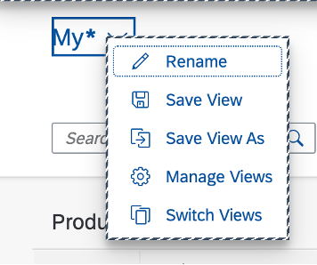
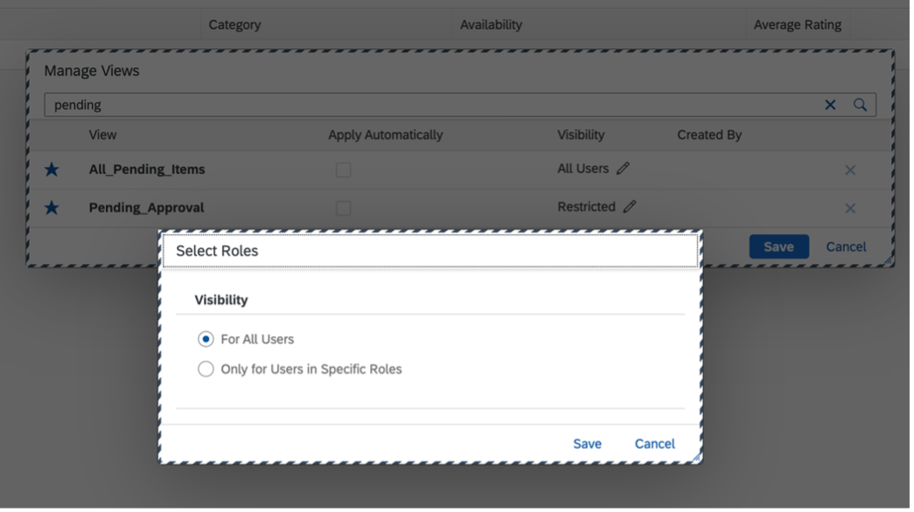

<!-- loio59bfd317ed5d4af3b490abbe7a9731d8 -->

# Adapting the UI

Both application developers and key users can extend and customize SAP Fiori applications by adapting the UI.

**UI Adaptation**

<table>
<tr>
<th valign="top" rowspan="2">

Adaptation Type

</th>
<th valign="top" rowspan="2">

Adaptation Project

</th>
<th valign="top" colspan="2">

Key User Adaptation

</th>
</tr>
<tr>
<th valign="top">

Enabling Adaptation

</th>
<th valign="top">

Adapting the UI

</th>
</tr>
<tr>
<td valign="top">

**Description**

</td>
<td valign="top">

App developers can adapt the UI at design time.

</td>
<td valign="top" colspan="2">

Key users can adapt the application at runtime by changing the UI from the initial state of the app to a personalized view for end users. In the *User Actions Menu*, key users can then choose *Adapt UI* and change the user interface of SAP Fiori apps directly.

For more information about key user adaptation, see [SAPUI5 Flexibility: Adapting UIs Made Easy](../04_Essentials/sapui5-flexibility-adapting-uis-made-easy-a8e55aa.md).

</td>
</tr>
<tr>
<td valign="top">

**Performed By**

</td>
<td valign="top">

App Developer

</td>
<td valign="top">

App Developer

</td>
<td valign="top">

Key User

</td>
</tr>
<tr>
<td valign="top">

**SAP Fiori Elements for OData V2**

</td>
<td valign="top">

For information about the features that application developers can adapt, see [Adapting the UI: List Report and Object Page](adapting-the-ui-list-report-and-object-page-0d2f1a9.md), [Adapting the UI: Analytical List Page](adapting-the-ui-analytical-list-page-2c5fa29.md), and [Extending the Delivered Apps Manifest Using an Adaptation Project](extending-the-delivered-apps-manifest-using-an-adaptation-project-a2b24a6.md).

</td>
<td valign="top">

For more information about what you have to consider when developing apps that support key user adaptation, see [SAPUI5 Flexibility: Enable Your App for UI Adaptation](../05_Developing_Apps/sapui5-flexibility-enable-your-app-for-ui-adaptation-f1430c0.md).

</td>
<td valign="top">

See the [Additional Features in the SAP Fiori Elements for OData V2](adapting-the-ui-59bfd31.md#loio59bfd317ed5d4af3b490abbe7a9731d8__section_g15_g2n_gnb) section in this topic.

</td>
</tr>
<tr>
<td valign="top">

**SAP Fiori Elements for OData V4**

</td>
<td valign="top">

App developers adapt the UI manually or use SAP Fiori tools for the most common settings. For more information, see the following topics:

-   [Create the Adaptation Project](https://help.sap.com/docs/SAP_FIORI_tools/17d50220bcd848aa854c9c182d65b699/d6ab2614df5c4c5597055e4dd988ad16.html) \(for SAP S/4HANA Cloud Public Edition\)

-   [Creating a Project](https://help.sap.com/docs/SAP_FIORI_tools/17d50220bcd848aa854c9c182d65b699/072f566ed1d845b6aa41cb01057700d5.html) \(for an on-premise system\)

</td>
<td valign="top">

For information about how application developers can enable an app for key user adaptation, see [Enabling an App for Key User Adaptation](enabling-an-app-for-key-user-adaptation-ccd45ba.md).

For more information about what you have to consider when developing apps that support key user adaptation, see [SAPUI5 Flexibility: Enable Your App for UI Adaptation](../05_Developing_Apps/sapui5-flexibility-enable-your-app-for-ui-adaptation-f1430c0.md).

</td>
<td valign="top">

See the [Additional Features in the SAP Fiori Elements for OData V4](adapting-the-ui-59bfd31.md#loio59bfd317ed5d4af3b490abbe7a9731d8__section_qmw_cxf_zcc) section in this topic.

</td>
</tr>
</table>

<a name="loio59bfd317ed5d4af3b490abbe7a9731d8__section_g15_g2n_gnb"/>

## Additional Features in SAP Fiori Elements for OData V2

### Variant Management

Key users can create public variants and deliver them to all users or to users with specific roles. This is supported for page variants in list pages and table variants in list report and object pages.

Key users can also perform the following:

-   Modify existing public variants

-   Rename variants

-   Manage views by adding or removing favorites and modifying the visibility

While switching to key user adaptation mode from normal mode, the app starts in a fresh state and the applied changes are not preserved in the internal app state. Also, when a user exits key user adaptation mode, the app restores to the old state it was in before entering key user adaptation mode.

> ### Note:  
> We do not recommend embedding iFrames in the SAP Fiori elements for OData V2 application using UI adaptation.

<a name="loio59bfd317ed5d4af3b490abbe7a9731d8__section_qmw_cxf_zcc"/>

## Additional Features in SAP Fiori Elements for OData V4

SAP Fiori elements for OData V4 provides configuration settings for the list report, the object page, and for the filter bar and tables. These configuration settings are applied to the app's `manifest.json` file, so they are not immediately visible on the UI. When a key user activates a new version and exits key user adaptation mode, the application automatically reloads with the new settings.

The following table provides an overview of the available configuration settings for key users:

**Configuration Settings for Key Users**

<table>
<tr>
<th valign="top">

Feature

</th>
<th valign="top">

Setting

</th>
<th valign="top">

Values

</th>
<th valign="top">

Description

</th>
<th valign="top">

Documentation

</th>
<th valign="top">

Additional Information

</th>
</tr>
<tr>
<td valign="top" rowspan="2">

List Report

</td>
<td valign="top">

*Variant Management*

</td>
<td valign="top">

*Page*

*Control*

*None*

</td>
<td valign="top">

Configure how variant management is used in the list report.

</td>
<td valign="top">

[Creating a List Report without Variant Management](creating-a-list-report-without-variant-management-094fe8c.md)

</td>
<td valign="top">

> ### Note:  
> Settings made by a key user can override those made by an end user. This means that end users may need to reapply their personalization settings.

</td>
</tr>
<tr>
<td valign="top">

*Initial Load*

</td>
<td valign="top">

*Auto*

*Enabled*

*Disabled*

</td>
<td valign="top">

Configure how data is loaded initially when the app is loaded.

</td>
<td valign="top">

[Loading Behavior of Data on Initial Launch of the Application](loading-behavior-of-data-on-initial-launch-of-the-application-9f4e119.md)

</td>
<td valign="top">

 

</td>
</tr>
<tr>
<td valign="top" rowspan="2">

Filter Bar

</td>
<td valign="top" colspan="2">

*Display Clear Button*

</td>
<td valign="top">

Configure if the *Clear* button is displayed in the filter bar.

</td>
<td valign="top">

[Adapting the Filter Bar](adapting-the-filter-bar-609c39a.md)

Section: Adding a Clear Button

</td>
<td valign="top">

 

</td>
</tr>
<tr>
<td valign="top" colspan="2">

*Use Semantic Date Range*

</td>
<td valign="top">

Configure if the semantic date range options in the `manifest.json` are active.

</td>
<td valign="top">

[Enabling Semantic Operators in the Filter Bar](enabling-semantic-operators-in-the-filter-bar-fef65d0.md)

</td>
<td valign="top">

 

</td>
</tr>
<tr>
<td valign="top">

Object Page

</td>
<td valign="top" colspan="2">

*Table Variant Management*

</td>
<td valign="top">

Configure if variant management is used in tables on the object page.

</td>
<td valign="top">

[Enabling Variant Management on the Object Page](enabling-variant-management-on-the-object-page-f26d42b.md)

</td>
<td valign="top">

> ### Note:  
> Settings made by a key user can override those made by an end user. This means that end users may need to reapply their personalization settings.

</td>
</tr>
<tr>
<td valign="top" rowspan="9">

Table

</td>
<td valign="top" colspan="2">

*Enable Export*

</td>
<td valign="top">

Configure if the *Export* button is displayed in the table.

</td>
<td valign="top">

[Using the Export Button](using-the-export-button-4bab6f2.md)

</td>
<td valign="top">

 

</td>
</tr>
<tr>
<td valign="top" colspan="2">

*Frozen Column Count*

</td>
<td valign="top">

Configure the count of columns that are always visible when scrolling horizontally.

</td>
<td valign="top">

[Tables](tables-c0f6592.md)

</td>
<td valign="top">

 

</td>
</tr>
<tr>
<td valign="top">

*Personalization*

</td>
<td valign="top">

*Enabled*

*Disabled*

*Own Settings*

-   *Sorting*

-   *Columns*

-   *Filtering*

-   *Grouping*

</td>
<td valign="top">

Configure if the table personalization settings are enabled. To configure the listed settings individually, choose `Own Settings`.

</td>
<td valign="top">

[Enabling Table Personalization](enabling-table-personalization-3e2b4d2.md)

</td>
<td valign="top">

> ### Note:  
> Settings made by a key user can override those made by an end user. This means that end users may need to reapply their personalization settings.

</td>
</tr>
<tr>
<td valign="top" colspan="2">

*Row Count*

</td>
<td valign="top">

Configure the number of rows to be displayed in the table.

</td>
<td valign="top">

 

</td>
<td valign="top">

Only applicable to the object page.

Not applicable to responsive tables.

</td>
</tr>
<tr>
<td valign="top" colspan="2">

*Condensed Table Layout*

</td>
<td valign="top">

Configure if the table uses this layout.

</td>
<td valign="top">

[Using the Condensed Table Layout](using-the-condensed-table-layout-f3cc057.md)

</td>
<td valign="top">

Not applicable to responsive tables.

</td>
</tr>
<tr>
<td valign="top" colspan="2">

*Width Including Column Header*

</td>
<td valign="top">

Configure if the *Column Header* label is considered when calculating the column width.

</td>
<td valign="top">

[Setting the Default Column Width](setting-the-default-column-width-a765253.md)

</td>
<td valign="top">

 

</td>
</tr>
<tr>
<td valign="top" colspan="2">

*Select All*

</td>
<td valign="top">

Configure if the *Select All* option is displayed in the table.

</td>
<td valign="top">

[Enabling Multiple Selection in Tables](enabling-multiple-selection-in-tables-116b5d8.md)

</td>
<td valign="top">

 

</td>
</tr>
<tr>
<td valign="top" colspan="2">

*Selection Limit*

</td>
<td valign="top">

Configure the maximum limit of the number of rows that can be selected at once.

</td>
<td valign="top">

[Enabling Multiple Selection in Tables](enabling-multiple-selection-in-tables-116b5d8.md)

</td>
<td valign="top">

Not applicable to responsive tables.

</td>
</tr>
<tr>
<td valign="top" colspan="2">

*Enable Add Card to Insights*

</td>
<td valign="top">

Configure the *Add Card to Insights* feature for *My Home* in SAP S/4HANA.

</td>
<td valign="top">

[Creating Cards for the Insights Cards Section of My Home in SAP S/4HANA Cloud Public Edition and My Home in SAP S/4HANA](creating-cards-for-the-insights-cards-section-of-my-home-in-sap-s-4hana-cloud-public-edit-9b13559.md)

</td>
<td valign="top">

 

</td>
</tr>
</table>

