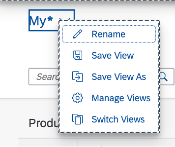
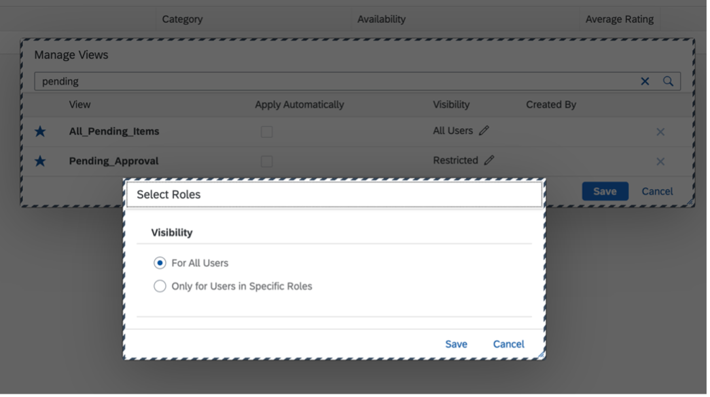

<!-- loio7837c7a3d1494731aff54e9a95230cea -->

# Adapting the UI

App developers and key users can extend and configure the app UI.

> ### Note:  
> For information about SAP Fiori elements for OData V4, see [Extending Delivered Apps With Key User Adaptation](extending-delivered-apps-with-key-user-adaptation-59bfd31.md).

**UI Adaptation**

<table>
<tr>
<th valign="top" rowspan="2">

Adaptation Type

</th>
<th valign="top" rowspan="2">

Developer Adaptation \(Adaptation Project\)

</th>
<th valign="top" colspan="2">

Key User Adaptation

</th>
</tr>
<tr>
<th valign="top">

Enabling Adaptation

</th>
<th valign="top">

Adapting the UI

</th>
</tr>
<tr>
<td valign="top">

**Description**

</td>
<td valign="top">

App developers can adapt the UI at design time.

</td>
<td valign="top" colspan="2">

Key users can adapt the application at runtime by changing the UI from the initial state of the app to a personalized view for end users. In the *User Menu*, key users can then choose *Adapt UI* and change the user interface of SAP Fiori apps directly.

For more information about key user adaptation, see [SAPUI5 Flexibility: Adapting UIs Made Easy](../04_Essentials/sapui5-flexibility-adapting-uis-made-easy-a8e55aa.md).

</td>
</tr>
<tr>
<td valign="top">

**Performed By**

</td>
<td valign="top">

App Developer

</td>
<td valign="top">

App Developer

</td>
<td valign="top">

Key User

</td>
</tr>
<tr>
<td valign="top">

**Documentation**

</td>
<td valign="top">

For information about the features that application developers can adapt, see [Adapting the UI: List Report Page and Object Page](adapting-the-ui-list-report-page-and-object-page-0d2f1a9.md), [Adapting the UI: Analytical List Page](adapting-the-ui-analytical-list-page-2c5fa29.md), and [Extending the Delivered Apps Manifest Using an Adaptation Project](extending-the-delivered-apps-manifest-using-an-adaptation-project-61a015c.md).

</td>
<td valign="top">

For more information about what you have to consider when developing apps that support key user adaptation, see [SAPUI5 Flexibility: Enable Your App for UI Adaptation](../05_Developing_Apps/sapui5-flexibility-enable-your-app-for-ui-adaptation-f1430c0.md).

</td>
<td valign="top">

See further in this topic.

</td>
</tr>
</table>

<a name="loio7837c7a3d1494731aff54e9a95230cea__section_g15_g2n_gnb"/>

## Variant Management

Key users can create public variants and deliver them to all users or to users with specific roles. This is supported for page variants on list pages and table variants on list report pages and object pages.

Key users can also perform the following:

-   Modify existing public variants

-   Rename variants

-   Manage views by adding or removing favorites and modifying the visibility

While switching to key user adaptation mode from normal mode, the app starts in a fresh state and the applied changes are not preserved in the internal app state. Also, when a user exits key user adaptation mode, the app restores to the old state it was in before entering key user adaptation mode.

> ### Note:  
> We do not recommend embedding iFrames in SAP Fiori elements for OData V2 applications using UI adaptation.

The following table provides an overview of the available configuration settings for key users:

**Configuration Settings for Key Users**

<table>
<tr>
<th valign="top">

Feature

</th>
<th valign="top">

Setting

</th>
<th valign="top">

Values

</th>
<th valign="top">

Description

</th>
<th valign="top">

Documentation

</th>
<th valign="top">

Additional Information

</th>
</tr>
<tr>
<td valign="top" rowspan="4">

List report page

</td>
<td valign="top">

*Variant Management*

</td>
<td valign="top">

*Page*

*Control*

</td>
<td valign="top">

Configure how variant management is used on the list report page.

</td>
<td valign="top">

 

</td>
<td valign="top">

> ### Note:  
> Settings made by a key user can override those made by an end user. This means that end users may need to reapply their personalization settings.

</td>
</tr>
<tr>
<td valign="top" colspan="2">

*Hide Variant Management*

</td>
<td valign="top">

Configure how variant management is disabled on the list report page.

</td>
<td valign="top">

[Creating a List Report Page Without Variant Management](creating-a-list-report-page-without-variant-management-e3b12f4.md)

</td>
<td valign="top">

 

</td>
</tr>
<tr>
<td valign="top">

*Initial Load*

</td>
<td valign="top">

*Auto*

*Enabled*

*Disabled*

</td>
<td valign="top">

Configure how data is loaded initially when the app is loaded.

</td>
<td valign="top">

[Loading Behavior of Data on Initial Launch of the Application](loading-behavior-of-data-on-initial-launch-of-the-application-b736ab6.md)

</td>
<td valign="top">

 

</td>
</tr>
<tr>
<td valign="top" colspan="2">

*Open In Edit Mode*

</td>
<td valign="top">

Configure to open the object directly in edit mode.

</td>
<td valign="top">

[Navigation to an Object Page in Edit Mode](navigation-to-an-object-page-in-edit-mode-7952b13.md)

</td>
<td valign="top">

 

</td>
</tr>
<tr>
<td valign="top">

Analytical list page

</td>
<td valign="top">

*Default Display Mode*

</td>
<td valign="top">

*Hybrid*

*Chart*

*Table*

</td>
<td valign="top">

Configure the default display mode of data in the analytical list page.

</td>
<td valign="top">

[Hybrid View](hybrid-view-6615668.md)

</td>
<td valign="top">

 

</td>
</tr>
<tr>
<td valign="top" rowspan="3">

Filter bar

</td>
<td valign="top" colspan="2">

*Display Go Button*

</td>
<td valign="top">

Configure if the *Go* button is displayed in the visual filter bar.

</td>
<td valign="top">

 

</td>
<td valign="top">

Only applicable to the analytical list page

</td>
</tr>
<tr>
<td valign="top" colspan="2">

*Enable Date Range*

</td>
<td valign="top">

Configure if the semantic date range options in the `manifest.json` file are active.

</td>
<td valign="top">

[Enabling Semantic Operators in the Filter Bar](enabling-semantic-operators-in-the-filter-bar-c2b916c.md)

</td>
<td valign="top">

 

</td>
</tr>
<tr>
<td valign="top" colspan="2">

*Navigation Properties*

</td>
<td valign="top">

Configure the list of filterable properties from navigation entities to include them as filters.

</td>
<td valign="top">

[Adapting the Filter Bar](adapting-the-filter-bar-c7a7ac4.md)

Section: Including Navigation Properties

</td>
<td valign="top">

Only applicable to the list report page

</td>
</tr>
<tr>
<td valign="top" rowspan="4">

Object page

</td>
<td valign="top" colspan="2">

*Editable Header Content*

</td>
<td valign="top">

Configure if the header fields are editable.

</td>
<td valign="top">

[Toggling the Editability of Header Fields](toggling-the-editability-of-header-fields-955b213.md)

</td>
<td valign="top">

 

</td>
</tr>
<tr>
<td valign="top" colspan="2">

*Table Variant Management*

</td>
<td valign="top">

Configure if variant management is used in tables on the object page.

</td>
<td valign="top">

[Enabling Variant Management on the Object Page](enabling-variant-management-on-the-object-page-ca0eb16.md)

</td>
<td valign="top">

> ### Note:  
> Settings made by a key user can override those made by an end user. This means that end users may need to reapply their personalization settings.

</td>
</tr>
<tr>
<td valign="top" colspan="2">

*Chart Variant Management*

</td>
<td valign="top">

Configure if variant management is used in charts on the object page.

</td>
<td valign="top">

[Enabling Variant Management on the Object Page](enabling-variant-management-on-the-object-page-ca0eb16.md)

</td>
<td valign="top">

> ### Note:  
> Settings made by a key user can override those made by an end user. This means that end users may need to reapply their personalization settings.

</td>
</tr>
<tr>
<td valign="top" colspan="2">

*Show Related Apps*

</td>
<td valign="top">

Configure if the *Related Apps* button is displayed on the object page.

</td>
<td valign="top">

[Enabling the Related Apps Button](enabling-the-related-apps-button-f302a97.md)

</td>
<td valign="top">

 

</td>
</tr>
<tr>
<td valign="top" rowspan="9">

Table

</td>
<td valign="top">

*Selection Mode*

</td>
<td valign="top">

*Single*

*Multi*

</td>
<td valign="top">

Configure if end users can select a single row or multiple rows in a table.

</td>
<td valign="top">

[Configuring the Selection Mode for Tables](configuring-the-selection-mode-for-tables-402fac7.md)

</td>
<td valign="top">

 

</td>
</tr>
<tr>
<td valign="top">

*Create Mode*

</td>
<td valign="top">

*New Page*

*Inline*

*Inline Creation Rows*

*Inline Creation Rows \(Hidden in edit page\)*

</td>
<td valign="top">

Configure the mode for creating tables.

</td>
<td valign="top">

[Enabling Inline Creation Mode or Empty Row Mode for Table Entries](enabling-inline-creation-mode-or-empty-row-mode-for-table-entries-276cbe5.md)

</td>
<td valign="top">

Only applicable to the object page.

</td>
</tr>
<tr>
<td valign="top" colspan="2">

*Condensed Table Layout*

</td>
<td valign="top">

Configure if the table uses this layout.

</td>
<td valign="top">

[Using the Condensed Table Layout](using-the-condensed-table-layout-432a2d2.md)

</td>
<td valign="top">

Not applicable to responsive tables.

</td>
</tr>
<tr>
<td valign="top" colspan="2">

*Width Including Column Header*

</td>
<td valign="top">

Configure if the *Column Header* label is considered when calculating the column width.

</td>
<td valign="top">

[Setting the Default Column Width](setting-the-default-column-width-cd262f2.md)

</td>
<td valign="top">

 

</td>
</tr>
<tr>
<td valign="top" colspan="2">

*Enable Select All*

</td>
<td valign="top">

Configure if the *Select All* option is displayed in the table.

</td>
<td valign="top">

[Configuring the Selection Mode for Tables](configuring-the-selection-mode-for-tables-402fac7.md)

Section: Select All and Clear All Options in the Table

</td>
<td valign="top">

 

</td>
</tr>
<tr>
<td valign="top" colspan="2">

*Selection Limit*

</td>
<td valign="top">

Configure the maximum limit of the number of rows that can be selected at once.

</td>
<td valign="top">

[Configuring the Selection Mode for Tables](configuring-the-selection-mode-for-tables-402fac7.md)

Section: Limiting the Number of Selected Rows in a Table

</td>
<td valign="top">

Not applicable to responsive tables.

</td>
</tr>
<tr>
<td valign="top" colspan="2">

*Scroll Threshold*

</td>
<td valign="top">

Configure the number of additional records that must be dynamically loaded when scrolling through the application.

</td>
<td valign="top">

[Tables](tables-f242a02.md)

Section: Optimizing Data Loading Using the `scrollThreshold` Property

</td>
<td valign="top">

Not applicable to responsive tables.

</td>
</tr>
<tr>
<td valign="top" colspan="2">

*Threshold*

</td>
<td valign="top">

Configure the number of records that must be loaded during the initial load of the application.

</td>
<td valign="top">

[Tables](tables-f242a02.md)

Section: Initial Data Loading Using the `Threshold` Property

</td>
<td valign="top">

 

</td>
</tr>
<tr>
<td valign="top" colspan="2">

*Hide "Add Card to Insights"*

</td>
<td valign="top">

Configure if the *Add Card to Insights* feature for *My Home* in SAP S/4HANA and SAP S/4HANA Cloud Public Edition is hidden.

</td>
<td valign="top">

[Creating Cards for the Insights Cards Section of My Home in SAP S/4HANA Cloud Public Edition and My Home in SAP S/4HANA](creating-cards-for-the-insights-cards-section-of-my-home-in-sap-s-4hana-cloud-public-edit-fac8e9e.md)

</td>
<td valign="top">

Only applicable to the list report page

</td>
</tr>
</table>

