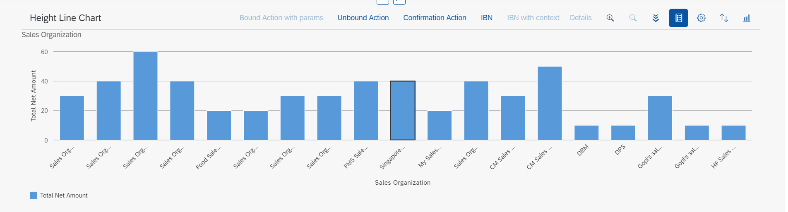

<!-- loio6495eab00f5a459b893c3cc83b763b20 -->

# Adding a Chart Facet

You can add a chart facet to a content section within the object page.

A chart facet is suitable to use if you wish to present data graphically for analysis.


<a name="loio6495eab00f5a459b893c3cc83b763b20__section_fnc_ptc_2tb"/>

## Adding the Chart Facet to an Object Page

To add a chart facet, use the `UI.Facet` term and include the `UI.ReferenceFacet` complex type, and then reference the `UI.Chart` annotation. This is displayed as shown within a content section of the object page in the following screenshot:

   
  
**Chart in Object Page**

  

For more information, see [Configuring Charts](configuring-charts-653ed0f.md).


<a name="loio6495eab00f5a459b893c3cc83b763b20__section_gs4_brq_2tb"/>

## Additional Features in SAP Fiori Elements for OData V2

The object page does not support the `UI.Chart` with qualifier \(see example below\).

   
  
**Navigation Property**

  


<a name="loio6495eab00f5a459b893c3cc83b763b20__section_ymw_bdc_4nb"/>

## Additional Features in SAP Fiori Elements for OData V4

Application developers can add the `UI.Chart` as the first visualization to the `UI.PresentationVariant` and point the `AnnotationPath` of the `ReferenceFacet` to the `UI.PresentationVariant`.

> ### Sample Code:  
> XML Annotation
> 
> ```xml
> <Record Type="UI.ReferenceFacet">
>     <PropertyValue Property="Label" String="Items"/>
>     <PropertyValue Property="ID" String="SalesOrderItems"/>
>     <PropertyValue Property="Target" AnnotationPath="_Item/@UI.PresentationVariant"/>
>     <Annotation Term="UI.Importance" EnumMember="UI.ImportanceType/High"/>
> </Record>
> 
> <Annotation Term="UI.PresentationVariant">
>     <Record Type="UI.PresentationVariantType">
>         <PropertyValue Property="SortOrder">
>             <Collection>
>                 <Record Type="Common.SortOrderType">
>                     <PropertyValue Property="Property" PropertyPath="SalesOrderItem"/>
>                     <PropertyValue Property="Descending" Bool="true"/>
>                 </Record>
>             </Collection>
>         </PropertyValue>
>         <PropertyValue Property="Visualizations">
>             <Collection>
>                 <AnnotationPath>@UI.Chart</AnnotationPath>
>                 <AnnotationPath>@UI.LineItem</AnnotationPath>
>             </Collection>
>         </PropertyValue>
>     </Record>
> </Annotation>
> ```

> ### Sample Code:  
> ABAP CDS Annotation
> 
> ```
> @UI.facet: [
>    {
>       id:           'SalesOrderItems',
>       label:        'Items',
>       type:         #PRESENTATIONVARIANT_REFERENCE,
>       purpose:      #STANDARD,
>       targetElement: '_Item',
>       importance:   #HIGH 
>     },
>   ]
> SalesOrder;
> 
> @UI.PresentationVariant: [
>   {
>     sortOrder: [
>       {
>         by: ' SALESORDERITEM',
>         direction: #DESC
>       }
>     ],
>     visualizations: [
>       {
>         type: #AS_CHART
>       },
>      {
>         type: #AS_LINEITEM
>       }
>     ]
>   }
> ]
> annotate view VIEWNAME with {
> 
> }
> 
> ```

> ### Sample Code:  
> CAP CDS Annotation
> 
> ```
> {
>             $Type             : 'UI.ReferenceFacet',
>             Label             : 'Items',
>             ID                : 'SalesOrderItems',
>             Target            : '_Item/@UI.PresentationVariant',
>             ![@UI.Importance] : #High
>  }
> 
> UI.PresentationVariant: {
>     SortOrder : [
>         {
>             $Type : 'Common.SortOrderType',
>             Property : SalesOrderItem,
>             Descending : true
>         }
>     ],
>     Visualizations : [
>         '@UI.Chart', 
>         '@UI.LineItem'
>     ]
> }
> 
> ```

