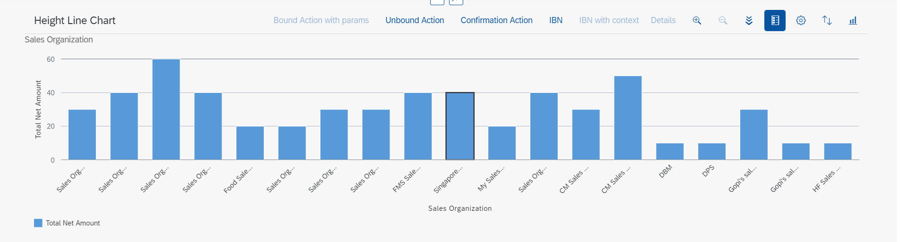

<!-- loioee441be6588648419ec0b4763f6f8257 -->

# Adding a Chart Facet

You can add a chart facet to a content section within the object page.

A chart facet is suitable to use if you wish to present data graphically for analysis.

<a name="loioee441be6588648419ec0b4763f6f8257__section_fnc_ptc_2tb"/>

## Adding the Chart Facet to an Object Page

To add a chart facet, use the `UI.Facet` term and include the `UI.ReferenceFacet` complex type, and then reference the `UI.Chart` annotation. This is displayed as shown within a content section of the object page in the following screenshot:

  
  
**Chart in Object Page**

For more information, see [Configuring Charts](configuring-charts-05eda5a.md).

> ### Restriction:  
> The object page does not support the `UI.Chart` with qualifier \(see example below\).
> 
>   
>   
> **Navigation Property**
> 
> 

