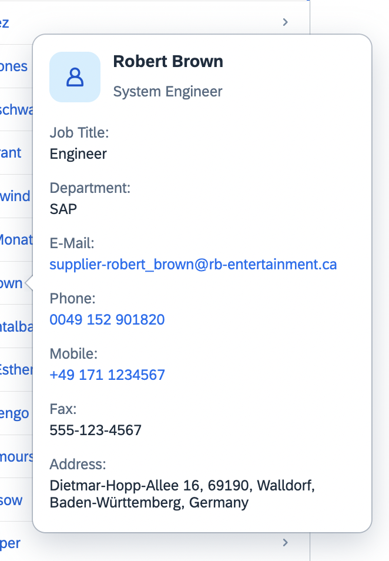
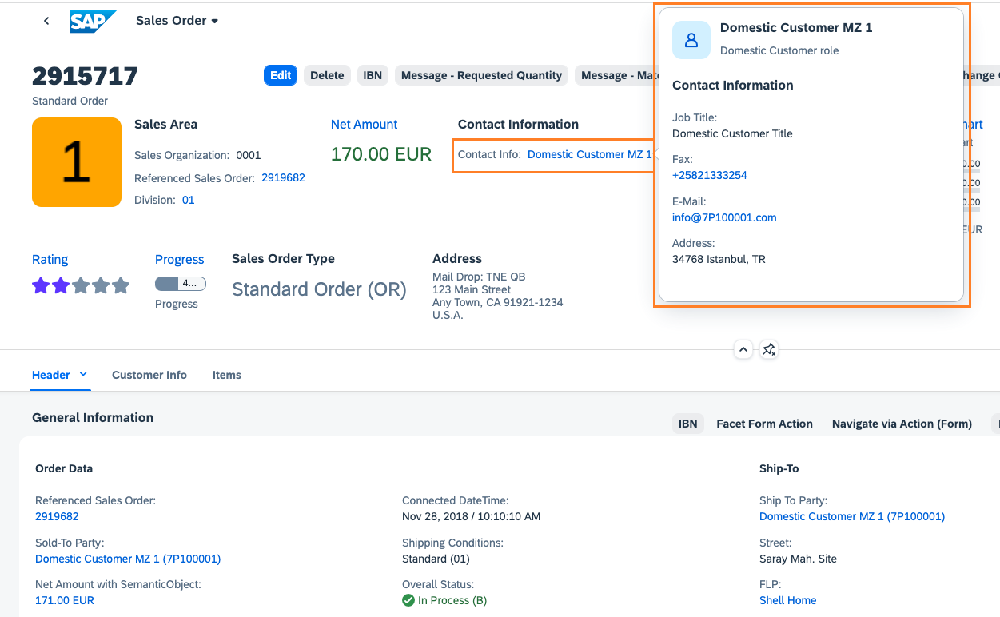

<!-- loioa6a8c0c4849b483eb10e87f6fdf9383c -->

# Adding a Contact Facet

To render a contact list and contact facet, you add a `UI.ReferenceFacet` that points to a contact annotation \(`type`\). It shows the label of the `UI.ReferenceFacet`, and below it, the `fn` property of the contact annotation. If you click on the name, a quick view with the contact details is displayed, as shown here:

   
  
**Object Page: Contacts**

  

Currently, the contact card reads the following annotation properties and displays them:

-   `fn`: the full name of the contact. It is displayed as the title of the card using a bigger font.

-   `title`: the job title of the contact. It is displayed below the title of the card using a smaller font.

-   `photo`: the photo assigned to the contact. It is displayed in the header of the contact card. If no photo is provided, a contact fallback icon is shown instead.

-   `role`: the role of the contact. It is displayed in the content of the card, as shown in the screenshot below.

-   `org`: the organization of the contact. It is displayed in the content of the card, as shown in the screenshot below.

-   `adr`: the address of the contact. It is displayed in the content of the card, as shown in the screenshot below The address has to follow the `addressType` definition. The order of the displayed address is street, code, locality, region and country simultaneously in a comma-separated string. Note that if the `label` property is used, then only this is shown and the other properties are ignored.

-   `mail`: the email addresses of the contact, together with the email type. Only `preferred` and `work` are supported type values. This information is displayed as a link in the content of the card, as shown in the screenshot below. When clicked, an email window opens.

-   `tel`: the telephone numbers of the contact, together with the types. This information is displayed as a link in the content of the card, as shown in the screenshot below. When clicked, the phone application defined in the user's browser settings opens. If the telephone number is a fax number, use `type: #fax`to display it as a fax number. The other supported types are preferred, cell, and work.


<a name="loioa6a8c0c4849b483eb10e87f6fdf9383c__section_bgb_xqr_cpb"/>

## Additional Features in SAP Fiori Elements for OData V2

The facet annotation looks like this:

> ### Sample Code:  
> XML Annotation
> 
> ```xml
> <Record Type="UI.ReferenceFacet">
>    <PropertyValue Property="Label" String="Supplier"/>
>    <PropertyValue AnnotationPath="to_Supplier/@Communication.Contact" Property="Target"/>
> </Record>
> ```

> ### Sample Code:  
> ABAP CDS Annotation
> 
> ```
> 
> @UI.facet: [
>  {
>   label: 'Supplier',
>   type:         #CONTACT_REFERENCE,
>   targetElement: '_Supplier',
>   purpose: #STANDARD
>  }
> ]
> product;
> ```

The Contact annotation looks like this:

> ### Sample Code:  
> XML Annotation
> 
> ```xml
> <Annotations Target="SEPMRA_PROD_MAN.SEPMRA_I_EmployeeType">
> 	<Annotation Term="Communication.Contact">
> 		<Record>
> 			<PropertyValue Property="fn" Path="FormattedName"/>
> 			<PropertyValue Property="title" Path="JobTitle"/>
> 			<PropertyValue Property="org" Path="CompanyName"/>
> 			<PropertyValue Property="role" Path="OrganizationRole"/>
> 			<PropertyValue Property="n">
> 				<Record>
> 					<PropertyValue Property="given" Path="FirstName"/>
> 					<PropertyValue Property="additional" Path="MiddleName"/>
> 					<PropertyValue Property="surname" Path="LastName"/>
> 				</Record>
> 										
> 			</PropertyValue>
> 			<PropertyValue Property="photo" Path="EmployeePictureURL"/>
> 			<PropertyValue Property="tel">
> 				<Collection>
> 					<Record>
> 						<PropertyValue Property="type" EnumMember="Communication.PhoneType/fax"/>
> 						<PropertyValue Property="uri" Path="FaxNumber"/>
> 					</Record>
> 					<Record>
> 						<PropertyValue Property="type" EnumMember="Communication.PhoneType/cell"/>
> 						<PropertyValue Property="uri" Path="MobilePhoneNumber"/>
> 					</Record>
> 					<Record>
> 						<PropertyValue Property="type" EnumMember="Communication.PhoneType/work"/>
> 						<PropertyValue Property="uri" Path="PhoneNumber"/>
> 					</Record>
> 					<Record>
> 						<PropertyValue Property="type" EnumMember=""/>
> 						<PropertyValue Property="address" Path="FaxNumber"/>
> 					</Record>
> 				</Collection>
> 			</PropertyValue>
> 			<PropertyValue Property="email">
> 				<Collection>
> 					<Record>
> 						<PropertyValue Property="type" EnumMember="Communication.ContactInformationType/work"/>
> 						<PropertyValue Property="address" Path="EmailAddress"/>
> 					</Record>
> 				</Collection> 
> 			</PropertyValue>
> 		</Record>
> 	</Annotation>
> </Annotations>				
> ```

> ### Sample Code:  
> ABAP CDS Annotation
> 
> ```
> 
> define view VIEWNAME
> {
>   @Semantics.name.fullName: true
>   FormattedName,
> 
>   @Semantics.eMail.address: true
>   @Semantics.eMail.type:  [#WORK]
>   EmailAddress,
>    
>   @Semantics.telephone.type:  [ #FAX ] 
>   FaxNumber,
> 
>   @Semantics.telephone.type:  [ #CELL ]
>   MobilePhoneNumber,
>   
>   @Semantics.telephone.type:  [ #WORK]
>   PhoneNumber,
> 
>   @Semantics.name: { jobTitle: true }   
>   JobTitle,
> 
>   @Semantics.organization: { name: true }
>   CompanyName,
> 
>   @Semantics.organization: { role: true, unit: true }
>   OrganizationRole
> 
>   @Semantics.name: { givenName: true }   
>   FirstName,
> 
>   @Semantics.name: { additionalName: true }   
>   MiddleName,
> 
>   @Semantics.name: { familyName: true }   
>   LastName,
> 
>   @Semantics.address : { city: true }  
>   City,
> 
>   @Semantics.contact.photo: true
>   EmployeePictureURL
> }
> 
> ```


<a name="loioa6a8c0c4849b483eb10e87f6fdf9383c__section_u2p_crr_cpb"/>

## Additional Features in SAP Fiori Elements for OData V4

Applications can configure additional contact information to be displayed in a popover when users click on the smart link.

Configure the contact card using `com.sap.vocabularies.UI.v1.DataFieldForAnnotation` and `com.sap.vocabularies.Communication.v1. Communication`, as shown in the following sample code:

> ### Sample Code:  
> XML Annotation
> 
> ```xml
> <Annotations Target="clouds.products.CatalogService.Products">
>     <Annotation Term="UI.LineItem">
>         <Collection>
>             <Record Type="UI.DataFieldForAnnotation">
>                 <PropertyValue Property="Label" String="Supplier"/>
>                 <PropertyValue Property="Target" AnnotationPath="supplier/@Communication.Contact"/>
>             </Record>
>         </Collection>
>     </Annotation>
> </Annotations>
> ```

> ### Sample Code:  
> ABAP CDS Annotation
> 
> ```
> annotate view PRODUCTS.CATALOGSERVICE.PRODUCTS with {
> 
> 
> @UI.lineItem: [
>   {
>     label: 'Supplier',
>     value: 'SUPPLIER',
>     type: #AS_CONTACT,
>     position: 1 
>   }
> ]
> 
> test;
> }
> 
> ```

> ### Sample Code:  
> CAP CDS Annotation
> 
> ```
> LineItem                         : [
>     {
>         $Type  : 'UI.DataFieldForAnnotation',
>         Target : 'supplier/@Communication.Contact',
>         Label  : 'Supplier'
>     }]
> 
> ```

You must then add the annotation given below to the `EntitySet` pointed to by the `Navigation` property \(`"Supplier"` in the code snippet above\) for the contents of the card. The following snippet controls the content of the card:

> ### Sample Code:  
> XML Annotation
> 
> `Communication.Contact`
> 
> ```xml
> <Annotations Target="clouds.products.CatalogService.Suppliers">
>     <Annotation Term="Communication.Contact">
>         <Record Type="Communication.ContactType">
>             <PropertyValue Property="email">
>                 <Collection>
>                     <Record Type="Communication.EmailAddressType">
>                         <PropertyValue Property="type">
>                             <EnumMember>Communication.ContactInformationType/work</EnumMember>
>                         </PropertyValue>
>                         <PropertyValue Property="address">
>                             <Path>emailAddress</Path>
>                         </PropertyValue>
>                     </Record>
>                 </Collection>
>             </PropertyValue>
>             <PropertyValue Property="fn">
>                 <Path>name</Path>
>             </PropertyValue>
>             <PropertyValue Property="tel">
>                 <Collection>
>                     <Record Type="Communication.PhoneNumberType">
>                         <PropertyValue Property="type">
>                             <EnumMember>Communication.PhoneType/fax</EnumMember>
>                         </PropertyValue>
>                         <PropertyValue Property="uri">
>                             <Path>faxNumber</Path>
>                         </PropertyValue>
>                     </Record>
>                     <Record Type="Communication.PhoneNumberType">
>                         <PropertyValue Property="type">
>                             <EnumMember>Communication.PhoneType/work</EnumMember>
>                         </PropertyValue>
>                         <PropertyValue Property="uri">
>                             <Path>phoneNumber</Path>
>                         </PropertyValue>
>                     </Record>
>                 </Collection>
>             </PropertyValue>
>         </Record>
>     </Annotation>
> </Annotations>
> ```

> ### Sample Code:  
> ABAP CDS Annotation
> 
> ```
> define view Suppliers
> {
>   @Semantics.name.fullName: true
>   name,
> 
>   @Semantics.eMail.address: true
>   @Semantics.eMail.type:  [#WORK]
>   emailAddress,
>    
>   @Semantics.telephone.type:  [ #FAX ] 
>   FaxNumber,
>   
>   @Semantics.telephone.type:  [ #WORK]
>   PhoneNumber
> }
> 
> ```

> ### Sample Code:  
> CAP CDS Annotation
> 
> ```
> FieldGroup #HeaderGeneralInformation            : {Data : [{
>         $Type  : 'UI.DataFieldForAnnotation',
>         Target : '_SoldToParty/@Communication.Contact',
>         Label  : 'Contact Info'
>     }, ]},
> 
> 
> entity Customer                                        @(
>     cds.autoexpose,
>     title                  : 'Sold-to Party',
>     Communication.Contact  : {
>         email : [{
>             type    : #work,
>             address : EmailAddress
>         }],
>         fn    : CustomerName,
>         tel   : [{
>             type : #fax,
>             uri  : InternationalPhoneNumber
>         }],
>         adr   : [{
>             type     : #work,
>             code     : PostalCode,
>             country  : Country,
>             locality : CityName
>         }]
>     },
>     Common.IsNaturalPerson : true
> )
> 
> ```

The column in the table and the contact popover when clicking the link looks like this:

  

> ### Tip:  
> If no "`@Contact.photo`" annotation is provided, a fallback icon for the contact is displayed.

