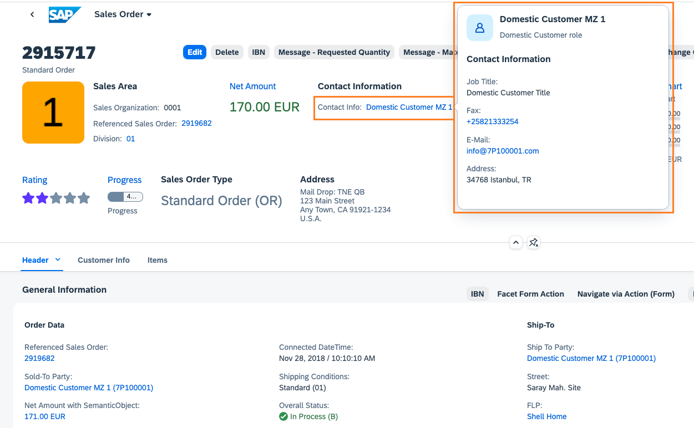

<!-- loioa6a8c0c4849b483eb10e87f6fdf9383c -->

# Adding a Contact Facet

You can use the `Field` building block to render a contact facet.

> ### Note:  
> This topic describes how to use the building block within SAP Fiori elements object pages. If the functionality isn't available when you use the building block in other floorplans, custom pages, or custom sections, you can try achieving the functionality through other means, such as the following:
> 
> -   Properties or methods exposed by the building block
> 
> -   Custom code using extensions

To render a contact list and contact facet, you add a `UI.ReferenceFacet` that points to a contact annotation \(`type`\). It shows the label of the `UI.ReferenceFacet`, and below it, the `fn` property of the contact annotation. If you click on the name, a quick view with the contact details is displayed, as shown in the following screenshot:

  
  
**Object Page: Contacts**


The contact card reads the following annotation properties and displays them:

-   `fn`: the full name of the contact. It's displayed as the title of the card, using a bigger font.

-   `title`: the job title of the contact. It's displayed below the title of the card, using a smaller font.

-   `photo`: the photo assigned to the contact. It's displayed in the header of the contact card. If no photo is provided, a contact fallback icon is shown instead.

-   `role`: the role of the contact. It's displayed in the content of the card.

-   `org`: the organization of the contact. It's displayed in the content of the card.

-   `adr`: the address of the contact. It's displayed in the content of the card. The address must match the `addressType` definition. The order of the displayed address is street, code, locality, region, and country in a comma-separated string. Note that if the `label` property is used, then only this is shown and the other properties are ignored.

-   `email`: the email addresses of the contact, together with the email type. The supported type values are `preferred` and `work`. This information is displayed as a link in the content of the card. When the end user clicks on it, an email window opens.

-   `tel`: the telephone numbers of the contact, together with the types. This information is displayed as a link in the content of the card. When the end user clicks on it, the phone application defined in the user's browser settings opens. If the telephone number is a fax number, use `type: #fax`to display it as a fax number. The other supported types are `preferred`, `cell`, and `work`.


Applications can configure additional contact details to be displayed in a popover when users click on the link.

Configure the contact card using `com.sap.vocabularies.UI.v1.DataFieldForAnnotation` and `com.sap.vocabularies.Communication.v1.Communication`, as shown in the following sample code:

> ### Sample Code:  
> XML Annotation
> 
> ```xml
> <Annotations Target="clouds.products.CatalogService.Products">
>     <Annotation Term="UI.LineItem">
>         <Collection>
>             <Record Type="UI.DataFieldForAnnotation">
>                 <PropertyValue Property="Label" String="Supplier"/>
>                 <PropertyValue Property="Target" AnnotationPath="supplier/@Communication.Contact"/>
>             </Record>
>         </Collection>
>     </Annotation>
> </Annotations>
> ```

> ### Sample Code:  
> ABAP CDS Annotation
> 
> ```
> annotate view PRODUCTS.CATALOGSERVICE.PRODUCTS with {
> 
> 
> @UI.lineItem: [
>   {
>     label: 'Supplier',
>     value: 'SUPPLIER',
>     type: #AS_CONTACT,
>     position: 1 
>   }
> ]
> 
> test;
> }
> 
> ```

> ### Sample Code:  
> CAP CDS Annotation
> 
> ```
> LineItem                         : [
>     {
>         $Type  : 'UI.DataFieldForAnnotation',
>         Target : 'supplier/@Communication.Contact',
>         Label  : 'Supplier'
>     }]
> 
> ```

You must then add the annotation given below to the `EntitySet` pointed to by the `Navigation` property \(`"Supplier"` in the code snippet above\) for the contents of the card. The following snippet controls the content of the card:

> ### Sample Code:  
> XML Annotation
> 
> `Communication.Contact`
> 
> ```xml
> <Annotations Target="clouds.products.CatalogService.Suppliers">
>     <Annotation Term="Communication.Contact">
>         <Record Type="Communication.ContactType">
>             <PropertyValue Property="email">
>                 <Collection>
>                     <Record Type="Communication.EmailAddressType">
>                         <PropertyValue Property="type">
>                             <EnumMember>Communication.ContactInformationType/work</EnumMember>
>                         </PropertyValue>
>                         <PropertyValue Property="address">
>                             <Path>emailAddress</Path>
>                         </PropertyValue>
>                     </Record>
>                 </Collection>
>             </PropertyValue>
>             <PropertyValue Property="fn">
>                 <Path>name</Path>
>             </PropertyValue>
>             <PropertyValue Property="tel">
>                 <Collection>
>                     <Record Type="Communication.PhoneNumberType">
>                         <PropertyValue Property="type">
>                             <EnumMember>Communication.PhoneType/fax</EnumMember>
>                         </PropertyValue>
>                         <PropertyValue Property="uri">
>                             <Path>faxNumber</Path>
>                         </PropertyValue>
>                     </Record>
>                     <Record Type="Communication.PhoneNumberType">
>                         <PropertyValue Property="type">
>                             <EnumMember>Communication.PhoneType/work</EnumMember>
>                         </PropertyValue>
>                         <PropertyValue Property="uri">
>                             <Path>phoneNumber</Path>
>                         </PropertyValue>
>                     </Record>
>                 </Collection>
>             </PropertyValue>
>         </Record>
>     </Annotation>
> </Annotations>
> ```

> ### Sample Code:  
> ABAP CDS Annotation
> 
> ```
> define view Suppliers
> {
>   @Semantics.name.fullName: true
>   name,
> 
>   @Semantics.eMail.address: true
>   @Semantics.eMail.type:  [#WORK]
>   emailAddress,
>    
>   @Semantics.telephone.type:  [ #FAX ] 
>   FaxNumber,
>   
>   @Semantics.telephone.type:  [ #WORK]
>   PhoneNumber
> }
> 
> ```

> ### Sample Code:  
> CAP CDS Annotation
> 
> ```
> FieldGroup #HeaderGeneralInformation            : {Data : [{
>         $Type  : 'UI.DataFieldForAnnotation',
>         Target : '_SoldToParty/@Communication.Contact',
>         Label  : 'Contact Info'
>     }, ]},
> 
> 
> entity Customer                                        @(
>     cds.autoexpose,
>     title                  : 'Sold-to Party',
>     Communication.Contact  : {
>         email : [{
>             type    : #work,
>             address : EmailAddress
>         }],
>         fn    : CustomerName,
>         tel   : [{
>             type : #fax,
>             uri  : InternationalPhoneNumber
>         }],
>         adr   : [{
>             type     : #work,
>             code     : PostalCode,
>             country  : Country,
>             locality : CityName
>         }]
>     },
>     Common.IsNaturalPerson : true
> )
> 
> ```

The column in the table and the contact popover when clicking the link looks like this:



> ### Tip:  
> If no "`@Contact.photo`" annotation is provided, a fallback icon for the contact is displayed.


## Contact Facet in the Object Page Header

Using the `@Communication.Contact` annotation, you can enable a quick view contact within the header form facet.

  
  
**Contact Facet**


In the example, the `UI.DataFieldForAnnotation` points to a contact annotation on a different entity, which has a 1:1 relation to the root entity, and so one contact is displayed in the header. The label, for example *Sold-To-Party*, is taken from `UI.DataFieldForAnnotation`, and the value, for example *Domestic HK Customer 1*, is the `fn` property of the contact annotation.


### Contact Link

> ### Sample Code:  
> XML Annotation
> 
> ```
> 
> <Annotation Term="UI.FieldGroup" Qualifier="OrderData">
>     <Record Type="UI.FieldGroupType">
>         <PropertyValue Property="Data">
>             <Collection>
>                 <Record Type="UI.DataFieldWithNavigationPath">
>                     <PropertyValue Property="Label" String="Referenced Sales Order"/>
>                     <PropertyValue Property="Value" Path="_ReferencedSalesOrder/SalesOrder"/>
>                     <PropertyValue Property="Target" NavigationPropertyPath="SalesOrderManage"/>
>                 </Record>
>                 <Record Type="UI.DataFieldForAnnotation">
>                     <PropertyValue Property="Target" AnnotationPath="_SoldToParty/@Communication.Contact"/>
>                     <PropertyValue Property="Label" String="Sold-To-Party"/>
>                 </Record>
>                 <Record Type="UI.DataField">
>                     <PropertyValue Property="Value" Path="PurchaseOrderByCustomer"/>
>                     <Annotation Term="UI.Importance" EnumMember="UI.ImportanceType/High"/>
>                 </Record>
>                 <Record Type="UI.DataField">
>                     <PropertyValue Property="Value" Path="SalesOrderDate"/>
>                     <Annotation Term="UI.Importance" EnumMember="UI.ImportanceType/High"/>
>                     <Annotation Term="UI.Hidden" Path="Delivered"/>
>                 </Record>
>                 <Record Type="UI.DataField">
>                     <PropertyValue Property="Value" Path="ShippingCondition"/>
>                     <Annotation Term="UI.Importance" EnumMember="UI.ImportanceType/High"/>
>                 </Record>
>                 <Record Type="UI.DataField">
>                     <PropertyValue Property="Value" Path="OverallSDProcessStatus"/>
>                     <Annotation Term="UI.Importance" EnumMember="UI.ImportanceType/High"/>
>                     <PropertyValue Property="Criticality" Path="StatusCriticality"/>
>                 </Record>
>                 <Record Type="UI.DataField">
>                     <PropertyValue Property="Value" Path="DescriptionFieldForOPACleanup"/>
>                     <Annotation Term="UI.Importance" EnumMember="UI.ImportanceType/High"/>
>                 </Record>
>             </Collection>
>         </PropertyValue>
>     </Record>
> </Annotation>
> 
> ```

> ### Sample Code:  
> ABAP CDS Annotation
> 
> ```
> 
> @UI.fieldGroup: [
>   {
>     targetelement: 'SALESORDERMANAGE',
>     label: 'Referenced Sales Order',
>     value: '_REFERENCEDSALESORDER.SALESORDER',
>     type: #WITH_NAVIGATION_PATH,
>     position: 10,
>     qualifier: 'OrderData'
>   }
> ]
> _REFERENCEDSALESORDER;
> 
> @UI.fieldGroup: [
>   {
>     value: '_SOLDTOPARTY',
>     label: 'Sold-To-Party',
>     type: #AS_CONTACT,
>     position: 20 ,
>     qualifier: 'OrderData'
>   }
> ]
> _SOLDTOPARTY;
> 
> @UI.fieldGroup: [
>   {
>     importance: #HIGH,
>     position: 30 ,
>     qualifier: 'OrderData'
>   }
> ]
> PURCHASEORDERBYCUSTOMER;
> 
> @UI.fieldGroup: [
>   {
>     importance: #HIGH,
>     hidden: true,
>     position: 40 ,
>     qualifier: 'OrderData'
>   }
> ]
> SALESORDERDATE;
> 
> @UI.fieldGroup: [
>   {
>     importance: #HIGH,
>     position: 50 ,
>     qualifier: 'OrderData'
>   }
> ]
> SHIPPINGCONDITION;
> 
> @UI.fieldGroup: [
>   {
>     importance: #HIGH,
>     criticality: 'STATUSCRITICALITY',
>     position: 60 ,
>     qualifier: 'OrderData'
>   }
> ]
> OVERALLSDPROCESSSTATUS;
> 
> @UI.fieldGroup: [
>   {
>     importance: #HIGH,
>     position: 70 ,
>     qualifier: 'OrderData'
>   }
> ]
> DESCRIPTIONFIELDFOROPACLEANUP;
> 
> ```

> ### Sample Code:  
> CAP CDS Annotation
> 
> ```
> 
> UI.FieldGroup #OrderData : {
>     $Type : 'UI.FieldGroupType',
>     Data : [
>         {
>             $Type : 'UI.DataFieldWithNavigationPath',
>             Label : 'Referenced Sales Order',
>             Value : _ReferencedSalesOrder.SalesOrder,
>             Target : SalesOrderManage
>         },
>         {
>             $Type : 'UI.DataFieldForAnnotation',
>             Target : '_SoldToParty/@Communication.Contact',
>             Label : 'Sold-To-Party'
>         },
>         {
>             $Type : 'UI.DataField',
>             Value : PurchaseOrderByCustomer,
>             ![@UI.Importance] : #High
>         },
>         {
>             $Type : 'UI.DataField',
>             Value : SalesOrderDate,
>             ![@UI.Importance] : #High,
>             ![@UI.Hidden] : Delivered
>         },
>         {
>             $Type : 'UI.DataField',
>             Value : ShippingCondition,
>             ![@UI.Importance] : #High
>         },
>         {
>             $Type : 'UI.DataField',
>             Value : OverallSDProcessStatus,
>             Criticality : StatusCriticality,
>             ![@UI.Importance] : #High
>         },
>         {
>             $Type : 'UI.DataField',
>             Value : DescriptionFieldForOPACleanup,
>             ![@UI.Importance] : #High
>         }
>     ]
> }
> 
> ```


### Popover

> ### Sample Code:  
> XML Annotation
> 
> ```
> 
> <Annotation Term="Communication.Contact">
>     <Record Type="Communication.ContactType">
>         <PropertyValue Property="adr">
>             <Collection>
>                 <Record Type="Communication.AddressType">
>                     <PropertyValue Property="type" EnumMember="Communication.ContactInformationType/work"/>
>                     <PropertyValue Property="uri" Path="InternationalPhoneNumber"/>
>                     <PropertyValue Property="code" Path="PostalCode"/>
>                     <PropertyValue Property="country" Path="Country"/>
>                     <PropertyValue Property="locality" Path="CityName"/>
>                 </Record>
>             </Collection>
>         </PropertyValue>
>         <PropertyValue Property="email">
>             <Collection>
>                 <Record Type="Communication.EmailAddressType">
>                     <PropertyValue Property="type" EnumMember="Communication.ContactInformationType/work"/>
>                     <PropertyValue Property="address" Path="EmailAddress"/>
>                 </Record>
>             </Collection>
>         </PropertyValue>
>         <PropertyValue Property="fn" Path="CustomerName"/>
>         <PropertyValue Property="tel">
>             <Collection>
>                 <Record Type="Communication.PhoneNumberType">
>                     <PropertyValue Property="type" EnumMember="Communication.PhoneType/fax"/>
>                     <PropertyValue Property="uri" Path="InternationalPhoneNumber"/>
>                 </Record>
>             </Collection>
>         </PropertyValue>
>         <PropertyValue Property="photo" Path="CustomerImg"/>
>     </Record>
> </Annotation>
> 
> ```

> ### Sample Code:  
> ABAP CDS Annotation
> 
> ```
> 
> define view VIEWNAME
> {
>   @Semantics.name.fullName: true
>   CustomerName,
> 
>   @Semantics.eMail.address: true
>   @Semantics.eMail.type:  [#WORK]
>   EmailAddress,
>    
>   @Semantics.telephone.type:  [ #FAX ] 
>   InternationalPhoneNumber,
> 
>   @Semantics.address : { zipCode: true } 
>   PostalCode,
> 
>   @Semantics.address : { country: true } 
>   Country,
> 
>   @Semantics.address : { city: true }  
>   CityName,
> 
>   @Semantics.contact.photo: true
>   CustomerImg
> }
> 
> ```

> ### Sample Code:  
> CAP CDS Annotation
> 
> ```
> 
> Communication.Contact : {
>     $Type : 'Communication.ContactType',
>     adr : [
>         {
>             $Type : 'Communication.AddressType',
>             type : #work,
>             uri : InternationalPhoneNumber,
>             code : PostalCode,
>             country : Country,
>             locality : CityName
>         }
>     ],
>     email : [
>         {
>             $Type : 'Communication.EmailAddressType',
>             type : #work,
>             address : EmailAddress
>         }
>     ],
>     fn : CustomerName,
>     tel : [
>         {
>             $Type : 'Communication.PhoneNumberType',
>             type : #fax,
>             uri : InternationalPhoneNumber
>         }
>     ],
>     photo : CustomerImg
> },
> 
> ```


> ### Note:  
> For information about SAP Fiori elements for OData V2, see [Adding a Contact Facet](adding-a-contact-facet-9375d6a.md).


## Related Links

For more information about header facets, see [Header Facets](header-facets-17dbd5b.md).

