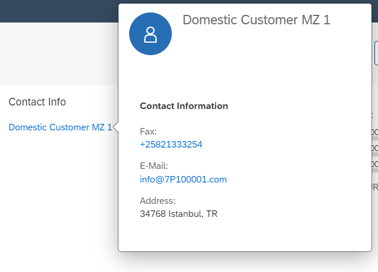

<!-- loio677fbde43a324f36aa9398b7f04e9896 -->

# Adding a Contact Quick View to a Table

Using the `@Communication.Contact` annotation, you can enable a contact quick view in a table.

The quick view can be displayed from the list report and the object page, as shown below.

   
  
**Displaying a Contact Quick View in a Table**

  


<a name="loio677fbde43a324f36aa9398b7f04e9896__section_dkt_hb2_qz"/>

## Code Samples

Using the `@Communication.Contact` annotation, you can enable a contact quick view in a table.

In the example, the `UI.LineItem` annotation needs to be added under the `ProductType` entity, as follows:

> ### Sample Code:  
> XML Annotation
> 
> ```xml
> <Annotation Term="UI.LineItem">
>     <Collection>
>         <Record Type="UI.DataFieldForAction">
>             <PropertyValue Property="Label" String="Activate" />
>             <PropertyValue Property="Action"
>                            String="STTA_PROD_MAN.STTA_PROD_MAN_Entities/STTA_C_MP_ProductActivation"/>
>             <PropertyValue Property="InvocationGrouping"
>                            EnumMember="UI.OperationGroupingType/ChangeSet" />
>         </Record>
>         <Record Type="UI.DataField">
>             <PropertyValue Property="Value" Path="ProductPictureURL" />
>             <Annotation Term="UI.Importance" EnumMember="UI.ImportanceType/High" />
>         </Record>
>         <Record Type="UI.DataField">
>             <PropertyValue Property="Value" Path="ProductForEdit" />
>             <Annotation Term="UI.Importance" EnumMember="UI.ImportanceType/High" />
>         </Record>
>         <Record Type="UI.DataField">
>             <PropertyValue Property="Value" Path="ProductCategory" />
>             <Annotation Term="UI.Importance" EnumMember="UI.ImportanceType/High" />
>         </Record>
>         <Record Type="UI.DataFieldWithIntentBasedNavigation">
>             <PropertyValue Property="Label" String="Supplier (with IBN)" />
>             <PropertyValue Property="Value" Path="Supplier" />
>             <PropertyValue Property="SemanticObject" String="EPMProduct" />
>             <PropertyValue Property="Action" String="manage" />
>         </Record>
>         <Record Type="UI.DataFieldForAnnotation">
>             <PropertyValue Property="Label" String="{@i18n>Supplier}"/>
>             <PropertyValue Property="Target"
>                            AnnotationPath="to_Supplier/@Communication.Contact"/>
>             <Annotation Term="UI.Importance" EnumMember="UI.ImportanceType/High" />
>         </Record>
>         <Record Type="UI.DataField">
>             <PropertyValue Property="Criticality"
>                            Path="to_StockAvailability/StockAvailability" />
>             <PropertyValue Property="Value"
>                            Path="to_StockAvailability/StockAvailability" />
>             <Annotation Term="UI.Importance" EnumMember="UI.ImportanceType/High" />
>         </Record>
>         <Record Type="UI.DataFieldForAnnotation">
>             <PropertyValue Property="Label" String="Rating" />
>             <PropertyValue Property="Target" AnnotationPath="@UI.DataPoint#Rating" />
>         </Record>
>         <Record Type="UI.DataFieldForAnnotation">
>             <PropertyValue Property="Label" String="Progress" />
>             <PropertyValue Property="Criticality"
>                            Path="to_StockAvailability/Quantity" />
>             <PropertyValue Property="Target" AnnotationPath="@UI.DataPoint#Progress" />
>         </Record>
>         <Record Type="UI.DataField">
>             <PropertyValue Property="Value" Path="Price" />
>             <Annotation Term="UI.Importance" EnumMember="UI.ImportanceType/High" />
>         </Record>
>         <Record Type="UI.DataFieldForAction">
>             <PropertyValue Property="Label" String="Copy" />
>             <PropertyValue Property="IconUrl" String="sap-icon://copy" />
>             <PropertyValue Property="Action"
>                            String="STTA_PROD_MAN.STTA_PROD_MAN_Entities/STTA_C_MP_ProductCopy" />
>             <PropertyValue Property="Inline" Bool="true" />
>             <PropertyValue Property="Determining" Bool="true" />
>             <PropertyValue Property="InvocationGrouping"
>                            EnumMember="UI.OperationGroupingType/Isolated" />
>         </Record>
>         <Record Type="UI.DataFieldForIntentBasedNavigation">
>             <PropertyValue Property="Label" String="{@i18n>MANAGE_PRODUCTS_(ST)_2}" />
>             <PropertyValue Property="SemanticObject" String="EPMProduct" />
>             <PropertyValue Property="Action" String="manage_st" />
>             <PropertyValue Property="Inline" Bool="false" />
>             <PropertyValue Property="Determining" Bool="false" />
>             <PropertyValue Property="RequiresContext" Bool="true" />
>         </Record>
>         <Record Type="UI.DataFieldForIntentBasedNavigation">
>             <PropertyValue Property="Label" String="{@i18n>Inline_Nav_MasterDetail}" />
>             <PropertyValue Property="SemanticObject" String="EPMProduct" />
>             <PropertyValue Property="Action" String="manage" />
>             <PropertyValue Property="Inline" Bool="true" />
>             <PropertyValue Property="Determining" Bool="false" />
>             <PropertyValue Property="RequiresContext" Bool="false" />
>         </Record>
>         <Record Type="UI.DataFieldForAnnotation">
>             <PropertyValue Property="Label" String="Sales"/>
>             <PropertyValue Property="Target" AnnotationPath="to_ProductSalesPrice/@UI.Chart#SalesPriceAreaChart"/>
>         </Record>
>         <Record Type="UI.DataFieldForAnnotation">
>             <PropertyValue Property="Label" String="Revenue"/>
>             <PropertyValue Property="Target" AnnotationPath="to_ProductSalesRevenue/@UI.Chart#GrossSalesRevenueBulletChart"/>
>         </Record>
>     </Collection>
> </Annotation> 
> ```

> ### Sample Code:  
> ABAP CDS Annotation
> 
> ```
> 
> @UI.lineItem: [
>   {
>     label: 'Activate',
>     dataAction: 'PUSHDOWN:STTA_C_MP_ProductActivation',
>     invocationGrouping: #CHANGE_SET,
>     type: #FOR_ACTION,
>     position: 1 
>   },
>   {
>     importance: #HIGH,
>     value: 'PRODUCTPICTUREURL',
>     type: #STANDARD,
>     position: 2 
>   },
>   {
>     importance: #HIGH,
>     label: '{@i18n>@Supplier}',
>     value: 'TO_SUPPLIER',
>     type: #AS_CONTACT,
>     position: 6 
>   },
>   {
>     label: 'Rating',
>     valueQualifier: 'Rating',
>     type: #AS_DATAPOINT,
>     position: 8 
>   },
>   {
>     label: 'Progress',
>     criticality: 'TO_STOCKAVAILABILITY/QUANTITY',
>     valueQualifier: 'Progress',
>     type: #AS_DATAPOINT,
>     position: 9 
>   },
>   {
>     label: 'Copy',
>     iconUrl: 'sap-icon:,//copy'
>     dataAction: 'PUSHDOWN:STTA_C_MP_ProductCopy',
>     invocationGrouping: #ISOLATED,
>     type: #FOR_ACTION,
>     position: 11 
>   },
>   {
>     label: '{@i18n>@MANAGE_PRODUCTS_(ST)_2}',
>     semanticObjectAction: 'manage_st',
>     requiresContext: true,
>     type: #FOR_INTENT_BASED_NAVIGATION,
>     position: 12 
>   },
>   {
>     label: '{@i18n>@Inline_Nav_MasterDetail}',
>     semanticObjectAction: 'manage',
>     type: #FOR_INTENT_BASED_NAVIGATION,
>     position: 13 
>   },
>   {
>     label: 'Sales',
>     valueQualifier: 'SalesPriceAreaChart',
>     value: 'TO_PRODUCTSALESPRICE',
>     type: #AS_CHART,
>     position: 14 
>   },
>   {
>     label: 'Revenue',
>     valueQualifier: 'GrossSalesRevenueBulletChart',
>     value: 'TO_PRODUCTSALESREVENUE',
>     type: #AS_CHART,
>     position: 15 
>   }
> ]
> PRODUCTPICTUREURL;
> 
> @UI.lineItem: [
>   {
>     importance: #HIGH,
>     value: 'PRODUCTFOREDIT',
>     type: #STANDARD,
>     position: 3 
>   }
> ]
> PRODUCTFOREDIT;
> 
> @UI.lineItem: [
>   {
>     importance: #HIGH,
>     value: 'PRODUCTCATEGORY',
>     type: #STANDARD,
>     position: 4 
>   }
> ]
> PRODUCTCATEGORY;
> 
> @UI.lineItem: [
>   {
>     label: 'Supplier (with IBN)',
>     value: 'SUPPLIER',
>     semanticObjectAction: 'manage',
>     type: #WITH_INTENT_BASED_NAVIGATION,
>     position: 5 
>   }
> ]
> SUPPLIER;
> 
> @UI.lineItem: [
>   {
>     importance: #HIGH,
>     criticality: 'TO_STOCKAVAILABILITY/STOCKAVAILABILITY',
>     value: 'TO_STOCKAVAILABILITY/STOCKAVAILABILITY',
>     type: #STANDARD,
>     position: 7 
>   }
> ]
> TO_STOCKAVAILABILITY/STOCKAVAILABILITY;
> 
> @UI.lineItem: [
>   {
>     importance: #HIGH,
>     value: 'PRICE',
>     type: #STANDARD,
>     position: 10 
>   }
> ]
> PRICE;
> 
> @Consumption.semanticObject: 'EPMProduct'
> SUPPLIER;
> 
> ```

> ### Sample Code:  
> CAP CDS Annotation
> 
> ```
> 
> UI.LineItem : [
>     {
>         $Type : 'UI.DataFieldForAction',
>         Label : 'Activate',
>         Action : 'STTA_PROD_MAN.STTA_PROD_MAN_Entities/STTA_C_MP_ProductActivation',
>         InvocationGrouping : #ChangeSet
>     },
>     {
>         $Type : 'UI.DataField',
>         Value : ProductPictureURL,
>         ![@UI.Importance] : #High
>     },
>     {
>         $Type : 'UI.DataField',
>         Value : ProductForEdit,
>         ![@UI.Importance] : #High
>     },
>     {
>         $Type : 'UI.DataField',
>         Value : ProductCategory,
>         ![@UI.Importance] : #High
>     },
>     {
>         $Type : 'UI.DataFieldWithIntentBasedNavigation',
>         Label : 'Supplier (with IBN)',
>         Value : Supplier,
>         SemanticObject : 'EPMProduct',
>         Action : 'manage'
>     },
>     {
>         $Type : 'UI.DataFieldForAnnotation',
>         Label : '{@i18n&gt;@Supplier}',
>         Target : 'to_Supplier/@Communication.Contact',
>         ![@UI.Importance] : #High
>     },
>     {
>         $Type : 'UI.DataField',
>         Criticality : to_StockAvailability.StockAvailability,
>         Value : to_StockAvailability.StockAvailability,
>         ![@UI.Importance] : #High
>     },
>     {
>         $Type : 'UI.DataFieldForAnnotation',
>         Label : 'Rating',
>         Target : '@UI.DataPoint#Rating'
>     },
>     {
>         $Type : 'UI.DataFieldForAnnotation',
>         Label : 'Progress',
>         Criticality : to_StockAvailability.Quantity,
>         Target : '@UI.DataPoint#Progress'
>     },
>     {
>         $Type : 'UI.DataField',
>         Value : Price,
>         ![@UI.Importance] : #High
>     },
>     {
>         $Type : 'UI.DataFieldForAction',
>         Label : 'Copy',
>         IconUrl : 'sap-icon://copy',
>         Action : 'STTA_PROD_MAN.STTA_PROD_MAN_Entities/STTA_C_MP_ProductCopy',
>         Inline : true,
>         Determining : true,
>         InvocationGrouping : #Isolated
>     },
>     {
>         $Type : 'UI.DataFieldForIntentBasedNavigation',
>         Label : '{@i18n&gt;@MANAGE_PRODUCTS_(ST)_2}',
>         SemanticObject : 'EPMProduct',
>         Action : 'manage_st',
>         Inline : false,
>         Determining : false,
>         RequiresContext : true
>     },
>     {
>         $Type : 'UI.DataFieldForIntentBasedNavigation',
>         Label : '{@i18n&gt;@Inline_Nav_MasterDetail}',
>         SemanticObject : 'EPMProduct',
>         Action : 'manage',
>         Inline : true,
>         Determining : false,
>         RequiresContext : false
>     },
>     {
>         $Type : 'UI.DataFieldForAnnotation',
>         Label : 'Sales',
>         Target : 'to_ProductSalesPrice/@UI.Chart#SalesPriceAreaChart'
>     },
>     {
>         $Type : 'UI.DataFieldForAnnotation',
>         Label : 'Revenue',
>         Target : 'to_ProductSalesRevenue/@UI.Chart#GrossSalesRevenueBulletChart'
>     }
> ]
> 
> ```

The `Communication.Contact` annotation term is defined under the `SupplierType` entity as follows:

> ### Sample Code:  
> XML Annotation
> 
> ```xml
> <Annotation Term="Communication.Contact">
>     <Record>
>         <PropertyValue Property="fn" Path="CompanyName" />
>         <PropertyValue Property="tel">
>             <Collection>
>                 <Record>
>                     <PropertyValue Property="type"
>                                    EnumMember="Communication.PhoneType/fax" />
>                     <PropertyValue Property="uri" Path="FaxNumber" />
>                 </Record>
>                 <Record>
>                     <PropertyValue Property="type"
>                                    EnumMember="Communication.PhoneType/preferred Communication.PhoneType/work" />
>                     <PropertyValue Property="uri" Path="PhoneNumber" />
>                 </Record>
>             </Collection>
>         </PropertyValue>
>         <PropertyValue Property="email">
>             <Collection>
>                 <Record>
>                     <PropertyValue Property="type"
>                                    EnumMember="Communication.ContactInformationType/work Communication.ContactInformationType/pref" />
>                     <PropertyValue Property="address" Path="EmailAddress" />
>                 </Record>
>             </Collection>
>         </PropertyValue>
>     </Record>
> </Annotation>
> ```

> ### Sample Code:  
> ABAP CDS Annotation
> 
> ```
> 
> define view VIEWNAME
> {
>   @Semantics.name.fullName: true
>   CompanyName,
> 
>   @Semantics.eMail.address: true
>   @Semantics.eMail.type:  [#WORK]
>   EmailAddress,
>    
>   @Semantics.telephone.type:  [ #FAX ] 
>   FaxNumber,
>   
>   @Semantics.telephone.type:  [ #WORK]
>   PhoneNumber
> }
> 
> ```

> ### Sample Code:  
> CAP CDS Annotation
> 
> ```
> 
> Communication.Contact : {
>     fn : CompanyName,
>     tel : [
>         {
>             type : #fax,
>             uri : FaxNumber
>         },
>         {
>             type : [ #preferred, #work ],
>             uri : PhoneNumber
>         },
>     ],
>     email : [
>         {
>             type : [ #work, #pref ],
>             address : EmailAddress
>         }
>     ]
> }
> 
> ```

