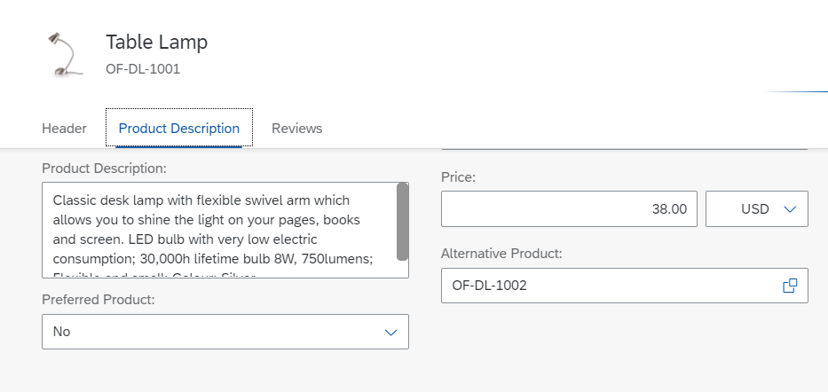

<!-- loiob75af69fbe9048c3aaa95664578051ee -->

<link rel="stylesheet" type="text/css" href="../css/sap-icons.css"/>

# Adding a Custom Section to an Object Page

You can add custom sections to the object page.


> ### Note:  
> For information about SAP Fiori elements for OData V4, see [Adding a Custom Section to an Object Page](adding-a-custom-section-to-an-object-page-a357047.md).


<a name="loiob75af69fbe9048c3aaa95664578051ee__section_nbx_fky_rcc"/>

## Adding a Custom Section to an Object Page Using SAP Fiori Tools

To add a section to an object page using SAP Fiori tools, follow these steps:

1.  Launch the *Page Map*. You can launch the *Page Map* in several ways, for example by right-clicking the project folder and selecting *Show Page Map*. For more information, see [Define Application Structure](https://help.sap.com/docs/SAP_FIORI_tools/17d50220bcd848aa854c9c182d65b699/bae38e6216754a76896b926a3d6ac3a9.html).
2.  Launch the *Page Editor* for your object page. Click the :pencil2: \(*Edit*\) icon next to *Object Page*.
3.  Click the :heavy_plus_sign: \(*Add*\) icon next to *Sections*.
4.  Click *Add Custom Section*.
5.  Provide a unique *Title*.
6.  Provide a unique *Fragment Name*.
7.  Select an *Anchor Section*.
8.  Click *Add*.
9.  To preview your new section, see [Previewing an Application](https://help.sap.com/docs/SAP_FIORI_tools/17d50220bcd848aa854c9c182d65b699/b962685bdf9246f6bced1d1cc1d9ba1c.html).

    The following screen recording shows how to add a new section:


<a name="loiob75af69fbe9048c3aaa95664578051ee__section_cjq_qdf_d4b"/>

## Adding a Custom Section Manually

> ### Caution:  
> Use app extensions with caution and only if you cannot produce the required behavior by other means, such as manifest settings or annotations. To correctly integrate your app extension coding with SAP Fiori elements, use only the `extensionAPI` of SAP Fiori elements. For more information, see [Using the extensionAPI](using-the-extensionapi-a5a4ec6.md).
> 
> After you've created an app extension, its display \(for example, control placement and layout\) and system behavior \(for example, model and binding usage, busy handling\) lies within the application's responsibility. SAP Fiori elements provides support only for the official `extensionAPI` functions. Don't access or manipulate controls, properties, models, or other internal objects created by the SAP Fiori elements framework.

The following steps show you how to add a custom section, namely *Product Description*, to the object page of the*Manage Products* application:


### Step 1: Create Fragment for the New Facet

In the editor of your choice, open the folder structure of the project where you want to make the adaptation and proceed as follows:

1.  In the `webapp` folder, create a new subfolder called `ext`.
2.  In the folder `ext`, create a new subfolder called `view`.
3.  In the `view` folder, create file `DescriptionBreakout.view.xml`.
4.  Define the view with its elements. The following sample code is for the `TextArea` element. The title for `TextArea` is translatable and is picked from the `i18n` file.

> ### Sample Code:  
> ```
> 
> <mvc:View xmlns:mvc="sap.ui.core.mvc" xmlns="sap.m">
>   <VBox>
>     <TextArea
>       id="DescriptionTextArea"
>       value="{to_ProductTextInOriginalLang/Description}"
>       width="30%"
>       editable="false"
>     />
>   </VBox>
> </mvc:View>
> 	
> ```


### Step 2: Add Section Title to the `i18n` File

To make the section title translatable, add the text to the `i18n` file as follows:

> ### Sample Code:  
> ```
> #This is the resource bundle for Manage Products
> 					
> # XTIT: Title of a facet within an object page if not needed in local/annotations.xml
> ProductDescription=Product Description		
> ```


### Step 3: Add Extension Definition to the `manifest.json` file

To add the extension definition to the `manifest.json` file, use a `viewExtension`.

In the following example, the custom section is placed after the `GeneralInformation` section:

> ### Sample Code:  
> `manifest.json`
> 
> ```
> 
> "extends": {
>     "extensions": {
>         "sap.ui.viewExtensions": {
>             "sap.suite.ui.generic.template.ObjectPage.view.Details": {
>                 "AfterFacet|SEPMRA_C_PD_Product|GeneralInformation": {
>                     "className": "sap.ui.core.mvc.View",
>                     "viewName": "ManageProducts.ext.view.DescriptionBreakout",
>                     "type": "XML",
>                     "sap.ui.generic.app": {
>                         "title": "{{ProductDescription}}"
>                     }
>                 }
>             }
>         }
>     }
> }
> 	
> ```

To add multiple sections, the extension name needs to contain a key after the annotation name in the extension entry, for example,`BeforeFacet|SEPMRA_C_PD_Product|to_ProductText::com.sap.vocabularies.UI.v1.LineItem|1`, as well as a `key` object in `sap.ui.generic.app`.

> ### Sample Code:  
> `manifest.json`
> 
> ```
> 
> "extends": {
>     "extensions": {
>         "sap.ui.viewExtensions": {
>             "sap.suite.ui.generic.template.ObjectPage.view.Details": {
>                 "BeforeFacet|SEPMRA_C_PD_Product|to_ProductText::com.sap.vocabularies.UI.v1.LineItem": {
>                     "className": "sap.ui.core.mvc.View",
>                     "viewName": "ManageProducts.ext.view.BeforeFacetTest",
>                     "type": "XML",
>                     "sap.ui.generic.app": {
>                         "title": "Facet Breakout before Product Text LineItem"
>                     }
>                 },
>                 "BeforeFacet|SEPMRA_C_PD_Product|to_ProductText::com.sap.vocabularies.UI.v1.LineItem|1": {
>                     "className": "sap.ui.core.mvc.View",
>                     "viewName": "ManageProducts.ext.view.BeforeFacetTestNew",
>                     "type": "XML",
>                     "sap.ui.generic.app": {
>                         "title": "Facet Breakout before Product Text LineItem",
>                         "key": "1"
>                     }
>                 },
>                 "AfterFacet|SEPMRA_C_PD_Product|to_Supplier::com.sap.vocabularies.UI.v1.Identification": {
>                     "className": "sap.ui.core.mvc.View",
>                     "viewName": "ManageProducts.ext.view.AfterFacetTest",
>                     "type": "XML",
>                     "sap.ui.generic.app": {
>                         "title": "Facet Breakout after Supplier Identification"
>                     }
>                 },
>                 "AfterFacet|SEPMRA_C_PD_Product|to_Supplier::com.sap.vocabularies.UI.v1.Identification|1": {
>                     "className": "sap.ui.core.mvc.View",
>                     "viewName": "ManageProducts.ext.view.AfterFacetTest",
>                     "type": "XML",
>                     "sap.ui.generic.app": {
>                         "title": "Facet Breakout after Supplier Identification",
>                         "key": 1
>                     }
>                 }
>             }
>         }
>     }
> }
> 
> ```


### Results

The object page of the *Manage Products* app shows the new section *Product Description*:




### Setting Section Title to the Control within Custom Section

To hide the section title or subsection title, you can call the `setAsTitleOwner` extension API. This allows you to replace the control title with the section or subsection title.

Define the `initialise` method of a table or chart in the extension fragment component.

> ### Sample Code:  
> ```
> <st:SmartTable id="SalesPriceFacetID" initialise="SalesPriceInitialise"/>
> ```

Define the same event in the controller and call the `setAsTitleOwner` extension API with the parameter `SmartTable` or `SmartChart`.

> ### Sample Code:  
> ```
> 
> SalesPriceInitialise: function(oEvent) {
>     var oSmartTable = oEvent.getSource();
>     var oExtensionAPI = extensionAPI.getExtensionAPI(oSmartTable);
>     oExtensionAPI.setAsTitleOwner(oSmartTable);
> }
> ```

For more information, see [Adding Titles to Object Page Tables](adding-titles-to-object-page-tables-f0d679d.md).

