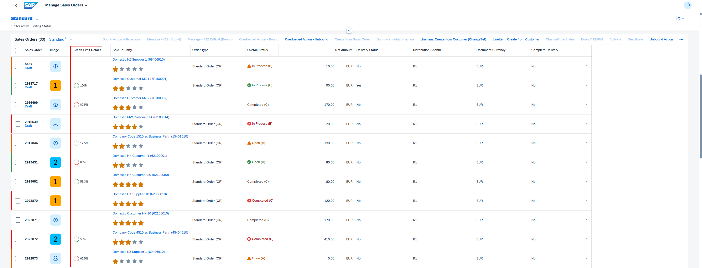

<!-- loiob8312a4adde54f33a89480dbe12d8632 -->

# Adding a Micro Chart to a Table

You can add a micro chart to the column of a responsive table in both the list report and the object page.

To add a micro chart to a table, use the `UI.LineItem` annotation and the complex type `DataFieldForAnnotation`. The micro charts are then displayed within the table column, as shown in the following screenshot:

  
  
**Micro Chart in List Report Table**



> ### Note:  
> You cannot sort and filter the measures and dimensions in a micro chart from the column header. These measures and dimensions are available in the *Settings* menu *Sorting and Filtering* menu if they are direct properties of the table entity.


<a name="loiob8312a4adde54f33a89480dbe12d8632__section_yvw_mdf_tnb"/>

## Additional Features in SAP Fiori Elements for OData V2


### `UI.LineItem` and `UI.DataFieldForAnnotation`

The `Label` property of the `UI.DataFieldForAnnotation` is used for the text of the table column header.

> ### Sample Code:  
> XML Annotation
> 
> ```xml
> 
> <Annotations Target="STTA_PROD_MAN.STTA_C_MP_ProductType">
>   <Annotation Term="UI.LineItem">
>     <Collection>
>       <Record Type="UI.DataFieldForAction">
>         <PropertyValue Property="Label" String="Copy with new Supplier"/>
>         <PropertyValue Property="Action" String="STTA_PROD_MAN.STTA_PROD_MAN_Entities/STTA_C_MP_ProductCopywithparams"/>
>         <Annotation Term="UI.OperationGrouping" EnumMember="UI.OperationGroupingType/Isolated"/>
>       </Record>
>       <Record Type="UI.DataFieldForAction">
>         <PropertyValue Property="Label" String="Activate"/>
>         <PropertyValue Property="Action" String="STTA_PROD_MAN.STTA_PROD_MAN_Entities/STTA_C_MP_ProductActivation"/>
>         <PropertyValue Property="Determining" Bool="true"/>
>         <Annotation Term="UI.OperationGrouping" EnumMember="UI.OperationGroupingType/ChangeSet"/>
>       </Record>
>       <Record Type="UI.DataField">
>         <PropertyValue Property="Value" Path="Product"/>
>         <Annotation Term="UI.Importance" EnumMember="UI.ImportanceType/High"/>
>       </Record>
>       <Record Type="UI.DataField">
>         <PropertyValue Property="Value" Path="ProductCategory"/>
>         <Annotation Term="UI.Importance" EnumMember="UI.ImportanceType/High"/>
>       </Record>
>       <Record Type="UI.DataField">
>         <PropertyValue Property="Value" Path="to_Supplier/CompanyName"/>
>         <Annotation Term="UI.Importance" EnumMember="UI.ImportanceType/High"/>
>       </Record>
>       <Record Type="UI.DataField">
>         <PropertyValue Property="Criticality" Path="to_StockAvailability/StockAvailability"/>
>         <PropertyValue Property="Value" Path="to_StockAvailability/StockAvailability"/>
>         <Annotation Term="UI.Importance" EnumMember="UI.ImportanceType/High"/>
>       </Record>
>       <Record Type="UI.DataField">
>         <PropertyValue Property="Value" Path="Price"/>
>         <Annotation Term="UI.Importance" EnumMember="UI.ImportanceType/High"/>
>       </Record>
>       <Record Type="UI.DataFieldForAction">
>         <PropertyValue Property="Label" String="Copy"/>
>         <PropertyValue Property="IconUrl" String="sap-icon://copy"/>
>         <PropertyValue Property="Action" String="STTA_PROD_MAN.STTA_PROD_MAN_Entities/STTA_C_MP_ProductCopy"/>
>         <PropertyValue Property="Inline" Bool="true"/>
>         <PropertyValue Property="Determining" Bool="true"/>
>         ABAP CDS
>                     Annotation
> <<Annotation Term="UI.OperationGrouping" EnumMember="UI.OperationGroupingType/Isolated"/>Annotations Target="STTA_PROD_MAN.STTA_C_MP_ProductType">
>       
>   <</Record>Annotation Term="UI.LineItem">
>       
>     <<Record Type="UI.DataFieldForIntentBasedNavigation">Collection>
>         
>       <<PropertyValue Property="Label" String="Manage Products (ST)"/>Record Type="UI.DataFieldForAction">
>         
>         <<PropertyValue Property="SemanticObject" String="EPMProduct"/>PropertyValue Property="Label" String="Copy with new Supplier"/>
>         
>         <<PropertyValue Property="Action" String="manage_st"/>PropertyValue Property="Action" String="STTA_PROD_MAN.STTA_PROD_MAN_Entities/STTA_C_MP_ProductCopywithparams"/>
>         
>         <<PropertyValue Property="Inline" Bool="true"/>Annotation Term="UI.OperationGrouping" EnumMember="UI.OperationGroupingType/Isolated"/>
>         
>       <<PropertyValue Property="Determining" Bool="true"/>/Record>
>       
>       <</Record>Record Type="UI.DataFieldForAction">
>       
>         <<Record Type="UI.DataFieldForAnnotation">PropertyValue Property="Label" String="Activate"/>
>         
>         <<PropertyValue Property="Label" String="Rating"/>PropertyValue Property="Action" String="STTA_PROD_MAN.STTA_PROD_MAN_Entities/STTA_C_MP_ProductActivation"/>
>         
>         <<PropertyValue Property="Target" AnnotationPath="@UI.DataPoint#Rating"/>PropertyValue Property="Determining" Bool="true"/>
>       
>         <</Record>Annotation Term="UI.OperationGrouping" EnumMember="UI.OperationGroupingType/ChangeSet"/>
>       
>       <<Record Type="UI.DataFieldForAnnotation">/Record>
>         
>       <<PropertyValue Property="Label" String="Progress"/>Record Type="UI.DataField">
>         
>         <<PropertyValue Property="Criticality" Path="to_StockAvailability/Quantity"/>PropertyValue Property="Value" Path="Product"/>
>         
>         <<PropertyValue Property="Target" AnnotationPath="@UI.DataPoint#Progress"/>Annotation Term="UI.Importance" EnumMember="UI.ImportanceType/High"/>
>       
>       </Record>
>       <</Record>Record Type="UI.DataFieldForAnnotation">
>       
>         <<Record Type="UI.DataField">PropertyValue Property="Label" String="Sales"/>
>         
>         <<PropertyValue Property="Value" Path="ProductCategory"/>PropertyValue Property="Target" AnnotationPath="to_ProductSalesPrice/@UI.Chart#AreaChartQualifier"/>
>         
>       <<Annotation Term="UI.Importance" EnumMember="UI.ImportanceType/High"/>/Record>
>       
>       <</Record>Record Type="UI.DataFieldForAnnotation">
>       
>         <<Record Type="UI.DataField">PropertyValue Property="Label" String="Revenue"/>
>         
>         <<PropertyValue Property="Target" AnnotationPath="to_ProductSalesRevenue/@UI.Chart#BulletChartQualifier"/>PropertyValue Property="Value" Path="to_Supplier/CompanyName"/>
>       
>         <</Record>Annotation Term="UI.Importance" EnumMember="UI.ImportanceType/High"/>
>     
>       <</Collection>/Record>
>   
>       <</AnRecord Type="UI.DataField">notation>
>         
> <<PropertyValue Property="Criticality" Path="to_StockAvailability/StockAvailability"/>/Annotations>
>         
> ```

> ### Sample Code:  
> CAP CDS Annotation
> 
> ```
> 
> @Consumption.semanticObject: 'EPMProduct'
> annotate view STTA_C_MP_PRODUCTTYPE with {
> @UI.lineItem: [
>   {
>     label: 'Copy with new Supplier',
>     dataAction: 'PUSHDOWN:STTA_C_MP_ProductCopywithparams',
>     type: #FOR_ACTION,
>     position: 10 
>   },
>   {
>     label: 'Activate',
>     dataAction: 'PUSHDOWN:STTA_C_MP_ProductActivation',
>     type: #FOR_ACTION,
>     position: 20 
>   },
>   {
>     label: 'Copy',
>     iconUrl: 'sap-icon:,//copy'
>     dataAction: 'PUSHDOWN:STTA_C_MP_ProductCopy',
>     type: #FOR_ACTION,
>     position: 80
>   },
>   {
>     label: 'Manage Products (ST)',
>     semanticObjectAction: 'manage_st',
>     type: #FOR_INTENT_BASED_NAVIGATION,
>     position: 90 
>   },
>   {
>     label: 'Rating',
>     valueQualifier: 'Rating',
>     type: #AS_DATAPOINT,
>     position: 100 
>   },
>   {
>     label: 'Progress',
>     criticality: 'TO_STOCKAVAILABILITY/QUANTITY',
>     valueQualifier: 'Progress',
>     type: #AS_DATAPOINT,
>     position: 110 
>   },
>   {
>     label: 'Sales',
>     valueQualifier: 'AreaChartQualifier',
>     value: '_PRODUCTSALESPRICE',
>     type: #AS_CHART,
>     position: 120 
>   },
>   {
>     label: 'Revenue',
>     valueQualifier: 'BulletChartQualifier',
>     value: '_PRODUCTSALESREVENUE',
>     type: #AS_CHART,
>     position: 130 
>   },
>   {
>     importance: #HIGH,
>     position: 30 
>   }
> ]
> product;
> 
> @UI.lineItem: [
>   {
>     importance: #HIGH,
>     position: 40 
>   }
> ]
> productcategory;
> 
> @UI.lineItem: [
>   {
>     importance: #HIGH,
>     value: '_SUPPLIER.COMPANYNAME',
>     type: #STANDARD,
>     position: 50
>   }
> ]
> _supplier;
> 
> @UI.lineItem: [
>   {
>     importance: #HIGH,
>     criticality: '_STOCKAVAILABILITY.STOCKAVAILABILITY',
>     value: '_STOCKAVAILABILITY.STOCKAVAILABILITY',
>     type: #STANDARD,
>     position: 60 
>   }
> ]
> _stockavailability;
> 
> @UI.lineItem: [
>   {
>     importance: #HIGH,UI.Chart Annotations
> ]
> price;
> }
> 
> ```


### 

**Area Micro Chart**

> ### Sample Code:  
> XML Annotation
> 
> ```xml
> 
> <Annotation Term="UI.Chart" Qualifier="AreaChartQualifier">
>     <Record Type="UI.ChartDefinitionType">
>         <PropertyValue Property="Title" String="Sales Price" />
>         <PropertyValue Property="Description" String="Area Micro Chart" />
>         <PropertyValue Property="ChartType" EnumMember="UI.ChartType/Area" />
>         <PropertyValue Property="Dimensions">
>             <Collection>
>                 <PropertyPath>PriceDay</PropertyPath>
>             </Collection>
>         </PropertyValue>
>         <PropertyValue Property="Measures">
>             <Collection>
>                 <PropertyPath>AreaChartPrice</PropertyPath>
>             </Collection>
>         </PropertyValue>
>         <PropertyValue Property="MeasureAttributes">
>             <Collection>
>                 <Record Type="UI.ChartMeasureAttributeType">
>                     <PropertyValue Property="Measure" PropertyPath="AreaChartPrice" />
>                     <PropertyValue Property="Role" EnumMember="UI.ChartMeasureRoleType/Axis1" />
>                     <PropertyValue Property="DataPoint" AnnotationPath="@UI.DataPoint#AreaChartPrice" />
>                 </Record>
>             </Collection>
>         </PropertyValue>
>     </Record>
> </Annotation>
> ```

> ### Sample Code:  
> ABAP CDS Annotation
> 
> ```
> 
> @UI.Chart: [
>   {
>     title: 'Sales Price',
>     description: 'Area Micro Chart',
>     chartType: #AREA,
>     dimensions: [
>       'PRICEDAY'
>     ],
>     measures: [
>       'AREACHARTPRICE'
>     ],
>     measureAttributes: [
>       {
>         measure: 'AreaChartPrice',
>         role: #AXIS_1,
>         asDataPoint: true
>       }
>     ],
>     qualifier: 'AreaChartQualifier'
>   }
> ]
> annotate view ITEM with {
> 
> }
> 
> ```

**Bullet Micro Chart**

> ### Sample Code:  
> XML Annotation
> 
> ```xml
> 
> <Annotation Term="UI.Chart" Qualifier="BulletChartQualifier">
>     <Record Type="UI.ChartDefinitionType">
>         <PropertyValue Property="Title" String="Sales Revenue" />
>         <PropertyValue Property="Description" String="Bullet Micro Chart" />
>         <PropertyValue Property="ChartType" EnumMember="UI.ChartType/Bullet" />
>         <PropertyValue Property="Measures">
>             <Collection>
>                 <PropertyPath>BulletChartRevenue</PropertyPath>
>             </Collection>
>         </PropertyValue>
>         <PropertyValue Property="MeasureAttributes">
>             <Collection>
>                 <Record Type="UI.ChartMeasureAttributeType">
>                     <PropertyValue Property="Measure" PropertyPath="BulletChartRevenue" />
>                     <PropertyValue Property="Role" EnumMember="UI.ChartMeasureRoleType/Axis1" />
>                     <PropertyValue Property="DataPoint" AnnotationPath="@UI.DataPoint#BulletChartRevenue" />
>                 </Record>
>             </Collection>
>         </PropertyValue>
>     </Record>
> </Annotation>
> ```

> ### Sample Code:  
> ABAP CDS Annotation
> 
> ```
> 
> @UI.Chart: [
>   {
>     title: 'Sales Revenue',
>     description: 'Bullet Micro Chart',
>     chartType: #BULLET,
>     measures: [
>       'BULLETCHARTREVENUE'
>     ],
>     measureAttributes: [
>       {
>         measure: 'BulletChartRevenue',
>         role: #AXIS_1,
>         asDataPoint: true
>       }
>     ],
>     qualifier: 'BulletChartQualifier'
>   }
> ]
> annotate view ITEM with {
> 
> }
> 
> ```

> ### Tip:  
> For more information about the code samples of other micro charts, see [Micro Chart Facet](micro-chart-facet-e219fd0.md).

> ### Restriction:  
> The template doesn't support the use of navigation properties in the `UI.Chart` term for the micro chart, as shown in the following sample code:
> 
>   
>   
> **Navigation Property**
> 
> 


### `UI.DataPoint` Annotation

The `DataPoint` property of the `MeasureAttributes` of the `UI.Chart` annotation should point to the `UI.DataPoint` annotation.

The `SmartMicroChart` control supports the `Criticality` and `CriticalityCalculation` properties of `UI.DataPoint`. For an example of how to use the `CriticalityCalculation`, see the following area micro chart annotation example. For an example of how to use the `Criticality` property, see the following bullet micro chart annotation example.

> ### Note:  
> The `Title` for `UI.DataPoint` is required, but the micro chart does not use it.

**Area Micro Chart**

> ### Sample Code:  
> XML Annotation
> 
> ```xml
> 
> <Annotation Term="UI.DataPoint" Qualifier="AreaChartPrice">
>     <Record>
>         <PropertyValue Property="Title" String="Sales Price" />
>         <PropertyValue Property="Value" Path="AreaChartPrice" />
>         <PropertyValue Property="TargetValue" Path="TargetPrice" />
>         <PropertyValue Property="CriticalityCalculation">
>             <Record>
>                 <PropertyValue Property="ImprovementDirection" EnumMember="UI.ImprovementDirectionType/Target" />
>                 <PropertyValue Property="DeviationRangeHighValue" Path="DeviationUpperBoundPrice" />
>                 <PropertyValue Property="DeviationRangeLowValue" Path="DeviationLowerBoundPrice" />
>                 <PropertyValue Property="ToleranceRangeHighValue" Path="ToleranceUpperBoundPrice" />
>                 <PropertyValue Property="ToleranceRangeLowValue" Path="ToleranceLowerBoundPrice" />
>             </Record>
>         </PropertyValue>
>     </Record>
> </Annotation>
> ```

> ### Sample Code:  
> ABAP CDS Annotation
> 
> ```
> 
> @UI.dataPoint: {
>   title: 'Sales Price',
>   targetValueElement: 'TargetPrice',
>   criticalityCalculation: {
>     improvementDirection: #TARGET,
>     deviationRangeHighValueElement: 'DeviationUpperBoundPrice',
>     deviationRangeLowValueElement: 'DeviationLowerBoundPrice',
>     toleranceRangeHighValueElement: 'ToleranceUpperBoundPrice',
>     toleranceRangeLowValueElement: 'ToleranceLowerBoundPrice'
>   }
> }
> AreaChartPrice;
> 
> ```

**Bullet Micro Chart**

> ### Sample Code:  
> XML Annotation
> 
> ```xml
> 
> <Annotation Term="UI.DataPoint" Qualifier="BulletChartRevenue">
>     <Record>
>         <PropertyValue Property="Title" String="Sales Revenue" />
>         <PropertyValue Property="Value" Path="BulletChartRevenue" />
>         <PropertyValue Property="TargetValue" Path="TargetRevenue" />
>         <PropertyValue Property="ForecastValue" Path="ForecastRevenue" />
>         <PropertyValue Property="MinimumValue" Decimal="100" />
>         <PropertyValue Property="MaximumValue" Decimal="300" />
>         <PropertyValue Property="Criticality" Path="Criticality" />
>     </Record>
> </Annotation>
> ```

> ### Sample Code:  
> ABAP CDS Annotation
> 
> ```
> 
> @UI.dataPoint: {
>   title: 'Sales Revenue',
>   targetValueElement: 'TargetRevenue',
>   forecastValue: 'ForecastRevenue',
>   minimumValue: 100,
>   maximumValue: 300,
>   criticality: 'Criticality'
> }
> BulletChartRevenue;
> ```


### CDS Annotations

> ### Sample Code:  
> CDS Annotation Definition for `UI.Chart`
> 
> ```
> 
> chart : array of
> {
>     qualifier : String(120);
>     @LanguageDependency.maxLength : 40
>     title : String(60);
>     @LanguageDependency.maxLength : 80
>     description : String(120);
>     chartType : String enum
>     {
>        COLUMN;
>        COLUMN_STACKED;
>        COLUMN_STACKED_100;
>        COLUMN_DUAL;
>        COLUMN_STACKED_DUAL;
>        COLUMN_STACKED_DUAL_100;
>        BAR;
>        BAR_STACKED;
>        BAR_STACKED_100;
>        BAR_DUAL;
>        BAR_STACKED_DUAL;
>        BAR_STACKED_DUAL_100;
>        AREA;
>        AREA_STACKED;
>        AREA_STACKED_100;
>        HORIZONTAL_AREA;
>        HORIZONTAL_AREA_STACKED;
>        HORIZONTAL_AREA_STACKED_100;
>        LINE;
>        LINE_DUAL;
>        COMBINATION;
>        COMBINATION_STACKED;
>        COMBINATION_STACKED_DUAL;
>        HORIZONTAL_COMBINATION_STACKED;
>        HORIZONTAL_COMBINATION_STACKED_DUAL;
>        PIE;
>        DONUT;
>        SCATTER;
>        BUBBLE;
>        RADAR;
>        HEAT_MAP;
>        TREE_MAP;
>        WATERFALL;
>        BULLET;
>        VERTICAL_BULLET;
>     };
>     dimensions : array of elementRef;
>     measures : array of elementRef;
>     dimensionAttributes : array of
>     {
>        dimension : elementRef;
>        role : String(10) enum
>        {
>            CATEGORY;
>            SERIES;
>        };
>     };
>     measureAttributes : array of
>     {
>        measure : elementRef;
>        role : String(10) enum
>        {
>            AXIS_1;
>            AXIS_2;
>            AXIS_3;
>        };
>        asDataPoint : Boolean default true;
>     };
> }
> ```

> ### Sample Code:  
> CDS Annotation for `UI.Chart`: Area Micro Chart
> 
> ```
> 
> @UI.chart:[{
>   title: 'Sales Price',
>   description: 'Area Micro Chart',
>   chartType: #AREA,
>   dimensions:['PriceDay'],
>   measures:['AreaChartPrice'],
>   measureAttributes: [
>     { measure: 'AreaChartPrice', role: #AXIS_1, asDataPoint: true }
>   ],
>   qualifier: 'AreaChartQualifier'
> }]
> ```

> ### Sample Code:  
> CDS Annotation for `UI.Chart`: Bullet Micro Chart
> 
> ```
> 
> @UI.chart:[{
>   title:'Sales Revenue',
>   description: 'Bullet Micro Chart',
>   chartType: #BULLET,
>   measures:['BulletChartRevenue'],
>   measureAttributes: [
>     { measure: 'BulletChartRevenue', role: #AXIS_1, asDataPoint: true }
>   ],
>   qualifier: 'BulletChartQualifier'
> }]
> ```

> ### Sample Code:  
> CDS Annotation Definition for `UI.DataPoint`
> 
> ```
> 
> dataPoint
> {
>     @LanguageDependency.maxLength : 40
>     title : String(60);
>     @LanguageDependency.maxLength : 80
>     description : String(120);
>     @LanguageDependency.maxLength : 190
>     longDescription : String(250);
>     targetValue : DecimalFloat;
>     targetValueElement : elementRef;
>     forecastValue : elementRef;
>     minimumValue : DecimalFloat;
>     maximumValue : DecimalFloat;
>     visualization : String enum
>     {
>         NUMBER;
>         BULLET_CHART;
>         DONUT;
>         PROGRESS;
>         RATING;
>     };
>     valueFormat
>     {
>         scaleFactor : DecimalFloat;
>         numberOfFractionalDigits : Integer;
>     };
>     referencePeriod
>     {
>         @LanguageDependency.maxLength : 80
>         description : String(120);
>         start : elementRef;
>         end : elementRef;
>     };
>     criticality : elementRef;
>     criticalityCalculation
>     {
>         improvementDirection : String enum { MINIMIZE; TARGET; MAXIMIZE; };
>         toleranceRangeLowValue : DecimalFloat;
>         toleranceRangeLowValueElement : elementRef;
>         toleranceRangeHighValue : DecimalFloat;
>         toleranceRangeHighValueElement : elementRef;
>         deviationRangeLowValue : DecimalFloat;
>         deviationRangeLowValueElement : elementRef;
>         deviationRangeHighValue : DecimalFloat;
>         deviationRangeHighValueElement : elementRef;
>     };
>     trend : elementRef;
>     trendCalculation
>     {
>         referenceValue : elementRef;
>         isRelativeDifference : Boolean default false;
>         upDifference : DecimalFloat;
>         upDifferenceElement : elementRef;
>         strongUpDifference : DecimalFloat;
>         strongUpDifferenceElement : elementRef;
>         downDifference : DecimalFloat;
>         downDifferenceElement : elementRef;
>         strongDownDifference : DecimalFloat;
>         strongDownDifferenceElement : elementRef;
>     };
>     responsible : elementRef;
>     responsibleName : String(120);
> };
> ```

> ### Sample Code:  
> CDS Annotation for `UI.DataPoint`: Area Micro Chart
> 
> ```
> 
> @UI.dataPoint: {
>    title: 'Sales Price',
>    targetValueElement: 'TargetPrice',
>    criticalityCalculation: {
>       improvementDirection: #TARGET,
>       toleranceRangeLowValueElement: 'ToleranceLowerBoundPrice',
>       toleranceRangeHighValueElement: 'ToleranceUpperBoundPrice',
>      deviationRangeLowValueElement: 'DeviationLowerBoundPrice',
>      deviationRangeHighValueElement: 'DeviationUpperBoundPrice'
>    }
> }
> ProductSalesPrice.Price as AreaChartPrice
> ```

> ### Sample Code:  
> CDS Annotation for `UI.DataPoint`: Bullet Micro Chart
> 
> ```
> 
> @UI.dataPoint: {
>    title:'Sales Revenue',
>    targetValueElement: 'TargetRevenue',
>    forecastValue: 'ForecastRevenue',
>    minimumValue: 100,
>    maximumValue: 300,
>    criticality: 'Criticality'   
> }
> ProductSalesRevenue.Revenue as BulletChartRevenue
> 
> ```


<a name="loiob8312a4adde54f33a89480dbe12d8632__section_hjf_4df_tnb"/>

## Additional Features in SAP Fiori Elements for OData V4

In tables, the micro chart is displayed in size `XS` without additional information such as title, description, dimension, measure labels, or footers indicating the unit of measure.

To add a micro chart to a table, include `DataFieldForAnnotation`, which references the micro chart, in the `LineItem` annotation, as shown in the sample code:

> ### Sample Code:  
> XML Annotation
> 
> ```xml
> <Record Type="UI.DataFieldForAnnotation">
>     <PropertyValue Property="Target" AnnotationPath="_CreditLimitDetails/@com.sap.vocabularies.UI.v1.Chart#RadialCriticalityPathHidden" />
>     <PropertyValue Property="Label" String="Credit Limit Details" />
> </Record>
> ```

> ### Sample Code:  
> ABAP CDS Annotation
> 
> ```
> {
> label: 'Credit Limit Details',
> type: #AS_CHART, valueQualifier: 'RadialCriticalityPathHidden', value: '_ CreditLimitDetails'
> }
> 
> ```

> ### Sample Code:  
> CAP CDS Annotation
> 
> ```
> {
>             $Type             : 'UI.DataFieldForAnnotation',
>             Target            : '_CreditLimitDetails/@com.sap.vocabularies.UI.v1.Chart#RadialCriticalityPathHidden',
>             Label             : 'Credit Limit Details'
> }
> 
> ```


### Configuring a Micro Chart for Responsive Tables

You can specify the size of a micro chart in a responsive table. To do so, configure the `microChartSize` property in the `manifest.json` file. By default, the size of a micro chart is `XS`.

Additionally, you can control the visibility of chart labels by setting the `showMicroChartLabel` property to either `true` or `false`, in the `manifest.json` file. By default, `showMicroChartLabel` is set to `false`.

The following sample code shows how to define a microchart of size `M` with labels in a responsive table:

> ### Sample Code:  
> manifest.json
> 
> ```json
> "options":{
>     "settings":{
>         "controlConfiguration": {
>             "@com.sap.vocabularies.UI.v1.LineItem": {
>                 "actions":{},
>                 "tableSettings":{
>                     "type": "ResponsiveTable"
>                 },
>                 "columns" : {
>                         "DataFieldForAnnotation::_CreditLimitDetails::Chart::RadialCriticalityPathHidden ": {
>                             "settings" : {
>                                 " microChartSize": "M",
>                                 " showMicroChartLabel ": true
>                             }
>                         }
>                 }
>             }
>         }
>     }
> }
> ```

> ### Note:  
> A micro chart within a table may not be rendered if an error occurs while retrieving the data or if no data is available in the back end.


### Applying Sort Order to Micro Charts in Responsive Tables

You can define a sort order for the micro chart data using the `UI.PresentationVariant`, choosing either ascending or descending order. This sorting option is available for area micro charts, line micro charts, column micro charts, comparison micro charts, and stacked bar micro charts.

> ### Note:  
> Micro charts consider only the `SortOrderType` property and ignore other properties in the `PresentationVariantType`.

To enable sorting, add `UI.DataFieldForAnnotation` within `UI.LineItem`. Then, link `UI.PresentationVariant` to this`UI.DataFieldForAnnotation` instead of directly linking it to `UI.Chart`.

> ### Sample Code:  
> XML Annotation
> 
> ```
> <Annotations Target="com.c_salesordermanage_sd.SalesOrderItem">
> <Annotation Term="UI.LineItem">
>    <Collection>
>       ………
>       ………
>       <Record Type="UI.DataFieldForAnnotation">
>          <PropertyValue Property="Target" AnnotationPath=”_Item/@com.sap.vocabularies.UI.v1.PresentationVariant#AreaMaxPath” />
>          <PropertyValue Property="Label" String="Credit Limit Details"/>
>          <Annotation Term="UI.Importance" EnumMember="UI.ImportanceType/Low"/>
>       </Record>
>    </Collection>
> </Annotation>
> 
> <Annotation Term="UI.PresentationVariant" Qualifier="AreaMaxPath">
>    <Record Type="UI.PresentationVariantType">
>       <PropertyValue Property="Visualizations">
>          <Collection>
>             <AnnotationPath>@UI.Chart#AreaMaxPath</AnnotationPath>
>          </Collection>
>       </PropertyValue>
>       <PropertyValue Property="SortOrder">
>         <Collection>
>             <Record Type="Common.SortOrderType">
>                <PropertyValue Property="Property" PropertyPath="NetAmount"/>
>                <PropertyValue Property="Descending" Bool="true"/>
>             </Record>
>          </Collection>
>       </PropertyValue>
>    </Record>
> </Annotation>
> 
> <Annotation Term="UI.Chart" Qualifier="AreaMaxPath">
>    ………
>    ………
> </Annotation>
> </Annotations>
> ```

> ### Sample Code:  
> ABAP CDS Annotation
> 
> No ABAP CDS annotation sample is available. Please use the local XML annotation.

> ### Sample Code:  
> CAP CDS Annotation
> 
> ```
> LineItem: [
>       ………
>       ………
>       {
>         $Type            : 'UI.DataFieldForAnnotation',
>         Target           :'_Item/@com.sap.vocabularies.UI.v1.PresentationVariant#AreaMaxPath',
>         Label            : 'Credit Limit Details',
>         ![@UI.Importance]: #Low
>       }
>     ]
>   },
> 
> annotate c_salesordermanage_sd.SalesOrderItem with @(UI: {
>   PresentationVariant #AreaMaxPath: {
>      Visualizations: ['@UI.Chart#AreaMaxPath'],
>      SortOrder     : [{
>         Property  : 'NetAmount',
>         Descending: true
>      }]
>   },
>   Chart #AreaMaxPath: {
>      ………
>      ………
>   },
>   ………
>   ………
> });
> ```

