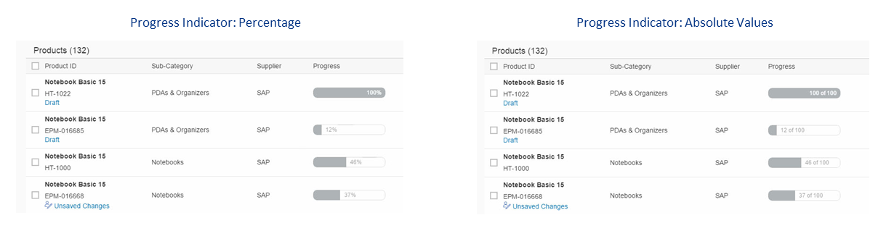
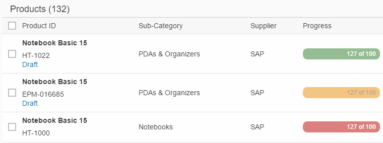

<!-- loio43f6f0faa1b64c5aa92bcde379be9054 -->

# Adding a Progress Indicator to a Table

You can add a progress indicator to a table.

The progress indicator allows you to visually represent the level of completion of a project or a goal, for example.

It can be used to express completion values either as a percentage or as absolute numbers \(for example, 8 of 10\).

   
  
**Progress Indicator**

  


<a name="loio43f6f0faa1b64c5aa92bcde379be9054__section_ipd_h4l_hmb"/>

## Code Samples

The following code sample shows how to implement a progress indicator using annotations. `AnnotationPath="@UI.DataPoint#Progress` references the `Qualifier="Progress"`. `EnumMember="UI.VisualizationType/Progress"` defines the actual visualization as a progress indicator.

> ### Sample Code:  
> XML Annotation
> 
> ```xml
> <Annotations Target="STTA_PROD_MAN.STTA_C_MP_ProductType">
>     <Annotation Term="UI.DataPoint" Qualifier="Progress">
>         <Record>
>             <PropertyValue Property="Value" Path="to_StockAvailability/Quantity" />
>             <PropertyValue Property="TargetValue" Decimal="100" />
>             <PropertyValue Property="Visualization" EnumMember="UI.VisualizationType/Progress" />
>         </Record>
>     </Annotation>
>     <Annotation Term="UI.LineItem">
>         <Collection>
>             <Record Type="UI.DataFieldForAnnotation">
>                 <PropertyValue Property="Label" String="Progress" />
>                 <PropertyValue Property="Criticality" Path="to_StockAvailability/Quantity" />
>                 <PropertyValue Property="Target" AnnotationPath="@UI.DataPoint#Progress" />
>             </Record>
>         <Collection>
>     </Annotation>
> </Annotations>
> 
> ```

> ### Sample Code:  
> ABAP CDS Annotation
> 
> ```
> 
> annotate view STTA_C_MP_StockAvailability with {
>   @UI.dataPoint: { targetValue: 100, visualization: #PROGRESS }
>   Quantity;
> }
> 
> 
> @UI.lineItem: [
>   {
>     label: 'Progress',
>     criticality: 'TO_STOCKAVAILABILITY/QUANTITY',
>     valueQualifier: 'Progress',
>     type: #AS_DATAPOINT
>   }
> ]
> progress;
> ```

> ### Sample Code:  
> CAP CDS Annotation
> 
> ```
> 
> annotate STTA_PROD_MAN.STTA_C_MP_ProductType @(
>   UI.DataPoint #Progress : {
>     Value : to_StockAvailability.Quantity,
>     TargetValue : 100,
>     Visualization : #Progress
>   },
>   UI.LineItem : [
>     {
>         $Type : 'UI.DataFieldForAnnotation',
>         Label : 'Progress',
>         Criticality : to_StockAvailability.Quantity,
>         Target : '@UI.DataPoint#Progress',
>     }
>   ]
> );
> 
> ```


<a name="loio43f6f0faa1b64c5aa92bcde379be9054__section_fbt_vql_hmb"/>

## Change Color of Progress Bar

If required, you can set up the progress bar so that it changes color to reflect the state of the progress depending on the `criticality` value as shown in the figure below.

   
  
**Progress Indicator: Colors Reflect State of Progress**

  

To do so, assign a value to the `criticality` property.

The path references the property \(in this case, `Path="StockAvailability`"\) that defines the color.

```
<Annotation Term="UI.DataPoint" Qualifier="Quantity">
               <Record>
                       <PropertyValue Property="Value" Path="Quantity"/>
                       <PropertyValue Property="Title" String="{@i18n&gt;@Availability}"/>
                       <PropertyValue Property="Description" String="Progress Indicator"/>
                       <PropertyValue Property="TargetValue" Decimal="150"/>
                       <PropertyValue Property="Visualization" EnumMember="UI.VisualizationType/Progress"/>
                       <PropertyValue Property="Criticality" Path="StockAvailability"/>
               </Record>
        </Annotation>

```

