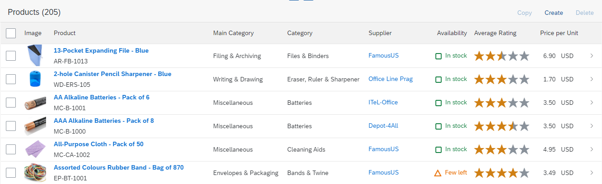

<!-- loioa797173b84724ef1bc54d59dc575e52f -->

# Adding a Rating Indicator to a Table

You can add a read-only rating indicator to a table.


The rating indicator allows you to visually represent the value of a field from the back-end system with the corresponding number of stars \(configurable\). This field can indicate a rating or classification for a specific object or item.

Decimal values are rounded up or down accordingly. If a value falls between x.25 and x.74, a half star is displayed.

  
  
**Rating Indicator in Table**



Use the following annotations to enable the rating indicator and define the maximum number of stars:

> ### Sample Code:  
> XML Annotation
> 
> ```xml
> 
> <Annotations Target="STTA_PROD_MAN.STTA_C_MP_ProductType">
>   <Annotation Term="UI.DataPoint" Qualifier="Rating">
>     <Record>
>       <PropertyValue Property="Value" Path="to_StockAvailability/StockAvailability" />
>       <PropertyValue Property="TargetValue" Decimal="4" />
>       <PropertyValue Property="Visualization" EnumMember="UI.VisualizationType/Rating" />
>     </Record>
>   </Annotation>
> 
>   <Annotation Term="UI.LineItem">
>     <Collection>
>       <Record Type="UI.DataFieldForAnnotation">
>         <PropertyValue Property="Label" String="Rating" />
>         <PropertyValue Property="Target" AnnotationPath="@UI.DataPoint#Rating" />
>       </Record>
>       ...
>     </Collection>
>    ...
>   </Annotation>
> ...
> </Annotations>
> 
> ```

> ### Sample Code:  
> ABAP CDS Annotation
> 
> ```
> 
> annotate view STTA_C_MP_PRODUCT with
> {
>   @UI.lineItem: [
>     {
>       label: 'Rating',
>       valueQualifier: 'Rating',
>       type: #AS_DATAPOINT,
>       position: 1
>     }
>   ]
>   @UI.dataPoint: {
>     targetValue: 4,
>     visualization: #RATING
>   }
>   to_stockavailability/stockavailability;
> }
> 
> ```

> ### Sample Code:  
> CAP CDS Annotation
> 
> ```
> annotate STTA_PROD_MAN.STTA_C_MP_ProductType with 
>   @(
>     UI.DataPoint #Rating : {
>       Value         : to_StockAvailability.StockAvailability,
>       TargetValue   : 4,
>       Visualization : #Rating
>     },
>     UI.LineItem : [
>       {
>         $Type  : 'UI.DataFieldForAnnotation',
>         Label  : 'Rating',
>         Target : '@UI.DataPoint#Rating'
>       }
>     ]
>   );
> 
> ```

> ### Note:  
> The `TargetValue` property defines the maximum number of stars. In this case, it is 4.


<a name="loioa797173b84724ef1bc54d59dc575e52f__section_z34_z1f_4tb"/>

## Additional Features in SAP Fiori Elements for OData V2


### Enable Rating Indicator

To add a rating indicator, add the type `#AS_DATAPOINT` to the relevant `lineItem` annotation and the `@UI.dataPoint: {visualization: #RATING}` annotation for the relevant field as shown below:

```xml

@UI.lineItem: {
  position: 30,
  type: #AS_DATAPOINT
}

@UI.dataPoint: {
  visualization: #RATING
}

Product.Rating,

```


### Define Maximum Number of Stars

By default, the rating indicator displays a maximum of five stars. If desired, you can change this by defining a different value for the `targetValue` property.

In the sample code below, the rating indicator is set up to display six stars:

```xml

@UI.lineItem: {
  position: 30,
  type: #AS_DATAPOINT
}

@UI.dataPoint: {
  targetValue: 4,
  visualization: #RATING
}

Product.Rating,

```

