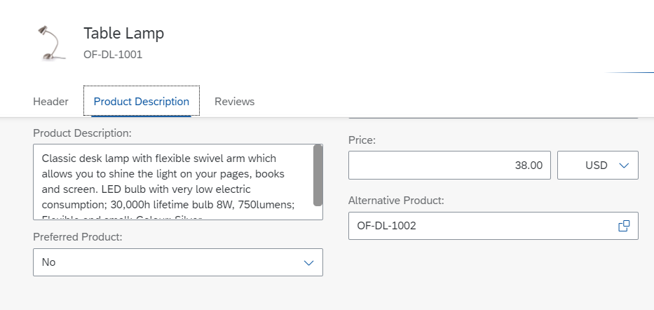

<!-- loioa357047be956436ebb1dfebf1aa29af2 -->

# Adding a Section to an Object Page

You can add an additional section to your object page, as described below.


<a name="loioa357047be956436ebb1dfebf1aa29af2__section_cjq_qdf_d4b"/>

## Additional Features in SAP Fiori Elements for OData V2

> ### Caution:  
> Use app extensions with caution and only if you cannot produce the required behavior by other means, such as manifest settings or annotations. To correctly integrate your app extension coding with SAP Fiori elements, use only the `extensionAPI` of SAP Fiori elements. For more information, see [Using the extensionAPI](using-the-extensionapi-bd2994b.md).
> 
> After you've created an app extension, its display \(for example, control placement and layout\) and system behavior \(for example, model and binding usage, busy handling\) lies within the application's responsibility. SAP Fiori elements provides support only for the official `extensionAPI` functions. Don't access or manipulate controls, properties, models, or other internal objects created by the SAP Fiori elements framework.

For this example, you want to add a section called *Product Description* to the object page of the *Manage Products* app.

> ### Note:  
> This documentation describes how to manually define extensions. The following video provides an example for how to create a section extension on the object page using the extension wizard: 


### Step 1: Create Fragment for the New Facet

In the SAP Web IDE, open the folder structure of the Manage Products project and proceed as follows:

1.  In the `webapp` folder, create a new subfolder called `ext`.
2.  In the folder `ext`, create a new subfolder called `view`.
3.  In the `view` folder, create file `DescriptionBreakout.view.xml`.
4.  Define the view with its elements, here a `TextArea` that consumes the section title for the product description text in the original language.

> ### Sample Code:  
> ```
> <mvc:View xmlns:mvc="sap.ui.core.mvc" xmlns="sap.m">
> 	<VBox>
> 		<TextArea id="DescriptionTextArea" 
> 				value="{to_ProductTextInOriginalLang/Description}"
> 				width="30%" 
> 				editable="false"/>
> 	</VBox>
> </core:View>		
> ```


### Step 2: Add Section Title to the i18n File

To make the section title translatable, add the text to the `i18n` file as follows:

> ### Sample Code:  
> ```
> #This is the resource bundle for Manage Products
> 					
> # XTIT: Title of a facet within an object page if not needed in local/annotations.xml
> ProductDescription=Product Description		
> ```


### Step 3: Add Extension Definition to the `manifest.json` File

To add the extension definition to the `manifest.json` file, use a `viewExtension`.

The extension appears within the `ObjectPage.view` using the `AfterFacet` option.

> ### Sample Code:  
> ```
> manifest.json
> 	"extends": {
> 			"extensions": {
> 				"sap.ui.viewExtensions": {
> 					"sap.suite.ui.generic.template.ObjectPage.view.Details": {
> 						"AfterFacet|SEPMRA_C_PD_Product|GeneralInformation": {
> 							"className": "sap.ui.core.mvc.View",
> 							"viewName": "ManageProducts.ext.view.DescriptionBreakout",
> 							"type": "XML",
> 							"sap.ui.generic.app": {
> 								"title": "{{ProductDescription}}"
> 							}
> 						}
> 					}
> 				}
> 			}
> 		},
> 			
> ```

To add multiple sections, the extension name needs to contain a key after the annotation name in the extension entry, for example,`"BeforeFacet|SEPMRA_C_PD_Product|to_ProductText::com.sap.vocabularies.UI.v1.LineItem|1"`, as well as a `key` object in `sap.ui.generic.app`.

> ### Sample Code:  
> ```
> "extends": {
>     "extensions": {
>      "BeforeFacet|SEPMRA_C_PD_Product|to_ProductText::com.sap.vocabularies.UI.v1.LineItem": {
>       "className": "sap.ui.core.Fragment",
>       "fragmentName": "nw.epm.refapps.st.prod.manage.ext.BeforeFacetTest",
>       "type": "XML",
>       "sap.ui.generic.app": {
>          "title": "Facet Breakout before Product Text LineItem"
>       }
>      },
>      "BeforeFacet|SEPMRA_C_PD_Product|to_ProductText::com.sap.vocabularies.UI.v1.LineItem|1": {
>       "className": "sap.ui.core.Fragment",
>       "fragmentName": "nw.epm.refapps.st.prod.manage.ext.BeforeFacetTestNew",
>       "type": "XML",
>       "sap.ui.generic.app": {
>          "title": "Facet Breakout before Product Text LineItem",
>           "key" : "1"
>       }
>      }
>      "AfterFacet|SEPMRA_C_PD_Product|to_Supplier::com.sap.vocabularies.UI.v1.Identification": {
>       "className": "sap.ui.core.Fragment",
>       "fragmentName": "nw.epm.refapps.st.prod.manage.ext.AfterFacetTest",
>       "type": "XML",
>       "sap.ui.generic.app": {
>          "title": "Facet Breakout after Supplier Identification"
>       }
>      },
>      "AfterFacet|SEPMRA_C_PD_Product|to_Supplier::com.sap.vocabularies.UI.v1.Identification|1": {
>       "className": "sap.ui.core.Fragment",
>       "fragmentName": "nw.epm.refapps.st.prod.manage.ext.AfterFacetTest",
>       "type": "XML",
>       "sap.ui.generic.app": {
>          "title": "Facet Breakout after Supplier Identification",
>          "key": 1
>       }
> 
> ```


### Results

The object page of the *Manage Products* app shows the new section *Product Description*:

  


<a name="loioa357047be956436ebb1dfebf1aa29af2__section_e23_tdf_d4b"/>

## Additional Features in SAP Fiori Elements for OData V4


### Step 1: Create Fragment for the New Section

In the editor of your choice, open the folder structure of the project where you want to make the adaptation and proceed as follows:

1.  In the `webapp` folder, create a new subfolder called `custom`.
2.  In the folder `custom`, create the file `CustomSection.fragment.xml`.
3.  Define the XML fragment with its elements, in this example a `VerticalLayout` with several other controls is used. Bindings can be used as well.

    > ### Sample Code:  
    > ```xml
    > <core:FragmentDefinition xmlns:core="sap.ui.core" xmlns="sap.m" xmlns:l="sap.ui.layout">
    > 	<l:VerticalLayout core:require="{handler: 'SalesOrder/custom/CustomColumn'}">
    > 		<Button text="Custom Button" press="handler.buttonPressed" />
    > 	</l:VerticalLayout>
    > </core:FragmentDefinition>
    > ```

4.  If a custom handler is required, you must define it in the XML fragment using `core:require` \(see the example of `VerticalLayout` in the sample code above\).

    > ### Sample Code:  
    > ```
    > sap.ui.define(["sap/m/MessageBox"], function(MessageBox) {
    >     "use strict";
    > 
    >     return {
    >         buttonPressed: function() {
    >             MessageBox.show("Button pressed!");
    >         }
    >     };
    > });
    > 
    > ```


### Step 2: Add Section Title to the i18n File

To make the section title translatable, add the text to the `i18n` file as follows:

> ### Sample Code:  
> ```
> #This is the resource bundle
> 					
> # XTIT: Title of a facet within an object page
> customSection=Custom Section		
> ```


### Step 3: Add Extension Definition to the `manifest.json` File

To add the extension definition to the `manifest.json` file, use a `template`.

The extension appears within the object page before or after the defined section. By default, it is the last section.

> ### Sample Code:  
> ```json
> {
> 	"sap.ui5": {
> 		"routing": {
> 			"targets": {
> 				"SalesOrderManageObjectPage": {
> 					"options": {
> 						"settings": {
> 							"content": {
> 								"body": {
> 									"sections": {
> 										"customSection": {
> 											"type": "XMLFragment",
> 											"template": "SalesOrder.custom.CustomSection",
> 											"title": "{i18n>customSection}",
> 											"position": {
> 												"placement": "Before",
> 												"anchor": "SalesOrderItems"
> 											}
> 										},
> 										"anotherCustomSection": {
> 											"type": "XMLFragment",
> 											"template": "SalesOrder.custom.CustomFieldForm",
> 											"title": "Field Form",
> 											"position": {
> 												"placement": "After",
> 												"anchor": "customSection"
> 											}
> 										}
> 									}
> 								}
> 							}
> 						}
> 					}
> 				}
> 			}
> 		}
> 	}
> }
> ```

To add multiple sections, the custom section added in sections needs to contain an ID. In the example above, the IDs are `customSection` and `anotherCustomSection`. In the application, these will be the actual IDs on the corresponding control.

You can enrich the body of the object page with additional sections. To do so, you define sections by using a custom key that you later reference by providing the following properties:

-   a title

-   the UI5 fragment \(type and name\) and

-   its position


### Results

The object page of the app shows the new section.

