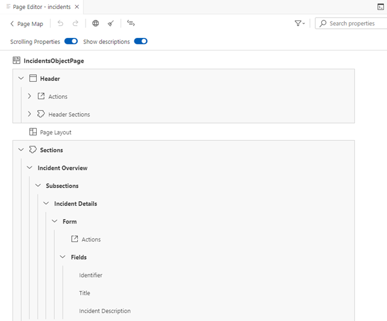

<!-- loio9940cf0b191743f9a421d14bf02ff889 -->

<link rel="stylesheet" type="text/css" href="../css/sap-icons.css"/>

# Adding a Section to an Object Page Using SAP Fiori Tools

Find out how to add a section to an object page using SAP Fiori tools.

> ### Note:  
> This topic is only applicable to SAP Fiori elements for OData V4.

<a name="loio9940cf0b191743f9a421d14bf02ff889__task_jbc_r22_3cc"/>

## Adding a New Section

1.  Launch the *Page Map*. You can launch the *Page Map* in several ways, for example by right-clicking the project folder and selecting *Show Page Map*. For more information, see [Define Application Structure](https://help.sap.com/docs/SAP_FIORI_tools/17d50220bcd848aa854c9c182d65b699/bae38e6216754a76896b926a3d6ac3a9.html).
2.  Launch the *Page Editor* for your object page. Click the :pencil2: \(*Edit*\) icon next to *Object Page*.
3.  Click the :heavy_plus_sign: \(*Add*\) icon next to *Sections*.
4.  Select the type of section you wish to add.
5.  Enter a name for the section.
6.  Select the *Value Source* you wish to have from the dropdown.
7.  Click *Add*.

    For more information about adding sections using SAP Fiori tools, see [Sections](https://help.sap.com/docs/SAP_FIORI_tools/17d50220bcd848aa854c9c182d65b699/2953503145dd428194c6dff252744ac1.html).

<a name="loio9940cf0b191743f9a421d14bf02ff889__task_f5x_wx3_rcc"/>

## Adding a Field to a Section

1.  Expand the *Sections* node in the outline tree. Click the  \(*Arrow*\) icon next to a section and continue to expand the further levels.

    The following screenshot shows the outline of the application with the *Sections* node expanded:

    

2.  Click the :heavy_plus_sign: \(*Add*\) icon next to *Fields*.
3.  Click *Add Basic Fields*.
4.  Select the fields you wish to add from the dropdown.
5.  Click *Add*.

    For more information about adding fields using SAP Fiori tools, see [Basic Fields](https://help.sap.com/docs/SAP_FIORI_tools/17d50220bcd848aa854c9c182d65b699/2953503145dd428194c6dff252744ac1.html).

6.  To preview your new section, see [Previewing an Application](https://help.sap.com/docs/SAP_FIORI_tools/17d50220bcd848aa854c9c182d65b699/b962685bdf9246f6bced1d1cc1d9ba1c.html).

    The following screen recording shows how to add a new section:

