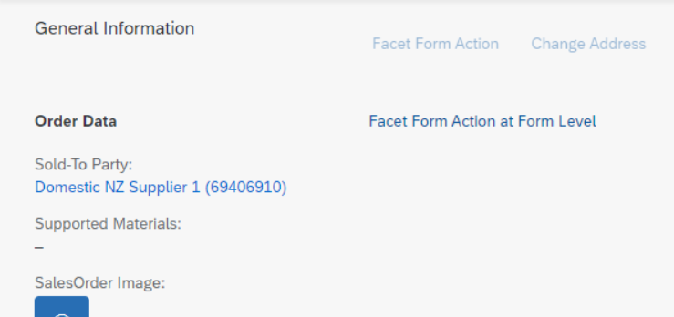

<!-- loioe64efdad5bdf4264b54052bd7ab2229a -->

# Adding Action Buttons to Forms in Sections

You can add action buttons to the forms contained in sections. These forms are indicated by `com.sap.vocabularies.UI.v1.FieldGroup`. A form action button is then displayed in the toolbar of the object page section that contains the form.


You can add the following action buttons:

-   Buttons calling an OData function \(using `DataFieldForAction`\)

-   Buttons triggering intent-based navigation \(using `DataFieldForIntentBasedNavigation`\)


To do so, add a `DataFieldForAction` or `DataFieldForIntentBasedNavigation` to the data of your `FieldGroup` definition. The following example shows the definition of a form with two buttons:

> ### Sample Code:  
> XML Annotation
> 
> ```xml
> 
> <Annotation Term="UI.FieldGroup" Qualifier="TechnicalData">
>     <Record>
>         <PropertyValue Property="Data">
>             <Collection>
>                 <Record Type="UI.DataField">
>                     <PropertyValue Property="Value" Path="Width"/>
>                     <Annotation Term="UI.Importance" EnumMember="UI.ImportanceType/Medium"/>
>                 </Record>
>                 <Record Type="UI.DataField">
>                     <PropertyValue Property="Value" Path="Depth"/>
>                     <Annotation Term="UI.Importance" EnumMember="UI.ImportanceType/Medium"/>
>                 </Record>
>                 ...
>                 <Record Type="UI.DataFieldForAction">
>                     <PropertyValue Property="Label" String="Copy"/>
>                     <PropertyValue Property="Action" String="STTA_PROD_MAN.STTA_PROD_MAN_Entities/STTA_C_MP_ProductCopy"/>
>                 </Record>
>                 <Record Type="UI.DataFieldForIntentBasedNavigation">
>                     <PropertyValue Property="Label" String="Manage Products (ST)" />
>                     <PropertyValue Property="SemanticObject" String="EPMProduct" />
>                 </Record>
>             </Collection>
>         </PropertyValue>
>         <PropertyValue Property="Label" String="Technical Data"/>
>     </Record>
> </Annotation>
> 
> ```

> ### Sample Code:  
> ABAP CDS Annotation
> 
> ```
> 
> @UI.fieldGroup: [
>   {
>     importance: #MEDIUM,
>     position: 10,
>     qualifier: 'TechnicalData',
>     groupLabel: 'Technical Data'
>   }
> ]
> WIDTH;
> 
> @UI.fieldGroup: [
>   {
>     importance: #MEDIUM,
>     position: 20,
>     qualifier: 'TechnicalData'
>   }
> ]
> DEPTH;
> 
> @UI.fieldGroup: [
>   {
>     label: 'Copy',
>     dataAction: 'STTA_C_MP_ProductCopy',
>     type: #FOR_ACTION,
>     position: 30,
>     qualifier: 'TechnicalData'
>   },
>   {
>     label: 'Manage Products (ST)',
>     type: #FOR_INTENT_BASED_NAVIGATION,
>     position: 40,
>     qualifier: 'TechnicalData'
>   }
> ]
> 
> @Consumption.semanticObject: 'EPMProduct'
> product;
> 
> ```

> ### Sample Code:  
> CAP CDS Annotation
> 
> ```
> 
> UI.FieldGroup #TechnicalData : {
>     Data : [
>         {
>             $Type : 'UI.DataField',
>             Value : Width,
>             ![@UI.Importance] : #Medium
>         },
>         {
>             $Type : 'UI.DataField',
>             Value : Depth,
>             ![@UI.Importance] : #Medium
>         },
>         {
>             $Type : 'UI.DataFieldForAction',
>             Label : 'Copy',
>             Action : 'STTA_PROD_MAN.STTA_PROD_MAN_Entities/STTA_C_MP_ProductCopy'
>         },
>         {
>             $Type : 'UI.DataFieldForIntentBasedNavigation',
>             Label : 'Manage Products (ST)',
>             SemanticObject : 'EPMProduct'
>         }
>     ],
>     Label : 'Technical Data'
> }
> 
> ```

You must now link the `UI.FieldGroup` configured above to the `UI.ReferenceFacet` that corresponds to the form:

> ### Sample Code:  
> XML Annotation
> 
> ```xml
> <Annotation Term="UI.Facets">
>     <Collection>
>     ....                  
>         <Record Type="UI.ReferenceFacet">
>             <PropertyValue Property="Label" String="Technical Data"/>
>             <PropertyValue Property="Target" AnnotationPath="@UI.FieldGroup#TechnicalData"/>
>         </Record>
>     ....
>     </Collection>
> </Annotation>
> ```

> ### Sample Code:  
> ABAP CDS Annotation
> 
> ```
> @UI.Facet: [
>   {
>     label: 'Technical Data',
>     targetQualifier: 'TechnicalData',
>     type: #FIELDGROUP_REFERENCE,
>     purpose: #STANDARD
>  }
> ]
> ```

> ### Sample Code:  
> CAP CDS Annotation
> 
> ```
> {
>    $Type             : 'UI.ReferenceFacet',
>    Label             : 'Technical Data',
>    ID                : 'TechnicalData',
>    Target            : '@UI.FieldGroup#TechnicalData'
> },
> 
> ```

For more information, see [Configuring External Navigation](configuring-external-navigation-1d4a0f9.md).

> ### Tip:  
> SAP recommends applications to place the action that is most important on the very left. For more information, see [Action Placement](https://experience.sap.com/fiori-design-web/action-placement/).


<a name="loioe64efdad5bdf4264b54052bd7ab2229a__section_nk1_vft_knb"/>

## Additional Features in SAP Fiori Elements for OData V2

You can change the form action button styles through UI adaptations.


<a name="loioe64efdad5bdf4264b54052bd7ab2229a__section_f5r_zhf_knb"/>

## Additional Features in SAP Fiori Elements for OData V4


### Adding Form Actions

In addition to the `UI.FieldGroup` definition given above, form actions can also be added via `UI.Identification` or `UI.StatusInfo`.

> ### Sample Code:  
> XML Annotation
> 
> ```xml
> <Annotation Term="UI.Facets">
>     <Collection>
>     ....                  
>         <Record Type="UI.ReferenceFacet">
>             <PropertyValue Property="Label" String="Technical Data"/>
>             <PropertyValue Property="Target" AnnotationPath="@UI.Identification#ID"/>
>         </Record>
>     ....
>     </Collection>
> </Annotation>
> ```

> ### Sample Code:  
> ABAP CDS Annotation
> 
> ```
> @UI.Facet: [
>   {
>     label: 'Technical Data',
>     targetQualifier: 'ID',
>     type: #IDENTIFICATION_REFERENCE,
>     purpose: #STANDARD
>   }
> ]
> ```

> ### Sample Code:  
> CAP CDS Annotation
> 
> ```
>   {
>         $Type  : 'UI.ReferenceFacet',
>         Label  : 'Technical Data',
>         Target : '@UI.Identification#ID'
>     },
> 
> ```

Here are some examples of the various possibilities via which a `UI.DataFieldForAction` can be embedded:

-   `UI.Identification` with a qualifier

    `UI.DataFieldForAction` in form actions in `UI.Identification`.

    > ### Sample Code:  
    > XML Annotation
    > 
    > ```xml
    > <Annotation Term="UI.Identification" Qualifier="ID">
    >     <Collection>
    >         ....
    >         <Record Type="UI.DataFieldForAction">
    >             <PropertyValue Property="Label" String="Break Up" />
    >             <PropertyValue Property="Action" String="com.sap.gateway.srvd.sadl_gw_appmusicdr_definition.v0001.BREAK_UP" />
    >         </Record>
    >         ....
    >     </Collection>
    > </Annotation>
    > ```

    > ### Sample Code:  
    > ABAP CDS Annotation
    > 
    > ```
    > @UI.identification: [
    >   {
    >     label: 'Break Up',
    >     dataAction: 'com.sap.gateway.srvd.sadl_gw_appmusicdr_definition.v0001.BREAK_UP',
    >     type: #FOR_ACTION,
    >     qualifier: 'ID'
    >   }
    > ]
    > 
    > ```

    > ### Sample Code:  
    > CAP CDS Annotation
    > 
    > ```
    >     UI.Identification #ID : [{
    >         $Type  : 'UI.DataFieldForAction',
    >         Label  : 'Break Up',
    >         Action : ' com.sap.gateway.srvd.sadl_gw_appmusicdr_definition.v0001.BREAK_UP'
    >     }],
    > 
    > ```

    Note that `DataFieldForAction` buttons coming from an unqualified `UI.Identification` will go to the global actions of the object page, unless they are marked as "determining", in which case they will go to the footer.

-   `UI.StatusInfo` with/without a qualifier

    `UI.DataFieldForAction` in form actions in `UI.StatusInfo`.

    > ### Sample Code:  
    > XML Annotation
    > 
    > ```xml
    > <Annotation Term="UI.StatusInfo" Qualifier="SI">
    >     <Collection>
    >         ....
    >         <Record Type="UI.DataFieldForAction">
    >             <PropertyValue Property="Label" String="Move Country" />
    >             <PropertyValue Property="Action" String="com.sap.gateway.srvd.sadl_gw_appmusicdr_definition.v0001.MOVE_COUNTRY" />
    >         </Record>
    >         ....
    >     </Collection>
    > </Annotation>
    > ```

    > ### Sample Code:  
    > ABAP CDS Annotation
    > 
    > ```
    > @UI.statusInfo: [
    >   {
    >     label: 'Move Country',
    >     dataAction: 'com.sap.gateway.srvd.sadl_gw_appmusicdr_definition.v0001.MOVE_COUNTRY',
    >     type: #FOR_ACTION,
    >     qualifier: 'SI'
    >   }
    > ]
    > 
    > ```

    > ### Sample Code:  
    > CAP CDS Annotation
    > 
    > ```
    >     UI.StatusInfo #SI : [{
    >         $Type  : 'UI.DataFieldForAction',
    >         Label  : 'Move Country',
    >         Action : ' com.sap.gateway.srvd.sadl_gw_appmusicdr_definition.v0001.MOVE_COUNTRY'
    >     }],
    > 
    > ```


### Placing Form Actions Inside the Form Toolbar

You can also place action inside the form toolbar using the `inline` parameter.

When you set `inline=true`, a given action from a `FieldGroup` shows up directly in the form toolbar instead of the section toolbar. You can see the result in the following image:

  

> ### Sample Code:  
> XML Annotation
> 
> ```xml
> <Annotation Term="UI.FieldGroup" Qualifier="OrderData">
>     <Record Type="UI.FieldGroupType">
>         <PropertyValue Property="Data">
>             <Collection>
>                 <Record Type="UI.DataFieldForAction">
>                     <PropertyValue Property="Label" String="Facet Form Action" />
>                     <PropertyValue Property="Action" String="com.c_salesordermanage_sd.FacetFormAction" />
>                     <Annotation Term="UI.Importance" EnumMember="UI.ImportanceType/High" />
>                 </Record>
>                 <Record Type="UI.DataFieldForAction">
>                     <PropertyValue Property="Label" String="Facet Form Action at Form Level" />
>                     <PropertyValue Property="Action" String="com.c_salesordermanage_sd.FacetFormAction2" />
>                     <PropertyValue Property="Inline" Bool="true" />
>                     <Annotation Term="UI.Importance" EnumMember="UI.ImportanceType/High" />
>                 </Record>
>             </Collection>
>         </PropertyValue>
>     </Record>
> </Annotation>
> ```

> ### Sample Code:  
> ABAP CDS Annotation
> 
> ```
> @UI.fieldGroup: [
>   {
>     importance: #HIGH,
>     label: 'Facet Form Action',
>     dataAction: 'com.c_salesordermanage_sd.FacetFormAction',
>     type: #FOR_ACTION,
>     position: 1 ,
>     qualifier: 'OrderData'
>   },
>   {
>     importance: #HIGH,
>     label: 'Facet Form Action at Form Level',
>     dataAction: 'com.c_salesordermanage_sd.FacetFormAction2',
>     type: #FOR_ACTION,
>     position: 2 ,
>     qualifier: 'OrderData'
>   }
> ]
> 
> ```

> ### Sample Code:  
> CAP CDS Annotation
> 
> ```
> FieldGroup #OrderData: {Data : [
>     {
>         $Type             : 'UI.DataFieldForAction',
>         Label             : 'Facet Form Action',
>         Action            : 'com.c_salesordermanage_sd.FacetFormAction',
>         ![@UI.Importance] : #High
>     },{
>         $Type             : 'UI.DataFieldForAction',
>         Label             : 'Facet Form Action at Form Level',
>         Action            : 'com.c_salesordermanage_sd.FacetFormAction2',
>         Inline            : true,
>         ![@UI.Importance] : #High
>     }
> ]}
> ```


### Visibility and Enablement of the Action Button

The visibility of the action button is mainly controlled by the `UI.Hidden` annotation for the action button. In addition, if the value of `OperationAvailable` is set to false \(that is, to a static false value\), then the button is not rendered.

The enablement of the button is controlled by the `OperationAvailable` annotation for the action as follows:

-   For the value false \(static false value\),the action button is not rendered at all since disabling the button is the expected behavior.

-   For the value true, or if no value is defined, or if only a term is given \(as in `<Annotation Term="Core.OperationAvailable"/>`, for example\), then the button is always enabled.

-   For path-based values the button is enabled if the path evaluates to true, and disabled if the path evaluates to false.


### Passing Context when Invoking the Form Action

If the form action is defined as a bound action, the entire context of the object page is passed to the action when the form action is triggered. If it is defined as an unbound action, then no context is passed.

For a `DataFieldForIntentBasedNavigation` button, the page context is passed if the `RequiresContext` is set to false. Setting it to true will result in an error, since users cannot select and provide context for a form button \(they can only do so when the button is used in a table or a chart-like control\).


### Emphasizing the Most Important ‘Form’ Action

By default, all form action buttons are rendered with a transparent background. If you need to set a focus on the most important action, you can highlight it by using a ‘ghost’ styling.

You can highlight form actions maintained via the `DataFieldForAction` and `DataFieldForIntentBasedNavigation` by adding `UI.Emphasized` to the action definition as shown in the examples below:

> ### Sample Code:  
> ```
> <Record Type=“UI.DataFieldForAction”>
>     <PropertyValue Property=“Label” String=“Static Action” />
>     <PropertyValue Property=“Action” String=“com.c_salesordermanage_sd.DummyStaticAction” />
>     <Annotation Term=“UI.Emphasized” />
> </Record>
> <Record Type=“UI.DataFieldForAction”>
>     <PropertyValue Property=“Label” String=“Static Action” />
>     <PropertyValue Property=“Action” String=“com.c_salesordermanage_sd.DummyStaticAction” />
>     <Annotation Term=“UI.Emphasized” Bool=“true” />
> </Record>
> <Record Type=“UI.DataFieldForAction”>
>     <PropertyValue Property=“Label” String=“Static Action” />
>     <PropertyValue Property=“Action” String=“com.c_salesordermanage_sd.DummyStaticAction” />
>     <Annotation Term=“UI.Emphasized” Path=“…” />
> </Record>
> ```

> ### Sample Code:  
> XML Annotation
> 
> ```xml
> <Annotation Term="UI.LineItem">
> <Collection>
> <Record Type="UI.DataFieldForIntentBasedNavigation" >
>      <PropertyValue Property="Label" String="IBN"/>
>      <PropertyValue Property="SemanticObject" String="SalesOrder"/>
>      <PropertyValue Property="Action" String="manageInline"/>
>      <PropertyValue Property="RequiresContext" Bool="false"/>
>      <Annotation Term="UI.Emphasized" Bool="true" />
> </Record> 
> </Collection>
> </Annotation>
> 
> ```

> ### Sample Code:  
> ABAP CDS Annotation
> 
> ```
> @UI.lineItem: [{ 
>   label: 'IBN',
>   type: #FOR_INTENT_BASED_NAVIGATION,
>   emphasized: true,
>   requiresContext: true,
>   semanticObjectAction: 'manageInline',
>   semanticObject: 'SalesOrder'
> }]
> 
> ```

> ### Sample Code:  
> CAP CDS Annotation
> 
> ```
> {
>     $Type               : 'UI.DataFieldForAction',
>     Label               : 'Static Action',
>     Action              : ‘com.c_salesordermanage_sd.DummyStaticAction’, 
>     ![@UI.Emphasized]   : <<Path>>
> }
> 
> {
>     $Type               : 'UI.DataFieldForIntentBasedNavigation',
>     SemanticObject      : 'SalesOrder',
>     Action              : 'manageInline',
>     Label               : 'IBN',
>     RequiresContext     : false,
>     ![@UI.Emphasized]   : true
> }
> 
> ```


### Triggering Actions Connected to a Field Value

You can trigger an action that is connected to a field value on a form. For more information, see [Adding Actions to Tables](adding-actions-to-tables-b623e0b.md).

