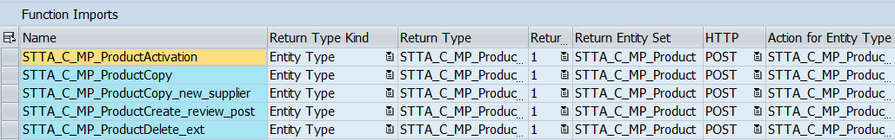

<!-- loiof5a04c7ddd054a33a84e48525a51b5fb -->

# Adding Action-Specific Messages to Confirmation Dialog Boxes

You can create message texts for specific critical actions. They are displayed in the confirmation dialog box for the action.

You can add action-specific messages to the i18n.properties file of your application. The key to be added needs to have the following format:

-   In SAP Fiori elements for OData V2: `ACTION_CONFIRM|<FunctionImportName>`

-   In SAP Fiori elements for OData V4: `SAPFE_ACTION_CONFIRM|<FunctionImportName>`


where `FunctionImportName` is specific to a particular action. The figure below shows some examples:   
  
**Function imports**

  

You can also add action messages specific to the entity set and the action name.


<a name="loiof5a04c7ddd054a33a84e48525a51b5fb__section_y4z_gqd_2nb"/>

## Additional Features in SAP Fiori Elements for OData V2

The key can also be interpreted as `ACTION_CONFIRM|<EntitySetName><ActionName>`.

Add the key value pair and the message text to the i18n.properties file of your application, as follows:

> ### Sample Code:  
> ```
> #XMSG: Messagebox text for confirming an action question
> ACTION_CONFIRM|STTA_C_MP_ProductActivation = Are you sure you really want to activate this product?
> 
> ```


<a name="loiof5a04c7ddd054a33a84e48525a51b5fb__section_a52_kqd_2nb"/>

## Additional Features in SAP Fiori Elements for OData V4

For more information, see [How to Replace the Standard UI Texts with Application-Specific Texts](localization-of-ui-texts-b8cb649.md).

