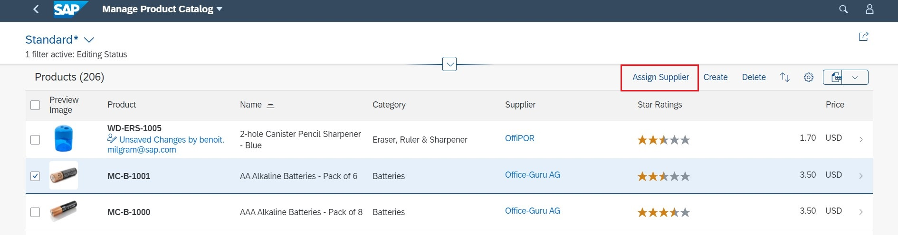
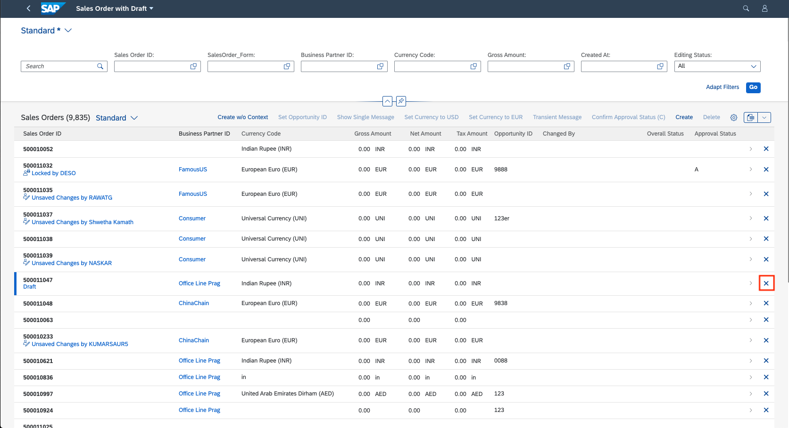

<!-- loiob623e0bbbb2b4147b2d0516c463921a0 -->

# Adding Actions to Tables

The table control offers a possibility to show both the generic actions, such as *Create* and *Delete*, as well as application-specific actions.


<a name="loiob623e0bbbb2b4147b2d0516c463921a0__section_nx4_qpb_2nb"/>

## Generic Actions

SAP Fiori elements provides two generic actions \(*Create* and *Delete*\) that can be rendered in the toolbar based on metadata properties`sap:creatable=true` and `sap:deletable=true` of the entity set.

You can control the `Insert` capability for the related entities, that is the enablement of the *Create* button, using the following options:


### Option 1: Using `NavigationRestrictions`

The system gives priority to the `Org.OData.Capabilities.V1.NavigationRestrictions` of the parent entity set if it is defined, and the `InsertRestrictions` provided directly at the table entity set level \(Option 2 below\) is ignored. Depending on the value of the `Insertable` property of `InsertRestrictions`, the related \(table\) entity set is made insertable or not insertable.

-   If `Insertable` is set as `true`, the related entity set is insertable.

-   If `Insertable` is set as `false`, the related entity set isn't insertable.


> ### Sample Code:  
> XML Annotation
> 
> ```xml
> <Annotations Target="STTA_PROD_MAN.STTA_PROD_MAN_Entities/STTA_C_MP_Product">
>   <Annotation Term="Capabilities.NavigationRestrictions">
>     <Record>
>         <PropertyValue Property="RestrictedProperties">
>           <Collection>
>             <Record>
>                <PropertyValue Property="NavigationProperty" NavigationPropertyPath="to_ProductText"/>
>                <PropertyValue Property="InsertRestrictions">
>                   <Record>
>                      <PropertyValue Property="Insertable" Bool="true"/>
>                      <!--Example with Boolean value for InsertRestriction-->
>                      <!-- <PropertyValue Property="Insertable" Path="Insertable"/>-->
>                      <!--Example with path for InsertRestriction-->
>                   </Record>
>                </PropertyValue>
>            </Record>
>         </Collection>
>         </PropertyValue>
>     </Record>
>   </Annotation>
> </Annotation>
> .
> ```

> ### Sample Code:  
> ABAP CDS Annotation
> 
> ```
> 
> define behavior for STTA_C_MP_Product
> {
>   create;
>   delete;
>   update;
>  
>   association _ProductText
>   { create;  }
> };
> ```
> 
> > ### Note:  
> > No ABAP CDS annotation is required, since the setting is made according to the modeling \(create, update, delete, etc.\) in RAP BDEF \(behavior definition\).

> ### Sample Code:  
> CAP CDS Annotation
> 
> ```
> 
> annotate STTA_PROD_MAN.STTA_C_MP_Product with @(
>   Capabilities.NavigationRestrictions : {
>     RestrictedProperties : [
>         {
>             NavigationProperty : to_ProductText,
>             InsertRestrictions : {
>                 Insertable : true
>             }
>         }
>     ]
>   }
> );
> ```


### Option 2: Using `InsertRestrictions`

-   If `Insertable` is set as `true`, the related entity set is insertable.

-   If `Insertable` is set as `false`, the related entity set isn't insertable.


> ### Sample Code:  
> XML Annotation
> 
> ```xml
> 
> <Annotations Target="STTA_PROD_MAN.STTA_PROD_MAN_Entities/STTA_C_MP_ProductText">
>   <Annotation Term="Capabilities.InsertRestrictions">
>     <Record>
>        <PropertyValue Property="Insertable" Bool="true" />
>                     <!--Example with Boolean value for InsertRestriction-->
>         	    <!-- <PropertyValue Property="Insertable" Path="Insertable"/>-->
>          	    <!--Example with path for InsertRestriction-->
>     </Record>
>   </Annotation>
> </Annotations>
> ```

> ### Sample Code:  
> ABAP CDS Annotation
> 
> No ABAP CDS annotation is required, since the setting is made according to the modeling \(create, update, delete, etc.\) in RAP BDEF \(behavior definition\).

> ### Sample Code:  
> CAP CDS Annotation
> 
> ```
> 
> annotate STTA_PROD_MAN.STTA_C_MP_ProductText with @(
>   Capabilities.InsertRestrictions : {
>     Insertable : true,
>   }
> );
> ```

For more information, see [Enabling Inline Creation Mode or Empty Rows Mode for Table Entries](enabling-inline-creation-mode-or-empty-rows-mode-for-table-entries-cfb04f0.md).


### Delete Action

The *Delete* button can be seen as an action on the table and it's disabled until a selection is made.

`DeleteRestrictions` also supports path-based values.

The *Delete* button is enabled by default if `DeleteRestrictions` isn't provided.

> ### Sample Code:  
> XML Annotation
> 
> ```xml
> <Annotations Target="SAP__self.Container/SalesOrderManage">
>    <Annotation Term="SAP__capabilities.DeleteRestrictions">
>       <Record>
>          <PropertyValue Property="Deletable" Bool="false"/>
>       </Record>
>    </Annotation>
> </Annotations>
> ```

> ### Sample Code:  
> ABAP CDS Annotation
> 
> No ABAP CDS annotation is required, since the setting is made according to the modeling \(create, update, delete, etc.\) in RAP BDEF \(behavior definition\).

> ### Sample Code:  
> CAP CDS Annotation
> 
> ```
> 
> annotate SAP__self.SalesOrderManage with {
>   SAP__capabilities.DeleteRestrictions : {
>     Deletable : false
>   }
> };
> ```

> ### Note:  
> The *Delete* action can't be performed for any of the selected records if the deletion of one of the selected records fails in the back end. So the *Delete* action either works for all records or for none.


### Enable or Disable *Delete* Button \(Using `deletable-path` Annotations\)

You can enable or disable the *Delete* button in the list report based on conditions specified in the back-end system. For example, you can disable deletion for a sales order that has already been paid. In this case, if a user selects an item that can't be deleted, the *Delete* button is disabled. In addition, if the user navigates from this item in the list report to the object page, the *Delete* button is hidden.

In your annotation, set the `deletable-path` to point to a particular property of an object \(entity\) in the back-end system that is either `true` or `false`. If the value of this property is `true`, the *Delete* button is enabled; if it's `false`, it's disabled. If you want to use the `deletable-path` annotation to specify conditions for deletion, you have to ensure that the setting `sap:deletable` isn't present in your annotations.

The following code sample shows you how to set up your annotation to enable or disable the *Delete* button, based on the value of the `Delete_mc` property in the back-end system.

> ### Sample Code:  
> XML Annotation
> 
> ```xml
> <Annotations Target="STTA_PROD_MAN.STTA_PROD_MAN_Entities/STTA_C_MP_Product">
>     <Annotation Term="Org.OData.Capabilities.V1.DeleteRestrictions">
>         <Record>
>             <PropertyValue Property="Deletable" Path="Delete_mc"/>
>         </Record>
>     </Annotation>
> </Annotations>
> ```

> ### Sample Code:  
> ABAP CDS Annotation
> 
> No ABAP CDS annotation is required, since the setting is made according to the modeling \(create, update, delete, etc.\) in RAP BDEF \(behavior definition\).

> ### Sample Code:  
> CAP CDS Annotation
> 
> ```
> 
> annotate STTA_C_MP_Product with @(
>     Capabilities.DeleteRestrictions : {
>         Deletable : Delete_mc
>     }
> );
> ```


<a name="loiob623e0bbbb2b4147b2d0516c463921a0__section_ifk_jqb_2nb"/>

## App-Specific Actions

Tables can also show application-configured actions. These can either be custom actions configured in the `manifest.json`, or can come from annotations.

**Custom Actions \(`manifest.json`\)**

Applications can define custom table toolbar actions via enhancements to the `manifest.json` file. For more information, refer to the corresponding sections in [Adding Custom Actions Using Extension Points](adding-custom-actions-using-extension-points-7619517.md).

**Annotation-Based Actions**

The following types of actions are supported:

-   Actions that trigger a back-end call through the OData service, for example, *Approve* or *Unblock*, represented by the complex type `DataFieldForAction`

    .

-   Actions that trigger navigation, for example to a different app, represented by the complex type `DataFieldForIntentBasedNavigation`. For more information, see [Navigation from an App \(Outbound Navigation\)](navigation-from-an-app-outbound-navigation-d782acf.md).

Annotation-based actions can be inline actions. Inline actions are used to trigger actions directly for a single table row. Such an action shows up within the table control as a separate column. To set an action as an inline action, set the `Inline` property to `true`. The line item actions are then displayed as shown in the following screenshot:

  
  
**Example: Actions in the Table Toolbar**

  


### Specifying Text for App-Specific Actions

To specify a text for your action, use the `com.sap.vocabularies.UI.v1.DataFieldForAction` property and specify the text to display. The following example shows you how to display an action to create a copy of the list item in the toolbar:

  

For more information about adding a button triggering external navigation, see [Navigation from an App \(Outbound Navigation\)](navigation-from-an-app-outbound-navigation-d782acf.md).

For information about context-dependent and context-independent actions, see [Actions](actions-cbf16c5.md).

The following code sample shows how to create your annotations for line item actions. Note that the `UI.LineItem` vocabulary term is used to define the columns for the table.


### `UI.LineItem`

> ### Sample Code:  
> XML Annotation
> 
> ```xml
> <Annotation Term="UI.LineItem">
>    <Collection>
>       <Record Type="UI.DataFieldForAction">
>          <PropertyValue Property="Label" String="Copy with new Supplier"/>
>          <PropertyValue Property="Action"
>             String="STTA_PROD_MAN.STTA_PROD_MAN_Entities/STTA_C_MP_ProductCopywithparams"/>
>          <PropertyValue Property="InvocationGrouping"   
>             EnumMember="UI.OperationGroupingType/Isolated"/>
>       </Record>
>       <Record Type="UI.DataFieldForAction">
>          <PropertyValue Property="Label" String="Activate"/>
>          <PropertyValue Property="Action"
>             String="STTA_PROD_MAN.STTA_PROD_MAN_Entities/STTA_C_MP_ProductActivation"/>
>          <PropertyValue Property="InvocationGrouping" 
>             EnumMember="UI.OperationGroupingType/ChangeSet"/>
>       </Record>
>       <Record Type="UI.DataField">
>          <PropertyValue Property="Value" Path="Product"/>
>          <Annotation Term="UI.Importance" EnumMember="UI.ImportanceType/High"/>
>       </Record>
>       <Record Type="UI.DataField">
>          <PropertyValue Property="Value" Path="ProductCategory"/>
>          <Annotation Term="UI.Importance" EnumMember="UI.ImportanceType/High"/>
>       </Record>
>       <Record Type="UI.DataField">
>          <PropertyValue Property="Value" Path="to_Supplier/CompanyName"/>
>          <Annotation Term="UI.Importance" EnumMember="UI.ImportanceType/High"/>
>       </Record>
>       <Record Type="UI.DataField">
>          <PropertyValue Property="Criticality" Path="to_StockAvailability/StockAvailability"/>
>          <PropertyValue Property="Value" Path="to_StockAvailability/StockAvailability"/>
>          <Annotation Term="UI.Importance" EnumMember="UI.ImportanceType/High"/>
>       </Record>
>       <Record Type="UI.DataField">
>          <PropertyValue Property="Value" Path="Price"/>
>          <Annotation Term="UI.Importance" EnumMember="UI.ImportanceType/High"/>
>       </Record>
>       <Record Type="UI.DataFieldForAction">
>          <PropertyValue Property="Label" String="Copy"/>
>          <PropertyValue Property="Action"
>             String="STTA_PROD_MAN.STTA_PROD_MAN_Entities/STTA_C_MP_ProductCopy"/>
>          <PropertyValue Property="Inline" Bool="true"/>
>          <PropertyValue Property="InvocationGrouping"   
>             EnumMember="UI.OperationGroupingType/Isolated"/>
>       </Record>
>       <Record Type="UI.DataFieldForIntentBasedNavigation">
>          <PropertyValue Property="Label" String="Manage Products (ST)"/>
>          <PropertyValue Property="SemanticObject" String="EPMProduct"/>
>          <PropertyValue Property="Action" String="manage_st"/>
>          <PropertyValue Property="Inline" Bool="true"/>
>       </Record>
>       <Record Type="UI.DataFieldWithIntentBasedNavigation">
>          <PropertyValue Property="Label" String="Weight (with IBN)" /
> 
> ```

> ### Sample Code:  
> ABAP CDS Annotation
> 
> ```
> @UI.lineItem: [
>   {
>     label: 'Copy with new Supplier',
>     dataAction: 'PUSHDOWN:STTA_C_MP_ProductCopywithparams',
>     invocationGrouping: #ISOLATED,
>     type: #FOR_ACTION,
>     position: 1 
>   },>
>          <PropertyValue Property="Value" Path="Weight"/>
>          <PropertyValue Property="SemanticObject" String="EPMProduct" /
>   {>
>     label: 'Activate',
>     dataAction: 'PUSHDOWN:STTA_C_MP_ProductActivation',
>     invocationGrouping: #CHANGE_SET,
>     type: #FOR_ACTION,
>     position: 2 
>          <PropertyValue Property="Action" String="manage_st"/
>   },>
>  {
>       
>     importance: #HIGH,<
>     value: 'PRODUCT',/Record
>     type: #STANDARD,>
>     position: 3 
>    
>   },<
>   {/Collection
>     label: 'Copy',>
>     dataAction: 'PUSHDOWN:STTA_C_MP_ProductCopy',
> 
>     invocationGrouping: #ISOLATED,<
>     type: #FOR_ACTION,/Annotation
>     position: 8 >
>   },
> 
>   {
> ```

> ### Sample Code:  
> CAP CDS Annotation
> 
> ```
> 
> UI.LineItem : [
>     {
>         $Type : 'UI.DataFieldForAction',
>         Label : 'Copy with new Supplier',
>         Action : 'STTA_PROD_MAN.STTA_PROD_MAN_Entities/STTA_C_MP_ProductCopywithparams',
>         InvocationGrouping : #Isolated
>     },
>     {
>         $Type : 'UI.DataFieldForAction',
>         Label : 'Activate',
>         Action : 'STTA_PROD_MAN.STTA_PROD_MAN_Entities/STTA_C_MP_ProductActivation',
>         InvocationGrouping : #ChangeSet
>     },
>     {
>         $Type : 'UI.DataField',
>         Value : Product,
>         ![@UI.Importance] : #High
>     },
>     {
>         $Type : 'UI.DataField',
>         Value : ProductCategory,
>         ![@UI.Importance] : #High
>     },
>     {
>         $Type : 'UI.DataField',
>         Value : to_Supplier.CompanyName,
>         ![@UI.Importance] : #High
>     },
>     {
>         $Type : 'UI.DataField',
>         Criticality : to_StockAvailability.StockAvailability,
>         Value : to_StockAvailability.StockAvailability,
>         ![@UI.Importance] : #High
>     },
>     {
>         $Type : 'UI.DataField',
>         Value : Price,
>         ![@UI.Importance] : #High
>     },
>     {
>         $Type : 'UI.DataFieldForAction',
>         Label : 'Copy',
>         Action : 'STTA_PROD_MAN.STTA_PROD_MAN_Entities/STTA_C_MP_ProductCopy',
>         Inline : true,
>         InvocationGrouping : #Isolated
>     },
>     {
>         $Type : 'UI.DataFieldForIntentBasedNavigation',
>         Label : 'Manage Products (ST)',
>         SemanticObject : 'EPMProduct',
>         Action : 'manage_st',
>         Inline : true
>     },
>     {
>         $Type : 'UI.DataFieldWithIntentBasedNavigation',
>         Label : 'Weight (with IBN)',
>         Value : Weight,
>         SemanticObject : 'EPMProduct',
>         Action : 'manage_st'
>     }
> ]
> 
> ```

In the example above, the order in which the record types are presented in the annotation determines the order in which they appear in the table columns:

-   For the first two record types, the `DataFieldForAction` complex type doesn't contain the `Inline` property, which means that the action button appears in the table toolbar. If the `Inline` property is there and set to `false`, the action button is also displayed in the table toolbar.

-   With the next five record types, the `DataField` complex type is used to define the data for a column within the table.

-   With the last two record types, the `DataFieldForAction` and `DataFieldForIntentBasedNavigation` complex types are used and contain the `Inline` property, which is set to `true`. This means the action buttons appear in every row in the appropriate column within the table.

-   With the last record type, the `DataFieldWithIntentBasedNavigation` complex type is used to render the property value as a link allowing for navigation to the semantic object.


<a name="loiob623e0bbbb2b4147b2d0516c463921a0__section_cgn_hlf_nmb"/>

## Additional Features in SAP Fiori Elements for OData V2


### Delete Action

The *Delete* button is enabled by default if `DeleteRestrictions` is not provided. Note that if you want to specify conditions for deletion \(using the `deletable-path` annotation\), you must ensure that the setting `sap:deletable` has not been made.


### Inline Deletion of Rows in Tables

You can enable inline deletion in a table of list report and object page. This can be enabled by setting the `inlineDelete` property to `true` for `tableSettings` as shown below:

> ### Sample Code:  
> ```
> 
> "tableSettings": {
>      "inlineDelete": true
> }
> 
> ```

After you enable this setting, a *Delete* button is displayed at the end of the row in the table.



> ### Note:  
> -   The inline deletion is only possible for responsive table types.
> 
> -   The `inlineDelete` and `multiselect` cannot be enabled simultaneously. If both are enabled, the application fails to load.
> 
> -   If you have set delete restrictions and the restriction path property is set to false for the item, the item cannot be deleted.


<a name="loiob623e0bbbb2b4147b2d0516c463921a0__section_b1k_3lf_nmb"/>

## Additional Features in SAP Fiori Elements for OData V4


### Showing or Hiding the *Create* Button

You can control the visibility of the *Create* button depending on the `UI.CreateHidden` annotation. The annotation can be a Boolean value or can point to a path. In your annotation, set the path to point to a particular property \(either true or false\) of the parent object. If the value of the property is `true`, then the *Create* button is hidden; if it's `false`, it's visible.

The following code sample shows you how to hide or show the *Create* button, depending on the `isCreateHidden` property of the parent entity.

> ### Sample Code:  
> XML Annotation
> 
> ```xml
> <Annotations Target="com.c_salesordermanage_sd.EntityContainer/HeaderPartner"> 
>    <Annotation Term="UI.CreateHidden" Path="owner/isCreateHidden"/> 
> </Annotations> 
> ```

> ### Sample Code:  
> ABAP CDS Annotation
> 
> ```
> @UI.createHidden: #(_Root.isCreateHidden)
> ```

> ### Sample Code:  
> CAP CDS Annotation
> 
> ```
> Annotate com.c_salesordermanage_sd.HeaderPartner with @( UI.CreateHidden: owner.isCreateHidden);
> ```


### Showing or Hiding the *Delete* Button

You can control the visibility of the *Delete* button depending on the `UI.DeleteHidden` annotation. The annotation can be a Boolean value or can point to a path. In your annotation, set the path to point to a particular property \(either true or false\) of the parent object. If the value of the property is `true`, then the *Delete* button is hidden; if it's `false`, it's visible.

The following code sample shows you how to hide or show the *Delete* button, depending on the `isDeleteHidden` property of the parent entity.

> ### Sample Code:  
> XML Annotation
> 
> ```xml
> <Annotations Target="com.c_salesordermanage_sd.EntityContainer/HeaderPartner"> 
>    <Annotation Term="UI.DeleteHidden" Path="owner/isDeleteHidden"/> 
> </Annotations> 
> ```

> ### Sample Code:  
> ABAP CDS Annotation
> 
> ```
> @UI.deleteHidden: #(_Root.isDeleteHidden)
> ```

> ### Sample Code:  
> CAP CDS Annotation
> 
> ```
> annotate com.c_salesordermanage_sd.SalesOrderManage with @( UI.DeleteHidden: owner.isDeleteHidden);
> ```


### Enabling the `Update` or `Delete` Feature for the Table

Application developers can control the editability of table fields using `UpdateRestrictions`.

```xml
<Annotations Target="com.c_salesordermanage_sd.EntityContainer/Material">
    <Annotation Term="Capabilities.UpdateRestrictions">
        <Record Type="Capabilities.UpdateRestrictionsType">
            <PropertyValue Property="Updatable" Path="owner.isUpdatable"/>
        </Record>
    </Annotation>
</Annotations>

```

Application developers can control the `Delete` functionality of tables by using `DeleteRestrictions`.

```xml
<Annotations Target="com.c_salesordermanage_sd.EntityContainer/Material">
    <Annotation Term="Capabilities.DeleteRestrictions">
        <Record Type="Capabilities.DeleteRestrictionsType">
            <PropertyValue Property="Deletable" Path="owner.isDeletable"/>
        </Record>
    </Annotation>
</Annotations>

```

The system gives priority to the `Org.OData.Capabilities.V1.NavigationRestrictions` of the parent entity set. Depending on the value of the `Deletable` property of `DeleteRestrictions`, the related *Delete* button is shown or not.

-   If `NavigationRestrictions` has the setting `Deletable=false`, the *Delete* button for the child entity table is never visible.

-   If `NavigationRestrictions` has the setting `Deletable=true` or a path, the visibility of the *Delete* button for the child entity table depends on the value of `UI.DeleteHidden` of the child entity \(that is, the table entity\).


```xml
<Annotations Target="STTA_PROD_MAN.STTA_PROD_MAN_Entities/STTA_C_MP_Product">
  <Annotation Term="Capabilities.NavigationRestrictions">
    <Record>
        <PropertyValue Property="RestrictedProperties">
          <Collection>
            <Record>
               <PropertyValue Property="NavigationProperty" NavigationPropertyPath="to_ProductText"/>
               <PropertyValue Property="DeleteRestrictions">
                  <Record>
                     <PropertyValue Property="Deletable" Bool="false"/>
                  </Record>
               </PropertyValue>
           </Record>
        </Collection>
        </PropertyValue>
    </Record>
  </Annotation>
</Annotation>

```

> ### Sample Code:  
> CDS annotation for `deletable-path`
> 
> ```
> annotate com.c_salesordermanage_sd.SalesOrderManagewith @Capabilities: {Insertable: false, Deletable:’isDeletable’, Updatable: true}
> ```

> ### Sample Code:  
> ABAP CDS Annotation for `deletable-path`
> 
> No ABAP CDS annotation sample is available. Please use the local XML annotation.


### Enabling Single Selection for a Bound Action

Applications can control the number of table records that need to be selected for the bound action to be enabled. For more information, see [Actions](actions-cbf16c5.md). By default, for a bound action, this is 1 or more applicable records \(that is, 1 or more records for which `OperationAvailable` evaluates to true\). However, applications can change this configuration so that the action is enabled only when a single applicable record is selected. If more records are selected, then the action is disabled again. They can do this by specifying the `enableOnSelect` property in the manifest:

> ### Sample Code:  
> Table Actions
> 
> ```
> "@com.sap.vocabularies.UI.v1.LineItem": {
>     "actions": {
>         "DataFieldForAction::com.c_salesordermanage_sd.CreateWithSalesOrderType": {
>             "enableOnSelect": "single” // Possible values: "single", "multi" (default)
>         }
>     }
> }
> ```

> ### Sample Code:  
> Chart Actions
> 
> ```
> "@com.sap.vocabularies.UI.v1.Chart": {
>     "actions": {
>         "DataFieldForAction::com.c_salesordermanage_sd.CreateWithSalesOrderType": {
>             "enableOnSelect": "single” // Possible values: "single", "multi" (default)
>         }
>     }
> }
> ```

> ### Note:  
> -   The setting isn't applicable for inline actions \(where only the context of the row of the pressed button is passed\) and for static or unbound actions \(where no context is passed\).
> 
> -   The feature is currently supported for annotation-based actions only.


### Working with the `Create` Dialog in `POST`-Based `Create`

When you create new table records using the `POST` mechanism, that is, not using `NewAction`, and provided that the entity set on which the `create` is being performed has visible non-computed key fields, then these fields are brought up in a dialog so that users can enter values before the `create` is performed. Since the key fields are immutable, that is, not changeable after the initial `create`, the dialog is the only chance for users to enter values. The dialog also comes up for the following fields:

-   key fields that are based on `Edm.GUID`, annotated with `Core.ComputedDefaultValue`, and have a text association

-   fields that are marked as required for `create` via `InsertRestrictions`/`RequiredProperties`. Note that `InsertRestrictions`/`RequiredProperties`, if they are part of `NavgationRestrictions` of the parent entity, will take precedence over the same annotations directly at the level of the table entity set.

-   other non-key immutable fields \(non-hidden and non-computed\) in the main entity set


> ### Tip:  
> The dialog does **not** come up when you use the inline creation mode.

> ### Sample Code:  
> XML Annotation for `ComputedDefaultValue`
> 
> ```xml
> <Annotations Target="com.c_salesordermanage_sd.SalesOrderManage/ID">
>     <Annotation Term="Common.Text" String="SalesOrder">
>         <Annotation Term="UI.TextArrangement" EnumMember="UI.TextArrangementType/TextOnly" />
>     </Annotation>
>     <Annotation Term="Common.Label" String="Sales Order" />
>     <Annotation Term="Core.ComputedDefaultValue" Bool="true" />
> </Annotations>
> ```

> ### Sample Code:  
> ABAP CDS Annotation for `Core.ComputedDefaultValue`
> 
> No ABAP CDS annotation sample is available. Please use the local XML annotation.

> ### Sample Code:  
> CAP CDS Annotation for `ComputedDefaultValue`
> 
> ```
> entity SalesOrderManage @(
>     title        : 'Manage Sales Order'
> ) {
>     key ID : UUID @(
>             title         : 'Sales Order',
>             Common        : {
>                 Text            : SalesOrder,
>                 TextArrangement : #TextOnly
>             },
>             Core.ComputedDefaultValue : true
>         );
>     .....
>     .....
> }
> ```

> ### Sample Code:  
> XML Annotation for `InsertRestrictions`/`RequiredProperties`
> 
> ```xml
> <Annotation Term="Capabilities.InsertRestrictions">
>     <Record Type="Capabilities.InsertRestrictionsType">
>         <PropertyValue Property="Insertable" Bool="true"/>
>         <PropertyValue Property="RequiredProperties">
>             <Collection>
>                 <PropertyPath>PurchaseOrderByCustomer</PropertyPath>
>             </Collection>
>         </PropertyValue>
>     </Record>
> </Annotation>
> ```

> ### Sample Code:  
> ABAP CDS Annotation for `InsertRestrictions`/`RequiredProperties`
> 
> No ABAP CDS annotation sample is available. Please use the local XML annotation.

> ### Sample Code:  
> CAP CDS Annotation for `InsertRestrictions`/`RequiredProperties`
> 
> ```
> InsertRestrictions     : {
>   Insertable         : true,
>   RequiredProperties : [PurchaseOrderByCustomer]
> }
> ```


### Rendering Buttons with Icon Instead of Text

The text for the inline `DataFieldForAction` and the `DataFieldForIntentBasedNavigation` buttons can be replaced with an icon, as specified in the `"IconUrl"` annotation property. The label of the button then appears as the tooltip of the button.

> ### Note:  
> -   If you use icons, the `"Criticality"` of the `DataFieldForAction` and `DataFieldForIntentBasedNavigation` is ignored.
> 
> -   The feature is supported only for inline table actions and navigation buttons, not for buttons used elsewhere.
> 
> -   Use icon buttons only for basic standard icon metaphors. For more information, see [Button Content in SAP Fiori Design Guidelines](https://experience.sap.com/fiori-design-web/button/#text-or-icon).

`DataFieldForAction`

> ### Sample Code:  
> XML Annotation
> 
> ```
> <Record Type="UI.DataFieldForAction">
>     <PropertyValue Property="Label" String="Navigate via Action"/>
>     <PropertyValue Property="Action" String="com.c_salesordermanage_sd.ActionNavigation"/>
>     <PropertyValue Property="Inline" Bool="true"/>
>     <PropertyValue Property="IconUrl" String="sap-icon://arrow-right"/>
> </Record>
> 
> ```

> ### Sample Code:  
> ABAP CDS Annotation
> 
> ```
> {
>     label: 'Navigate via Action',
>     dataAction: 'com.c_salesordermanage_sd.ActionNavigation',
>     iconUrl: 'sap-icon://arrow-right'
>     type: #FOR_ACTION
> }
> 
> ```

> ### Note:  
> Inline is not supported in ABAP CDS.

> ### Sample Code:  
> CAP CDS Annotation
> 
> ```
> {
>     $Type             : 'UI.DataFieldForAction',
>     Label             : 'Navigate via Action',
>     Action            : 'com.c_salesordermanage_sd.ActionNavigation',
>     Inline            : true,
>     IconUrl           : 'sap-icon://arrow-right'
> },
> }
> ```

`DataFieldForIntentBasedNavigation`

> ### Sample Code:  
> XML Annotation
> 
> ```xml
> <Record Type="UI.DataFieldForIntentBasedNavigation">
>     <PropertyValue Property="SemanticObject" String="v4Freestyle"/>
>     <PropertyValue Property="Action" String="Inbound"/>
>     <PropertyValue Property="Label" String="IBN Inline"/>
>     <PropertyValue Property="RequiresContext" Bool="true"/>
>     <PropertyValue Property="Inline" Bool="true"/>
>     <PropertyValue Property=" IconUrl" String="sap-icon://arrow-left"/>
> </Record>
> ```

> ### Sample Code:  
> ABAP CDS Annotation
> 
> ```
> @UI.lineItem: [
>   {
>     semanticObjectAction: 'Inbound',
>     label: 'IBN Inline',
>     requiresContext: true,
>      iconUrl: 'sap-icon://arrow-left'
>     type: #FOR_INTENT_BASED_NAVIGATION
>   }
> ]
> TEST;
> 
> @Consumption.semanticObject: 'v4Freestyle'
> %ENTITY;
> 
> ```

> ### Note:  
> Inline is not supported in ABAP CDS.

> ### Sample Code:  
> CAP CDS Annotation
> 
> ```
> {
>     $Type             : 'UI.DataFieldForIntentBasedNavigation',
>     SemanticObject    : 'v4Freestyle',
>     Action            : 'Inbound',
>     Label             : 'IBN Inline',
>     RequiresContext   : true,
>     Inline            : true,
>     IconUrl           : 'sap-icon://arrow-left'
> }
> ```


### Grouping Actions as Menu Buttons

Actions that have a similar business purpose can be grouped together and rendered in the form of menu buttons. For more information, see [Actions](actions-cbf16c5.md).


### Triggering Actions Connected to a Field Value

You can trigger an action that is connected to a field value. The field value is displayed as a link. The action to be triggered is defined by the `Action` property.

> ### Sample Code:  
> XML Annotation
> 
> ```xml
> <Record Type="UI.DataFieldWithAction">
>     <PropertyValue Property="Value" Path="PurchaseOrderByCustomer"/>
>     <PropertyValue Property="Action" String="com.c_salesordermanage_sd.ActionDataFieldWith"/>
>     <PropertyValue Property="Label" String="Customer Reference"/>
> </Record>
> 
> ```

> ### Sample Code:  
> ABAP CDS Annotation
> 
> No ABAP CDS annotation sample is available. Please use the local XML annotation.

> ### Sample Code:  
> CAP CDS Annotation
> 
> ```
> {
>     $Type : 'UI.DataFieldWithAction',
>     Value : PurchaseOrderByCustomer,
>     Label : 'Customer Reference',
>     Action : 'com.c_salesordermanage_sd.ActionDataFieldWith'
> },
> ```

To pass the field value to an action parameter, use the annotation term `ParameterDefaultValue` to set specific values in the action parameters.

> ### Sample Code:  
> XML Annotation
> 
> ```xml
> <Annotations Target="com.c_salesordermanage_sd.ActionDataFieldWith(com.c_salesordermanage_sd.SalesOrderManage)/PurchaseOrderByCustomer">
>     <Annotation Term="UI.ParameterDefaultValue" Path="_it/PurchaseOrderByCustomer"/>
>     <Annotation Term="Common.Label" String="Customer Reference"/>
> </Annotations>
> 
> ```

You can also trigger an action that is connected to a field value on a form.

