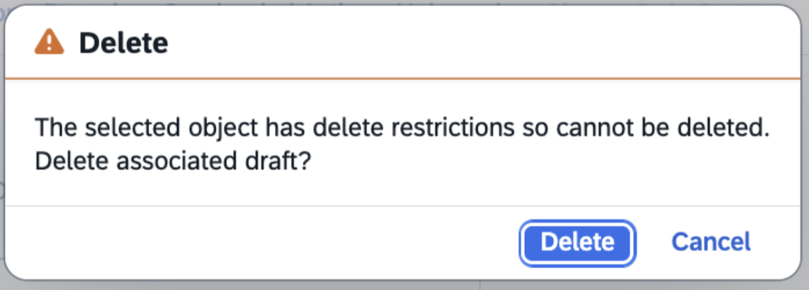
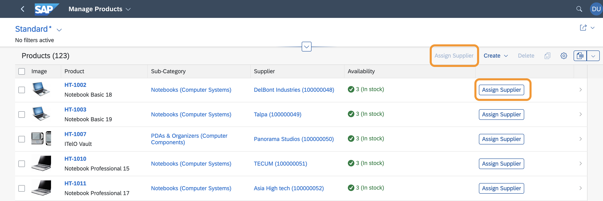

<!-- loiob623e0bbbb2b4147b2d0516c463921a0 -->

# Adding Actions to Tables

You can add different buttons to tables.

The table control offers the possibility to show generic actions, such as *Create* and *Delete*, as well as app-specific actions.


<a name="loiob623e0bbbb2b4147b2d0516c463921a0__section_nx4_qpb_2nb"/>

## Generic Actions

SAP Fiori elements provides two generic actions \(*Create* and *Delete*\) that can be rendered in the toolbar based on metadata properties of the entity set.

You can control the `Insert` capability for the related entities, that is the enablement of the *Create* button, using the following options:


### Option 1: Using `NavigationRestrictions`

The system gives priority to the `Org.OData.Capabilities.V1.NavigationRestrictions`<code><code></code></code> of the parent entity set if it is defined, and the `InsertRestrictions` provided directly at the table entity set level \(Option 2 below\) is ignored. Depending on the value of the `Insertable` property of `InsertRestrictions`, the related \(table\) entity set is made insertable or not insertable.

-   If `Insertable` is set as `true`, the related entity set is insertable.

-   If `Insertable` is set as `false`, the related entity set isn't insertable.


> ### Sample Code:  
> XML Annotation
> 
> ```xml
> <Annotations Target="STTA_PROD_MAN.STTA_PROD_MAN_Entities/STTA_C_MP_Product">
>   <Annotation Term="Capabilities.NavigationRestrictions">
>     <Record>
>         <PropertyValue Property="RestrictedProperties">
>           <Collection>
>             <Record>
>                <PropertyValue Property="NavigationProperty" NavigationPropertyPath="to_ProductText"/>
>                <PropertyValue Property="InsertRestrictions">
>                   <Record>
>                      <PropertyValue Property="Insertable" Bool="true"/>
>                      <!--Example with Boolean value for InsertRestriction-->
>                      <!-- <PropertyValue Property="Insertable" Path="Insertable"/>-->
>                      <!--Example with path for InsertRestriction-->
>                   </Record>
>                </PropertyValue>
>            </Record>
>         </Collection>
>         </PropertyValue>
>     </Record>
>   </Annotation>
> </Annotation>
> 
> ```

> ### Sample Code:  
> ABAP CDS Annotation
> 
> No ABAP CDS annotation is required, since the setting is made according to the modeling \(such as create, update, or delete\) in RAP BDEF \(behavior definition\).

> ### Sample Code:  
> ```
> 
> define behavior for STTA_C_MP_Product
> {
>   create;
>   delete;
>   update;
>  
>   association _ProductText
>   { create;  }
> };
> ```

> ### Sample Code:  
> CAP CDS Annotation
> 
> ```
> 
> annotate STTA_PROD_MAN.STTA_C_MP_Product with @(
>   Capabilities.NavigationRestrictions : {
>     RestrictedProperties : [
>         {
>             NavigationProperty : to_ProductText,
>             InsertRestrictions : {
>                 Insertable : true
>             }
>         }
>     ]
>   }
> );
> ```


### Option 2: Using `InsertRestrictions`

-   If `Insertable` is set as `true`, the related entity set is insertable.

-   If `Insertable` is set as `false`, the related entity set isn't insertable.


> ### Sample Code:  
> XML Annotation
> 
> ```xml
> 
> <Annotations Target="STTA_PROD_MAN.STTA_PROD_MAN_Entities/STTA_C_MP_ProductText">
>   <Annotation Term="Capabilities.InsertRestrictions">
>     <Record>
>        <PropertyValue Property="Insertable" Bool="true" />
>                     <!--Example with Boolean value for InsertRestriction-->
> 
>     </Record>
>   </Annotation>
> </Annotations>
> ```

> ### Sample Code:  
> ABAP CDS Annotation
> 
> No ABAP CDS annotation is required, since the setting is made according to the modeling \(such as create, update, or delete\) in RAP BDEF \(behavior definition\).

> ### Sample Code:  
> CAP CDS Annotation
> 
> ```
> 
> annotate STTA_PROD_MAN.STTA_C_MP_ProductText with @(
>   Capabilities.InsertRestrictions : {
>     Insertable : true,
>   }
> );
> ```

For more information, see [Enabling Inline Creation Mode or Empty Row Mode for Table Entries](enabling-inline-creation-mode-or-empty-row-mode-for-table-entries-cfb04f0.md).


### Showing or Hiding the *Create* Button

You can control the visibility of the *Create* button depending on the `UI.CreateHidden` annotation. The annotation can be a Boolean value or can point to a path. In your annotation, set the path to point to a particular property \(either `true` or `false`\) of the parent object. If the value of the property is `true`, then the *Create* button is hidden; if it's `false`, it's visible.

The following sample code shows you how to hide or show the *Create* button, depending on the `isCreateHidden` property of the parent entity:

> ### Sample Code:  
> XML Annotation
> 
> ```xml
> <Annotations Target="com.c_salesordermanage_sd.EntityContainer/HeaderPartner"> 
>    <Annotation Term="UI.CreateHidden" Path="owner/isCreateHidden"/> 
> </Annotations> 
> ```

> ### Sample Code:  
> ABAP CDS Annotation
> 
> ```
> @UI.createHidden: #(_Root.isCreateHidden)
> ```

> ### Sample Code:  
> CAP CDS Annotation
> 
> ```
> Annotate com.c_salesordermanage_sd.HeaderPartner with @( UI.CreateHidden: owner.isCreateHidden);
> ```


### Working with the `Create` Dialog in `POST`-Based `Create`

When you create new table records using the `POST` mechanism, that is, not using `NewAction`, and provided that the entity set on which the `create` is being performed has visible non-computed key fields, then these fields are brought up in a dialog so that users can enter values before the `create` is performed. Since the key fields are immutable, that is, not changeable after the initial `create`, the dialog is the only chance for users to enter values. The dialog also comes up for the following fields:

-   Key fields that are based on `Edm.GUID`, annotated with `Core.ComputedDefaultValue`, and have a text association

-   Fields that are marked as required for `create` using `InsertRestrictions`/`RequiredProperties`. Note that `InsertRestrictions`/`RequiredProperties`, if they are part of `NavgationRestrictions` of the parent entity, will take precedence over the same annotations directly at the level of the table entity set.

-   Other non-key immutable fields \(non-hidden and non-computed\) in the main entity set


> ### Tip:  
> The dialog does **not** come up when you use inline creation mode.

> ### Sample Code:  
> XML Annotation for `ComputedDefaultValue`
> 
> ```xml
> <Annotations Target="com.c_salesordermanage_sd.SalesOrderManage/ID">
>     <Annotation Term="Common.Text" String="SalesOrder">
>         <Annotation Term="UI.TextArrangement" EnumMember="UI.TextArrangementType/TextOnly" />
>     </Annotation>
>     <Annotation Term="Common.Label" String="Sales Order" />
>     <Annotation Term="Core.ComputedDefaultValue" Bool="true" />
> </Annotations>
> ```

> ### Sample Code:  
> ABAP CDS Annotation for `Core.ComputedDefaultValue`
> 
> No ABAP CDS annotation sample is available. Please use the local XML annotation.

> ### Sample Code:  
> CAP CDS Annotation for `ComputedDefaultValue`
> 
> ```
> entity SalesOrderManage @(
>     title        : 'Manage Sales Order'
> ) {
>     key ID : UUID @(
>             title         : 'Sales Order',
>             Common        : {
>                 Text            : SalesOrder,
>                 TextArrangement : #TextOnly
>             },
>             Core.ComputedDefaultValue : true
>         );
>     .....
>     .....
> }
> ```

> ### Sample Code:  
> XML Annotation for `InsertRestrictions`/`RequiredProperties`
> 
> ```xml
> <Annotation Term="Capabilities.InsertRestrictions">
>     <Record Type="Capabilities.InsertRestrictionsType">
>         <PropertyValue Property="Insertable" Bool="true"/>
>         <PropertyValue Property="RequiredProperties">
>             <Collection>
>                 <PropertyPath>PurchaseOrderByCustomer</PropertyPath>
>             </Collection>
>         </PropertyValue>
>     </Record>
> </Annotation>
> ```

> ### Sample Code:  
> ABAP CDS Annotation for `InsertRestrictions`/`RequiredProperties`
> 
> No ABAP CDS annotation sample is available. Please use the local XML annotation.

> ### Sample Code:  
> CAP CDS Annotation for `InsertRestrictions`/`RequiredProperties`
> 
> ```
> InsertRestrictions     : {
>   Insertable         : true,
>   RequiredProperties : [PurchaseOrderByCustomer]
> }
> ```


### Delete Action

The *Delete* button can be seen as an action on the table and is disabled until a selection is made.

`DeleteRestrictions` also supports path-based values.

The *Delete* button is shown by default if `DeleteRestrictions` isn't provided.

> ### Sample Code:  
> XML Annotation
> 
> ```xml
> <Annotations Target="SAP__self.Container/SalesOrderManage">
>    <Annotation Term="SAP__capabilities.DeleteRestrictions">
>       <Record>
>          <PropertyValue Property="Deletable" Bool="false"/>
>       </Record>
>    </Annotation>
> </Annotations>
> ```

> ### Sample Code:  
> ABAP CDS Annotation
> 
> No ABAP CDS annotation is required, since the setting is made according to the modeling \(such as create, update, or delete\) in RAP BDEF \(behavior definition\).

> ### Sample Code:  
> CAP CDS Annotation
> 
> ```
> 
> annotate SAP__self.SalesOrderManage with {
>   SAP__capabilities.DeleteRestrictions : {
>     Deletable : false
>   }
> };
> ```

> ### Note:  
> The *Delete* action can't be performed for any of the selected records if the deletion of one of the selected records fails in the back end. So the *Delete* action either works for all records or for none.

The system gives priority to the `Org.OData.Capabilities.V1.NavigationRestrictions` of the parent entity set. The *Delete* button is shown depending on the value of the `Deletable` property of `DeleteRestrictions`.

-   If `NavigationRestrictions` has the setting `Deletable=false`, the *Delete* button for the child entity table is always hidden.

-   If `NavigationRestrictions` has the setting `Deletable=true` or a path, the visibility of the *Delete* button for the child entity table depends on the value of `UI.DeleteHidden` of the child entity \(that is, the table entity\).


> ### Sample Code:  
> ```
> 
> <Annotations Target="STTA_PROD_MAN.STTA_PROD_MAN_Entities/STTA_C_MP_Product">
>   <Annotation Term="Capabilities.NavigationRestrictions">
>     <Record>
>         <PropertyValue Property="RestrictedProperties">
>           <Collection>
>             <Record>
>                <PropertyValue Property="NavigationProperty" NavigationPropertyPath="to_ProductText"/>
>                <PropertyValue Property="DeleteRestrictions">
>                   <Record>
>                      <PropertyValue Property="Deletable" Bool="false"/>
>                   </Record>
>                </PropertyValue>
>            </Record>
>         </Collection>
>         </PropertyValue>
>     </Record>
>   </Annotation>
> </Annotation>
> 
> ```


### Showing or Hiding the *Delete* Button

You can control the visibility of the *Delete* button depending on the `UI.DeleteHidden` annotation. The annotation can be a Boolean value or can point to a path. In your annotation, set the path to point to a particular property \(either `true` or `false`\) of the parent object. If the value of the property is `true`, then the *Delete* button is hidden; if it's `false`, it's visible.

The following sample code shows you how to hide or show the *Delete* button, depending on the `isDeleteHidden` property of the parent entity.

> ### Sample Code:  
> XML Annotation
> 
> ```xml
> <Annotations Target="com.c_salesordermanage_sd.EntityContainer/HeaderPartner"> 
>    <Annotation Term="UI.DeleteHidden" Path="owner/isDeleteHidden"/> 
> </Annotations> 
> ```

> ### Sample Code:  
> ABAP CDS Annotation
> 
> ```
> @UI.deleteHidden: #(_Root.isDeleteHidden)
> ```

> ### Sample Code:  
> CAP CDS Annotation
> 
> ```
> annotate com.c_salesordermanage_sd.SalesOrderManage with @( UI.DeleteHidden: owner.isDeleteHidden);
> ```


### Visibility of the *Delete* Button

The following table shows the visibility of the *Delete* button and the enabled/disabled state, based on the navigation restrictions:

****


<table>
<tr>
<th valign="top">

Restriction on Parent Entity Set: Deletable/Updatable

</th>
<th valign="top">

Restriction on Table Entity Set: Deletable/Updatable

</th>
<th valign="top">

Visibility of *Delete* Button

</th>
<th valign="top">

Delete/Update Enabled

</th>
</tr>
<tr>
<td valign="top">

undefined

</td>
<td valign="top">

undefined

</td>
<td valign="top">

depends on `UI.DeleteHidden`

</td>
<td valign="top">

enabled

</td>
</tr>
<tr>
<td valign="top">

undefined

</td>
<td valign="top">

true

</td>
<td valign="top">

depends on `UI.DeleteHidden`

</td>
<td valign="top">

enabled

</td>
</tr>
<tr>
<td valign="top">

undefined

</td>
<td valign="top">

false

</td>
<td valign="top">

false

</td>
<td valign="top">

disabled

</td>
</tr>
<tr>
<td valign="top">

undefined

</td>
<td valign="top">

<<Path\>\>

</td>
<td valign="top">

depends on `UI.DeleteHidden`

</td>
<td valign="top">

depends on <<Path\>\>

</td>
</tr>
<tr>
<td valign="top">

false

</td>
<td valign="top">

undefined

</td>
<td valign="top">

false

</td>
<td valign="top">

N/A

</td>
</tr>
<tr>
<td valign="top">

false

</td>
<td valign="top">

true

</td>
<td valign="top">

false

</td>
<td valign="top">

N/A

</td>
</tr>
<tr>
<td valign="top">

false

</td>
<td valign="top">

false

</td>
<td valign="top">

false

</td>
<td valign="top">

N/A

</td>
</tr>
<tr>
<td valign="top">

false

</td>
<td valign="top">

<<Path\>\>

</td>
<td valign="top">

false

</td>
<td valign="top">

N/A

</td>
</tr>
<tr>
<td valign="top">

true

</td>
<td valign="top">

undefined

</td>
<td valign="top">

depends on `UI.DeleteHidden`

</td>
<td valign="top">

enabled

</td>
</tr>
<tr>
<td valign="top">

true

</td>
<td valign="top">

true

</td>
<td valign="top">

depends on `UI.DeleteHidden`

</td>
<td valign="top">

enabled

</td>
</tr>
<tr>
<td valign="top">

true

</td>
<td valign="top">

false

</td>
<td valign="top">

depends on `UI.DeleteHidden`

</td>
<td valign="top">

enabled

</td>
</tr>
<tr>
<td valign="top">

true

</td>
<td valign="top">

<<Path\>\>

</td>
<td valign="top">

depends on `UI.DeleteHidden`

</td>
<td valign="top">

enabled

</td>
</tr>
<tr>
<td valign="top">

<<Path\>\>

</td>
<td valign="top">

undefined

</td>
<td valign="top">

depends on `UI.DeleteHidden`

</td>
<td valign="top">

depends on <<Path\>\>

</td>
</tr>
<tr>
<td valign="top">

<<Path\>\>

</td>
<td valign="top">

true

</td>
<td valign="top">

depends on `UI.DeleteHidden`

</td>
<td valign="top">

depends on <<Path\>\>

</td>
</tr>
<tr>
<td valign="top">

<<Path\>\>

</td>
<td valign="top">

false

</td>
<td valign="top">

depends on `UI.DeleteHidden`

</td>
<td valign="top">

depends on <<Path\>\>

</td>
</tr>
<tr>
<td valign="top">

<<Path\>\>

</td>
<td valign="top">

<<Path\>\>

</td>
<td valign="top">

depends on `UI.DeleteHidden`

</td>
<td valign="top">

depends on <<Path\>\> of parent entity set restrictions

</td>
</tr>
</table>


### Handling Delete Restrictions on the List Report Page

In the list report page, the delete restrictions set on a table entity are evaluated for the saved version of the entity and not for the draft. So, when the user selects a non-deletable entity with an existing draft, the *Delete* button is still enabled. The delete action affects only the draft, not the saved version.




### Defining the Order of Standard Actions

You can define the order of standard actions in the table toolbar. To do so, define the properties `anchor` and `position` for each action corresponding to the action key in the `manifest.json` file. The following table shows the keys and the corresponding standard actions:


<table>
<tr>
<th valign="top">

Key

</th>
<th valign="top">

Standard Action

</th>
</tr>
<tr>
<td valign="top">

`Create`

</td>
<td valign="top">

`StandardAction::Create`

</td>
</tr>
<tr>
<td valign="top">

`Delete`

</td>
<td valign="top">

`StandardAction::Delete`

</td>
</tr>
<tr>
<td valign="top">

`MassEdit`

</td>
<td valign="top">

`StandardAction::MassEdit`

</td>
</tr>
<tr>
<td valign="top">

`Delete`

</td>
<td valign="top">

`StandardAction::'Insights'`

</td>
</tr>
</table>

> ### Sample Code:  
> ```
> { "sap.ui5": {
>      "routing": { 
>         "targets": { 
>             "SalesOrderManageList": { 
>                 "options": { 
>                     "settings": { 
>                         "controlConfiguration": { 
>                             "@com.sap.vocabularies.UI.v1.LineItem": { 
>                                 "actions": { "StandardAction::Delete": { 
>                                     "position": { 
>                                         "anchor": "StandardAction::Create", 
>                                         "placement": "Before" 
>                                         } 
>                                     }, 
>                                     "CustomAction": { 
>                                         "press": "SalesOrder.custom.CustomActions.CustomAction1", 
>                                         "enabled": true, "text": "Custom Action", 
>                                         "command": "COMMON", "position": { 
>                                             "anchor": "StandardAction::Create", 
>                                             "placement": "After" 
>                                             } 
>                                         } 
>                                     } 
>                                 } 
>                             } 
>                         } 
>                     } 
>                 } 
>             } 
>         } 
>     } 
> }
> ```


### Enabling the `Update` Feature for the Table

You can control the editability of table fields using `UpdateRestrictions`.

```xml
<Annotations Target="com.c_salesordermanage_sd.EntityContainer/Material">
    <Annotation Term="Capabilities.UpdateRestrictions">
        <Record Type="Capabilities.UpdateRestrictionsType">
            <PropertyValue Property="Updatable" Path="owner.isUpdatable"/>
        </Record>
    </Annotation>
</Annotations>

```


<a name="loiob623e0bbbb2b4147b2d0516c463921a0__section_ifk_jqb_2nb"/>

## App-Specific Actions

Tables can also show application-configured actions. These can either be custom actions configured in the `manifest.json`, or can come from annotations.


### Custom Actions \(`manifest.json`\)

Applications can define custom table toolbar actions using enhancements to the `manifest.json` file. For more information, see [Adding Custom Actions Using Extension Points](adding-custom-actions-using-extension-points-7619517.md).


### Annotation-Based Actions

The following types of actions are supported:

-   Actions that trigger a back-end call through the OData service, for example *Approve* or *Unblock*, represented by the complex type `DataFieldForAction`.

-   Actions that trigger navigation, for example to a different app, represented by the complex type `DataFieldForIntentBasedNavigation`. For more information, see [Navigation from an App \(Outbound Navigation\)](navigation-from-an-app-outbound-navigation-d782acf.md).

Annotation-based actions can be inline actions. Inline actions are used to trigger actions directly for a single table row. Such an action shows up within the table control as a separate column. To set an action as an inline action, set the `Inline` property to `true`. The line item actions are then displayed as shown in the following screenshot:

  
  
**Example: Actions in the Table Toolbar**




### Specifying a Text for an App-Specific Action

To specify a text for your action, use the `com.sap.vocabularies.UI.v1.DataFieldForAction` property and specify the text to be displayed.

For more information about adding a button triggering external navigation, see [Navigation from an App \(Outbound Navigation\)](navigation-from-an-app-outbound-navigation-d782acf.md).

For more information about context-dependent and context-independent actions, see [Actions](actions-cbf16c5.md).

The following code sample shows how to create your annotations for line item actions. Note that the `UI.LineItem` vocabulary term is used to define the columns for the table.


### `UI.LineItem`

> ### Sample Code:  
> XML Annotation
> 
> ```xml
> <Annotation Term="UI.LineItem">
>    <Collection>
>       <Record Type="UI.DataFieldForAction">
>          <PropertyValue Property="Label" String="Copy with new Supplier"/>
>          <PropertyValue Property="Action"
>             String="STTA_PROD_MAN.STTA_PROD_MAN_Entities/STTA_C_MP_ProductCopywithparams"/>
>          <PropertyValue Property="InvocationGrouping"   
>             EnumMember="UI.OperationGroupingType/Isolated"/>
>       </Record>
>       <Record Type="UI.DataFieldForAction">
>          <PropertyValue Property="Label" String="Activate"/>
>          <PropertyValue Property="Action"
>             String="STTA_PROD_MAN.STTA_PROD_MAN_Entities/STTA_C_MP_ProductActivation"/>
>          <PropertyValue Property="InvocationGrouping" 
>             EnumMember="UI.OperationGroupingType/ChangeSet"/>
>       </Record>
>       <Record Type="UI.DataField">
>          <PropertyValue Property="Value" Path="Product"/>
>          <Annotation Term="UI.Importance" EnumMember="UI.ImportanceType/High"/>
>       </Record>
>       <Record Type="UI.DataField">
>          <PropertyValue Property="Value" Path="ProductCategory"/>
>          <Annotation Term="UI.Importance" EnumMember="UI.ImportanceType/High"/>
>       </Record>
>       <Record Type="UI.DataField">
>          <PropertyValue Property="Value" Path="to_Supplier/CompanyName"/>
>          <Annotation Term="UI.Importance" EnumMember="UI.ImportanceType/High"/>
>       </Record>
>       <Record Type="UI.DataField">
>          <PropertyValue Property="Criticality" Path="to_StockAvailability/StockAvailability"/>
>          <PropertyValue Property="Value" Path="to_StockAvailability/StockAvailability"/>
>          <Annotation Term="UI.Importance" EnumMember="UI.ImportanceType/High"/>
>       </Record>
>       <Record Type="UI.DataField">
>          <PropertyValue Property="Value" Path="Price"/>
>          <Annotation Term="UI.Importance" EnumMember="UI.ImportanceType/High"/>
>       </Record>
>       <Record Type="UI.DataFieldForAction">
>          <PropertyValue Property="Label" String="Copy"/>
>          <PropertyValue Property="Action"
>             String="STTA_PROD_MAN.STTA_PROD_MAN_Entities/STTA_C_MP_ProductCopy"/>
>          <PropertyValue Property="Inline" Bool="true"/>
>          <PropertyValue Property="InvocationGrouping"   
>             EnumMember="UI.OperationGroupingType/Isolated"/>
>       </Record>
>       <Record Type="UI.DataFieldForIntentBasedNavigation">
>          <PropertyValue Property="Label" String="Manage Products (ST)"/>
>          <PropertyValue Property="SemanticObject" String="EPMProduct"/>
>          <PropertyValue Property="Action" String="manage_st"/>
>          <PropertyValue Property="Inline" Bool="true"/>
>       </Record>
>       
>       <Record Type="UI.DataFieldWithIntentBasedNavigation">
>          < PropertyValue Property ="Label" String ="Weight (with IBN)" />
>          < PropertyValue Property ="Action" String ="manage_st_test" />
>          <PropertyValue Property="Value" Path="Weight"/>
>          <PropertyValue Property="SemanticObject" String="EPMProduct" />
>           <Annotation Term="UI.Importance" EnumMember="UI.ImportanceType/High"/>
>       </Record>
>     </Collection>
> </Annotation>
> 
> ```

> ### Sample Code:  
> ABAP CDS Annotation
> 
> ```
> @UI.lineItem: [
>   {
>     label: 'Copy with new Supplier',
>     dataAction: 'PUSHDOWN:STTA_C_MP_ProductCopywithparams',
>     invocationGrouping: #ISOLATED,
>     type: #FOR_ACTION,
>     position: 1
>   },
>   {
>     label: 'Activate',
>     dataAction: 'PUSHDOWN:STTA_C_MP_ProductActivation',
>     invocationGrouping: #CHANGE_SET,
>     type: #FOR_ACTION,
>     position: 2
>   },
>   {
>     label: 'Product',   
>     importance: #HIGH,
>     value: 'PRODUCT',
>     type: #STANDARD,
>     position: 3
>   },
>   {
>     label: 'Copy',   
>     dataAction: 'PUSHDOWN:STTA_C_MP_ProductCopy',
>     invocationGrouping: #ISOLATED,
>     type: #FOR_ACTION,
>     position: 8
>   }
> ]
> 
> ```

> ### Sample Code:  
> CAP CDS Annotation
> 
> ```
> 
> UI.LineItem : [
>     {
>         $Type : 'UI.DataFieldForAction',
>         Label : 'Copy with new Supplier',
>         Action : 'STTA_PROD_MAN.STTA_PROD_MAN_Entities/STTA_C_MP_ProductCopywithparams',
>         InvocationGrouping : #Isolated
>     },
>     {
>         $Type : 'UI.DataFieldForAction',
>         Label : 'Activate',
>         Action : 'STTA_PROD_MAN.STTA_PROD_MAN_Entities/STTA_C_MP_ProductActivation',
>         InvocationGrouping : #ChangeSet
>     },
>     {
>         $Type : 'UI.DataField',
>         Value : Product,
>         ![@UI.Importance] : #High
>     },
>     {
>         $Type : 'UI.DataField',
>         Value : ProductCategory,
>         ![@UI.Importance] : #High
>     },
>     {
>         $Type : 'UI.DataField',
>         Value : to_Supplier.CompanyName,
>         ![@UI.Importance] : #High
>     },
>     {
>         $Type : 'UI.DataField',
>         Criticality : to_StockAvailability.StockAvailability,
>         Value : to_StockAvailability.StockAvailability,
>         ![@UI.Importance] : #High
>     },
>     {
>         $Type : 'UI.DataField',
>         Value : Price,
>         ![@UI.Importance] : #High
>     },
>     {
>         $Type : 'UI.DataFieldForAction',
>         Label : 'Copy',
>         Action : 'STTA_PROD_MAN.STTA_PROD_MAN_Entities/STTA_C_MP_ProductCopy',
>         Inline : true,
>         InvocationGrouping : #Isolated
>     },
>     {
>         $Type : 'UI.DataFieldForIntentBasedNavigation',
>         Label : 'Manage Products (ST)',
>         SemanticObject : 'EPMProduct',
>         Action : 'manage_st',
>         Inline : true
>     },
>     {
>         $Type : 'UI.DataFieldWithIntentBasedNavigation',
>         Label : 'Weight (with IBN)',
>         Value : Weight,
>         SemanticObject : 'EPMProduct',
>         Action : 'manage_st'
>     }
> ]
> 
> ```

In the example above, the order in which the record types are presented in the annotation determines the order in which they appear in the table columns:

-   For the first two record types, the `DataFieldForAction` complex type doesn't contain the `Inline` property, which means that the action button appears in the table toolbar. If the `Inline` property is there and set to `false`, the action button is also displayed in the table toolbar.

-   With the next five record types, the `DataField` complex type is used to define the data for a column within the table.

-   With the last but two record types, the `DataFieldForAction` and `DataFieldForIntentBasedNavigation` complex types are used and contain the `Inline` property, which is set to `true`. This means the action buttons appear in every row in the appropriate column within the table.

-   With the last record type, the `DataFieldWithIntentBasedNavigation` complex type is used to render the property value as a link, allowing for navigation to the semantic object.


<a name="loiob623e0bbbb2b4147b2d0516c463921a0__section_b1k_3lf_nmb"/>

## Enabling Single Selection for a Bound Action

Applications can control the number of table records that need to be selected for the bound action to be enabled. For more information, see [Actions](actions-cbf16c5.md). By default, for a bound action, this is 1 or more applicable records \(that is, 1 or more records for which `OperationAvailable` evaluates to `true`\). However, applications can change this configuration so that the action is enabled only when a single applicable record is selected. If more records are selected, then the action is disabled again. Applications can do this by specifying the `enableOnSelect` property in the `manifest.json`:

> ### Sample Code:  
> Table Actions
> 
> ```
> "@com.sap.vocabularies.UI.v1.LineItem": {
>     "actions": {
>         "DataFieldForAction::com.c_salesordermanage_sd.CreateWithSalesOrderType": {
>             "enableOnSelect": "single" // Possible values: "single", "multi" (default)
>         }
>     }
> }
> ```

> ### Sample Code:  
> Chart Actions
> 
> ```
> "@com.sap.vocabularies.UI.v1.Chart": {
>     "actions": {
>         "DataFieldForAction::com.c_salesordermanage_sd.CreateWithSalesOrderType": {
>             "enableOnSelect": "single" // Possible values: "single", "multi" (default)
>         }
>     }
> }
> ```

> ### Note:  
> -   The setting isn't applicable for inline actions \(where only the context of the row of the pressed button is passed\) and for static or unbound actions \(where no context is passed\).
> 
> -   The feature is only supported for annotation-based actions.


## Rendering Buttons with an Icon Instead of Text

The text for the inline `DataFieldForAction` and the `DataFieldForIntentBasedNavigation` buttons can be replaced with an icon, as specified in the `"IconUrl"` annotation property. The label of the button then appears as the tooltip of the button.

> ### Note:  
> -   If you use icons, the `"Criticality"` of the `DataFieldForAction` and `DataFieldForIntentBasedNavigation` is ignored.
> 
> -   The feature is supported only for inline table actions and navigation buttons, not for buttons used elsewhere.
> 
> -   Use icon buttons only for basic standard icon metaphors. For more information, see [Button Content in SAP Fiori Design Guidelines](https://experience.sap.com/fiori-design-web/button/#text-or-icon).

`DataFieldForAction`

> ### Sample Code:  
> XML Annotation
> 
> ```
> <Record Type="UI.DataFieldForAction">
>     <PropertyValue Property="Label" String="Navigate via Action"/>
>     <PropertyValue Property="Action" String="com.c_salesordermanage_sd.ActionNavigation"/>
>     <PropertyValue Property="Inline" Bool="true"/>
>     <PropertyValue Property="IconUrl" String="sap-icon://arrow-right"/>
> </Record>
> 
> ```

> ### Sample Code:  
> ABAP CDS Annotation
> 
> ```
> {
>     label: 'Navigate via Action',
>     dataAction: 'com.c_salesordermanage_sd.ActionNavigation',
>     iconUrl: 'sap-icon://arrow-right'
>     type: #FOR_ACTION
> }
> 
> ```

> ### Note:  
> Inline is not supported in ABAP CDS.

> ### Sample Code:  
> CAP CDS Annotation
> 
> ```
> {
>     $Type             : 'UI.DataFieldForAction',
>     Label             : 'Navigate via Action',
>     Action            : 'com.c_salesordermanage_sd.ActionNavigation',
>     Inline            : true,
>     IconUrl           : 'sap-icon://arrow-right'
> },
> }
> ```

`DataFieldForIntentBasedNavigation`

> ### Sample Code:  
> XML Annotation
> 
> ```xml
> <Record Type="UI.DataFieldForIntentBasedNavigation">
>     <PropertyValue Property="SemanticObject" String="v4Freestyle"/>
>     <PropertyValue Property="Action" String="Inbound"/>
>     <PropertyValue Property="Label" String="IBN Inline"/>
>     <PropertyValue Property="RequiresContext" Bool="true"/>
>     <PropertyValue Property="Inline" Bool="true"/>
>     <PropertyValue Property=" IconUrl" String="sap-icon://arrow-left"/>
> </Record>
> ```

> ### Sample Code:  
> ABAP CDS Annotation
> 
> ```
> @UI.lineItem: [
>   {
>     semanticObjectAction: 'Inbound',
>     label: 'IBN Inline',
>     requiresContext: true,
>      iconUrl: 'sap-icon://arrow-left'
>     type: #FOR_INTENT_BASED_NAVIGATION
>   }
> ]
> TEST;
> 
> @Consumption.semanticObject: 'v4Freestyle'
> %ENTITY;
> 
> ```

> ### Note:  
> Inline is not supported in ABAP CDS.

> ### Sample Code:  
> CAP CDS Annotation
> 
> ```
> {
>     $Type             : 'UI.DataFieldForIntentBasedNavigation',
>     SemanticObject    : 'v4Freestyle',
>     Action            : 'Inbound',
>     Label             : 'IBN Inline',
>     RequiresContext   : true,
>     Inline            : true,
>     IconUrl           : 'sap-icon://arrow-left'
> }
> ```


## Grouping Actions as Menu Buttons

Actions that have a similar business purpose can be grouped together and rendered in the form of menu buttons. For more information, see [Actions](actions-cbf16c5.md).


## Triggering Actions Connected to a Field Value

You can trigger an action that is connected to a field value. The field value is displayed as a link. The action to be triggered is defined by the `Action` property.

> ### Sample Code:  
> XML Annotation
> 
> ```xml
> <Record Type="UI.DataFieldWithAction">
>     <PropertyValue Property="Value" Path="PurchaseOrderByCustomer"/>
>     <PropertyValue Property="Action" String="com.c_salesordermanage_sd.ActionDataFieldWith"/>
>     <PropertyValue Property="Label" String="Customer Reference"/>
> </Record>
> 
> ```

> ### Sample Code:  
> ABAP CDS Annotation
> 
> No ABAP CDS annotation sample is available. Please use the local XML annotation.

> ### Sample Code:  
> CAP CDS Annotation
> 
> ```
> {
>     $Type : 'UI.DataFieldWithAction',
>     Value : PurchaseOrderByCustomer,
>     Label : 'Customer Reference',
>     Action : 'com.c_salesordermanage_sd.ActionDataFieldWith'
> },
> ```

To pass the field value to an action parameter, use the annotation term `ParameterDefaultValue` to set specific values in the action parameters.

> ### Sample Code:  
> XML Annotation
> 
> ```xml
> <Annotations Target="com.c_salesordermanage_sd.ActionDataFieldWith(com.c_salesordermanage_sd.SalesOrderManage)/PurchaseOrderByCustomer">
>     <Annotation Term="UI.ParameterDefaultValue" Path="_it/PurchaseOrderByCustomer"/>
>     <Annotation Term="Common.Label" String="Customer Reference"/>
> </Annotations>
> 
> ```

You can also trigger an action that is connected to a field value on a form.

> ### Note:  
> In applications where links are annotated with `DataFieldWithAction`, the context menu does not show the *Open in New Tab* and *Open in New Window* options when an end user right-clicks on them.


> ### Note:  
> For information about SAP Fiori elements for OData V2, see [Adding Actions to Tables](adding-actions-to-tables-c909f6b.md).

