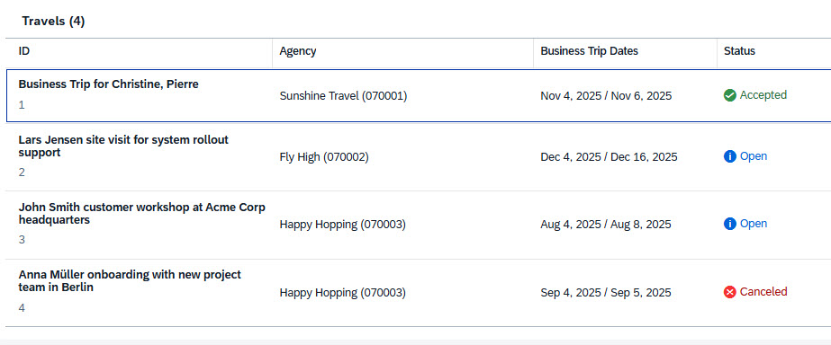

<!-- loio4a275cee936544f383b8d22061346c8f -->

# Adding `ConnectedFields` to a Table

You can add semantically connected fields to a table.

> ### Note:  
> This topic is only applicable to SAP Fiori elements for OData V4.

Connected fields allow you to represent two semantically related fields in a single table column while keeping each individual field editable. The following screenshot shows the `BeginDate` and `EndDate` properties represented as the *Business Trip Dates* column:

  
  
**Business Trip Dates Column Using Connected Fields**



You can add semantically connected fields as shown in the following sample code:

> ### Sample Code:  
> XML Annotation
> 
> ```xml
> <Annotations Target="TravelService.Travel">
> 	<Annotation Term="UI.ConnectedFields" Qualifier="TripDates">
> 		<Record Type="UI.ConnectedFieldsType">
> 			<PropertyValue Property="Label" String="Business Trip Dates"/>
> 			<PropertyValue Property="Template" String="{BeginDate}/{EndDate}"/>
> 			<PropertyValue Property="Data">
> 				<Record Type="Core.Dictionary">
> 					<PropertyValue Property="BeginDate">
> 						<Record Type="UI.DataField">
> 							<PropertyValue Property="Value" Path="BeginDate"/>
> 						</Record>
> 					</PropertyValue>
> 					<PropertyValue Property="EndDate">
> 						<Record Type="UI.DataField">
> 							<PropertyValue Property="Value" Path="EndDate"/>
> 						</Record>
> 					</PropertyValue>
> 				</Record>
> 			</PropertyValue>
> 		</Record>
> 	</Annotation>
> 	<Annotation Term="UI.LineItem">
> 		<Collection>
> 			<Record Type="UI.DataFieldForAnnotation">
> 				<PropertyValue Property="Target" AnnotationPath="@UI.ConnectedFields#TripDates"/>
> 			</Record>
> 		</Collection>
> 	</Annotation>
> </Annotations>
> ```

> ### Sample Code:  
> ABAP CDS Annotation
> 
> ```
> annotate view Travel with {
>     @UI.connectedField : [
>         {
>            name: 'Dates',
>            qualifier: 'TripDates',
>            template: '{BeginDate} / {EndDate}',
>            groupLabel: 'Business Trip Dates'
>         } 
>     ] 
>     
>     @UI.lineItem: [
>         {
>             type: #AS_CONNECTED_FIELDS, 
>             valueQualifier: 'TripDates'
>         } 
>     ]
> }
> ```

> ### Sample Code:  
> CAP CDS Annotation
> 
> ```
> annotate service.Travel @(
>     UI.ConnectedFields #TripDates: {
>           Label: 'Business Trip Dates',
>           Template: '{BeginDate} / {EndDate}',
>           Data: {
>               BeginDate: {
>                   $Type: 'UI.DataField',
>                   Value: BeginDate
>                   
>               },
>               EndDate: {
>                   $Type: 'UI.DataField', 
>                   Value: EndDate}
>           }
>       },
> 
>     UI.LineItem: [
>         {
>           $Type: 'UI.DataFieldForAnnotation',
>           Target: '@UI.ConnectedFields#TripDates'
>         } 
>     ]
> )
> ```

The content of the column is horizontally aligned to the left by default. You can override it by using manifest settings. For more information, see [Overriding the Horizontal Alignment of Annotation-Based Table Columns](overriding-the-horizontal-alignment-of-annotation-based-table-columns-fb93920.md).

Adding a semantic key to connected fields does not affect the editing status. For more information, see [Editing Status](editing-status-668ea18.md) and [Handling Semantic Key Fields](handling-semantic-key-fields-aa2793c.md).

