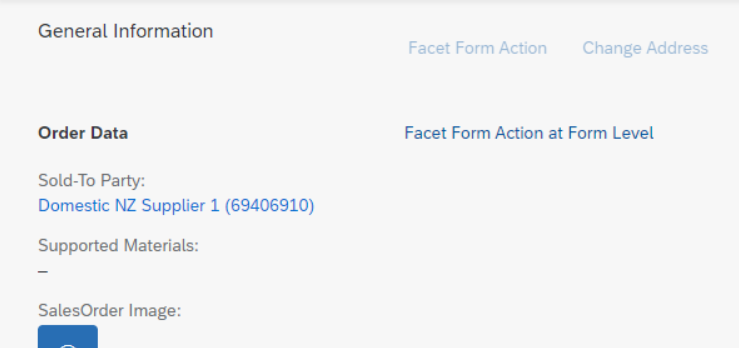

<!-- loio7619517a92414e27b71f02094bd08d06 -->

# Adding Custom Actions Using Extension Points

You can use extension points to add custom actions to the list report page and the object page.


## Context

> ### Caution:  
> Use app extensions with caution and only if you cannot produce the required behavior by other means, such as manifest settings or annotations. To correctly integrate your app extension coding with SAP Fiori elements, use only the `extensionAPI` of SAP Fiori elements. For more information, see [Using the ExtensionAPI](using-the-extensionapi-bd2994b.md).
> 
> After you've created an app extension, its display \(for example, control placement and layout\) and system behavior \(for example, model and binding usage, busy handling\) lies within the application's responsibility. SAP Fiori elements provides support only for the official `extensionAPI` functions. Don't access or manipulate controls, properties, models, or other internal objects created by the SAP Fiori elements framework.

You can define custom actions for:

-   List report page \(global action\)

    For global actions, you do not have to select a line in the list report page table. This type of action refers to the whole list report page, for example, *Display Log*. Global actions are placed in the list report page filter bar next to the *Share* button.

-   Table toolbar of the list report page
-   Header of the object page
-   Table toolbar for a specific table on the object page
-   Form in a section on the object page
-   Footer bar on the object page

These custom actions are displayed as buttons on the UI. When the user selects the action, the system calls a handler function that can be implemented within a controller extension.


<a name="loio7619517a92414e27b71f02094bd08d06__steps_a55_xtl_d4b"/>

## Procedure

1.  Create a custom action handler function in JavaScript.

2.  Extend the `manifest.json` file.

    In your app's `manifest.json` file, under `sap.ui5 → routing → targets → <target name> → options → settings → controlConfiguration → <control> → actions`, or in the footer, add actions as follows:

    > ### Sample Code:  
    > `manifest.json`
    > 
    > ```
    > "<Action name>": {
    >      "press": "<handler function>",
    >      "visible": <true|false|handler function>,
    >      "enabled": <true|false|handler function>,
    >      "text": "<button text>",
    >      "position": {
    >           "placement": <"Before"|"After">,
    >           "anchor": "<Anchor action name>"
    >      }
    > }
    > ```


    <table>
    <tr>
    <th valign="top">

    Property
    
    </th>
    <th valign="top">

    Description
    
    </th>
    </tr>
    <tr>
    <td valign="top">
    
    `The first parameter of<Action name>` 
    
    </td>
    <td valign="top">
    
    Name of the custom action
    
    </td>
    </tr>
    <tr>
    <td valign="top">
    
    `<handler function>` 
    
    </td>
    <td valign="top">
    
    Handler function that is called when the user selects the action button

    It is of the format `<app ID from manifest>.<Folder Name>.<Script file>.<Method Name>`
    
    </td>
    </tr>
    <tr>
    <td valign="top">
    
    `<button text>` 
    
    </td>
    <td valign="top">
    
    Text to be displayed on the button \(typically a binding to an i18n entry, for example `{i18n>BUTTON_TEXT}`\)
    
    </td>
    </tr>
    <tr>
    <td valign="top">
    
    `<Anchor action name>` 
    
    </td>
    <td valign="top">
    
    Name of another action with reference to which this action should be placed.

    Here are some examples:

    > ### Sample Code:  
    > ```
    > "position": {
    >      "placement": "Before",
    >      "anchor": "DataFieldForAction::Action"
    > }
    > ```

    This places the current action before the `DataFieldForAction` by the name `Action`.

    > ### Sample Code:  
    > ```
    > "position": {
    >      "placement": "After",
    >      "anchor": "DataFieldForIntentBasedNavigation::SO::Action"
    > }
    > ```

    This places the current action after the `DataFieldForIntentBasedNavigation` by the name `Action` defined on the semantic object `SO`.
    
    </td>
    </tr>
    </table>
    
3.  Define a handler function.

    1.  For a custom action, proceed as follows:

        > ### Sample Code:  
        > ```
        > "controlConfiguration": {
        >      "<NavigationPropertyFromRootEntityType>/@com.sap.vocabularies.UI.v1.LineItem": {
        >           "actions": {
        >                "myCustomAction": {
        >                     "press": "TestApplication.ext.CustomActions.message"
        >                     ....
        >                }
        >           }
        >      }
        > }
        > ```

    2.  Create a folder called *ext* in the webapp folder of the application.

    3.  Create a file called *CustomActions.js* in the *ext* folder.

    4.  Create a method called *message* in the *CustomActions.js* file.

        The signature of the method *message* looks as follows:

        > ### Sample Code:  
        > ```
        > sap.ui.define(
        >      [],
        >      function () {
        >           "use strict";
        >           return {
        >                message: function (oContext, aSelectedContexts) {
        >                     // oContext :  is the binding context of the current entity
        >                     // aSelectedContexts : contains an array of binding contexts corresponding to
        >                     //       selected items in case of table action (or)
        >                     //
        >                     alert("message");
        >                },
        >           };
        >      }
        > );
        > ```


<a name="loio7619517a92414e27b71f02094bd08d06__result_nkw_dbm_d4b"/>

## Results

-   Table toolbar action for the list report page

    > ### Sample Code:  
    > ```xml
    > 
    > {
    >     "sap.ui5": {
    >         "routing": {
    >             "targets": {
    >                 "<ListReportTargetName>": {
    >                     "options": {
    >                         "settings": {
    >                             "controlConfiguration": {
    >                                 "@com.sap.vocabularies.UI.v1.LineItem": {
    >                                     "actions": {
    >                                         "<ActionName>": {
    >                                             "press": "<ApplicationId.FolderName.ScriptFilename.methodName>",
    >                                             "text": "<button text>",
    >                                             "enabled": <true|false|handler function>,
    >                                             "visible": <true|false|handler function>
    >                                         }
    >                                     }
    >                                 }
    >                             }
    >                          }
    >                     }
    >                 }
    > ```

-   Action for the object page header

    > ### Sample Code:  
    > ```xml
    > 
    > {
    >      "sap.ui5": {
    >           "routing": {
    >                "targets": {
    >                     "<ObjectPageTargetName>": {
    >                          "options": {
    >                                "settings": {
    >                                     "content": {
    >                                          "header": {
    >                                               "actions": {
    >                                                    "<ActionName>": {
    >                                                    }
    >                                               }
    >                                          }
    >                                     }
    >                                }
    >                          }
    >                     }
    >                }
    >           }
    >      }
    > }
    > ```

-   Table toolbar action for the object page

    > ### Sample Code:  
    > ```xml
    > "sap.ui5": {
    >      "routing": {
    >           "targets": {
    >                "<ObjectPageTargetName>": {
    >                     "options": {
    >                          "settings": {
    >                               "controlConfiguration": {
    >                                    <NavigationPropertyFromRootEntityType>/@com.sap.vocabularies.UI.v1.LineItem": {
    >                                         "actions": {
    >                                              "<ActionName>": {
    >                                              }
    >                                         }
    >                                    }
    >                               }
    >                          }
    >                     }
    >                }
    >           }
    >      }
    > }
    > ```

-   Footer bar action in the object page:

    > ### Sample Code:  
    > ```xml
    > "sap.ui5": {
    >      "routing": {
    >           "targets": {
    >                "<ObjectPageTargetName>": {
    >                     "options": {
    >                          "settings": {
    >                               "content": {
    >                                    "footer": {
    >                                         "actions": {
    >                                              "<ActionName>": {
    >                                                   ...
    >                                              }
    >                                         }
    >                                    }
    >                               }
    >                          }
    >                     }
    >                }
    >           }
    >      }
    > }
    > 
    > ```

-   List report page \(global action\)

    > ### Sample Code:  
    > ```xml
    > "sap.ui5": {
    >     "routing": {
    >         "targets": {
    >             "<ListReportTargetName>": {
    >                 "options": {
    >                     "settings": {
    >                         "content": {
    >                             "header": {
    >                                 "actions": {
    >                                     "<ActionName>": {
    >                                         ...
    >                                     }
    >                                 }
    >                             }
    >                         }
    >                     }
    >                 }
    >             }
    >         }
    >     }
    > }
    > 
    > ```

-   Section action

    To define a custom action in a section, you must extend the `controlConfiguration` of any of the `FieldGroups` in that section with an actions block in a structure as follows:

    > ### Sample Code:  
    > ```xml
    > "sap.ui5": {
    >         "routing": {
    >             "targets": {
    >                 "SalesOrderManageObjectPage": {
    >                     "options": {
    >                         "settings": {
    >                             "enhanceI18n": "i18n/SalesOrderObjectPage.properties",
    >                             "controlConfiguration": {
    >                                 "@com.sap.vocabularies.UI.v1.FieldGroup#OrderData": {
    >                                     "actions": {
    >                                         "customSectionAction": {
    >                                             "press": "SalesOrder.ext.CustomActions.alert",
    >                                             "visible": true,
    >                                             "enabled": true,
    >                                             "text": "Alert",
    >                                             "position": {
    >                                                 "placement": "After",
    >                                                 "anchor": "DataFieldForIntentBasedNavigation::SalesOrder::manageInline"
    >                                             }
    >                                         },
    >                                         "sectionAction2": {
    >                                             "press": "SalesOrder.ext.CustomActions.accountDetails",
    >                                             "visible": true,
    >                                             "enabled": true,
    >                                             "text": "Display account details",
    >                                             "position": {
    >                                                 "placement": "Before",
    >                                                 "anchor": "customSectionAction"
    >                                             }
    >                                         }
    >                                     }
    >                                 }
    >                             }
    >                         }
    >                     }
    >                 }
    >             }
    >         }
    >     }
    > 
    > ```

-   Form toolbar action

    When you set `inline=true`, a given action from a `FieldGroup` shows up directly in the form toolbar instead of the section toolbar.

    > ### Sample Code:  
    > ```xml
    > "sap.ui5": {
    >     "routing": {
    >         "targets": {
    >             "SalesOrderManageObjectPage": {
    >                 "options": {
    >                     "settings": {
    >                         "controlConfiguration": {
    >                             "@com.sap.vocabularies.UI.v1.FieldGroup#OrderData": {
    >                                 "actions": {
    >                                     "customSectionAction": {
    >                                         "press": "SalesOrder.ext.CustomActions.alert",
    >                                         "visible": true,
    >                                         "enabled": false,
    >                                         "text": "Action on Form",
    >                                         "inline": true
    >                                     },
    >                                     "customSectionAction2": {
    >                                         "press": "SalesOrder.ext.CustomActions.alert",
    >                                         "visible": true,
    >                                         "enabled": true,
    >                                         "text": "Action not on Form"
    >                                     }
    >                                 }
    >                             }
    >                         }
    >                     }
    >                 }
    >             }
    >         }
    >     }
    > }
    > ```

    


## Example

You can explore and work with the coding yourself. For more information and live examples, see the SAP Fiori development portal at [Standard Floorplans - Extensions - Extensions for Object Pages - Custom Action](https://ui5.sap.com/test-resources/sap/fe/core/fpmExplorer/index.html#/topic/floorplanObjectPage/customAction).

<a name="concept_rld_gxp_c3c"/>

<!-- concept\_rld\_gxp\_c3c -->

## 

> ### Note:  
> For information about SAP Fiori elements for OData V2, see [Adding Custom Actions Using Extension Points](adding-custom-actions-using-extension-points-3530e6b.md).

