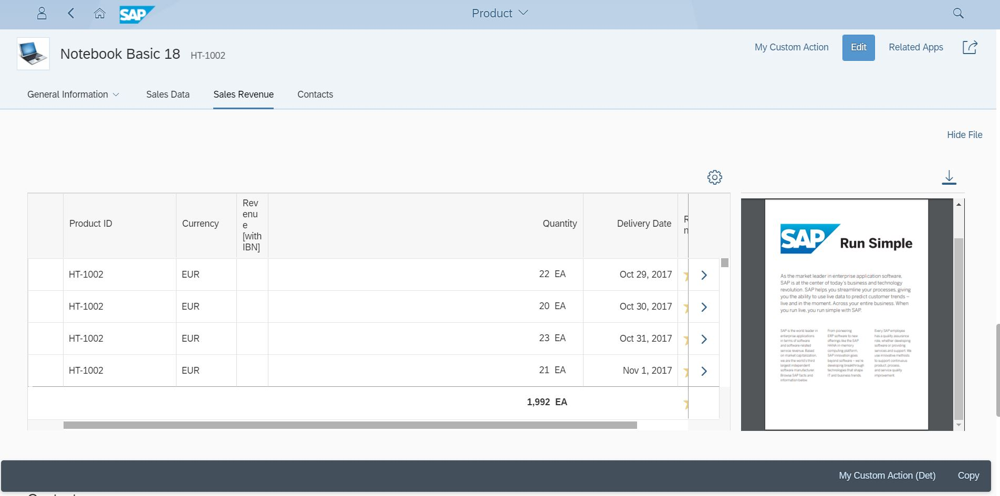
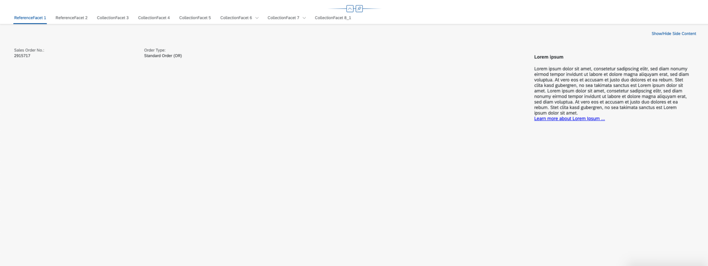
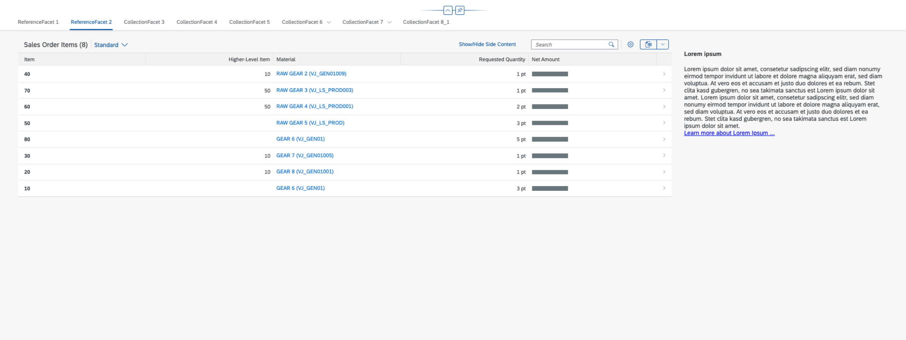
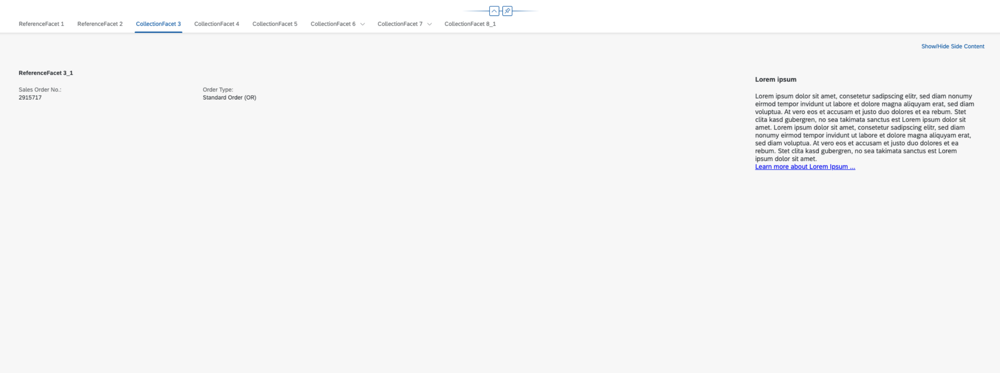
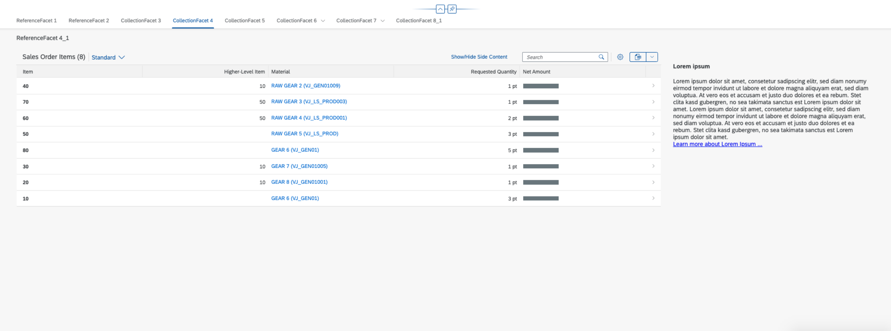
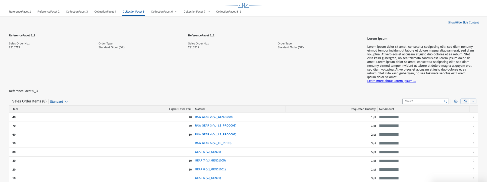
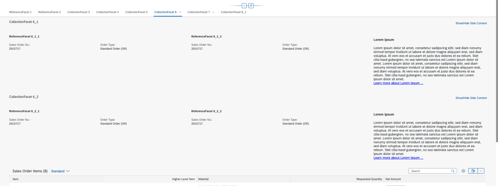
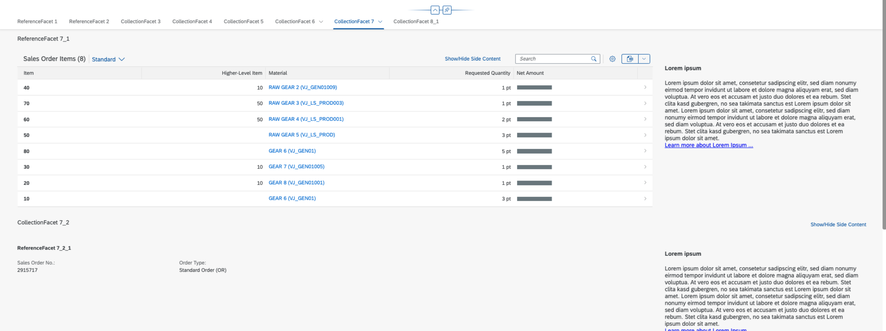
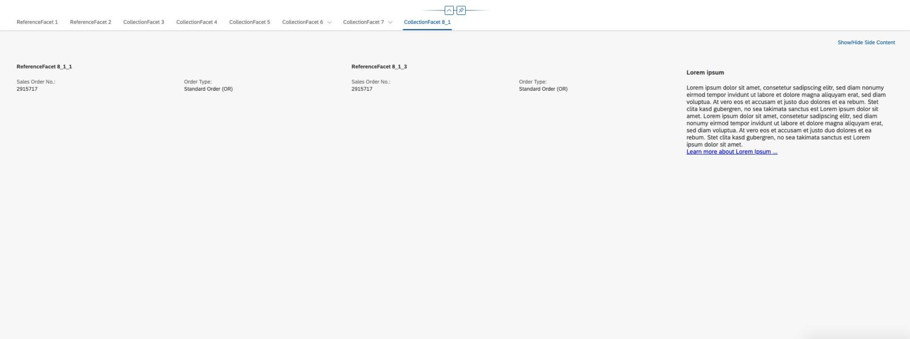
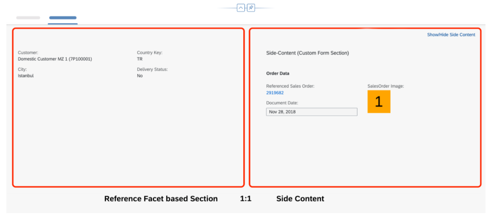

<!-- loio8e01a463d3984bfa8b23c2270d40e38c -->

# Adding Dynamic Side Content to Object Page Sections

Sometimes it might be necessary to add additional information that is not available with annotations to object page sections or subsections.

You can use extension points to add additional content to sections.

> ### Caution:  
> Use app extensions with caution and only if you cannot produce the required behavior by other means, such as manifest settings or annotations. To correctly integrate your app extension coding with SAP Fiori elements, use only the `extensionAPI` of SAP Fiori elements. For more information, see [Using the extensionAPI](using-the-extensionapi-bd2994b.md).
> 
> After you've created an app extension, its display \(for example, control placement and layout\) and system behavior \(for example, model and binding usage, busy handling\) lies within the application's responsibility. SAP Fiori elements provides support only for the official `extensionAPI` functions. Don't access or manipulate controls, properties, models, or other internal objects created by the SAP Fiori elements framework.


<a name="loio8e01a463d3984bfa8b23c2270d40e38c__section_sxm_pcn_p4b"/>

## Additional Features in SAP Fiori Elements for OData V2

You can use extension points to add additional content to sections in the following places:

-   `BeforeMainContent`: The extension is added before a sections' main content.

-   `AfterMainContent`: The extension is added after the section's main content.


Main content refers to the information that comes from the annotations.

Enter the extension information in the `manifest.json` of your application in the following format: `<Different_Scenario>|<EntitySet_Name>|<Annotation_Information_of_Subsection>`

Specify the extension facet in the form of the annotation information of the subsection where side content needs to be placed. In addition, specify the entity set name, as the same annotation may exist for various entity sets. You also need to define the `className`, `viewName`, `type`, and the optional parameter `equalSplit`.

To enable the equal split mode \(50:50 percent for main content vs. side content\), add the `"equalSplit”: true` setting to the manifest.

If `“equalSplit”` is set to `false` or is not defined, the percentage of main content and side content depends on the device on which the app is running.

> ### Sample Code:  
> ```
> "extends": {
>    "extensions": {
>          "sap.ui.viewExtensions": {
>                  "sap.suite.ui.generic.template.ObjectPage.view.Details": {
>                            "AfterMainContent|STTA_C_MP_Product|GeneralInformationForm":{
>                "className": "sap.ui.core.Fragment",
>                "fragmentName": "STTA_MP.ext.fragments.SideContentExtension",
>                "type": "XML",
> 		"equalSplit": true
>                },
> "BeforeMainContent|STTA_C_MP_Product|to_ProductSalesData::com.sap.vocabularies.UI.v1.Chart":{
>               "className": "sap.ui.core.Fragment",
>               "fragmentName": "STTA_MP.ext.fragments.SideContentExtension",
>               "type": "XML"
>                }
>                         }
>            }
>      }
> }
> 
> ```

You can specify either a view or a fragment contained in the section. You do not need to use the object page \(uxap\) tags, `ObjectPageSection`, `subSections`, or `ObjectPageSubSection`. These definitions are already part of the template for the object page view.

After you have added side content, the system displays a button in the subsection toolbar to show or hide the side content. The default texts for this button are *Show Details* or *Hide Details*. If you want to provide a custom text, specify it by adding the key value pair of the custom label to the i18n.properties file of the specific entity set of the object page. The key uniquely defines the subsection for whose side content button you provide the custom text. The structure of the key is as follows:

> ### Note:  
> In the annotation information of the subsection, replace all separators \(-- , :: etc.\) with a | \(vertical bar\) while forming the key.

-   Show the side content button

    `ShowSideContent|<EntitySet>|<Annotation Info of the Subsection>`

    Example: `ShowSideContent|STTA_C_MP_Product|to_ProductSalesData|com.sap.vocabularies.UI.v1.Chart`

     `ShowSideContent|STTA_C_MP_Product|GeneralInformationForm`

-   Hide the side content button

    `HideSideContent|<EntitySet>|<Annotation Info of the Subsection>`

    Example: `HideSideContent|STTA_C_MP_Product|to_ProductSalesData|com.sap.vocabularies.UI.v1.Chart`

    `HideSideContent|STTA_C_MP_Product|GeneralInformationForm`


   
  
**Side Content Added to the Object Page**

  

> ### Note:  
> -   Use dynamic side content for small previews. Do not consider it as an extension of the main panel's content.
> 
> -   Do not use tables in the side content panel.
> 
> -   Avoid any content that may introduce a horizontal scroll bar.
> 
> -   For better content visualization of the dynamic side content, use the 50% screen display of the dynamic side content.


<a name="loio8e01a463d3984bfa8b23c2270d40e38c__section_h42_k2n_p4b"/>

## Additional Features in SAP Fiori Elements for OData V4

You can add additional content in a flexible manner. When the side content is triggered, the main content is narrowed. The side content always comes from the right side of the app and provides the following features:

-   adding arbitrary sections via an `xmlfragment` definition

-   adding side content to sections as defined in the manifest for custom sections or facet-based sections

-   API for toggling the display of the side content \(show/hide\)


### Using the Side Content

You define the side content in the manifest as follows:

-   for custom sections: add `"sideContent"` with the `"template"` property pointing towards the content `xmlfragment` definition

-   for facet-based sections: add it in the same manner under *subSections* \> *sub-Section-key* \> *sideContent*, or under the section where there are no subsections as under *Sections* \> *section-key* \> *sideContent*


> ### Sample Code:  
> ```
> {
>    "sap.ui5": {
>       "routing": {
>          "targets": {
>             "SalesOrderManageObjectPage": {
>                "options": {
>                   "settings": {
>                      "content": {
>                         "body": {
>                            "sections": {
>                               "<section-key>": {
>                                  "sideContent": {
>                                     "template": "SalesOrder.custom.CustomSideContent"
>                                  }
>                               },
>                               "<section-key>": {
>                                  "subSections": {
>                                     "<subSection-key>": {
>                                        "sideContent": {
>                                           "template": "SalesOrder.custom.CustomSideContent",
>                                           "equalSplit": true
>                                        }
>                                     }
>                                  }
>                               }
>                            }
>                         }
>                      }
>                   }
>                }
>             }
>          }
>       }
>    }
> }
> ```


### Settings for Side Content

You can define your side content by implementing an `xmlfragment` and using the following properties:

**Properties of Side Content**


<table>
<tr>
<th valign="top">

Property Name


</th>
<th valign="top">

Supported Values


</th>
<th valign="top">

Description


</th>
</tr>
<tr>
<td valign="top">

template


</td>
<td valign="top">

"<module\_path\_to\_a\_fragment\>"


</td>
<td valign="top">

Defining the target fragment follows the syntax of defining a fragment via `Fragment.load`


</td>
</tr>
<tr>
<td valign="top">

equalSplit


</td>
<td valign="top">

true | **false**


</td>
<td valign="top">

Changes the visualization of the side content: instead of being split 1:3 / 1:2, according to responsiveness the side content is split 1:1.

For information about the layout API, see the [API Reference](https://ui5.sap.com/#/api/sap.ui.layout.DynamicSideContent).


</td>
</tr>
</table>

Bold formatting: default/fallback behavior


### Toggling Side Content via the `showSideContent` API

By default, the side content is not shown. SAP Fiori elements provides an API for the side content that enables you to toggle the side content display `(show/hide): this.showSideContent("<SideContent-Key>")`.

The `showSideContent` API accepts two parameters:

-   `"SideContent-Key"`

-   an optional Boolean value to explicitly define whether to show or hide side content


If no value for the parameter is provided, the API toggles the display.

> ### Sample Code:  
> manifest.json
> 
> ```
> {
>    "sap.ui5": {
>       "routing": {
>          "targets": {
>             "SalesOrderManageObjectPage": {
>                "options": {
>                   "settings": {
>                      "content": {
>                         "controlConfiguration": {
>                            "_Item/@com.sap.vocabularies.UI.v1.LineItem": {
>                               "actions": {
>                                  "CustomActionToggleSideContent": {
>                                  "press": "Namespace.custom.CustomSectionSideContent.toggleSideContent",
>                                  "text": "Show/Hide Side Content",
>                                  "enabled": true,
>                                  "visible": true 
>                               }
>                            }
>                         }
>                      }
>                   }
>                }
>             }
>          }
>       }
>    }
> }
> ```

For more information about defining an action, see [Adding Custom Actions Using Extension Points](adding-custom-actions-using-extension-points-7619517.md).

> ### Sample Code:  
> webapp/custom/customSectionSideContent.js
> 
> ```
> sap.ui.define([], function() {
>    "use strict";
> 
>    return {
>       toggleSideContent: function(oBindingContext) {
>          this.showSideContent("<SideContent-key>");
>       }
>    };
> });
> ```

To explicitly define that you want to display the side content, use `this.showSideContent("customerInfo", true)`.

To explicitly define that you want to hide the side content, use `this.showSideContent("customerInfo", false)`.

For information about the regular `Extension` API, see the [API Reference](https://ui5.sap.com/#/api/sap.fe.templates.ObjectPage.ExtensionAPI).


### Finding the Right Key for Sections, Subsections, and Side Content

The following table provides an overview of all possible combinations of facet nesting and how to find the right key in each scenario:

**Finding the Right Key for Sections, Subsections, and Side Content**


<table>
<tr>
<th valign="top">

Scenario


</th>
<th valign="top">

Level 0


</th>
<th valign="top">

Level 1


</th>
<th valign="top">

Level 2


</th>
<th valign="top">

Section-Key


</th>
<th valign="top">

SubSection-Key


</th>
<th valign="top">

SideContent-Key


</th>
<th valign="top">

How Side Content is Displayed


</th>
</tr>
<tr>
<td valign="top" colspan="8">

One level of nesting


</td>
</tr>
<tr>
<td valign="top">

1


</td>
<td valign="top">

Reference Facet including form \(RF\)


</td>
<td valign="top">

 


</td>
<td valign="top">

 


</td>
<td valign="top">

RF @ Level 0

\(for example: `SalesOrderItems`\)


</td>
<td valign="top">

RF @ Level 0

\(for example: `SalesOrderItems`\)


</td>
<td valign="top">

RF @ Level 0 Key

\(for example: `SalesOrderItems`\)


</td>
<td valign="top">

  


</td>
</tr>
<tr>
<td valign="top">

2


</td>
<td valign="top">

Reference Facet as Table \(T\)


</td>
<td valign="top">

 


</td>
<td valign="top">

 


</td>
<td valign="top">

RF @ Level 0


</td>
<td valign="top">

RF @ Level 0


</td>
<td valign="top">

RF @ Level 0 Key


</td>
<td valign="top">

  


</td>
</tr>
<tr>
<td valign="top">

3


</td>
<td valign="top">

Collection Facet \(CF\)


</td>
<td valign="top">

 


</td>
<td valign="top">

 


</td>
<td valign="top">

CF @ Level 0


</td>
<td valign="top">

 


</td>
<td valign="top">

 


</td>
<td valign="top">

  


</td>
</tr>
<tr>
<td valign="top">

3.1


</td>
<td valign="top">

 


</td>
<td valign="top">

RF


</td>
<td valign="top">

 


</td>
<td valign="top">

 


</td>
<td valign="top">

CF @ Level 0


</td>
<td valign="top">

CF @ Level 0 Key


</td>
<td valign="top">

 


</td>
</tr>
<tr>
<td valign="top">

4


</td>
<td valign="top">

CF


</td>
<td valign="top">

 


</td>
<td valign="top">

 


</td>
<td valign="top">

CF @ Level 0


</td>
<td valign="top">

 


</td>
<td valign="top">

 


</td>
<td valign="top">

  


</td>
</tr>
<tr>
<td valign="top">

4.1


</td>
<td valign="top">

 


</td>
<td valign="top">

T


</td>
<td valign="top">

 


</td>
<td valign="top">

 


</td>
<td valign="top">

CF @ Level 0


</td>
<td valign="top">

RF @ Level 1 Key


</td>
<td valign="top">

 


</td>
</tr>
<tr>
<td valign="top">

5


</td>
<td valign="top">

CF


</td>
<td valign="top">

 


</td>
<td valign="top">

 


</td>
<td valign="top">

CF @ Level 0


</td>
<td valign="top">

 


</td>
<td valign="top">

 


</td>
<td valign="top">

  


</td>
</tr>
<tr>
<td valign="top">

5.1/2


</td>
<td valign="top">

 


</td>
<td valign="top">

RF+RF


</td>
<td valign="top">

 


</td>
<td valign="top">

 


</td>
<td valign="top">

CF @ Level 0


</td>
<td valign="top">

CF @ Level 0 Key


</td>
<td valign="top">

 


</td>
</tr>
<tr>
<td valign="top">

5.3


</td>
<td valign="top">

 


</td>
<td valign="top">

T


</td>
<td valign="top">

 


</td>
<td valign="top">

 


</td>
<td valign="top">

 


</td>
<td valign="top">

 


</td>
<td valign="top">

 


</td>
</tr>
<tr>
<td valign="top" colspan="8">

Two levels of nesting


</td>
</tr>
<tr>
<td valign="top">

6


</td>
<td valign="top">

CF


</td>
<td valign="top">

 


</td>
<td valign="top">

 


</td>
<td valign="top">

CF @ Level 0


</td>
<td valign="top">

 


</td>
<td valign="top">

 


</td>
<td valign="top">

  


</td>
</tr>
<tr>
<td valign="top">

6.1


</td>
<td valign="top">

 


</td>
<td valign="top">

CF


</td>
<td valign="top">

 


</td>
<td valign="top">

 


</td>
<td valign="top">

 


</td>
<td valign="top">

 


</td>
<td valign="top">

 


</td>
</tr>
<tr>
<td valign="top">

6.1.1/2


</td>
<td valign="top">

 


</td>
<td valign="top">

 


</td>
<td valign="top">

RF+RF


</td>
<td valign="top">

 


</td>
<td valign="top">

CF @ Level 1


</td>
<td valign="top">

CF @ Level 1 Key


</td>
<td valign="top">

 


</td>
</tr>
<tr>
<td valign="top">

6.2


</td>
<td valign="top">

 


</td>
<td valign="top">

CF


</td>
<td valign="top">

 


</td>
<td valign="top">

 


</td>
<td valign="top">

 


</td>
<td valign="top">

 


</td>
<td valign="top">

 


</td>
</tr>
<tr>
<td valign="top">

6.2.1/2


</td>
<td valign="top">

 


</td>
<td valign="top">

 


</td>
<td valign="top">

RF+RF


</td>
<td valign="top">

 


</td>
<td valign="top">

CF @ Level 1


</td>
<td valign="top">

CF @ Level 1 Key


</td>
<td valign="top">

 


</td>
</tr>
<tr>
<td valign="top">

6.2.3


</td>
<td valign="top">

 


</td>
<td valign="top">

 


</td>
<td valign="top">

T


</td>
<td valign="top">

 


</td>
<td valign="top">

 


</td>
<td valign="top">

 


</td>
<td valign="top">

 


</td>
</tr>
<tr>
<td valign="top">

7


</td>
<td valign="top">

CF


</td>
<td valign="top">

 


</td>
<td valign="top">

 


</td>
<td valign="top">

CF @ Level 0


</td>
<td valign="top">

 


</td>
<td valign="top">

 


</td>
<td valign="top">

  


</td>
</tr>
<tr>
<td valign="top">

7.1


</td>
<td valign="top">

 


</td>
<td valign="top">

T


</td>
<td valign="top">

 


</td>
<td valign="top">

 


</td>
<td valign="top">

RF @ Level 1


</td>
<td valign="top">

RF @ Level 1 Key


</td>
<td valign="top">

 


</td>
</tr>
<tr>
<td valign="top">

7.2


</td>
<td valign="top">

 


</td>
<td valign="top">

CF


</td>
<td valign="top">

 


</td>
<td valign="top">

 


</td>
<td valign="top">

 


</td>
<td valign="top">

 


</td>
<td valign="top">

 


</td>
</tr>
<tr>
<td valign="top">

7.2.1


</td>
<td valign="top">

 


</td>
<td valign="top">

 


</td>
<td valign="top">

RF


</td>
<td valign="top">

 


</td>
<td valign="top">

CF @ Level 1


</td>
<td valign="top">

CF @ Level 1 Key


</td>
<td valign="top">

 


</td>
</tr>
<tr>
<td valign="top">

8


</td>
<td valign="top">

\(CF - ignored\)


</td>
<td valign="top">

 


</td>
<td valign="top">

 


</td>
<td valign="top">

 


</td>
<td valign="top">

 


</td>
<td valign="top">

 


</td>
<td valign="top">

\- not displayed -


</td>
</tr>
<tr>
<td valign="top">

8.1


</td>
<td valign="top">

 


</td>
<td valign="top">

CF


</td>
<td valign="top">

 


</td>
<td valign="top">

CF @ Level 1


</td>
<td valign="top">

 


</td>
<td valign="top">

 


</td>
<td valign="top">

  


</td>
</tr>
<tr>
<td valign="top">

8.1.1


</td>
<td valign="top">

 


</td>
<td valign="top">

 


</td>
<td valign="top">

RF


</td>
<td valign="top">

 


</td>
<td valign="top">

CF @ Level 1


</td>
<td valign="top">

CF @ Level 1 Key


</td>
<td valign="top">

 


</td>
</tr>
</table>

> ### Tip:  
> Scenario 4.1 differs: while for all other scenarios the `SubSection-Key` and the `SideContent-Key` are similar, here they differ.


### The Equal Split Functionality

The `equalSplit` property changes the visualization of the side content. It changes the aspect ratio of the section content in comparison to the side content. The following images show the UI without equal split mode and with equal split mode turned on:

  

  

