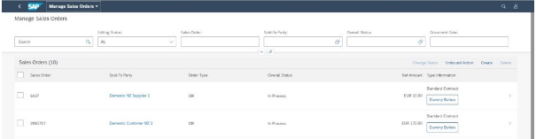

<!-- loiod318e423c7c14c98957fe0642b6fcf49 -->

# Adding Multiple Fields to One Column in Responsive Tables

You can add multiple IDs, descriptions, and action buttons to one column in a responsive table.


To include these items, the `UI.FieldGroup` needs to be referred to in the `UI.LineItem` annotation. The `UI.FieldGroup` then contains a collection of annotations that can be grouped together semantically.

The `FieldGroup` below contains the fields that are displayed in the same column.

> ### Sample Code:  
> XML Annotation
> 
> ```xml
> <Annotation Term="UI.FieldGroup" Qualifier="FieldGroup1">
>     <Record>
>         <PropertyValue Property="Data">
>             <Collection>
>                 <Record Type="UI.DataField">
>                     <PropertyValue Property="Value" Path="ContractType"/>
>                 </Record>
>                 <Record Type="UI.DataFieldForAction">
>                     <PropertyValue Property="Label" String="Dummy Button"/>
>                     <PropertyValue Property="Action" String="com.sap.gateway.srvd.sadl_gw_appmusicdr_definition.v0001.SOME_ACTION_2"/>
>                 </Record>
>             </Collection>
>         </PropertyValue>
>     </Record>
> </Annotation>
> ```

> ### Sample Code:  
> ABAP CDS Annotation
> 
> ```
> 
> @UI.fieldGroup: [
>   {
>     value: 'CONTRACTTYPE',
>     type: #STANDARD,
>     position: 1 ,
>     qualifier: 'FieldGroup1'
>   }
> ]
> CONTRACTTYPE;
> 
> @UI.fieldGroup: [
>   {
>     label: 'Dummy Button',
>     dataAction: 'PUSHDOWN:com.sap.gateway.srvd.sadl_gw_appmusicdr_definition.v0001.SOME_ACTION_2',
>     type: #FOR_ACTION,
>     position: 2 ,
>     qualifier: 'FieldGroup1'
>   }
> ]
> contractname;
> ```

> ### Sample Code:  
> CAP CDS Annotation
> 
> ```
> 
> UI.FieldGroup #FieldGroup1 : {
>     Data : [
>         {
>             $Type : 'UI.DataField',
>             Value : ContractType
>         },
>         {
>             $Type : 'UI.DataFieldForAction',
>             Label : 'Dummy Button',
>             Action : 'com.sap.gateway.srvd.sadl_gw_appmusicdr_definition.v0001.SOME_ACTION_2'
>         }
>     ]
> }
> 
> ```

The `UI.LineItem` that includes the `UI.FieldGroup` shown above looks like this \(second `DataField`\):

> ### Sample Code:  
> XML Annotation
> 
> ```xml
> <Annotation Term="UI.LineItem">
>     <Collection>
>         …………
>         …………
>         <Record Type="UI.DataFieldForAnnotation">
>             <PropertyValue Property="Target" AnnotationPath="@UI.FieldGroup#FieldGroup1" />
>             <PropertyValue Property="Label" String="Type Information"/>
>         </Record>
>         …………
>         …………
>     </Collection>
> </Annotation>
> ```

> ### Sample Code:  
> ABAP CDS Annotation
> 
> ```
> 
> @UI.lineItem: [
>   {
>     label: 'Type Information',
>     type: #AS_FIELDGROUP,
>     valueQualifier: 'FieldGroup1'
>   }
> ]
> producttype;
> ```

> ### Sample Code:  
> CAP CDS Annotation
> 
> ```
> 
> UI.LineItem : [
>     {
>         $Type : 'UI.DataFieldForAnnotation',
>         Target : '@UI.FieldGroup#FieldGroup1',
>         Label : 'Type Information'
>     }
> ]
> ```

You can use the following annotations in `UI.FieldGroup`:

-   `UI.DataField`

-   `UI.DataFieldForAction`

-   `UI.DataFieldForIntentBasedNavigation`

-   `UI.DataFieldForAnnotation`

    -   `Communication.Contact`

    -   `UI.Visualization/Rating`

    -   `UI.Visualization/Progress`


The result looks like this:

   
  
**Multiple IDs, Descriptions, and Action Buttons in a Table Column**

  


<a name="loiod318e423c7c14c98957fe0642b6fcf49__section_cbr_wwb_2nb"/>

## Restrictions

Take the following restrictions into account when implementing this feature:

-   In SAP Fiori elements for OData V2, when using the export to Microsoft Excel feature, only the first field of the semantically connected column is exported, that is, the first visible field in the table column.

-   In SAP Fiori elements for OData V4, when using the export to Microsoft Excel feature, none of the fields of the semantically connected fields are exported.
-   When using table personalization, users can only filter, sort, and group the semantically connected column based on the individual properties \(of the same entity type as the `UI.LineItem`\) mentioned in the `UI.FieldGroup` collection.

    Example: Height and weight are two properties which are semantically connected. The name of the column header is *Combined*. In this case, in the personalization, you cannot filter, sort, and group on *Combined*. You can only filter, sort, and group on individual properties like height and weight.


<a name="loiod318e423c7c14c98957fe0642b6fcf49__section_exs_1xb_2nb"/>

## Additional Features in SAP Fiori Elements for OData V2

You can use the following annotations in `UI.FieldGroup`:

-   `UI.DataFieldWithNavigationPath`

-   `UI.DataFieldForAnnotation`

    -   `UI.Chart`


> ### Note:  
> For the fields contained in the `FieldGroup` shown above: If a property and its corresponding `sap:text` property are shown in the same column, the `TextArrangement` annotation is not applicable for this field. In this case, the default is `idOnly`. In all other cases, the `textArrangement` annotation can be defined to show the ID and the description in the table column.

