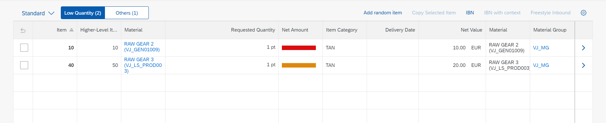

<!-- loio5532c899e6e94137b18b8ee68df12efb -->

# Adding Segmented Buttons to a Table Toolbar

You can add segmented buttons to the toolbar, to enable switching between the table content using a selection variant annotation.

You can associate every button of the segmented buttons \(or every list item in the select box\) with a selection variant that filters the table according to the selection variant filters once a user has clicked it. This means that the user has multiple views in a single table of the object page. You can enable this feature for any table on the object page.

To implement this feature, make a `"quickVariantSelection"` entry in the manifest. See the separate sections below for further details.


You can define a simple or a complex filter condition inside the `SelectionVariant`. While the simple condition has only one property in the `SelectionVariant`, the complex filter condition can have more than one property to be filtered.

The annotations defined in the variants are:

> ### Sample Code:  
> XML Annotation
> 
> ```xml
> <Annotation Term="UI.SelectionVariant" Qualifier="SimpleFilter">
>       <Record>
>          <PropertyValue Property="Text" String="Tax amount less than 10 USD" />
>          <PropertyValue Property="SelectOptions">
>             <Collection>
>                <Record Type="UI.SelectOptionType">
>                   <PropertyValue Property="PropertyName" PropertyPath="tax_amount" />
>                   <PropertyValue Property="Ranges">
>                      <Collection>
>                         <Record Type="UI.SelectionRangeType">
>                            <PropertyValue Property="Sign" EnumMember="UI.SelectionRangeSignType/I" />
>                            <PropertyValue Property="Option" EnumMember="UI.SelectionRangeOptionType/LT" />
>                            <PropertyValue Property="Low" String="10" />
>                         </Record>
>                      </Collection>
>                   </PropertyValue>
>                </Record>
>             </Collection>
>          </PropertyValue>
>       </Record>
>    </Annotation>
>    <Annotation Term="UI.SelectionVariant" Qualifier="ComplexFilter">
>       <Record>
>          <PropertyValue Property="Text" String="Net Amount between 10 and 40 And Gross Amount Less than 100 USD" />
>          <PropertyValue Property="SelectOptions">
>             <Collection>
>                <Record Type="UI.SelectOptionType">
>                   <PropertyValue Property="PropertyName" PropertyPath="net_amount" />
>                   <PropertyValue Property="Ranges">
>                      <Collection>
>                         <Record>
>                            <PropertyValue Property="Sign" EnumMember="com.sap.vocabularies.UI.v1.SelectionRangeSignType/I" />
>                            <PropertyValue Property="Option" EnumMember="UI.SelectionRangeOptionType/BT" />
>                            <PropertyValue Property="Low" String="10" />
>                            <PropertyValue Property="High" String="40" />
>                         </Record>
>                      </Collection>
>                   </PropertyValue>
>                </Record>
>                <Record Type="UI.SelectOptionType">
>                   <PropertyValue Property="PropertyName" PropertyPath="gross_amount" />
>                   <PropertyValue Property="Ranges">
>                      <Collection>
>                         <Record Type="UI.SelectionRangeType">
>                            <PropertyValue Property="Option" EnumMember="UI.SelectionRangeOptionType/LT" />
>                            <PropertyValue Property="Sign" EnumMember="UI.SelectionRangeSignType/I" />
>                            <PropertyValue Property="Low" String="100" />
>                         </Record>
>                      </Collection>
>                   </PropertyValue>
>                </Record>
>             </Collection>
>          </PropertyValue>
>       </Record>
>    </Annotation>
> 
> ```

> ### Sample Code:  
> ABAP CDS Annotation
> 
> ```
> 
> @UI.selectionVariant: [
>   {
>     text: 'Tax amount less than 10 USD',
>     qualifier: 'SimpleFilter'
>   }
> ]
> 
> @UI.selectionVariant: [
>   {
>     text: 'Net Amount between 10 and 40 And Gross Amount Less than 100 USD',
>     qualifier: 'ComplexFilter'
>   }
> ]
> ```

> ### Sample Code:  
> CAP CDS Annotation
> 
> ```
> 
> UI.SelectionVariant #SimpleFilter : {
>     Text : 'Tax amount less than 10 USD',
>     SelectOptions : [
>         {
>             $Type : 'UI.SelectOptionType',
>             PropertyName : tax_amount,
>             Ranges : [
>                 {
>                     $Type : 'UI.SelectionRangeType',
>                     Sign : #I,
>                     Option : #LT,
>                     Low : '10'
>                 }
>             ]
>         }
>     ]
> },
> UI.SelectionVariant #ComplexFilter : {
>     Text : 'Net Amount between 10 and 40 And Gross Amount Less than 100 USD',
>     SelectOptions : [
>         {
>             $Type : 'UI.SelectOptionType',
>             PropertyName : net_amount,
>             Ranges : [
>                 {
>                     Sign : #I,
>                     Option : #BT,
>                     Low : '10',
>                     High : '40'
>                 }
>             ]
>         },
>         {
>             $Type : 'UI.SelectOptionType',
>             PropertyName : gross_amount,
>             Ranges : [
>                 {
>                     $Type : 'UI.SelectionRangeType',
>                     Option : #LT,
>                     Sign : #I,
>                     Low : '100'
>                 }
>             ]
>         }
>     ]
> }
> 
> 
> ```

> ### Note:  
> If the `SelectionVariant` has multiple `<SelectionOptionType>`, filters that have the same target property are combined with an OR condition. Filters that have different target properties are combined with an AND condition.

The table containing the segmented buttons looks like this:

  
  
**Segmented button 1 selected**

  

  
  
**Segmented button 2 selected**

  

> ### Note:  
> When the table is initially loaded, two calls are made to determine the number of the records in the table. These are shown in the button text.
> 
> In SAP Fiori elements for OData V2, setting `showCounts` to `false` will not show the number in the button text. This means that in this case no count calls are made.
> 
> In SAP Fiori elements for OData V4, `showCounts` is set to `false` by default.


<a name="loio5532c899e6e94137b18b8ee68df12efb__section_wyn_r1c_2nb"/>

## Additional Features in SAP Fiori Elements for OData V2

Every variant corresponds to its filter on the UI. A segmented button is rendered when the number of variants defined is less than or equal to 3. Defining 4 or more variants in the manifest renders a selection box.

The following manifest settings are required for adding segmented buttons:

> ### Sample Code:  
> ```
> "component": {
>   "name": "sap.suite.ui.generic.template.ObjectPage",
>   "settings": {
>  
>     "sections": {
>       "SalesOrderItemsID": {
>         "navigationProperty": "to_Item",
>         "entitySet": "C_STTA_SalesOrderItem_WD_20",
>         "createMode": "inline",
>         "quickVariantSelection": {
>           "showCounts": true,
>           "variants": {
>             "0": {
>               "key": "_tab2",
>               "annotationPath": "com.sap.vocabularies.UI.v1.SelectionVariant#SimpleFilter"
>             },
>             "1": {
>               "key": "_tab3",
>               "annotationPath": "com.sap.vocabularies.UI.v1.SelectionVariant#ComplexFilter"
>             }
>           }
>         }
>       }
>     },
>     "showRelatedApps": true
>   }
> }
> 
> ```

To show the number of records available next to the title of the segmented button, set `showCounts` to `true`.


<a name="loio5532c899e6e94137b18b8ee68df12efb__section_lym_v1c_2nb"/>

## Additional Features in SAP Fiori Elements for OData V4

Every `"paths"` entry corresponds to its filter on the UI. A segmented button is rendered when the number of variants defined is less than or equal to 3. Defining 4 or more variants in the manifest renders a selection box.

The following manifest settings are required for adding segmented buttons:

> ### Sample Code:  
> ```
> "SalesOrderManageObjectPage": {
> 	"type": "Component",
> 	"id": "SalesOrderManageObjectPage",
> 	"name": "sap.fe.templates.ObjectPage",
> 	"options": {
> 		"settings": {
> 			"entitySet": "SalesOrderManage",
> 			"navigation": {
> 	           ...
> 			},
> 			"controlConfiguration": {
> 				"_Item/@com.sap.vocabularies.UI.v1.LineItem": {
> 					"tableSettings": {
> 						"type": "GridTable",
> 						"quickVariantSelection": {
> 							"paths": [
> 								{
> 									"annotationPath": "com.sap.vocabularies.UI.v1.SelectionVariant#SimpleFilter"
> 								},
> 								{
> 									"annotationPath": "com.sap.vocabularies.UI.v1.SelectionVariant#ComplexFilter"
> 								}
> 							],
> 							"showCounts": true,
> 							"hideTableTitle": true
> 						},
> 	                  ...
> 					}
> 				}
> 			}
> 		}
> 	}
> }
> ```

To show the number of records available next to the title of the segmented button, set `showCounts` to `true`.

To hide the title of the table and show only the segmented buttons or the `selectionBox`, set the `hideTableTitle` to `true`. You should use this option only if the title of your `SelectionVariant` is self-explanatory and can replace the table title.

**Related Information**  


[Defining Multiple Views on a List Report Table - Single Table Mode](defining-multiple-views-on-a-list-report-table-single-table-mode-0d390fe.md "You can define multiple views of a table and display them in single table mode. Users can switch between views using a segmented button.")

