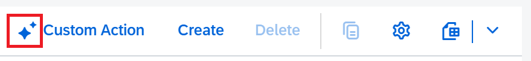

<!-- loio3ad04527971c4641a85d232fde076747 -->

<link rel="stylesheet" type="text/css" href="../css/sap-icons.css"/>

# Adding the AI Icon to Action Buttons

You can add an icon to indicate that a button is related to an AI action.

> ### Note:  
> You must use the <span class="SAP-icons-V5"></span>\(*AI*\) icon for all buttons that are related to AI actions. In addition to that, provide transparency when using AI during processing of personal data.

The <span class="SAP-icons-V5"></span>\(*AI*\) icon is displayed before the text on the button, as shown in the following screenshot:

  
  
**AI Icon on a Button**



> ### Restriction:  
> -   You can only add the <span class="SAP-icons-V5"></span>\(*AI*\) icon to buttons created using the `UI.DataFieldForAction` or `UI.DataFieldForActionGroup` annotation.
> 
> -   You can't add the <span class="SAP-icons-V5"></span>\(*AI*\) icon to inline action buttons.

You can add the icon using any of the following:

-   The `manifest.json` file

-   Local annotations


> ### Note:  
> -   If settings have been applied using the `manifest.json` file, they override the settings applied using local annotations.
> 
> -   To add the icon to a button created using the `UI.DataFieldForActionGroup` annotation, use local annotations.
> 
> 
> If settings have been applied using the `manifest.json` file, they override the settings applied using local annotations.


<a name="loio3ad04527971c4641a85d232fde076747__section_tyh_cf5_2fc"/>

## Adding the AI Icon Using the `manifest.json` File

To add the <span class="SAP-icons-V5"></span>\(*AI*\) icon to a button, set `isAIOperation` to `true`, as shown in the following sample code:

> ### Sample Code:  
> `manifest.json`
> 
> ```json
> {
>     ...
>     "sap.ui5": {
>         ...
>         "routing": {
>             "targets": {
>                 "ListReportExample": {
>                     "type": "Component",
>                     "name": "sap.fe.templates.ListReport",
>                     "id": "ListReportExample",
>                     "options": {
>                         "settings": {
>                             ...
>                             "controlConfiguration": {
>                                 "@com.sap.vocabularies.UI.v1.LineItem": {
>                                     "actions": {
>                                         "TableCustomAction": {
>                                             "text": "Custom Action",
>                                             "press": "sap.fe.core.ActionAllAreas.AnnotationUnboundAction",
>                                             "isAIOperation": true
>                                         }
>                                     }
>                                 }
>                             }
>                             ...
>                         }
>                     }
>                 }
>             }
>         }
>         ...
>     }
> }
>    
> ```


<a name="loio3ad04527971c4641a85d232fde076747__section_dv1_gf5_2fc"/>

## Adding the AI Icon Using Local Annotations

To add the <span class="SAP-icons-V5"></span> \(*AI*\) icon to a button, use the `UI.DataFieldForAction` annotation as shown in the following sample code:

> ### Sample Code:  
> XML Annotation
> 
> ```xml
> <Record Type="UI.DataFieldForAction">
>     <PropertyValue Property="ID" String="AIActionChart" />
>     <PropertyValue Property="Label" String="AI Action" />
>     <PropertyValue Property="Action" String="com.c_salesordermanage_sd_aggregate.EntityContainer/AIUnboundAction" />
> </Record>
> 
> <Action Name="AIUnboundAction" IsBound="false">
>     <ReturnType Type="com.c_salesordermanage_sd_aggregate.SalesOrderManage" />
> </Action>
> 
> <Annotations Target="com.c_salesordermanage_sd_aggregate.AIUnboundAction()">
>     <Annotation Term="UI.IsAIOperation" bool="true" />
> </Annotations>
> ```

> ### Sample Code:  
> ABAP CDS Annotation
> 
> ABAP CDS does not support `UI.IsAIOperation`. Use the local XML annotation.

> ### Sample Code:  
> CAP CDS Annotation
> 
> ```
> namespace sap.fe.core;
> 
> annotate ActionAllAreas.RootElement with @UI: {
>   FieldGroup #GeneralInformation: {
>     Label: 'General Information',
>     Data : [
>       {
>         $Type : 'UI.DataFieldForAction',
>         Label : 'Annotation Action',
>         Action: 'sap.fe.core.ActionAllAreas.AnnotationAction',
>       }
>     ]
>   },
> 
>   Identification                : [{
>     $Type : 'UI.DataFieldForAction',
>     Label : 'Annotation Action',
>     Action: 'sap.fe.core.ActionAllAreas.AnnotationAction',
>   }
> }
> 
> service ActionAllAreas {
>   @odata.draft.enabled
>   entity RootElement as projection on core.RootElement actions {
>                           @cds.odata.bindingparameter.name: 'self'
>                           @UI.IsAIOperation               : true
>                           action AnnotationAction()                   returns RootElement;
>                         }
> }
> ```
> 
> To add the icon to a button created using the `UI.DataFieldForActionGroup` annotation, set `UI.DataFieldForAction` to `true` for all its child elements.

