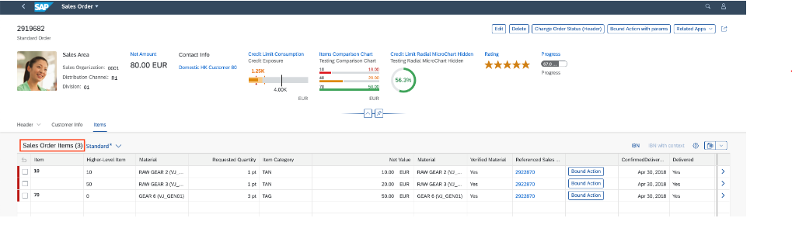

<!-- loiod9a45394165e439595cf0006924b6996 -->

# Adding Titles to Object Page Tables

You can add a title to an object page table.

To add a title to an object page table, provide a string value to the `TypeNamePlural` property of the `UI.HeaderInfo` annotation for the entity type with which the table is associated.


> ### Sample Code:  
> XML Annotation
> 
> ```xml
> <Annotations Target="STTA_PROD_MAN.STTA_C_MP_ProductTextType">
>       <Annotation Term="UI.HeaderInfo">
>           <Record>
>               <PropertyValue Property="TypeName" String="Product Text" />
>               <PropertyValue Property="TypeNamePlural" String="{@i18n>@TableTitle}" />
>               <PropertyValue Property="Title">
>                     <Record Type="UI.DataField">
>                            <PropertyValue Property="Value" Path="Name" />
>                     </Record>
>               </PropertyValue>
>              <PropertyValue Property="Description">
>                     <Record Type="UI.DataField">
>                         <PropertyValue Property="Value" Path="Language" />
>                     </Record>
>              </PropertyValue>
>        </Record>
>  </Annotation>
> ```

> ### Sample Code:  
> ABAP CDS Annotation
> 
> ```
> 
> @UI.headerInfo: {
>   typeName: 'Product Text',
>   typeNamePlural: '{@i18n>@TableTitle}',
>   title: {
>     value: 'NAME',
>     type: #STANDARD
>   },
>   description: {
>     value: 'LANGUAGE',
>     type: #STANDARD
>   }
> }
> annotate view STTA_C_MP_PRODUCTTEXT with {
> 
> }
> 
> ```

> ### Sample Code:  
> CAP CDS Annotation
> 
> ```
> 
> annotate STTA_PROD_MAN.STTA_C_MP_ProductType @(
>   UI.HeaderInfo : {
>     TypeName : 'Product Text',
>     TypeNamePlural : '{@i18n>@TableTitle}',
>     Title : {
>         $Type : 'UI.DataField',
>         Value : Name
>     },
>     Description : {
>         $Type : 'UI.DataField',
>         Value : Language
>     }
>   }
> );
> 
> 
> ```

Take the following into account:

-   `TypeNamePlural` is a mandatory parameter.

-   If the `UI.HeaderInfo` annotation hasn't been entered, the table title is also not displayed.

-   Make sure you provide the appropriate section titles if the same string is maintained under `TypeNamePlural` in the `UI.HeaderInfo` annotation.


The results look like this:

  
  
**Title for single table in object page section**



> ### Note:  
> If a section or a subsection has only one type of control \(table or chart\), then the title of the section or subsection is hidden and is set as the control title.
> 
> Sections with tables or charts, whether custom or embedded, can choose to hide the section title and set it as the title for the table or chart.
> 
> For more information about setting section title to the control within reuse component , see [Placing Reuse Component Instances on the Object Page](placing-reuse-component-instances-on-the-object-page-1ba7f88.md).
> 
> For more information about setting section title to the control within custom section, see [Adding a Section to an Object Page](adding-a-section-to-an-object-page-a357047.md).

