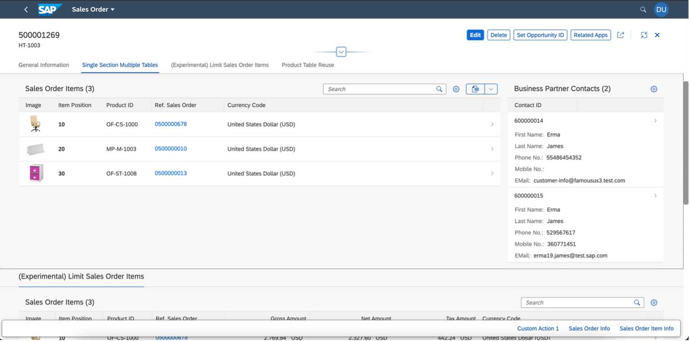
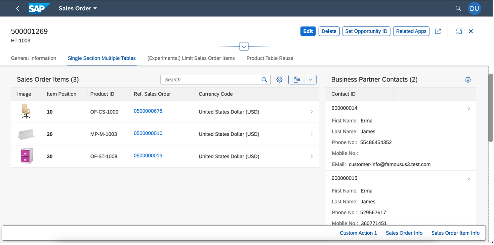
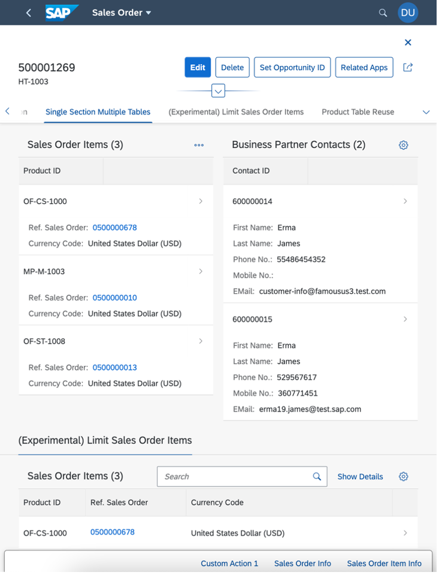
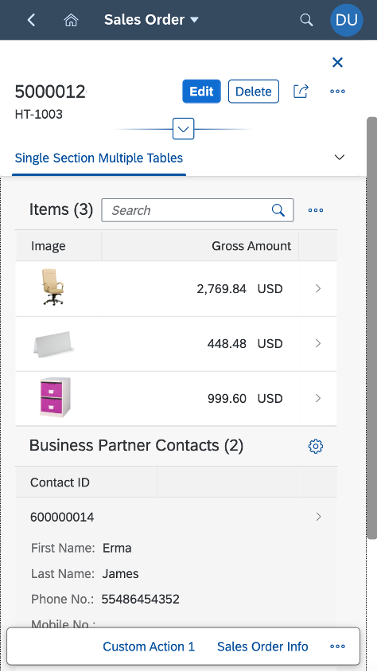

<!-- loio17564c2b77234ce69a88511b03d369f9 -->

# Adding Two Tables in a Subsection

You can add two tables adjacent to each other in a subsection of an object page.

> ### Note:  
> This topic is currently only applicable to SAP Fiori elements for OData V2.

To achieve this, add the annotations as shown below:

> ### Sample Code:  
> ```
> 
> <Record Type="UI.CollectionFacet">
>    <PropertyValue Property="Label" String="Single Section Multiple Tables" />
>    <PropertyValue Property="ID" String="MultiTable" />
>    <PropertyValue Property="Facets">
>       <Collection>
>          <Record Type="UI.ReferenceFacet">
>             <PropertyValue Property="Label" String="Sales Order Items" />
>             <PropertyValue Property="ID" String="SalesOrderItemsID" />
>             <PropertyValue Property="Target" AnnotationPath="to_Item/@UI.LineItem#SalesOrderItem" />
>             <Annotation Term="UI.Importance" EnumMember="UI.ImportanceType/High" />
>          </Record>
>          <Record Type="UI.ReferenceFacet">
>             <PropertyValue Property="Label" String="Contacts" />
>             <PropertyValue Property="ID" String="ContactsID" />
>           <PropertyValue Property="Target" AnnotationPath="to_BPAContact/@UI.LineItem" />
>             <Annotation Term="UI.Importance" EnumMember="UI.ImportanceType/High" />
>          </Record>
>       </Collection>
>    </PropertyValue>
> </Record>
> 
> ```


<a name="loio17564c2b77234ce69a88511b03d369f9__section_fp3_1k1_z4b"/>

## Space Occupied by Tables Based on the Screen Size

Depending on the available container/screen size, the two tables adjust their respective widths as follows:

-   For extra large \(XL\) container/screen size, for example, large desktops, the first table occupies 75% and the second table occupies 25% of the space.

    

-   For large \(L\) container/screen size, for example, desktops, the first table occupies 66.66% and the second table occupies 33.33% of the space.

    

-   For medium \(M\) container/screen size, for example, tablets, the first table and the second table occupy 50% each of the space.

    

-   For small \(S\) container/screen size, for example, mobiles, the tables appear one below the other.

    


