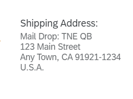

<!-- loio9eb3aaecc09b431ca27f97eb1ee5d861 -->

# Address Facet in Sections

If you add a `UI.ReferenceFacet` that points to an address annotation, an address facet is displayed in the object page sections or in a quick view.

> ### Note:  
> This topic is currently only applicable to SAP Fiori elements for OData V2.

It shows the label of the `UI.ReferenceFacet` and, below, only the label property of the address annotation. Therefore, the label property should contain the whole formatted address, with \\n for new lines.

> ### Note:  
> Other properties of the address annotation are not interpreted and rendered.

Example value for the label property: "Mail Drop: TNE QB\\n123 Main Street\\nAny Town, CA 91921-1234\\nU.S.A.". This is shown as follows:

  

The address facet can be used in various places:


### As a separate section

> ### Sample Code:  
> XML Annotation
> 
> ```xml
> <Record Type="UI.ReferenceFacet">
>    <PropertyValue Property="Label" String="Communication Address" />
>    <PropertyValue Property="Target" AnnotationPath="to_Address/@Communication.Address" />
> </Record>
> 
> ```

> ### Sample Code:  
> ABAP CDS Annotation
> 
> ```
> 
> @UI.facet: [
>  {
>   label: 'Communication Address',
>   type: #ADDRESS_REFERENCE,
>   targetElement: '_Address',
>   purpose: #STANDARD
>  }
> ]  
> ```

> ### Sample Code:  
> CAP CDS Annotation
> 
> ```
> 
> {
>     $Type : 'UI.ReferenceFacet',
>     Label : 'Communication Address',
>     Target : 'to_Address/@Communication.Address'
> }
> ```


### As part of a field group within a section and in a quick view with smart link navigation

> ### Sample Code:  
> XML Annotation
> 
> ```xml
> <Annotation Term="UI.FieldGroup" Qualifier="GeneralInformation">
>    <Record>
>       <PropertyValue Property="Data">
>          <Collection>
>             <Record Type="UI.DataFieldForAnnotation">
>                <PropertyValue Property="Label" String="Communication Address" />
>                <PropertyValue Property="Target" AnnotationPath="to_Address/@Communication.Address"/>
>             </Record>
>          </Collection>
>       </PropertyValue>
>       <PropertyValue Property="Label" String="Product Information"/>
>    </Record>
> </Annotation>
> 
> ```

> ### Sample Code:  
> ABAP CDS Annotation
> 
> ```
> 
> @UI.fieldGroup: [
>   {
>     label: 'Communication Address',
>     value: '_ADDRESS',
>     type: #AS_ADDRESS,
>     qualifier: 'GeneralInformation',
>     groupLabel: 'Product Information'
>   }
> ]
> _ADDRESS;
> ```

> ### Sample Code:  
> CAP CDS Annotation
> 
> ```
> 
> UI.FieldGroup #GeneralInformation : {
>     Data : [
>         {
>             $Type : 'UI.DataFieldForAnnotation',
>             Label : 'Communication Address',
>             Target : 'to_Address/@Communication.Address'
>         }
>     ],
>     Label : 'Product Information'
> }
> 
> ```

**Related Information**  


[Enabling Quick Views for Link Navigation](enabling-quick-views-for-link-navigation-307ced1.md "You can enrich the popovers for link navigation with additional information to display quick views.")

