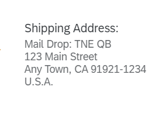

<!-- loio34f717536a5441e7a9170944a8cddd73 -->

# Address Facet in the Object Page Header

You can add an address facet to the object page header.

> ### Note:  
> For information about SAP Fiori elements for OData V4, see [Address Facet in the Object Page Header](address-facet-in-the-object-page-header-0b73cbb.md).

To display an address facet in the object page header, add a `UI.ReferenceFacet` that points to an address annotation. The address facet shows the label of the `UI.ReferenceFacet` and, below, only the label property of the address annotation. This is why the label property needs to contain the whole formatted address, with `\n` for new lines.

> ### Note:  
> Other properties of the address annotation are not interpreted and rendered.

For example, the value for the label property `Mail Drop: TNE QB\n123 Main Street\nAny Town, CA 91921-1234\nU.S.A.` is shown as follows:




> ### Sample Code:  
> XML Annotation
> 
> ```xml
> 
> <Record Type="UI.ReferenceFacet">
>     <PropertyValue Property="Label" String="Shipping Address"/>
>     <PropertyValue AnnotationPath="@Communication.Address" Property="Target"/>
> </Record>
> 
> ```

> ### Sample Code:  
> ABAP CDS Annotation
> 
> ```
> 
> @UI.facet: [
>  {
>   label: 'Shipping Address',
>   type:         #AS_ADDRESS,
>   purpose: #STANDARD
>  }
> ]
> product;
> ```

> ### Sample Code:  
> CAP CDS Annotation
> 
> ```
> 
> {
>     $Type : 'UI.ReferenceFacet',
>     Label : 'Shipping Address',
>     Target : '@Communication.Address'
> }
> ```

