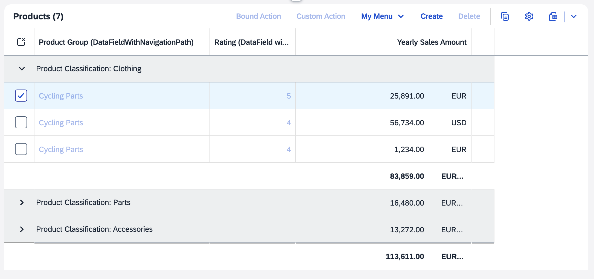
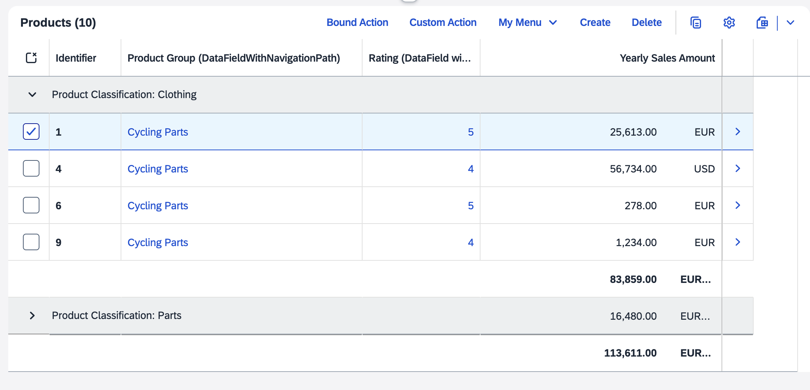

<!-- loiod230e371357b402fba3c3af8dfd0538e -->

# Aggregation Based on Visible Properties

Aggregation based on visible properties optimizes analytical table performance by limiting data aggregation to only displayed columns in SAP Fiori elements for OData V4. Use this feature with large datasets to reduce unnecessary back-end requests for key properties that aren't relevant to the current view.

In scenarios where analytical tables display large datasets with numerous columns, you can optimize performance and improve user experience by limiting data aggregation to only the columns that are visible to the user. This is particularly useful when an entity contains many key properties that are not relevant for the current view, but would otherwise be included in back-end requests and aggregation calculations.

By default, an analytical table requests all key properties for the displayed entity even if these properties are not displayed within the table. To display aggregation based solely on visible columns, configure the `aggregationOnLeafLevel` flag in the `manifest.json` file as shown in the following sample code:

> ### Sample Code:  
> `manifest.json`
> 
> ```
> "controlConfiguration": {
>     "@com.sap.vocabularies.UI.v1.LineItem": {
>         "tableSettings": {
>             "type": "AnalyticalTable",
>             "analyticalConfiguration": {
>                 "aggregationOnLeafLevel": true
>             },
>             "personalization": true
>         }
>     }
> }
> ```

When `aggregationOnLeafLevel` is set to `true`, any navigation or bound actions are enabled only if all key properties of the entity are displayed in the table. If the missing key properties are added through the table settings, both the navigation and the bound actions are enabled.

> ### Note:  
> If the `rowPress` event is overridden at the table level, the navigation indicator is still displayed even when `aggregationOnLeafLevel` is set to `true`.

In the following screenshots, *Identifier* is a key property:



In the previous example, the *Identifier* column is not displayed in the table, so navigation and bound actions are disabled.



In the previous example, the *Identifier* column is displayed in the table, so navigation and bound actions are enabled.

> ### Restriction:  
> Analytical tables don't support navigation properties, so if you include them through a `LineItem`, an empty column is displayed. You also can't add navigation properties through the table personalization settings.

