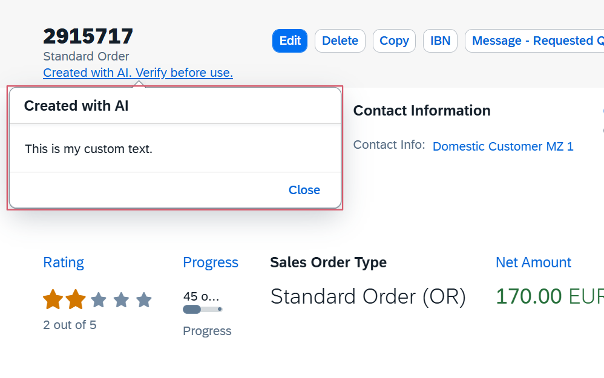

<!-- loio10a6cda6215e4cad9922a615e7f94341 -->

# AI Notice

You must use the AI notice to show that the page contains content generated by AI.

The AI notice allows users to make an informed decision regarding the handling of AI-generated data

> ### Note:  
> You must also provide documentation to users that explains your AI features and the process behind them to ensure transparency.

You can configure the AI notice that is placed on the header by using the `aiNotice` manifest setting.

The notice is displayed as one of the following options:

-   A link if `contentFragment` or `ContentText` is set. These keys configure what is displayed in the related popover. The `contentFragment` is used to load an entire fragment, whereas the property `ContentText` displays only the text that is set in the `manifest.json` file.
-   A label if content is not configured for the popover.

The following screenshot shows the AI notice displayed as a link:

  
  
**AI Notice as a Link**



To configure the AI notice, you must add the notice configuration to the header in the `manifest.json` file as shown in the following sample code:

> ### Sample Code:  
> `manifest.json` with a Fragment
> 
> ```
> "MyObjectPage":{
>     "type": "Component",
>     "id": "MyObjectPage",
>     "name": "sap.fe.templates.ObjectPage",
>     "options":{
>         "settings":{
>             "content": {
>                 "header": {
>                     "aiNotice": {
>                         "visible": "{= %{SalesOrder} === '2915717'}",
>                         "contentFragmentName": "myApp.CustomContentAiNotice"
>                     }
>                 }
>             }
>         }
>     }
> }
> 
> ```

> ### Sample Code:  
> `manifest.json` with Text
> 
> ```
> "MyObjectPage":{
>     "type": "Component",
>     "id": "MyObjectPage",
>     "name": "sap.fe.templates.ObjectPage",
>     "options":{
>         "settings":{
>             "content": {
>                 "header": {
>                     "aiNotice": {
>                         "visible": "{= %{SalesOrder} === '2915717'}",
>                         "contentText": "This is my custom text."
>                     }
>                 }
>             }
>         }
>     }
> }
> 
> ```

**Related Information**  


[The AINotice Building Block](the-ainotice-building-block-8c6e98b.md "You must use the AINotice building block to display information related to AI features.")

