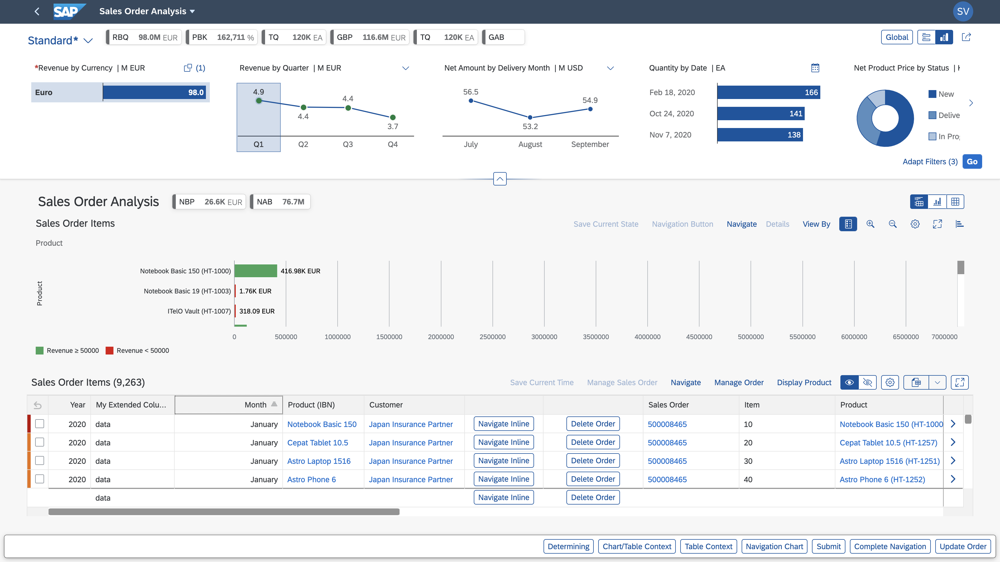

<!-- loio3d33684b08ca4490b26a844b6ce19b83 -->

# Analytical List Page

The analytical list page \(ALP\) offers a unique way to analyze data step by step from different perspectives, to investigate a root cause through drilldown, and to act on transactional content.

You can use SAP Fiori elements to build apps that require visualization and reporting of data using filters, interactive charts, and other data points such as KPIs \(key performance indicators\).

The combination of transactional and analytical data using chart and table visualization lets you quickly view the data you need. This hybrid view allows an interesting interplay between the chart and table representations.

Configure the ALP to include the following use cases seamlessly on one page:

-   Related KPIs on the header area as KPI tags. These KPI tags also allow progressive disclosure and navigation through KPI cards.
-   Filter data sets used for the main content area with different filter modes. For example, visual filters provide an intuitive way of choosing filter values from an associated measure value.
-   Seamless navigation to applications from the content area and the KPI card area.
-   Customizing and sharing ALP as a page variant with other users.

<a name="loio3d33684b08ca4490b26a844b6ce19b83__section_qnb_bwc_1qb"/>

## Restrictions for SAP Fiori Elements for OData V4

Visual filters are supported with restrictions.

<a name="loio3d33684b08ca4490b26a844b6ce19b83__section_ikr_k1v_r1b"/>

## More Information

For more information about the analytical list page, see [Building an App](building-an-app-9834a0a.md).

**Related Information**  

[Descriptor Configuration for the Analytical List Page](descriptor-configuration-for-the-analytical-list-page-2a9df06.md "The descriptor file (manifest.json) is an application configuration file that contains valid entries for initializing the analytical list page (ALP).")

[Configuring the Title Area](configuring-the-title-area-ebdb5da.md "The dynamic area of the analytical list page is the title area.")

[Configuring the Visual Filter Bar](configuring-the-visual-filter-bar-33f3d80.md "The visual filter bar enables end users to select filter values based on measure values in addition to the filters and filter values already selected in the regular filter bar.")

[Configuring the Content Area](configuring-the-content-area-fc7d73c.md "Visualize data from the main entity set and seamlessly navigate to an application. Define a valid chart or LineItem annotation to render content for the chart area and table area.")

[Configuring Analytical List Page App Extensions](configuring-analytical-list-page-app-extensions-9504fb4.md "This section provides some of the advance configurations and extensions for your application.")

