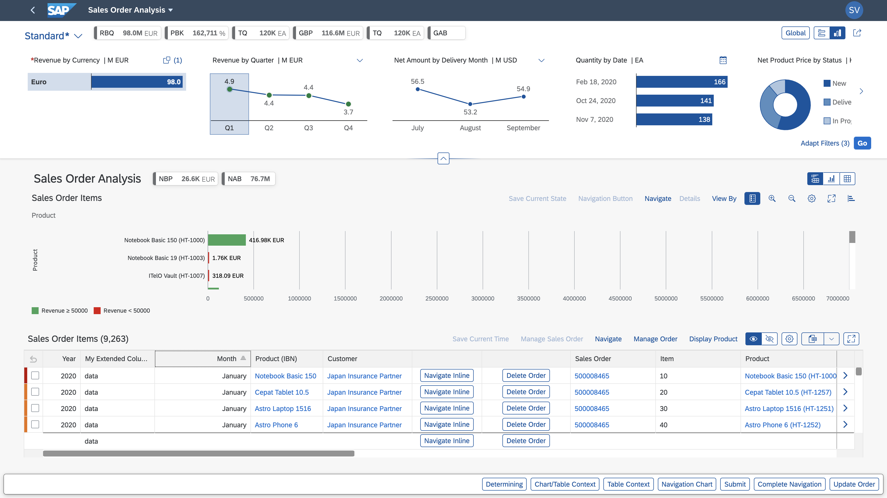

<!-- loioff056b46675240138ab8ef498b17638b -->

# Analytical List Page

You can build apps that require visualization and reporting of data using filters, interactive charts, and other data points such as KPIs \(key performance indicators\).

> ### Note:  
> For information about SAP Fiori elements for OData V4, see [Analytical List Page](analytical-list-page-3d33684.md).

The analytical list page \(ALP\) offers a unique way to analyze data step by step from different perspectives, to investigate a root cause through drilldown, and to act on transactional content.

The combination of transactional and analytical data using chart and table visualization lets you quickly view the data you need. This hybrid view allows an interesting interplay between the chart and table representations.

Configure the ALP to include the following use cases seamlessly on one page:

-   Related KPIs on the header area as KPI tags. These KPI tags also allow progressive disclosure and navigation through KPI cards.

-   Filter datasets used for the main content area with different filter modes. For example, visual filters provide an intuitive way of choosing filter values from an associated measure value.

-   Seamless navigation to applications from the content area and the KPI card area.

-   Customizing and sharing ALP as a page variant with other users.

For more information about the analytical list page, see [Building an App](building-an-app-bc6313e.md).

**Related Information**  

[Configuring the Manifest for the Analytical List Page](configuring-the-manifest-for-the-analytical-list-page-c4ebbae.md "You can use the manifest.json file to configure the analytical list page.")

[Configuring the Title Area](configuring-the-title-area-ebdb5da.md "The dynamic area of the analytical list page is the title area.")

[Configuring the Visual Filter Bar](configuring-the-visual-filter-bar-b44fe77.md "You can configure the visual filter bar on the analytical list page.")

[Configuring the Content Area](configuring-the-content-area-fc7d73c.md "You can visualize data from the main entity set and seamlessly navigate to an application.")

[Configuring Analytical List Page App Extensions](configuring-analytical-list-page-app-extensions-9504fb4.md "You can make use of advanced configurations and extensions in your app.")

