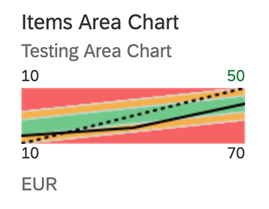

<!-- loio1467f2bc79874281ac152c1e15f133f5 -->

# Area Micro Chart

An area micro chart is a trend chart.

It provides information for actual and target values for a specific time range.



> ### Note:  
> In the chart, the values at the bottom \(10 and 70\) represent the dimension values, which are the IDs of the sales order items. The values at the top \(10 and 50\) are the measure values, corresponding to the points of the solid black line at the start and end of the chart.
> 
> A single measure value is shown along with the threshold values \(error, warning, acceptance and good range values\). So, semantic coloring using the `CriticalityCalculation` annotation is mandatory when using an area micro chart. For more information, see [Samples](https://ui5.sap.com/#/entity/sap.suite.ui.microchart.AreaMicroChart).


<a name="loio1467f2bc79874281ac152c1e15f133f5__section_q2j_v2q_qmb"/>

## `UI.Chart` Annotations

The `UI.Chart Title` property is used for the title. The `UI.Chart Description` property is used for the subtitle.

> ### Sample Code:  
> XML Annotation
> 
> ```xml
> <Annotation Term="UI.Chart">
>     <Record Type="UI.ChartDefinitionType">
>         <PropertyValue Property="Title" String="Sales Price" />
>         <PropertyValue Property="Description" String="Area Micro Chart" />
>         <PropertyValue Property="ChartType" EnumMember="UI.ChartType/Area" />
>         <PropertyValue Property="Dimensions">
>             <Collection>
>                 <PropertyPath>PriceDay</PropertyPath>
>             </Collection>
>         </PropertyValue>
>         <PropertyValue Property="Measures">
>             <Collection>
>                 <PropertyPath>AreaChartPrice</PropertyPath>
>             </Collection>
>         </PropertyValue>
>         <PropertyValue Property="MeasureAttributes">
>             <Collection>
>                 <Record Type="UI.ChartMeasureAttributeType">
>                     <PropertyValue Property="Measure" PropertyPath="AreaChartPrice" />
>                     <PropertyValue Property="Role" EnumMember="UI.ChartMeasureRoleType/Axis1" />
>                     <PropertyValue Property="DataPoint" AnnotationPath="@UI.DataPoint#AreaChartPrice" />
>                 </Record>
>             </Collection>
>         </PropertyValue>
>     </Record>
> </Annotation>
> 
> ```

> ### Sample Code:  
> ABAP CDS Annotation
> 
> ```
> 
> @UI.Chart: [
>   {
>     title: 'Sales Price',
>     description: 'Area Micro Chart',
>     chartType: #AREA,
>     dimensions: [
>       'PRICEDAY'
>     ],
>     measures: [
>       'AREACHARTPRICE'
>     ],
>     measureAttributes: [
>       {
>         measure: 'AreaChartPrice',
>         role: #AXIS_1,
>         asDataPoint: true
>       }
>     ]
>   }
> ]
> annotate view STTA_C_MP_PRODUCT with {
> 
> }
> 
> ```

> ### Sample Code:  
> CAP CDS Annotation
> 
> ```
> 
> UI.Chart : {
>     $Type : 'UI.ChartDefinitionType',
>     Title : 'Sales Price',
>     Description : 'Area Micro Chart',
>     ChartType : #Area,
>     Dimensions : [
>         PriceDay
>     ],
>     Measures : [
>         AreaChartPrice
>     ],
>     MeasureAttributes : [
>         {
>             $Type : 'UI.ChartMeasureAttributeType',
>             Measure : AreaChartPrice,
>             Role : #Axis1,
>             DataPoint : '@UI.DataPoint#AreaChartPrice'
>         }
>     ]
> }
> 
> ```


<a name="loio1467f2bc79874281ac152c1e15f133f5__section_as3_v2q_qmb"/>

## `UI.DataPoint` Annotation

> ### Sample Code:  
> XML Annotation
> 
> ```xml
> <Annotation Term="UI.DataPoint" Qualifier="AreaChartPrice">
>     <Record>
>         <PropertyValue Property="Title" String="Sales Price" />
>         <PropertyValue Property="Value" Path="AreaChartPrice" />
>         <PropertyValue Property="TargetValue" Path="TargetPrice" />
>         <PropertyValue Property="CriticalityCalculation">
>             <Record>
>                 <PropertyValue Property="ImprovementDirection" EnumMember="UI.ImprovementDirectionType/Target" />
>                 <PropertyValue Property="DeviationRangeHighValue" Path="DeviationUpperBoundPrice" />
>                 <PropertyValue Property="DeviationRangeLowValue" Path="DeviationLowerBoundPrice" />
>                 <PropertyValue Property="ToleranceRangeHighValue" Path="ToleranceUpperBoundPrice" />
>                 <PropertyValue Property="ToleranceRangeLowValue" Path="ToleranceLowerBoundPrice" />
>             </Record>
>         </PropertyValue>
>     </Record>
> </Annotation>
> 
> ```

> ### Sample Code:  
> ABAP CDS Annotation
> 
> ```
> 
> @UI.dataPoint: {
>   title: 'Sales Price',
>   targetValueElement: 'TargetPrice',
>   criticalityCalculation: {
>     improvementDirection: #TARGET,
>     deviationRangeHighValueElement: 'DeviationUpperBoundPrice',
>     deviationRangeLowValueElement: 'DeviationLowerBoundPrice',
>     toleranceRangeHighValueElement: 'ToleranceUpperBoundPrice',
>     toleranceRangeLowValueElement: 'ToleranceLowerBoundPrice'
>   }
> }
> AreaChartPrice;
> 
> ```

> ### Sample Code:  
> CAP CDS Annotation
> 
> ```
> 
> UI.DataPoint #AreaChartPrice : {
>     Title : 'Sales Price',
>     Value : AreaChartPrice,
>     TargetValue : TargetPrice,
>     CriticalityCalculation : {
>         ImprovementDirection : #Target,
>         DeviationRangeHighValue : DeviationUpperBoundPrice,
>         DeviationRangeLowValue : DeviationLowerBoundPrice,
>         ToleranceRangeHighValue : ToleranceUpperBoundPrice,
>         ToleranceRangeLowValue : ToleranceLowerBoundPrice
>     }
> }
> 
> ```

> ### Note:  
> -   You must ensure that the unit of measure is consistent across all data points.
> 
> -   The first and last values of the measure are set as labels at the top-left and top-right corners of the micro chart and, the first and the last dimension values from the data at the bottom-left and bottom-right corners respectively.
> 
> 
> The following annotations are mandatory and must be used in the area micro chart:
> 
> -   `UI.Chart` → `ChartType`: "`Area`"
> 
> -   `UI.Chart` → `Dimensions`
> 
> -   `UI.Chart` → `Measures`
> 
> -   `UI.Chart` → `MeasureAttributes` → `DataPoint`
> 
> -   `UI.DataPoint` → `Value`
> 
> -   `UI.CriticalityCalculation`
> 
>     -   `UI.DataPoint` → `CriticalityCalculation`
> 
>     -   `UI.DataPoint` → `CriticalityCalculation/ImprovementDirection`

