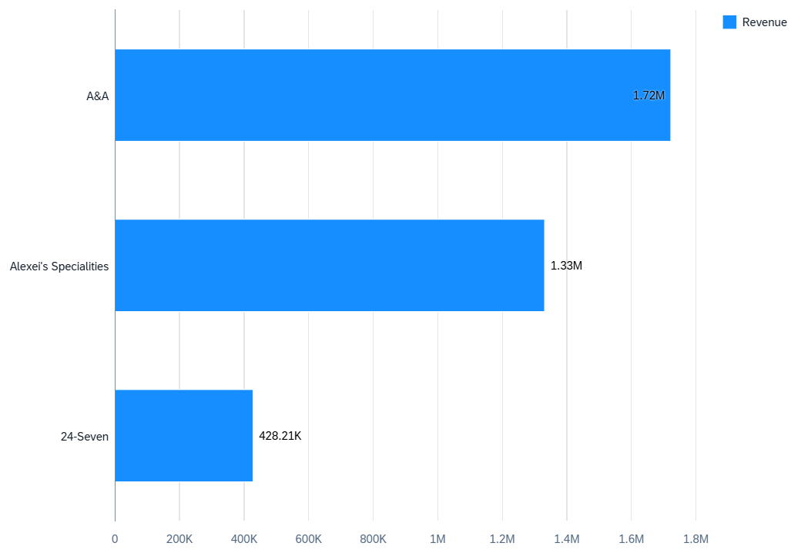
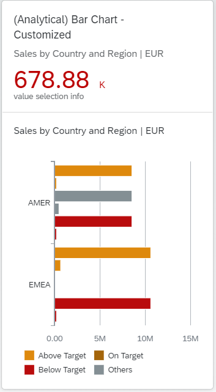
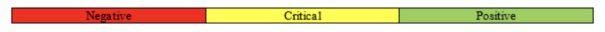
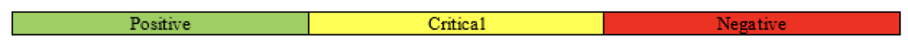
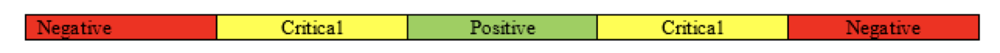

<!-- loio95f6aeb7eeb746ca94762f10f8217799 -->

# Bar Chart Card

You can use a bar chart to display data, such as total product sales over a period of years in columns.

The number of columns is equal to the number of measures in the annotation file.

   
  
**Example of a Horizontal Bar Chart Card**

  


<a name="loio95f6aeb7eeb746ca94762f10f8217799__section_nbv_jyb_z4b"/>

## Semantic Coloring

The semantic colouring of a bar chart card is based on the target and threshold values.

The target values are taken from the properties such as `ToleranceRangeLowValue`, `ToleranceRangeHighValue`, `DeviationRangeLowValue`, and `DeviationRangeHighValue` of the data point annotations that are associated with the measure and `ImprovementDirection` property.

The threshold values are taken from that data point annotations that are associated with the measures used in the analytical card.

> ### Recommendation:  
> We recommend you to use only one measure in the chart if you intend to use semantic coloring.

  
  
**Example of a Bar Chart Card with Semantic Coloring**

  

When you semantically color the bar chart card, the threshold values which influence the semantic color would also be displayed in the legend. However, if you use more than one measure in the chart, the legends would only show the values *Good*, *Bad*, and *Neutral*.

The data point should have a Measure Value based on which the direction for improvement is measured. Based on this value, you define if the measure is a:

-   Maximizing measure where a higher value of measure is better.

-   Minimizing measure where a lesser value of measure is better.

-   Target measure where a value is preferred within a certain range.


### Threshold Values

The measures can be maximizing, minimizing, or target, based on a threhold value.

-   Maximizing measure, for example, sales: The direction of improvement is as follows:

    -   Negative to Critical: Here, the measure value should be greater than or equal to `ThresholdValues.DeviationRangeLowValue` 

    -   Critical to Positive: Here, the measure value should be greater than or equal to `ThresholdValues.ToleranceRangeLowValue` 


       
      
    **Example of a Maximizing Measure**

      

-   Minimizing measure, for example, cost: The direction of improvement is as follows:

    -   Positive to Critical: Here, the measure value should be greater than `ThresholdValues.ToleranceRangeHighValue` 

    -   Critical to Negative: Here, the measure value should be greater than `ThresholdValues.DeviationRangeHighValue` 


       
      
    **Example of a Minimizing Measure**

      

-   Target measure, for example, temperature: The direction of improvement is as follows:

    -   Negative to Critical: Here, the measure value should be greater than or equal to `ThresholdValues.DeviationRangeLowValue` 

    -   Critical to Positive: Here, the measure value should be greater than or equal to `ThresholdValues.ToleranceRangeLowValue` 

    -   Positive to Critical: Here, the measure value should be greater than `ThresholdValues.ToleranceRangeHighValue` 

    -   Critical to Negative: Here, the measure value should be greater than `ThresholdValues.DeviationRangeHighValue` 


       
      
    **Example of a Target Measure**

      


> ### Sample Code:  
> ```
> <Annotation Term="UI.Chart" Qualifier="Eval_by_Currency_Bar">
>    <Record Type="UI.ChartDefinitionType">
>       <PropertyValue Property="Title" String="Sales by Product" />
>       <PropertyValue Property="ChartType" EnumMember="UI.ChartType/Bar" />
>       <PropertyValue Property="Measures">
>          <Collection>
>             <PropertyPath>Sales</PropertyPath>
>          </Collection>
>       </PropertyValue>
>       <PropertyValue Property="Dimensions">
>          <Collection>
>             <PropertyPath>Product</PropertyPath>
>          </Collection>
>       </PropertyValue>
>       <PropertyValue Property="MeasureAttributes">
>          <Collection>
>             <Record Type="UI.ChartMeasureAttributeType">
>                <PropertyValue Property="Measure" PropertyPath="Sales" />
>                <PropertyValue Property="DataPoint">
>                   <AnnotationPath>@UI.DataPoint#Column_Eval_by_Country_123</AnnotationPath>
>                </PropertyValue>
>                <PropertyValue Property="Role"
>                   EnumMember="UI.ChartMeasureRoleType/Axis1" />
>             </Record>
>              
>          </Collection>
>       </PropertyValue>
>       <PropertyValue Property="DimensionAttributes">
>          <Collection>
>             <Record Type="UI.ChartDimensionAttributeType">
>                <PropertyValue Property="Dimension" PropertyPath="Product" />
>                <PropertyValue Property="Role"
>                   EnumMember="UI.ChartDimensionRoleType/Category" />
>             </Record>
>          </Collection>
>       </PropertyValue>
>    </Record>
> </Annotation>
> ```

