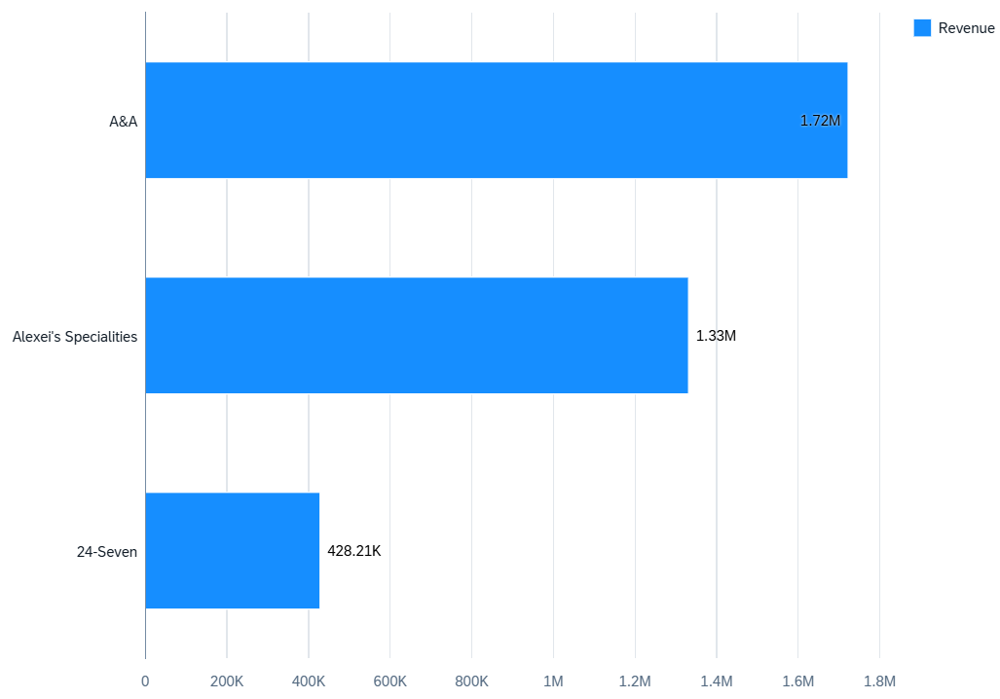
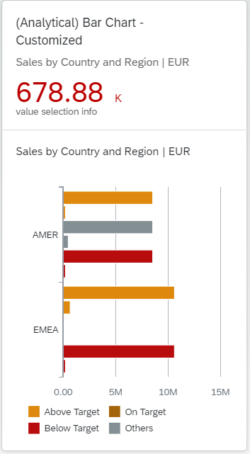
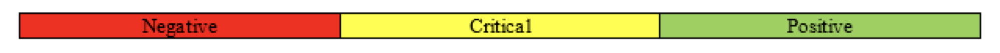
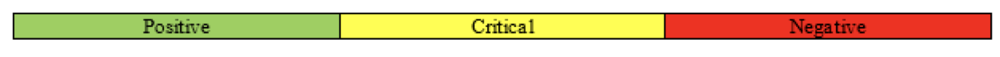
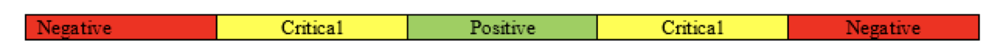

<!-- loioee990ca60142435489a9262ff3de961e -->

# Bar Chart Card

You can render the chart as a bar chart to display data, such as total product sales over a period of years as horizontal bars.

The number of columns is equal to the number of measures in the annotation file.

  
  
**Example of a Horizontal Bar Chart Card**




<a name="loioee990ca60142435489a9262ff3de961e__section_nbv_jyb_z4b"/>

## Semantic Coloring

A bar chart can be semantically colored based on target and threshold values:

The target values are taken from the properties such as `ToleranceRangeLowValue`, `ToleranceRangeHighValue`, `DeviationRangeLowValue`, and `DeviationRangeHighValue` of the data point annotations that are associated with the measure and `ImprovementDirection` property.

The threshold values are taken from that data point annotations that are associated with the measures used in the analytical card.

> ### Recommendation:  
> Use only one measure in the chart if you intend to use semantic coloring.

  
  
**Example of a Bar Chart Card with Semantic Coloring**



When you apply semantic coloring, the threshold values that influence the colors are also displayed in the legend. However, if you use more than one measure, the legend shows only the values *Good*, *Bad*, and *Neutral*.

The `DataPoint` annotation must define a Measure Value based on which the direction for improvement is measured. The measure can be one of three types:

-   Maximizing measure where a higher value of measure is better.

-   Minimizing measure where a lesser value of measure is better.

-   Target measure where a value is preferred within a certain range.


### Threshold Values

The measures can be maximizing, minimizing, or target, based on a threshold value.

-   Maximizing measure, for example, sales: The direction of improvement is as follows:

    -   Negative to Critical: The measure value is greater than or equal to `ThresholdValues.DeviationRangeLowValue` 

    -   Critical to Positive: The measure value is greater than or equal to `ThresholdValues.ToleranceRangeLowValue` 


      
      
    **Example of a Maximizing Measure**

    

-   Minimizing measure, for example, cost: The direction of improvement is as follows:

    -   Positive to Critical: The measure value is greater than `ThresholdValues.ToleranceRangeHighValue` 

    -   Critical to Negative: The measure value is greater than `ThresholdValues.DeviationRangeHighValue` 


      
      
    **Example of a Minimizing Measure**

    

-   Target measure, for example, temperature: The direction of improvement is as follows:

    -   Negative to Critical: The measure value is greater than or equal to `ThresholdValues.DeviationRangeLowValue`.

    -   Critical to Positive: The measure value is greater than or equal to `ThresholdValues.ToleranceRangeLowValue`.

    -   Positive to Critical: The measure value is greater than `ThresholdValues.ToleranceRangeHighValue`.

    -   Critical to Negative: The measure value is greater than `ThresholdValues.DeviationRangeHighValue`.


      
      
    **Example of a Target Measure**

    


The following sample code how to define a bar chart:

> ### Sample Code:  
> ```
> <Annotation Term="UI.Chart" Qualifier="Eval_by_Currency_Bar">
>    <Record Type="UI.ChartDefinitionType">
>       <PropertyValue Property="Title" String="Sales by Product" />
>       <PropertyValue Property="ChartType" EnumMember="UI.ChartType/Bar" />
>       <PropertyValue Property="Measures">
>          <Collection>
>             <PropertyPath>Sales</PropertyPath>
>          </Collection>
>       </PropertyValue>
>       <PropertyValue Property="Dimensions">
>          <Collection>
>             <PropertyPath>Product</PropertyPath>
>          </Collection>
>       </PropertyValue>
>       <PropertyValue Property="MeasureAttributes">
>          <Collection>
>             <Record Type="UI.ChartMeasureAttributeType">
>                <PropertyValue Property="Measure" PropertyPath="Sales" />
>                <PropertyValue Property="DataPoint">
>                   <AnnotationPath>@UI.DataPoint#Column_Eval_by_Country_123</AnnotationPath>
>                </PropertyValue>
>                <PropertyValue Property="Role"
>                   EnumMember="UI.ChartMeasureRoleType/Axis1" />
>             </Record>
>              
>          </Collection>
>       </PropertyValue>
>       <PropertyValue Property="DimensionAttributes">
>          <Collection>
>             <Record Type="UI.ChartDimensionAttributeType">
>                <PropertyValue Property="Dimension" PropertyPath="Product" />
>                <PropertyValue Property="Role"
>                   EnumMember="UI.ChartDimensionRoleType/Category" />
>             </Record>
>          </Collection>
>       </PropertyValue>
>    </Record>
> </Annotation>
> ```


The following sample code shows the minimum required configuration for a bar chart:

> ### Sample Code:  
> XML Annotation
> 
> ```xml
> <Annotation Term="UI.Chart" Qualifier="BarChartSoldToParty">
>     <Record Type="UI.ChartDefinitionType">
>         <PropertyValue Property="Title" String="Bar Chart"/>
>         <PropertyValue Property="Description" String="Testing Bar Chart"/>
>         <PropertyValue Property="ChartType" EnumMember="UI.ChartType/Bar"/>
>         <PropertyValue Property="Measures">
>             <Collection>
>                 <PropertyPath>totalPricing</PropertyPath>
>             </Collection>
>         </PropertyValue>
>         <PropertyValue Property="Dimensions">
>             <Collection>
>                 <PropertyPath>SoldToParty</PropertyPath>
>             </Collection>
>         </PropertyValue>
>         <PropertyValue Property="MeasureAttributes">
>             <Collection/>
>         </PropertyValue>
>         <PropertyValue Property="DimensionAttributes">
>             <Collection/>
>         </PropertyValue>
>     </Record>
> </Annotation>
> ```

> ### Sample Code:  
> ABAP CDS Annotation
> 
> No ABAP CDS annotation sample is available. Please use the local XML annotation.

> ### Sample Code:  
> CAP CDS Annotation
> 
> ```
> Chart #BarChartSoldToParty                              : {
>     $Type              : 'UI.ChartDefinitionType',
>     Title              : 'Bar Chart',
>     Description        : 'Testing Bar Chart',
>     ChartType          : #Bar,
>     Measures           : [totalPricing],
>     Dimensions         : [SoldToParty],
>     MeasureAttributes  : [],
>     DimensionAttributes: []
> },
> ```

