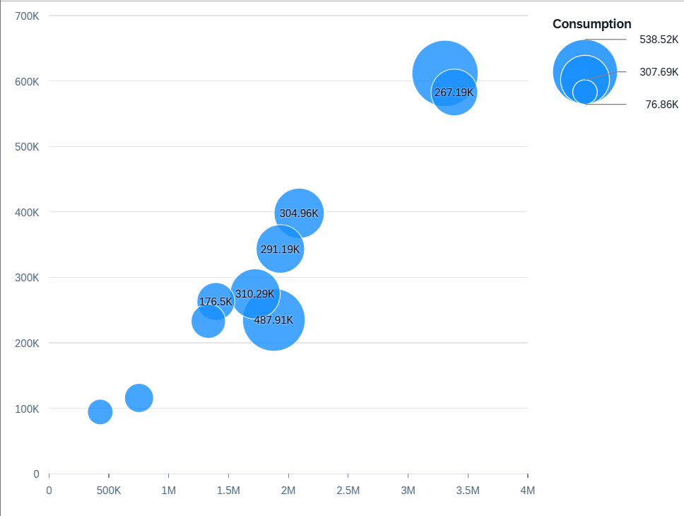

<!-- loio5003d9153b0345fa9af0bdb211d9802b -->

# Bubble Chart Card

You can render the chart as a bubble chart to display up to three measures and two dimensions of data.

The three measures are reflected in the x-axis and y-axis, and the size of the bubbles. The dimensions can be expressed in the colors and shapes of the bubbles. Bubble charts must have three measures and one or two dimensions.

  
  
**Example of a Bubble Chart Card**



Each measure is assigned to a chart axis or to the bubble size based on its `Role`. Each feed has a unique identifier \(UID\) that the chart framework uses internally to map the measure to a chart element \(x-axis, y-axis, or bubble size\).

X-axis \(`valueAxis` feed\): The first measure with an axis role is assigned to the `valueAxis` feed, and its UID maps the measure to the x-axis.

> ### Note:  
> The role is set to `axis1`, `axis2` \(if there's no `axis1`\), or `axis3` \(if there's no `axis2`.\)

Y-axis \(`valueAxis2` feed\): The first measure with an axis role is assigned to the `valueAxis2` feed, and its UID maps the measure to the y-axis. The role is set to:

-   `axis2` of the first measure.

-   If there's no `axis2`, the role is set to`axis1` of the second measure.

-   If there's no `axis1` for the second measure, the role is set to `axis3` of the first measure.


Bubble size \(`bubbleWidth` feed\): The remaining measure is assigned to the `bubbleWidth` feed's UID, which determines the size of each bubble.

The dimensions for which the role is set to `series` are assigned to the `color` feed's UID. Different values for this dimension in the dataset result in differently colored data points in the chart. If the `series` role is assigned to both dimensions, then each combination of the dimension members gets a unique color.

For example, if the `series` role is assigned to the dimensions *Year* and *Country*, then "India/2025", "India/2026", "Germany/2025", and "Germany/2026" are represented as different colored bubbles. If no role is assigned to a dimension, then the dimension members get the same color. In the above example, if no role has been assigned to *Year*, then the bubbles only have two colors, one for all records for India and one for all records for Germany, irrespective of the year.

> ### Note:  
> Assigning the `category` role to a dimension leads to differently shaped data points for different values of the dimension. However, we do not recommend this for a bubble chart card.

The dimensions for which the role is set to `category` are assigned to the `shape` feed's UID. Different values for this dimension in the dataset result in differently shaped data points in the chart. If multiple dimensions are set with the `category` role, only the first dimension is considered.

The bubble chart supports a color palette for semantic coloring. For more information, see [Configuring Charts on the Overview Page](configuring-charts-on-the-overview-page-c7c5a82.md).

The following code samples show how to configure a bubble chart with three measures \(`SalesShare`, `TotalSales`, `Sales`\) and one dimension \(`Product`\):

> ### Sample Code:  
> XML Annotation
> 
> ```xml
> <Annotation Term="UI.Chart" Qualifier="Qualifier_ID_1">
>     <Record Type="UI.ChartDefinitionType">
>         <PropertyValue Property="Title" String="View1" />
>         <PropertyValue Property="ChartType" EnumMember="UI.ChartType/Bubble"/>
>         <PropertyValue Property="MeasureAttributes">
>             <Collection>
>                 <Record Type="UI.ChartMeasureAttributeType">
>                     <PropertyValue Property="Measure" PropertyPath="SalesShare" />
>                     <PropertyValue Property="Role" EnumMember="UI.ChartMeasureRoleType/Axis1" />
>                 </Record>
>                 <Record Type="UI.ChartMeasureAttributeType">
>                     <PropertyValue Property="Measure" PropertyPath="TotalSales" />
>                     <PropertyValue Property="Role" EnumMember="UI.ChartMeasureRoleType/Axis2" />
>                 </Record>
>                 <Record Type="UI.ChartMeasureAttributeType">
>                     <PropertyValue Property="Measure" PropertyPath="Sales" />
>                     <PropertyValue Property="Role" EnumMember="UI.ChartMeasureRoleType/Axis3" />
>                 </Record>
>             </Collection>
>         </PropertyValue>
>         <PropertyValue Property="DimensionAttributes">
>             <Collection>
>                 <Record Type="UI.ChartDimensionAttributeType">
>                     <PropertyValue Property="Dimension" PropertyPath="Product" />
>                     <PropertyValue Property="Role" EnumMember="UI.ChartDimensionRoleType/Series" />
>                 </Record>
>             </Collection>
>         </PropertyValue>
>     </Record>
> </Annotation>
> 
> ```

> ### Sample Code:  
> ABAP CDS Annotation
> 
> ```
> 
> @UI.Chart: [
>   {
>     title: 'View1',
>     chartType: #BUBBLE,
>     measureAttributes: [
>       {
>         measure: 'SalesShare',
>         role: #AXIS_1
>       },
>       {
>         measure: 'TotalSales',
>         role: #AXIS_2
>       },
>       {
>         measure: 'Sales',
>         role: #AXIS_3
>       }
>     ],
>     dimensionAttributes: [
>       {
>         dimension: 'Product',
>         role: #SERIES
>       }
>     ],
>     qualifier: 'Qualifier_ID_1'
>   }
> ]
> annotate view VIEWNAME with { }
> 
> ```

> ### Sample Code:  
> CAP CDS Annotation
> 
> ```
> 
> UI.Chart #Qualifier_ID_1 : {
>     $Type : 'UI.ChartDefinitionType',
>     Title : 'View1',
>     ChartType : #Bubble,
>     MeasureAttributes : [
>         {
>             $Type : 'UI.ChartMeasureAttributeType',
>             Measure : SalesShare,
>             Role : #Axis1
>         },
>         {
>             $Type : 'UI.ChartMeasureAttributeType',
>             Measure : TotalSales,
>             Role : #Axis2
>         },
>         {
>             $Type : 'UI.ChartMeasureAttributeType',
>             Measure : Sales,
>             Role : #Axis3
>         }
>     ],
>     DimensionAttributes : [
>         {
>             $Type : 'UI.ChartDimensionAttributeType',
>             Dimension : Product,
>             Role : #Series
>         }
>     ]
> }
> 
> ```

