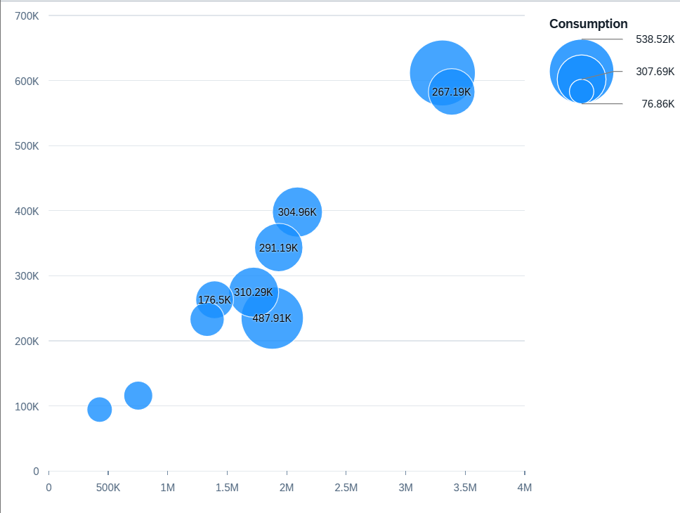

<!-- loio84123071bc1a46dd9d9b544ecec6fdcf -->

# Bubble Chart Card

Bubble charts display up to three measures and two dimensions of data.


The three measures are reflected in the x- and y-axes, and in the size of the bubbles. The dimensions can be expressed in the colors and/or shapes of the bubbles. Bubble charts need to have three measures and one or two dimensions.

-   The first measure for which the role is set to an axis is assigned to the `valueAxis` feed. The UID makes up the x-axis.

    > ### Note:  
    > The role is set to `axis1`, `axis2` \(if there's no `axis1`\), or `axis3` \(if there's no `axis2`.\)

-   The first measure for which the role is set to an axis is assigned to the `valueAxis2` feed and the UID makes up the y-axis.

    > ### Note:  
    > The role is set to `axis2` of the first measure. If there's no `axis2`, the role is set to `axis1` of the second measure. If there's no axis1 for the second measure, the role is set to `axis3` of the first measure.

-   The remaining measure is assigned to the `bubbleWidth` feed'sUID. This determines the size of the bubble.
-   The dimensions for which the role is set to `series` are assigned to the feed's UID **color**. Different values for this dimension in the data set result in different colored data points in the chart. If multiple dimensions are set with the category role, only the first dimension is considered. If the role **series** is assigned to both dimensions, then each combination of the dimension member gets a unique color.

    For example, if role **series** is assigned to the dimensions "Year" and "Country" then "India/2015", "India/2016", "Germany/2015", "Germany/2016" are represented as different colored bubbles. If no role is assigned to a dimension, then the dimension members gets the same color. In the above example, if no color has been assigned to a year, then the bubbles only have two colors - one for all records for India and one for all records for Germany, irrespective of the year.

    > ### Note:  
    > Assigning the role of a dimension as a category leads to differently shaped data points for different values of the dimension. However, we do not recommend this for a bubble chart card.

-   The dimensions for which the role is set to a **category** are assigned to the **shape** feed's UID. Different values for this dimension in the data set result in differently shaped data points in the chart. If multiples dimensions are set with the category role, only the first dimension is considered.

The code snippet shown below demonstrates how you define a bubble chart card. Note that there are three measures \(under the `MeasureAttributes` property\) and one dimension \(under the `DimensionAttributes` property\).


### Example

> ### Sample Code:  
> XML Annotation
> 
> ```xml
> <Annotation Term="UI.Chart" Qualifier="Qualifier_ID_1">
>     <Record Type="UI.ChartDefinitionType">
>         <PropertyValue Property="Title" String="View1" />
>         <PropertyValue Property="ChartType" EnumMember="UI.ChartType/Bubble"/>
>         <PropertyValue Property="MeasureAttributes">
>             <Collection>
>                 <Record Type="UI.ChartMeasureAttributeType">
>                     <PropertyValue Property="Measure" PropertyPath="SalesShare" />
>                     <PropertyValue Property="Role" EnumMember="UI.ChartMeasureRoleType/Axis1" />
>                 </Record>
>                 <Record Type="UI.ChartMeasureAttributeType">
>                     <PropertyValue Property="Measure" PropertyPath="TotalSales" />
>                     <PropertyValue Property="Role" EnumMember="UI.ChartMeasureRoleType/Axis2" />
>                 </Record>
>                 <Record Type="UI.ChartMeasureAttributeType">
>                     <PropertyValue Property="Measure" PropertyPath="Sales" />
>                     <PropertyValue Property="Role" EnumMember="UI.ChartMeasureRoleType/Axis3" />
>                 </Record>
>             </Collection>
>         </PropertyValue>
>         <PropertyValue Property="DimensionAttributes">
>             <Collection>
>                 <Record Type="UI.ChartDimensionAttributeType">
>                     <PropertyValue Property="Dimension" PropertyPath="Product" />
>                     <PropertyValue Property="Role" EnumMember="UI.ChartDimensionRoleType/Series" />
>                 </Record>
>             </Collection>
>         </PropertyValue>
>     </Record>
> </Annotation>
> 
> ```

> ### Sample Code:  
> ABAP CDS Annotation
> 
> ```
> 
> @UI.Chart: [
>   {
>     title: 'View1',
>     chartType: #BUBBLE,
>     measureAttributes: [
>       {
>         measure: 'SalesShare',
>         role: #AXIS_1
>       },
>       {
>         measure: 'TotalSales',
>         role: #AXIS_2
>       },
>       {
>         measure: 'Sales',
>         role: #AXIS_3
>       }
>     ],
>     dimensionAttributes: [
>       {
>         dimension: 'Product',
>         role: #SERIES
>       }
>     ],
>     qualifier: 'Qualifier_ID_1'
>   }
> ]
> annotate view VIEWNAME with { }
> 
> ```

> ### Sample Code:  
> CAP CDS Annotation
> 
> ```
> 
> UI.Chart #Qualifier_ID_1 : {
>     $Type : 'UI.ChartDefinitionType',
>     Title : 'View1',
>     ChartType : #Bubble,
>     MeasureAttributes : [
>         {
>             $Type : 'UI.ChartMeasureAttributeType',
>             Measure : SalesShare,
>             Role : #Axis1
>         },
>         {
>             $Type : 'UI.ChartMeasureAttributeType',
>             Measure : TotalSales,
>             Role : #Axis2
>         },
>         {
>             $Type : 'UI.ChartMeasureAttributeType',
>             Measure : Sales,
>             Role : #Axis3
>         }
>     ],
>     DimensionAttributes : [
>         {
>             $Type : 'UI.ChartDimensionAttributeType',
>             Dimension : Product,
>             Role : #Series
>         }
>     ]
> }
> 
> ```

The bubble chart supports a color palette for semantic coloring.

  
  
**Example of a Bubble Chart Card**

  

