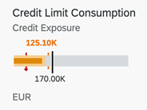

<!-- loio4a7e1b80173e4a38b7baf625c77b0548 -->

# Bullet Micro Chart

You can render the micro chart as a bullet micro chart.

> ### Note:  
> For information about SAP Fiori elements for OData V4, see [Bullet Micro Chart](bullet-micro-chart-b915166.md).

The bullet chart displays the evaluation of a single, primary value compared against one or more data point values. For example, a current year-to-date revenue is displayed as below the target revenue for the same period.



For more information about this chart type, see [Samples](https://ui5.sap.com/1.82.5/#/entity/sap.suite.ui.microchart.BulletMicroChart).


<a name="loio4a7e1b80173e4a38b7baf625c77b0548__section_hs3_vfq_qmb"/>

## `UI.Chart` Annotations

The `UI.Chart Title` property is used to define the title, while the `UI.Chart Description` property is used to specify the subtitle.

> ### Sample Code:  
> XML Annotation
> 
> ```xml
> 
> <Annotation Term="UI.Chart">
>     <Record Type="UI.ChartDefinitionType">
>         <PropertyValue Property="Title" String="Sales Revenue" />
>         <PropertyValue Property="Description" String="Bullet Micro Chart" />
>         <PropertyValue Property="ChartType" EnumMember="UI.ChartType/Bullet" />
>         <PropertyValue Property="Measures">
>             <Collection>
>                 <PropertyPath>BulletChartRevenue</PropertyPath>
>             </Collection>
>         </PropertyValue>
>         <PropertyValue Property="MeasureAttributes">
>             <Collection>
>                 <Record Type="UI.ChartMeasureAttributeType">
>                     <PropertyValue Property="Measure" PropertyPath="BulletChartRevenue" />
>                     <PropertyValue Property="Role" EnumMember="UI.ChartMeasureRoleType/Axis1" />
>                     <PropertyValue Property="DataPoint" AnnotationPath="@UI.DataPoint#BulletChartRevenue" />
>                 </Record>
>             </Collection>
>         </PropertyValue>
>     </Record>
> </Annotation>
> 
> ```

> ### Sample Code:  
> ABAP CDS Annotation
> 
> ```
> 
> @UI.Chart: [
>   {
>     title: 'Sales Revenue',
>     description: 'Bullet Micro Chart',
>     chartType: #BULLET,
>     measures: [
>       'BULLETCHARTREVENUE'
>     ],
>     measureAttributes: [
>       {
>         measure: 'BulletChartRevenue',
>         role: #AXIS_1,
>         asDataPoint: true
>       }
>     ]
>   }
> ]
> annotate view STTA_C_MP_PRODUCT with {
> 
> }
> ```

> ### Sample Code:  
> CAP CDS Annotation
> 
> ```
> 
> UI.Chart : {
>     $Type : 'UI.ChartDefinitionType',
>     Title : 'Sales Revenue',
>     Description : 'Bullet Micro Chart',
>     ChartType : #Bullet,
>     Measures : [
>         BulletChartRevenue
>     ],
>     MeasureAttributes : [
>         {
>             $Type : 'UI.ChartMeasureAttributeType',
>             Measure : BulletChartRevenue,
>             Role : #Axis1,
>             DataPoint : '@UI.DataPoint#BulletChartRevenue'
>         }
>     ]
> }
> 
> ```


<a name="loio4a7e1b80173e4a38b7baf625c77b0548__section_mk3_vfq_qmb"/>

## `UI.DataPoint` Annotation

> ### Sample Code:  
> XML Annotation
> 
> ```xml
> 
> <Annotation Term="UI.DataPoint" Qualifier="BulletChartRevenue">
>     <Record>
>         <PropertyValue Property="Value" Path="BulletChartRevenue" />
>         <PropertyValue Property="TargetValue" Path="TargetRevenue" />
>         <PropertyValue Property="ForecastValue" Path="ForecastRevenue" />
>         <PropertyValue Property="MinimumValue" Decimal="100" />
>         <PropertyValue Property="MaximumValue" Decimal="300" />
>         <PropertyValue Property="Criticality" Path="Criticality" />
>     </Record>
> </Annotation>
> ```

> ### Sample Code:  
> ABAP CDS Annotation
> 
> ```
> 
> @UI.dataPoint: {
>   targetValueElement: 'TargetRevenue',
>   forecastValue: 'ForecastRevenue',
>   minimumValue: 100,
>   maximumValue: 300,
>   criticality: 'Criticality'
> }
> BulletChartRevenue;
> ```

> ### Sample Code:  
> CAP CDS Annotation
> 
> ```
> 
> UI.DataPoint #BulletChartRevenue : {
>     Value : BulletChartRevenue,
>     TargetValue : TargetRevenue,
>     ForecastValue : ForecastRevenue,
>     MinimumValue : 100,
>     MaximumValue : 300,
>     Criticality : Criticality
> }
> 
> ```

For semantic coloring, both the `Criticality` and `CriticalityCalculation` annotations are supported. However, the `Criticality` annotation overrides the `CriticalityCalculation` annotation.

The following annotations are mandatory and must be used in the bullet micro chart:

-   `UI.Chart` → `ChartType`: `"Bullet"`

-   `UI.Chart` → `Measures`

-   `UI.Chart` → `MeasureAttributes` → `DataPoint`

-   `UI.DataPoint` → `Value`

-   In case the `CriticalityCalculation` annotation is used for semantic coloring, then:

    -   `UI.DataPoint` → `CriticalityCalculation`

    -   `UI.DataPoint` → `CriticalityCalculation/ImprovementDirection`


