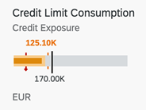

<!-- loiob91516684a8641b2964c2380c9ea94df -->

# Bullet Micro Chart

The bullet chart features a single, primary measure \(for example, current year-to-date revenue\).

It compares that measure to one or more other measures to enrich its meaning \(for example, compared to a target\), and displays it in the context of qualitative ranges of performance, such as poor, satisfactory, and good.



> ### Note:  
> For more information about this chart type, see [Samples](https://ui5.sap.com/1.82.5/#/entity/sap.suite.ui.microchart.BulletMicroChart).


<a name="loiob91516684a8641b2964c2380c9ea94df__section_hs3_vfq_qmb"/>

## UI.Chart Annotations

The `UI.Chart Title` property is used for the title.

The `UI.Chart Description` property is used for the subtitle.

> ### Sample Code:  
> XML Annotation
> 
> ```xml
> 
> <Annotation Term="UI.Chart">
>     <Record Type="UI.ChartDefinitionType">
>         <PropertyValue Property="Title" String="Sales Revenue" />
>         <PropertyValue Property="Description" String="Bullet Micro Chart" />
>         <PropertyValue Property="ChartType" EnumMember="UI.ChartType/Bullet" />
>         <PropertyValue Property="Measures">
>             <Collection>
>                 <PropertyPath>BulletChartRevenue</PropertyPath>
>             </Collection>
>         </PropertyValue>
>         <PropertyValue Property="MeasureAttributes">
>             <Collection>
>                 <Record Type="UI.ChartMeasureAttributeType">
>                     <PropertyValue Property="Measure" PropertyPath="BulletChartRevenue" />
>                     <PropertyValue Property="Role" EnumMember="UI.ChartMeasureRoleType/Axis1" />
>                     <PropertyValue Property="DataPoint" AnnotationPath="@UI.DataPoint#BulletChartRevenue" />
>                 </Record>
>             </Collection>
>         </PropertyValue>
>     </Record>
> </Annotation>
> 
> ```

> ### Sample Code:  
> ABAP CDS Annotation
> 
> ```
> 
> @UI.Chart: [
>   {
>     title: 'Sales Revenue',
>     description: 'Bullet Micro Chart',
>     chartType: #BULLET,
>     measures: [
>       'BULLETCHARTREVENUE'
>     ],
>     measureAttributes: [
>       {
>         measure: 'BulletChartRevenue',
>         role: #AXIS_1,
>         asDataPoint: true
>       }
>     ]
>   }
> ]
> annotate view STTA_C_MP_PRODUCT with {
> 
> }
> ```

> ### Sample Code:  
> CAP CDS Annotation
> 
> ```
> 
> UI.Chart : {
>     $Type : 'UI.ChartDefinitionType',
>     Title : 'Sales Revenue',
>     Description : 'Bullet Micro Chart',
>     ChartType : #Bullet,
>     Measures : [
>         BulletChartRevenue
>     ],
>     MeasureAttributes : [
>         {
>             $Type : 'UI.ChartMeasureAttributeType',
>             Measure : BulletChartRevenue,
>             Role : #Axis1,
>             DataPoint : '@UI.DataPoint#BulletChartRevenue'
>         }
>     ]
> }
> 
> ```


<a name="loiob91516684a8641b2964c2380c9ea94df__section_mk3_vfq_qmb"/>

## UI.DataPoint Annotation

> ### Sample Code:  
> XML Annotation
> 
> ```xml
> 
> <Annotation Term="UI.DataPoint" Qualifier="BulletChartRevenue">
>     <Record>
>         <PropertyValue Property="Title" String="Sales Revenue" />
>         <PropertyValue Property="Value" Path="BulletChartRevenue" />
>         <PropertyValue Property="TargetValue" Path="TargetRevenue" />
>         <PropertyValue Property="ForecastValue" Path="ForecastRevenue" />
>         <PropertyValue Property="MinimumValue" Decimal="100" />
>         <PropertyValue Property="MaximumValue" Decimal="300" />
>         <PropertyValue Property="Criticality" Path="Criticality" />
>     </Record>
> </Annotation>
> ```

> ### Sample Code:  
> ABAP CDS Annotation
> 
> ```
> 
> @UI.dataPoint: {
>   title: 'Sales Revenue',
>   targetValueElement: 'TargetRevenue',
>   forecastValue: 'ForecastRevenue',
>   minimumValue: 100,
>   maximumValue: 300,
>   criticality: 'Criticality'
> }
> BulletChartRevenue;
> ```

> ### Sample Code:  
> CAP CDS Annotation
> 
> ```
> 
> UI.DataPoint #BulletChartRevenue : {
>     Title : 'Sales Revenue',
>     Value : BulletChartRevenue,
>     TargetValue : TargetRevenue,
>     ForecastValue : ForecastRevenue,
>     MinimumValue : 100,
>     MaximumValue : 300,
>     Criticality : Criticality
> }
> 
> ```

For semantic coloring, both `Criticality` and `CriticalityCalculation` are supported \(`Criticality` overrides `CriticalityCalculation`\).

For semantic coloring, both `Criticality` and `CriticalityCalculation` are supported \(`Criticality` overrides `CriticalityCalculation`\).

Mandatory:

1.  `UI.Chart` → `ChartType`: “`Bullet`”
2.  `UI.Chart` → `Measures`
3.  `UI.Chart` → `MeasureAttributes` → `DataPoint`
4.  `UI.DataPoint` → `Value`
5.  In case `CriticalityCalculation` is used for semantic coloring, then
    -   `UI.DataPoint` → `CriticalityCalculation`

    -   `UI.DataPoint` → `CriticalityCalculation/ImprovementDirection`


