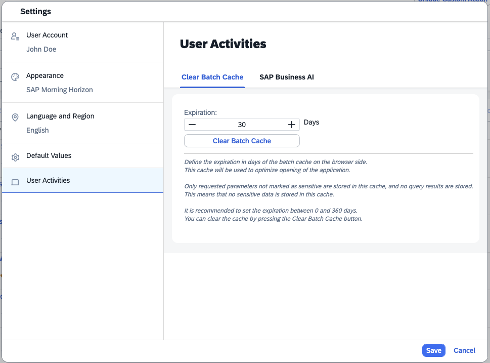

<!-- loio4215eca8d1aa41c68329992530d38067 -->

# Caching the Last Executed Request

When the list report is configured to load data automatically, the last executed request is stored on the client to improve performance.

> ### Note:  
> This topic is only applicable to apps using SAP Fiori elements for OData V4 in SAP S/4HANA Cloud Public Edition.

Caching applies to the request parameters, not the response from the back end. Storing the last executed request enables triggering the request while the application loads. This approach reduces the end-to-end response time.

Request caching is disabled if any of the following conditions are met:

-   The request contains a filter on properties that are annotated with [`PersonalData.IsPotentiallySensitive`](https://github.com/SAP/odata-vocabularies/blob/main/vocabularies/PersonalData.xml#L234). For more security-related information, see [Security Configuration](security-configuration-ba0484b.md).

-   A controller extension is defined in the list report. Request caching is disabled in this case because the request can be modified through extension points in the list report to add filters on sensitive data. If such filters are not added, you can still enable request caching by using the `disableRequestCache` parameter as shown in the following sample code:

    > ### Sample Code:  
    > `manifest.json`
    > 
    > ```json
    > "routing": {
    >     "targets": {
    >         "RootEntityList": {
    >             "type": "Component",
    >             "name": "sap.fe.templates.ListReport",
    >             "id": "RootEntityList",
    >             "options": {
    >                 "settings": {
    >                     "entitySet": "RootEntity",
    >                     "controlConfiguration": {
    >                         "@com.sap.vocabularies.UI.v1.LineItem": {
    >                             "tableSettings": {
    >                                 "disableRequestCache": false
    >                             }
    >                         }
    >                     }
    >                 }
    >             }
    >         }
    >     }
    > }
    > 
    > ```

    > ### Note:  
    > When using the `disableRequestCache` parameter, you must make sure that no filters on sensitive data are added.


End users can control cache expiration and clear the cache in the SAP Fiori launchpad settings.



