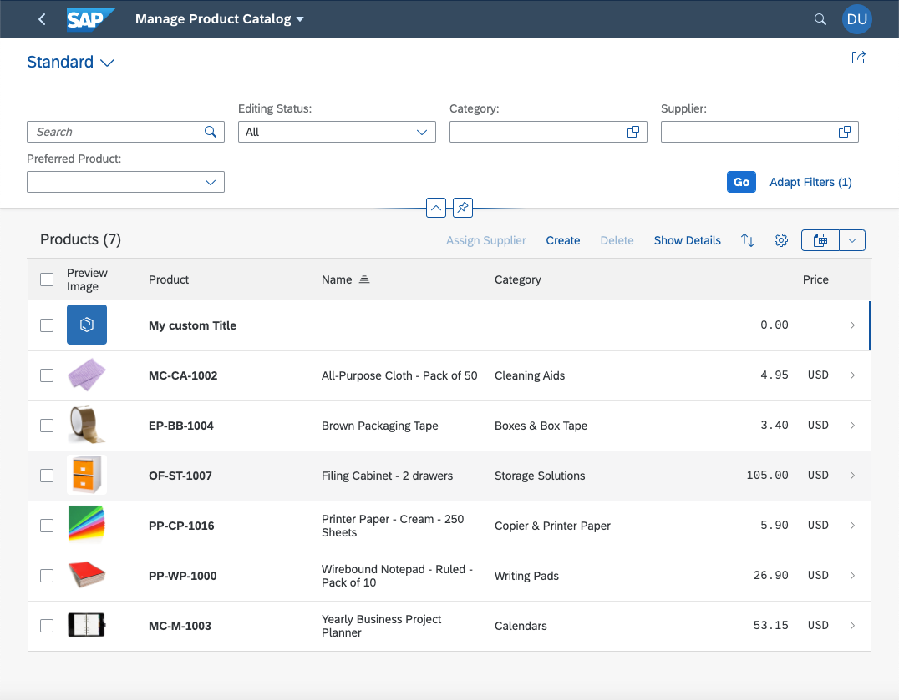
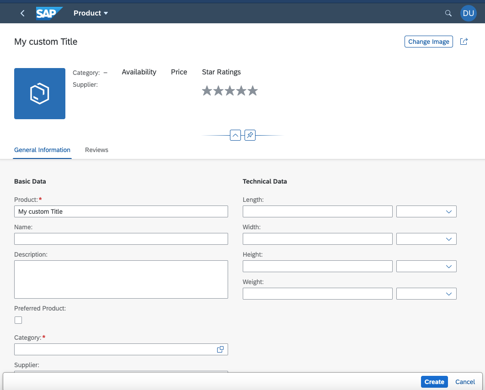
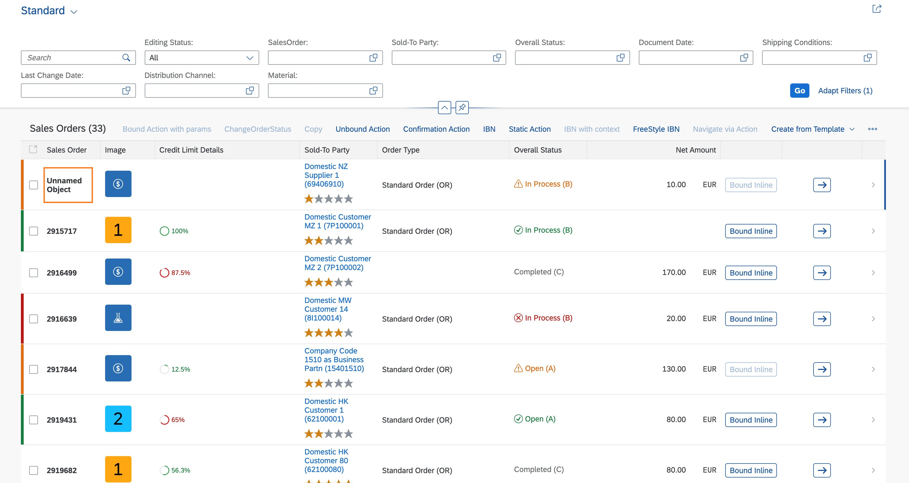
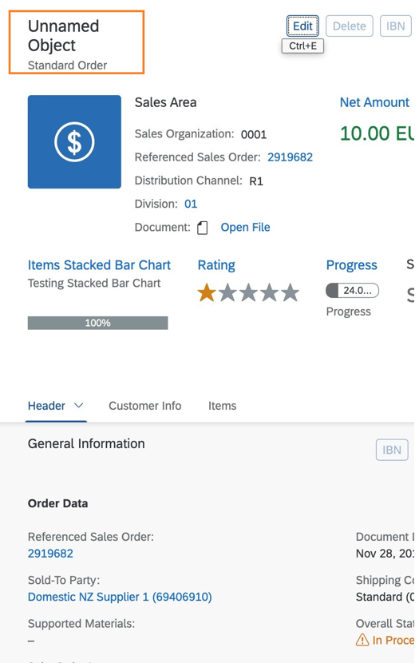

<!-- loio63946c02df1d45efbbad5b1658fef3a5 -->

# Changing Default Titles of New and Unnamed Objects

When a user creates new items for a list report or object page table, a default title is displayed. When a user removes the title and activates the object, SAP Fiori elements also provides a default title.

<a name="loio63946c02df1d45efbbad5b1658fef3a5__section_msb_g2s_qrb"/>

## Additional Features in SAP Fiori Elements for OData V2

In the i18n files of the list report and the object page, change the value of the NEW\_OBJECT property to the title you want to be displayed for new entities for the list report or the object page like this:

List report:

`#XTIT, Default title for unnamed objects`

`NEW_OBJECT=My custom Title`

   
  
**Default title in list report**

  

Object page:

`#XTIT, Default title for unnamed objects`

`NEW_OBJECT=My custom Title`

   
  
**Default title on object page**

  

<a name="loio63946c02df1d45efbbad5b1658fef3a5__section_mb5_k2s_qrb"/>

## Additional Features in SAP Fiori Elements for OData V4

When adding new items to a list report or object page table, the default title shown depends on the presence of the `UI.HeaderInfo.TypeName` annotation.

-   If `UI.HeaderInfo.TypeName` is present, SAP Fiori elements uses "*New: <HeaderInfo.TypeName\>*". The "*New*" comes from the i18n key `T_ANNOTATION_HELPER_DEFAULT_OBJECT_PAGE_HEADER_TITLE`.

-   If `UI.HeaderInfo.TypeName` is not present, SAP Fiori elements uses the "*New Object*" from the i18n key `T_NEW_OBJECT`. Applications can override this text.

-   If the title is configured to a path pointing to an editable property in the entity set of the object page, and if the user edits the title to leave it blank, SAP Fiori elements uses "*Unnamed Object*" from the i18n key `T_ANNOTATION_HELPER_DEFAULT_OBJECT_PAGE_HEADER_TITLE_NO_HEADER_INFO`. Applications can override this text.

      

      

For more information about i18n keys and how applications can override it, see [Localization of UI Texts](localization-of-ui-texts-b8cb649.md).

