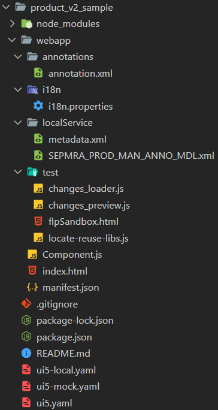

<!-- loiof7abd1bbc766422e82476e333a46c9a1 -->

# Checking Folder Structure and Project Artifacts

Once the generation is complete and the node modules have been installed, the application is ready to run.

> ### Note:  
> This topic is currently only applicable to SAP Fiori elements for OData V2.

The new app or component reuses the views and controllers from `sap.suite.ui.generic.template`. The resource links and route definitions for navigation are in the app descriptor file \(`manifest.json`\). You can find the destination configuration for preview in the `ui5*.yaml` files.

You can use the run configurations \(palette command `Fiori: Open Run Configurations`\) to adapt the destinations for preview.

The following artifacts are generated:

  
  
**Folder Structure for List Report and Object Page**

For more information about generated files, see the **Projects** section of [Generating an Application](https://help.sap.com/docs/SAP_FIORI_tools/17d50220bcd848aa854c9c182d65b699/db44d45051794d778f1dd50def0fa267.html).

## Component.js

After you generate the application, the SAPUI5 component `Component.js` that represents the application, can be executed. This component links to the manifest where further information can be found at runtime. This information includes the OData resource links or the reference to the template.

> ### Caution:  
> Don't edit or change this file.

## manifest.json

You can find the service and annotation resource links that you've entered in the configuration wizard in the app descriptor \(`manifest.json` file\).

Here, the annotations are read using the catalog service of SAP Gateway. This is the standard method when using the auto-exposure feature of the application infrastructure.

The local resources `localService/metadata.xml` and `localService/SEPMRA_PROD_MAN_ANNO_MDL.xml` are generated for local tests that want to simulate back-end access.

If the local `annotations.xml` is defined, it takes the precedence over the annotations from back-end.

We recommend that you use i18n properties, for example, to maintain the texts in the related `i18n` resource file. For more information, see [Localization of UI Texts](localization-of-ui-texts-b8cb649.md).

> ### Note:  
> You can define the subtitle and the application icon to display on the shell bar navigation menu in the `manifest.json` file. For more information, see [Descriptor for Applications, Components, and Libraries \(manifest.json\)](../04_Essentials/descriptor-for-applications-components-and-libraries-manifest-json-be0cf40.md).

