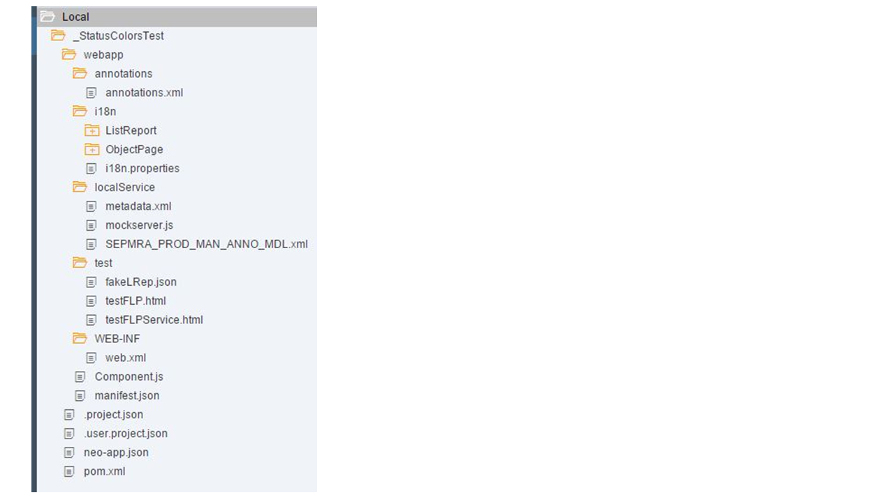

<!-- loiof7abd1bbc766422e82476e333a46c9a1 -->

# Checking Folder Structure and Project Artifacts

Once you've applied the template, the generated application is ready to run.

The new app or component reuses the views and controllers from `sap.suite.ui.generic.template`. You can find the destinations in the `neo-app.json` file. The resource links and route definitions for navigation are in the app descriptor file \(`manifest.json`\).

The following artifacts are generated:

   
  
**Folder Structure for List Report and Object Page**

  


## Component.js

After you generate the application, the SAPUI5 component `Component.js` that represents the application, can be executed. This component links to the manifest where further information can be found at runtime. This information includes the OData resource links or the reference to the template.

> ### Caution:  
> Don't edit or change this file.

The generated app uses the reuse component controller by referencing a template that uses transactional processing including draft-save. Similarly, the generated app uses the generic view in the template's folder, which is based on the [XML templating](../04_Essentials/xml-templating-5ee619f.md) approach.


## manifest.json

You can find the service and annotation resource links that you've entered in the configuration wizard in the app descriptor \(`manifest.json` file\).

Here, the annotations are read using the catalog service of SAP Gateway. This is the standard method when using the auto-exposure feature of the application infrastructure.

The local resources `localService/metadata.xml` and `localService/SEPMRA_PROD_MAN_ANNO_MDL.xml` are generated for local tests that want to simulate back-end access.

Besides, the annotations that are retrieved from the back-end system, the local resource `annotations.xml` plays a role at runtime, as this file contains the facet descriptions for the object page. This is where you've to maintain the labels for the different facets.

We recommend that you use i18n properties, for example, to maintain the texts in the related `i18n` resource file. For more information, see [Localization of UI Texts](localization-of-ui-texts-b8cb649.md).

> ### Note:  
> -   You can use the annotation modeler to maintain `UI.facets`.
> 
>     For more information, search for *Annotation Modeler* in the documentation for SAP Web IDE on the SAP Help Portal at [https://help.sap.com/viewer/p/SAP\_Web\_IDE](https://help.sap.com/viewer/p/SAP_Web_IDE).
> 
>     We recommend that you use only the manifest properties specified there.
> 
> -   You can define the subtitle and the application icon to display on the shell bar navigation menu in the `manifest.json` file. For more information, see [Descriptor for Applications, Components, and Libraries \(manifest.json\)](../04_Essentials/descriptor-for-applications-components-and-libraries-manifest-json-be0cf40.md).


## Neo-app.json

You can find the routing information in the `neoapp.json` file that is based on the destination you've chosen:

```
{
  "welcomeFile": "index.html",
  "routes": [
    {
      "path": "/sap/opu/odata",
      "target": {
        "type": "destination",
        "name": "<DestinationName>",
        "entryPath": "/sap/opu/odata"
      },
      "description": "<YourDescription>"
    },
    {
      "path": "/sap/bc/lrep",
      "target": {
        "type": "destination",
        "name": "<DestinationName>",
        "entryPath": "/sap/bc/lrep"
      },
      "description": "<DestinationName>"
    },

```

You can adapt the destinations in order to address a different back-end system. This option is also available under *Run Configurations* \> *Advanced Settings*.

