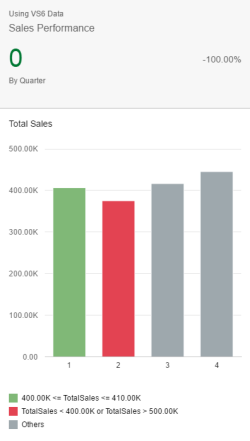
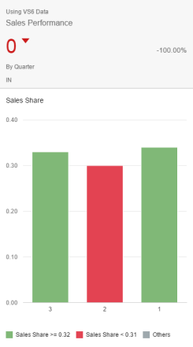

<!-- loio02c53f4d9e58447db939546bed33fb44 -->

# Coloring Cards Based on Threshold Values

With overview pages, column chart cards can be semantically colored based on threshold values.

The threshold values used to semantically color column charts come from the data point annotation that is associated with the measure used in the analytic card. We recommend to only use one measure in the chart if you intend to use this feature.

When you color the chart card, the threshold value that influences the semantic color would also be displayed in the legend; however, in instances where you have more than one measure, then the chart legend would only show "good", "bad" or "neutral" values. For example, a measure can be linked with a data point as follows, if the following two conditions are met:

-   This data point should have a value that provides the improvement direction. This typically depicts whether we are dealing with:
    -   a maximizing measure where a higher value of a measure is better, or
    -   a minimizing measure where a lesser value of a measure is better, or
    -   a target measure where the measure value is preferred within a certain range

-   It is also required to have all the threshold values based on the examples below.

> ### Note:  
> We recommend configuring only one measure in the chart if you want to use semantic coloring. If more than one measure is used and all the measures satisfy the above two conditions, then the chart would still be colored semantically with each measure colored based on its own threshold values. The legends, however, won't be very meaningful.
> 
> If more than one measure is used and some of the measures don't satisfy the required conditions, those measures will be colored black and the measures that do satisfy the conditions will be semantically colored based on the threshold values.

## Examples of Measures

### Target Measure \(for example, temperature\)

<table>
<tr>
<th valign="top">

From

</th>
<th valign="top">

To

</th>
<th valign="top">

Measure Value

</th>
</tr>
<tr>
<td valign="top">

Negative

</td>
<td valign="top">

Critical

</td>
<td valign="top">

\>= ThresholdValues.DeviationRangeLowValue

</td>
</tr>
<tr>
<td valign="top">

Critical

</td>
<td valign="top">

Positive

</td>
<td valign="top">

\>= ThresholdValues.ToleranceRangeLowValue

</td>
</tr>
<tr>
<td valign="top">

Positive

</td>
<td valign="top">

Critical

</td>
<td valign="top">

\> ThresholdValues.ToleranceRangeHighValue

</td>
</tr>
<tr>
<td valign="top">

Critical

</td>
<td valign="top">

Negative

</td>
<td valign="top">

\> ThresholdValues.DeviationRangeHighValue

</td>
</tr>
</table>

### Maximizing Measure \(for example, sales\)

<table>
<tr>
<th valign="top">

From

</th>
<th valign="top">

To

</th>
<th valign="top">

Measure Value

</th>
</tr>
<tr>
<td valign="top">

Negative

</td>
<td valign="top">

Critical

</td>
<td valign="top">

\>= ThresholdValues.DeviationRangeLowValue

</td>
</tr>
<tr>
<td valign="top">

Critical

</td>
<td valign="top">

Positive

</td>
<td valign="top">

\>= ThresholdValues.ToleranceRangeLowValue

</td>
</tr>
</table>

### Example of Target and Maximizing Measures

<table>
<tr>
<td valign="top">

</td>
<td valign="top">

</td>
</tr>
<tr>
<td valign="top">

Semantic coloring with target KPIs

</td>
<td valign="top">

Semantic coloring with maximizing KPIs

</td>
</tr>
</table>

### Minimizing Measure \(for example, cost\)

<table>
<tr>
<th valign="top">

From

</th>
<th valign="top">

To

</th>
<th valign="top">

Measure Value

</th>
</tr>
<tr>
<td valign="top">

Positive

</td>
<td valign="top">

Critical

</td>
<td valign="top">

\> ThresholdValues.ToleranceRangeHighValue

</td>
</tr>
<tr>
<td valign="top">

Critical

</td>
<td valign="top">

Negative

</td>
<td valign="top">

\> ThresholdValues.DeviationRangeHighValue

</td>
</tr>
</table>

