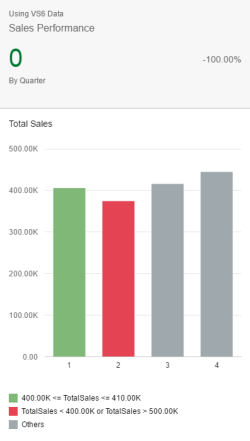
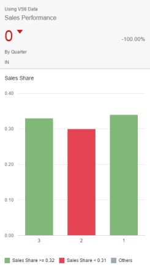

<!-- loio02c53f4d9e58447db939546bed33fb44 -->

# Coloring Cards Based on Threshold Values

You can apply semantic coloring to column chart cards in overview pages based on threshold values.

The threshold values used to semantically color column charts come from the `DataPoint` annotation that is associated with the measure used in the analytical card. The chart compares each measure value to the configured thresholds and colors the column accordingly:


<table>
<tr>
<th valign="top">

Color

</th>
<th valign="top">

Meaning

</th>
</tr>
<tr>
<td valign="top">

Green

</td>
<td valign="top">

Positive: the value is in the desired range.

</td>
</tr>
<tr>
<td valign="top">

Orange

</td>
<td valign="top">

Critical: the value is approaching a problematic range.

</td>
</tr>
<tr>
<td valign="top">

Red

</td>
<td valign="top">

Negative: the value is in a problematic range.

</td>
</tr>
</table>

When the chart is colored, the threshold values that influence the colors also appear in the chart legend. If the chart contain multiple measures, the legend instead shows "good", "bad" or "neutral" values.

For a measure to be colored semantically, both of the following conditions must be met in its `DataPoint` annotation:

-   This data point must define a value that provides the improvement direction, which describes how the measure must be evaluated:

    -   A maximizing measure where the higher values are better.

    -   A minimizing measure where the lower values are better.

    -   A target measure where the values are within a specific range.


-   The data point must define all required threshold values for the chosen improvement direction.


> ### Note:  
> We recommend using one measure for a chart when you enable semantic coloring. With multiple measures, the legends won't provide a meaningful information.

**Behavior with Multiple Measures**


<table>
<tr>
<th valign="top">

Scenario

</th>
<th valign="top">

Behavior

</th>
</tr>
<tr>
<td valign="top">

Multiple measures are used and all of them satisfies both conditions

</td>
<td valign="top">

Each measure is colored based on its threshold values. The legends, however, won't be very meaningful.

</td>
</tr>
<tr>
<td valign="top">

Multiple measures are used and some of them satisfies both conditions

</td>
<td valign="top">

Measures that meet the conditions are colored semantically, while the ones that don't meet the conditions are colored black.

</td>
</tr>
</table>

The following code sample defines a column chart that displays sales by country with dynamic semantic coloring based on sales thresholds:

> ### Sample Code:  
> XML Annotation
> 
> ```xml
> <Annotation Term="UI.Chart" Qualifier="Eval_by_Currency_DynamicSemanticColor">
>     <Record Type="UI.ChartDefinitionType">
>         <PropertyValue Property="Title" String="Sales by Country"/>
>         <PropertyValue Property="ChartType" EnumMember="UI.ChartType/Column"/>
>         <PropertyValue Property="Measures">
>             <Collection>
>                 <PropertyPath>Sales</PropertyPath>
>             </Collection>
>         </PropertyValue>
>         <PropertyValue Property="Dimensions">
>             <Collection>
>                 <PropertyPath>Country</PropertyPath>
>             </Collection>
>         </PropertyValue>
>         <PropertyValue Property="MeasureAttributes">
>             <Collection>
>                 <Record Type="UI.ChartMeasureAttributeType">
>                     <PropertyValue Property="Measure" PropertyPath="Sales"/>
>                     <PropertyValue Property="DataPoint">
>                         <AnnotationPath>@UI.DataPoint#Column_Eval_by_Country_DynamicSemanticColor</AnnotationPath>
>                     </PropertyValue>
>                     <PropertyValue Property="Role" EnumMember="UI.ChartMeasureRoleType/Axis1"/>
>                 </Record>
>             </Collection>
>         </PropertyValue>
>         <PropertyValue Property="DimensionAttributes">
>             <Collection>
>                 <Record Type="UI.ChartDimensionAttributeType">
>                     <PropertyValue Property="Dimension" PropertyPath="Country"/>
>                     <PropertyValue Property="Role" EnumMember="UI.ChartDimensionRoleType/Category"/>
>                 </Record>
>             </Collection>
>         </PropertyValue>
>     </Record>
> </Annotation>
> 
> <Annotation Term="UI.DataPoint" Qualifier="Column_Eval_by_Country_DynamicSemanticColor">
>     <Record Type="UI.DataPointType">
>         <PropertyValue Property="Value" Path="Sales"/>
>         <PropertyValue Property="CriticalityCalculation">
>             <Record Type="UI.CriticalityCalculationType">
>                 <PropertyValue Property="ImprovementDirection" EnumMember="UI.ImprovementDirectionType/Maximize"/>
>                 <PropertyValue Property="ToleranceRangeLowValue" Decimal="80000"/>
>                 <PropertyValue Property="DeviationRangeLowValue" Decimal="70000"/>
>             </Record>
>         </PropertyValue>
>     </Record>
> </Annotation>
> ```

> ### Sample Code:  
> ABAP CDS Annotation
> 
> ```
> 
> @UI.chart: [{
>     qualifier: 'Eval_by_Currency_DynamicSemanticColor',
>     title: 'Sales by Country',
>     chartType: #COLUMN,
>     dimensions: [ 'Country' ],
>     measures: [ 'Sales' ],
>     measureAttributes: [{
>         measure: 'Sales',
>         role: #AXIS_1,
>         asDataPoint: true
>     }],
>     dimensionAttributes: [{
>         dimension: 'Country',
>         role: #CATEGORY
>     }]
> }]
> 
> @UI.dataPoint: {
>     qualifier: 'Column_Eval_by_Country_DynamicSemanticColor',
>     value: 'Sales',
>     criticalityCalculation: {
>         improvementDirection: #MAXIMIZE,
>         toleranceRangeLowValue: 80000,
>         deviationRangeLowValue: 70000
>     }
> }
> Sales;
> 
> ```

> ### Sample Code:  
> CAP CDS Annotation
> 
> ```
> annotate service.Sales with @(
>     UI.Chart #Eval_by_Currency_DynamicSemanticColor : {
>         Title      : 'Sales by Country',
>         ChartType  : #Column,
>         Measures   : [ Sales ],
>         Dimensions : [ Country ],
>         MeasureAttributes : [{
>             Measure   : Sales,
>             Role      : #Axis1,
>             DataPoint : '@UI.DataPoint#Column_Eval_by_Country_DynamicSemanticColor'
>         }],
>         DimensionAttributes : [{
>             Dimension : Country,
>             Role      : #Category
>         }]
>     },
>     UI.DataPoint #Column_Eval_by_Country_DynamicSemanticColor : {
>         Value : Sales,
>         CriticalityCalculation : {
>             ImprovementDirection   : #Maximize,
>             ToleranceRangeLowValue : 80000,
>             DeviationRangeLowValue : 70000
>         }
>     }
> );
> 
> 
> ```


## Examples of Measures


### Target Measure

Use a target measure when values within a specific range are preferred such as room temperature.


<table>
<tr>
<th valign="top">

From

</th>
<th valign="top">

To

</th>
<th valign="top">

Measure Value

</th>
</tr>
<tr>
<td valign="top">

Negative

</td>
<td valign="top">

Critical

</td>
<td valign="top">

\>= ThresholdValues.DeviationRangeLowValue

</td>
</tr>
<tr>
<td valign="top">

Critical

</td>
<td valign="top">

Positive

</td>
<td valign="top">

\>= ThresholdValues.ToleranceRangeLowValue

</td>
</tr>
<tr>
<td valign="top">

Positive

</td>
<td valign="top">

Critical

</td>
<td valign="top">

\> ThresholdValues.ToleranceRangeHighValue

</td>
</tr>
<tr>
<td valign="top">

Critical

</td>
<td valign="top">

Negative

</td>
<td valign="top">

\> ThresholdValues.DeviationRangeHighValue

</td>
</tr>
</table>


### Maximizing Measure

Use a maximizing measure when higher values such as sales are better.


<table>
<tr>
<th valign="top">

From

</th>
<th valign="top">

To

</th>
<th valign="top">

Measure Value

</th>
</tr>
<tr>
<td valign="top">

Negative

</td>
<td valign="top">

Critical

</td>
<td valign="top">

\>= ThresholdValues.DeviationRangeLowValue

</td>
</tr>
<tr>
<td valign="top">

Critical

</td>
<td valign="top">

Positive

</td>
<td valign="top">

\>= ThresholdValues.ToleranceRangeLowValue

</td>
</tr>
</table>


### Minimizing Measure

Use a minimizing measure when lower values such as cost is better.


<table>
<tr>
<th valign="top">

From

</th>
<th valign="top">

To

</th>
<th valign="top">

Measure Value

</th>
</tr>
<tr>
<td valign="top">

Positive

</td>
<td valign="top">

Critical

</td>
<td valign="top">

\> ThresholdValues.ToleranceRangeHighValue

</td>
</tr>
<tr>
<td valign="top">

Critical

</td>
<td valign="top">

Negative

</td>
<td valign="top">

\> ThresholdValues.DeviationRangeHighValue

</td>
</tr>
</table>


### Example of Target and Maximizing Measures


<table>
<tr>
<td valign="top">



Semantic coloring with target KPIs

</td>
<td valign="top">



Semantic coloring with maximizing KPIs

</td>
</tr>
</table>

**Related Information**  


[Configuring Card Properties](configuring-card-properties-53b0791.md "This section describes the configuration items relevant for all overview page cards. All cards inherit a set of generic capabilities such as a card header, content area, and navigation support.")

