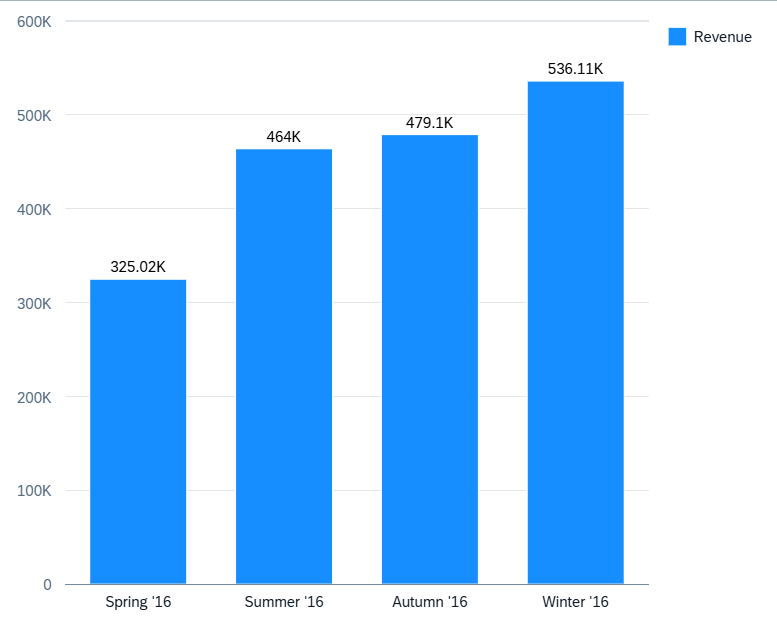

<!-- loio6c0637c0dc1d40ab9ea62131852728f9 -->

# Column Chart Card

You can render the chart as a column chart to display data, such as total product sales over a period of years in columns.

> ### Note:  
> For information about SAP Fiori elements for OData V4, see [Column Chart](column-chart-d80ef8e.md).

  
  
**Example of a Column Chart Card**

The number of columns is equal to the number of measures in the annotation file.

Column charts need to have at least one measure and one dimension. Irrespective of the role defined for the measure in the annotation file, every measure is represented as a separate column. Similarly, regardless of the role defined in the annotation file, every dimension is added to the **axis** category \(x-axis\).

