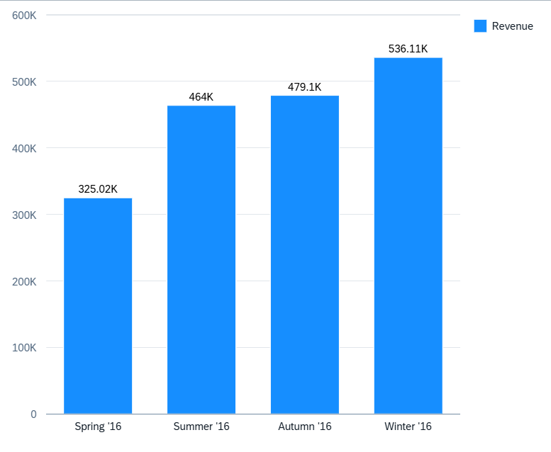

<!-- loiod80ef8e964cc48a69989fb61815e151d -->

# Column Chart Card

You can use column chart to display data, such as total product sales over a period of years in columns.

The number of columns is equal to the number of measures in the annotation file.

Column charts need to have at least one measure and one dimension. Irrespective of the role defined for the measure in the annotation file, every measure is represented as a separate column. Similarly, regardless of the role defined in the annotation file, every dimension is added to the **axis** category \(x-axis\).

   
  
**Example of a Column Chart Card**

  

