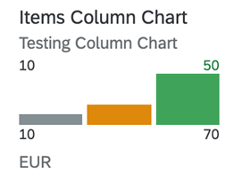

<!-- loio1a4ecb81be1940959d2aaa4eb7547567 -->

# Column Micro Chart

A column chart uses vertical bars to compare multiple values over time or across categories.

One axis of the chart shows the categories being compared, the other axis represents a value.



In the chart, the values at the bottom \(10 and 70\) represent the dimension values. They are the IDs of the sales order items. For more information about this chart type, see [Samples](https://ui5.sap.com/1.82.5/#/entity/sap.suite.ui.microchart.ColumnMicroChart).

> ### Note:  
> The chart dimensions and measures cannot be of the same entity; they must be from a 1:n navigation entity.


<a name="loio1a4ecb81be1940959d2aaa4eb7547567__section_rt5_vhq_qmb"/>

## `UI.Chart` Annotation

The `UI.Chart Title` property is used for the title. The `UI.Chart Description` property is used for the subtitle.

> ### Sample Code:  
> XML Annotation
> 
> ```xml
> <Annotation Term="UI.Chart" Qualifier="SpecificationWidthColumnChart">
>     <Record Type="UI.ChartDefinitionType">
>         <PropertyValue Property="Title" String="Product Width Specification Column Chart"/>
>         <PropertyValue Property="Description" String="Describe Column Chart"/>
>         <PropertyValue Property="ChartType" EnumMember="UI.ChartType/Column"/>
>         <PropertyValue Property="Measures">
>             <Collection>
>                 <PropertyPath>Width</PropertyPath>
>             </Collection>
>         </PropertyValue>
>         <PropertyValue Property="Dimensions">
>             <Collection>
>                 <PropertyPath>Day</PropertyPath>
>             </Collection>
>         </PropertyValue>
>         <PropertyValue Property="MeasureAttributes">
>             <Collection>
>                 <Record Type="UI.ChartMeasureAttributeType">
>                     <PropertyValue Property="Measure" PropertyPath="Width"/>
>                     <PropertyValue Property="Role" EnumMember="UI.ChartMeasureRoleType/Axis1"/>
>                     <PropertyValue Property="DataPoint" AnnotationPath="@UI.DataPoint#Width"/>
>                 </Record>
>             </Collection>
>         </PropertyValue>
>     </Record>
> </Annotation>
> 
> ```

> ### Sample Code:  
> ABAP CDS Annotation
> 
> ```
> 
> @UI.Chart: [
>   {
>     title: 'Product Width Specification Column Chart',
>     description: 'Describe Column Chart',
>     chartType: #COLUMN,
>     measures: [
>       'WIDTH'
>     ],
>     dimensions: [
>       'DAY'
>     ],
>     measureAttributes: [
>       {
>         measure: 'Width',
>         role: #AXIS_1,
>         asDataPoint: true
>       }
>     ],
>     qualifier: 'SpecificationWidthColumnChart'
>   }
> ]
> annotate view STTA_C_MP_PRODUCT with {
> 
> }
> 
> ```

> ### Sample Code:  
> CAP CDS Annotation
> 
> ```
> 
> UI.Chart #SpecificationWidthColumnChart : {
>     $Type : 'UI.ChartDefinitionType',
>     Title : 'Product Width Specification Column Chart',
>     Description : 'Describe Column Chart',
>     ChartType : #Column,
>     Measures : [
>         Width
>     ],
>     Dimensions : [
>         Day
>     ],
>     MeasureAttributes : [
>         {
>             $Type : 'UI.ChartMeasureAttributeType',
>             Measure : Width,
>             Role : #Axis1,
>             DataPoint : '@UI.DataPoint#Width',
>         }
>     ]
> }
> 
> ```


<a name="loio1a4ecb81be1940959d2aaa4eb7547567__section_bq5_vhq_qmb"/>

## `UI.DataPoint` Annotation

> ### Sample Code:  
> XML Annotation
> 
> ```xml
> <Annotation Term="UI.DataPoint" Qualifier="Width">
>     <Record>
>         <PropertyValue Property="Value" Path="Width"/>
>         <PropertyValue Property="Criticality" Path="criticalityValue"/>
>     </Record>
> </Annotation>
> ```

> ### Sample Code:  
> ABAP CDS Annotation
> 
> ```
> 
> @UI.dataPoint: {
>   targetValueElement: 'Weight',
>   criticality: 'criticalityValue'
> }
> Width;
> ```

> ### Sample Code:  
> CAP CDS Annotation
> 
> ```
> 
> UI.DataPoint #Width : {
>     Value : Width,    Criticality : criticalityValue
> }
> 
> 
> ```

For semantic coloring, both the `Criticality` and `CriticalityCalculation` properties are supported. However, the `Criticality` property overrides the `CriticalityCalculation` property.

The following annotations are mandatory and must be used in the column micro chart:

-   `UI.Chart` → `ChartType`: "`Column`"

-   `UI.Chart` → `Measures`

-   `UI.Chart` → `MeasureAttributes` → `DataPoint`

-   `UI.DataPoint` → `Value`

-   In case the `CriticalityCalculation` annotation is used for semantic coloring, the following applies:

    -   `UI.DataPoint` → `CriticalityCalculation`

    -   `UI.DataPoint` → `CriticalityCalculation/ImprovementDirection`


