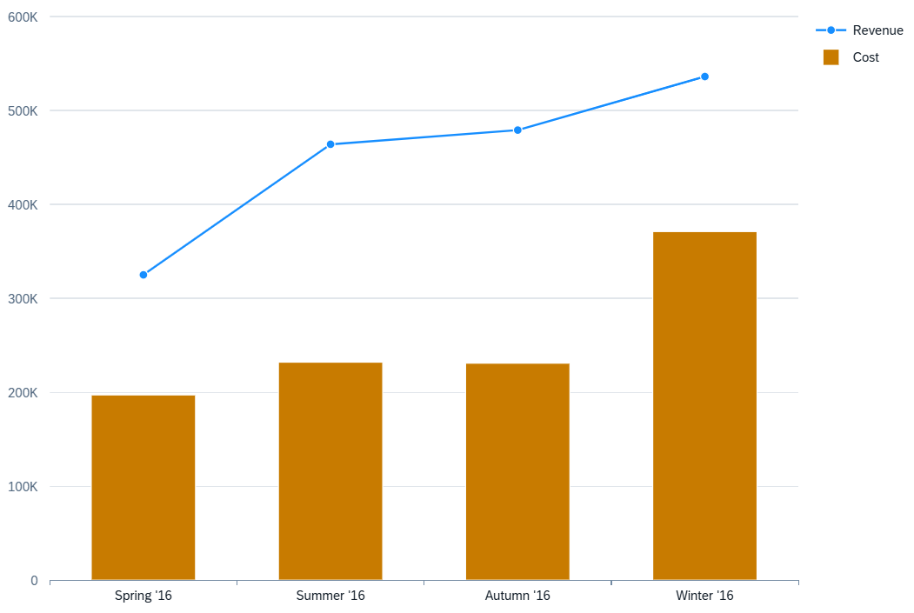

<!-- loiob46334025cf443ab80faed9b78de295d -->

# Combination Chart Card

You can render the chart as a combination chart, which lets you combine and view two or more chart types in a single chart.


  
  
**Example of a Combination Chart Card**



A combination chart has the following requirements:

-   At least two measures. The first measure is displayed as columns, and each subsequent measure is displayed as a line.

-   At least one dimension with the `Category` role assigned to the category axis.


> ### Note:  
> We recommend using one time-based dimension for the **category** axis.

Measures are visualized based on their position in the annotation:

-   The first measure is displayed as columns.

-   Each subsequent measure is displayed as a line within the chart.


> ### Note:  
> The `Role` property is ignored for measures in a combination chart. Use `Axis1` as a convention, but the visualization is determined by measure order.

Dimensions are visualized based on their role:

-   `Category` \(default\): Forms the category axis \(x-axis\).

-   `Series`: Splits the data into differently colored column and line combinations, one per dimension value.


The following code samples show how to configure a combination chart with two measures \(`sales` and `totalsales`\) and one dimension \(`quarter_1`\):

> ### Sample Code:  
> XML Annotation
> 
> ```xml
> <Annotation Term="UI.Chart" Qualifier="Eval_by_Currency_Combination">
>     <Record Type="UI.ChartDefinitionType">
>         <PropertyValue Property="Title" String="Sales and Total Sales" />
>         <PropertyValue Property="ChartType" EnumMember="UI.ChartType/Combination"/>
>         <PropertyValue Property="MeasureAttributes">
>             <Collection>
>                 <Record Type="UI.ChartMeasureAttributeType">
>                         <PropertyValue Property="Measure" PropertyPath="sales" />
>                         <PropertyValue Property="Role" EnumMember="UI.ChartMeasureRoleType/Axis1" />
>                 </Record>
>                 <Record Type="UI.ChartMeasureAttributeType">
>                     <PropertyValue Property="Measure" PropertyPath="totalsales" />
>                     <PropertyValue Property="Role" EnumMember="UI.ChartMeasureRoleType/Axis1" />
>                 </Record>
>             </Collection>
>         </PropertyValue>
>         <PropertyValue Property="DimensionAttributes">
>             <Collection>
>                 <Record Type="UI.ChartDimensionAttributeType">
>                     <PropertyValue Property="Dimension" PropertyPath="quarter_1" />
>                     <PropertyValue Property="Role" EnumMember="UI.ChartDimensionRoleType/Category" />
>                 </Record>
>             </Collection>
>         </PropertyValue>
>     </Record>
> </Annotation>
> ```

> ### Sample Code:  
> ABAP CDS Annotation
> 
> ```
> 
> @UI.Chart: [
>   {
>     title: 'Sales and Total Sales',
>     chartType: #COMBINATION,
>     measureAttributes: [
>       {
>         measure: 'sales',
>         role: #AXIS_1
>       },
>       {
>         measure: 'totalsales',
>         role: #AXIS_1
>       }
>     ],
>     dimensionAttributes: [
>       {
>         dimension: 'quarter_1',
>         role: #CATEGORY
>       }
>     ],
>     qualifier: 'Eval_by_Currency_Combination'
>   }
> ]
> annotate view VIEWNAME with { }
> 
> ```

> ### Sample Code:  
> CAP CDS Annotation
> 
> ```
> 
> UI.Chart #Eval_by_Currency_Combination : {
>     $Type : 'UI.ChartDefinitionType',
>     Title : 'Sales and Total Sales',
>     ChartType : #Combination,
>     MeasureAttributes : [
>         {
>             $Type : 'UI.ChartMeasureAttributeType',
>             Measure : sales,
>             Role : #Axis1
>         },
>         {
>             $Type : 'UI.ChartMeasureAttributeType',
>             Measure : totalsales,
>             Role : #Axis1
>         }
>     ],
>     DimensionAttributes : [
>         {
>             $Type : 'UI.ChartDimensionAttributeType',
>             Dimension : quarter_1,
>             Role : #Category
>         }
>     ]
> }
> 
> ```

