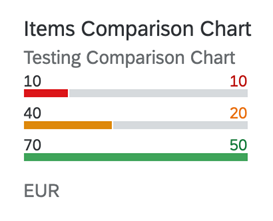

<!-- loio9d126f1d92d34c178d9686b0cf12800a -->

# Comparison Micro Chart

A single measure value is shown against a maximum value. Only the first three values as received from the back end are shown.

> ### Note:  
> This topic is only applicable to SAP Fiori elements for OData V4.



> ### Note:  
> The chart dimensions and measures cannot be of the same entity; they must be from a 1:n navigation entity. In the chart, the values on the left \(10, 40 and 70\) represent the dimension values, which are the IDs of the sales order items. For more information about this chart type, see [Samples](https://ui5.sap.com/1.82.5/#/entity/sap.suite.ui.microchart.ComparisonMicroChart).

There are two variants to the display value. If the `Value` property of the `DataPoint` doesn't have a text associated with it in the `@com.sap.vocabularies.Common.v1.Text` annotation, the value is displayed. If there is a text associated with the `DataPoint`, then the `TextValue` is displayed.

> ### Note:  
> You must ensure that the unit of measure is consistent across all data points.

For semantic coloring, only the `Criticality` annotation is supported.

The following annotations are mandatory and must be used in the comparison micro chart:

-   `UI.Chart` → `ChartType`: `"Bar"`

-   `UI.Chart` → `Dimensions`

-   `UI.Chart` → `Measures`

-   `UI.Chart` → `MeasureAttributes` → `DataPoint`

-   `UI.DataPoint` → `Value`


<a name="loio9d126f1d92d34c178d9686b0cf12800a__section_bcw_pgq_qmb"/>

## `UI.Chart` Annotations

The `UI.Chart Title` property is used to define the title, while the `UI.Chart Description` property is used to specify the subtitle.

> ### Sample Code:  
> XML Annotation
> 
> ```xml
> 
> <Annotation Term="UI.Chart" Qualifier="ComparisonPath">
>     <Record Type="UI.ChartDefinitionType">
>         <PropertyValue Property="ChartType" EnumMember="UI.ChartType/Bar"/>
>         <PropertyValue Property="Description" String="Testing Comparison Chart"/>
>         <PropertyValue Property="Dimensions">
>             <Collection>
>                 <PropertyPath>SalesOrderItem</PropertyPath>
>             </Collection>
>         </PropertyValue>
>         <PropertyValue Property="MeasureAttributes">
>             <Collection>
>                 <Record Type="UI.ChartMeasureAttributeType">
>                     <PropertyValue Property="Measure" PropertyPath="NetAmount"/>
>                     <PropertyValue Property="Role" EnumMember="UI.ChartMeasureRoleType/Axis1"/>
>                     <PropertyValue Property="DataPoint" AnnotationPath="@UI.DataPoint#ComparisonPath"/>
>                 </Record>
>             </Collection>
>         </PropertyValue>
>         <PropertyValue Property="Measures">
>             <Collection>
>                 <PropertyPath>NetAmount</PropertyPath>
>             </Collection>
>         </PropertyValue>
>         <PropertyValue Property="Title" String="Items Comparison Chart"/>
>     </Record>
> </Annotation>
> 
> 
> ```

> ### Sample Code:  
> ABAP CDS Annotation
> 
> ```
> 
> @UI.Chart: [
>   {
>     chartType: #BAR,
>     description: 'Testing Comparison Chart',
>     dimensions: [
>       'SALESORDERITEM'
>     ],
>     measureAttributes: [
>       {
>         measure: 'NetAmount',
>         role: #AXIS_1,
>         asDataPoint: true
>       }
>     ],
>     measures: [
>       'NETAMOUNT'
>     ],
>     title: 'Items Comparison Chart',
>     qualifier: 'ComparisonPath'
>   }
> ]
> annotate view STTA_C_MP_PRODUCT with {
> 
> }
> 
> ```

> ### Sample Code:  
> CAP CDS Annotation
> 
> ```
> 
> UI.Chart #ComparisonPath : {
>     $Type : 'UI.ChartDefinitionType',
>     ChartType : #Bar,
>     Description : 'Testing Comparison Chart',
>     Dimensions : [
>         SalesOrderItem
>     ],
>     MeasureAttributes : [
>         {
>             $Type : 'UI.ChartMeasureAttributeType',
>             Measure : NetAmount,
>             Role : #Axis1,
>             DataPoint : '@UI.DataPoint#ComparisonPath'
>         },
>     ],
>     Measures : [
>         NetAmount
>     ],
>     Title : 'Items Comparison Chart'
> }
> 
> ```


<a name="loio9d126f1d92d34c178d9686b0cf12800a__section_t1z_zl2_trb"/>

## `UI.DataPoint` Annotation

The `UI.DataPoint` annotation can be used to define criticality, as well as minimum and maximum values for the chart measures.

> ### Sample Code:  
> XML Annotation
> 
> ```xml
> <Annotation Term="UI.DataPoint" Qualifier="NetAmount">
>       <Record Type="UI.DataPointType">
>             <PropertyValue Property="Value" Path="NetAmount"/>
>             <PropertyValue Property="Criticality" Path="Criticality"/>
>             <PropertyValue Property="MaximumValue" Decimal="100"/>
>             <PropertyValue Property="MinimumValue" Decimal="0"/>
>       </Record>
> </Annotation>
> ```

> ### Sample Code:  
> ABAP CDS Annotation
> 
> ```
> @UI.dataPoint: {
>   criticality: 'Criticality'
>   maximumValue: 100,
>   minimumValue: 0
> }
> NetAmount;
> 
> ```

> ### Sample Code:  
> CAP CDS Annotation
> 
> ```
> 
> UI.DataPoint #NetAmount              : {
>             Value       : NetAmount,
>             Criticality : Criticality,
>             MaximumValue : 100,
>             MinimumValue : 0,
>         }
> 
> ```

