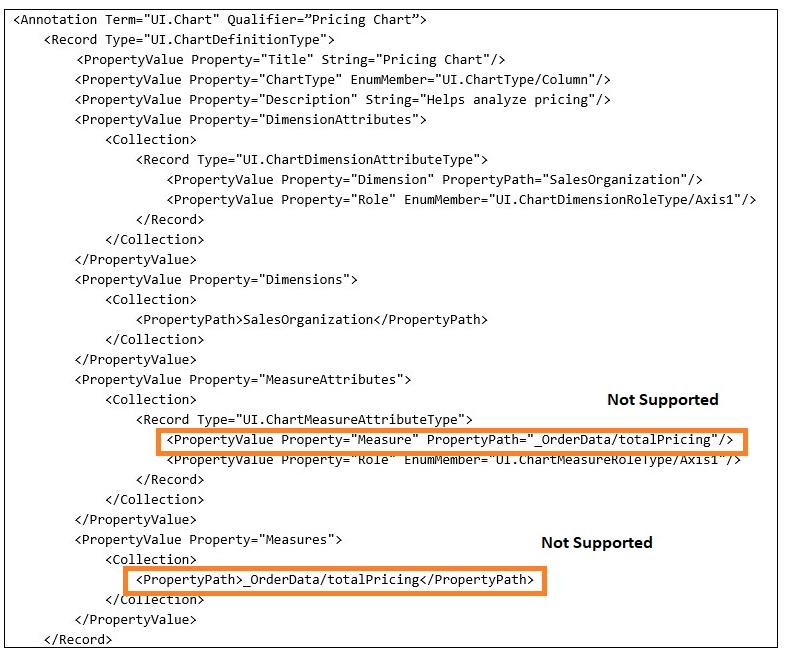

<!-- loio05eda5aef50245f2b6e07e51802ad855 -->

# Configuring Charts

You can add a chart facet to a content section within the list report and object page.

A chart facet is suitable to use if you wish to present data graphically for analysis.


<a name="loio05eda5aef50245f2b6e07e51802ad855__section_tth_5tc_2tb"/>

## Configuring Charts in a List Report

You can configure a chart to be part of a list report that has multiple views. For more information, see [Defining Multiple Views on a List Report Table - Multiple Table Mode](defining-multiple-views-on-a-list-report-table-multiple-table-mode-97dfeea.md) and [Defining Multiple Views on a List Report Page with Different Entity Sets and Table Settings](defining-multiple-views-on-a-list-report-page-with-different-entity-sets-and-table-settin-6698b80.md).


<a name="loio05eda5aef50245f2b6e07e51802ad855__section_fnc_ptc_2tb"/>

## Configuring Charts in an Object Page

For more information, see [Adding a Chart Facet](adding-a-chart-facet-ee441be.md).


<a name="loio05eda5aef50245f2b6e07e51802ad855__section_nrq_3cy_tgc"/>

## Code Samples

The following code samples show how to create your annotations for the chart facet:


### `UI.ReferenceFacet`

> ### Sample Code:  
> XML Annotation
> 
> ```xml
> <Annotations Target="STTA_PROD_MAN.STTA_C_MP_ProductType">
>    <Annotation Term="UI.Facets">
>       <Record Type="UI.ReferenceFacet">
>          <PropertyValue Property="Label" String="{@i18n>@SalesData}"/>
>          <PropertyValue Property="Target" AnnotationPath="to_ProductSalesData/@UI.Chart"/>
>       </Record>
>    </Annotation>
> </Annotations>
> 
> ```

> ### Sample Code:  
> ABAP CDS Annotation
> 
> ```
> 
> @UI.facet: [
>  {
>   label: '{@i18n>@SalesData}',
>   type: #CHART_REFERENCE,
>   purpose: #STANDARD,
>   targetElement: '_productSalesData'
>  }
> ]  
> ```

> ### Sample Code:  
> CAP CDS Annotation
> 
> ```
> 
> annotate STTA_PROD_MAN.STTA_C_MP_ProductType @(
>   UI.Facets : {
>     $Type : 'UI.ReferenceFacet',
>     Label : '{@i18n>@SalesData}',
>     Target : 'to_ProductSalesData/@UI.Chart'
>   }
> );
> 
> ```


### `UI.Chart`

> ### Sample Code:  
> XML Annotation
> 
> ```xml
> <Annotations Target="STTA_PROD_MAN.STTA_C_MP_ProductSalesDataType">
>    <Annotation Term="UI.Chart">
>       <Record>
>          <PropertyValue Property="Title" String="Test Chart"/>
>          <PropertyValue Property="ChartType" EnumMember="UI.ChartType/Column"/>
>          <PropertyValue Property="Dimensions">
>             <Collection>
>                <PropertyPath>DeliveryMonth</PropertyPath>
>             </Collection>
>          </PropertyValue> 
>          <PropertyValue Property="Measures">
>             <Collection>
>                <PropertyPath>Revenue</PropertyPath>
>             </Collection>
>          </PropertyValue>
>       </Record>
>    </Annotation>
> </Annotations>
> 
> ```

> ### Sample Code:  
> ABAP CDS Annotation
> 
> ```
> 
> @UI.Chart: [
>   {
>     title: 'Test Chart',
>     chartType: #COLUMN,
>     dimensions: [
>       'DELIVERYMONTH'
>     ],
>     measures: [
>       'REVENUE'
>     ]
>   }
> ]
> annotate view STTA_C_MP_PRODUCTSALESDATA with {
> 
> }
> ```

> ### Sample Code:  
> CAP CDS Annotation
> 
> ```
> 
> annotate STTA_PROD_MAN.STTA_C_MP_ProductSalesDataType @(
>   UI.Chart : {
>     Title : 'Test Chart',
>     ChartType : #Column,
>     Dimensions : [
>         DeliveryMonth
>     ],
>     Measures : [
>         Revenue
>     ]
>   }
> );
> ```

The chart definition contains measures on which the aggregations calculations are done, and dimensions, which categorize these measures.

> ### Note:  
> The use of navigation properties within the `UI.Chart` term isn't supported.
> 
>   
>   
> **Navigation Property**
> 
> 
> 
> 

> ### Restriction:  
> Charts are only supported for entities or services that are **not** draft enabled or for read-only entities or services.

